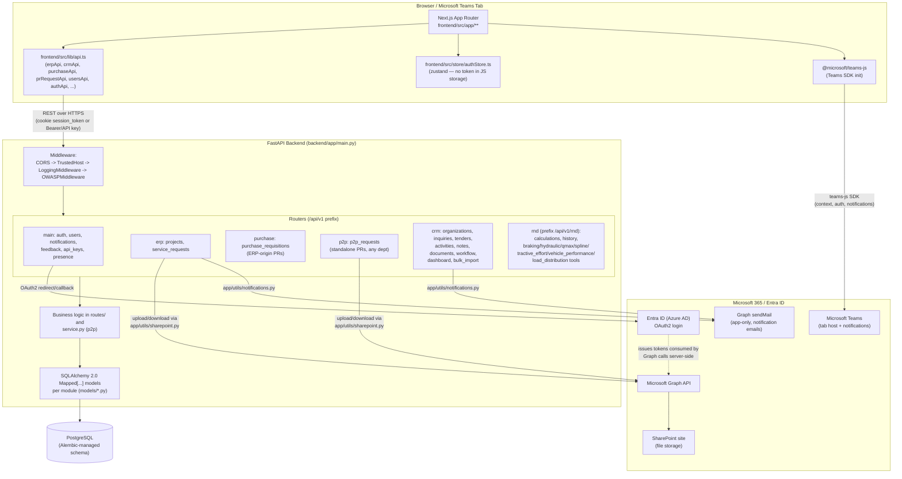

# Component Diagram

Derived from `backend/app/main.py` (router wiring), `frontend/src/lib/api.ts` (API client
surface), and `backend/app/utils/sharepoint.py` / `backend/app/modules/main/routes/auth.py`
(integrations). See [ARCHITECTURE.md](ARCHITECTURE.md) for prose detail per module.

## Notes on what's proxied vs direct

- The frontend **never** calls Microsoft Graph or SharePoint directly — all of that goes
  through the FastAPI backend (`app/utils/sharepoint.py`, `app/utils/notifications.py`),
  which holds the app-only Graph credentials (`AZURE_CLIENT_ID`/`AZURE_CLIENT_SECRET`/
  `AZURE_TENANT_ID` in `backend/app/core/config.py`).
- The frontend does load `@microsoft/teams-js` directly in the browser to detect/behave
  correctly inside a Teams tab (iframe context, SSO context) — see
  [INTEGRATION_ARCHITECTURE.md](INTEGRATION_ARCHITECTURE.md) for the full breakdown and
  cross-links to the how-to docs.
- The JWT session lives in an httponly `session_token` cookie (never exposed to page
  JS); `frontend/src/store/authStore.ts` documents this explicitly in a comment. A
  separate `Authorization: Bearer` / `X-API-Key` path exists for tooling — see
  [../api/API.md](../api/API.md).
