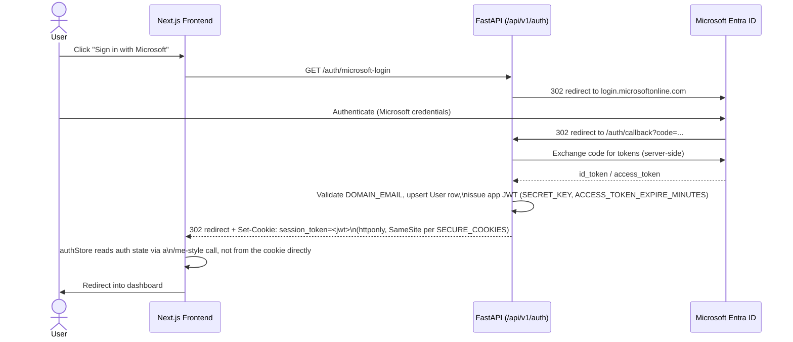
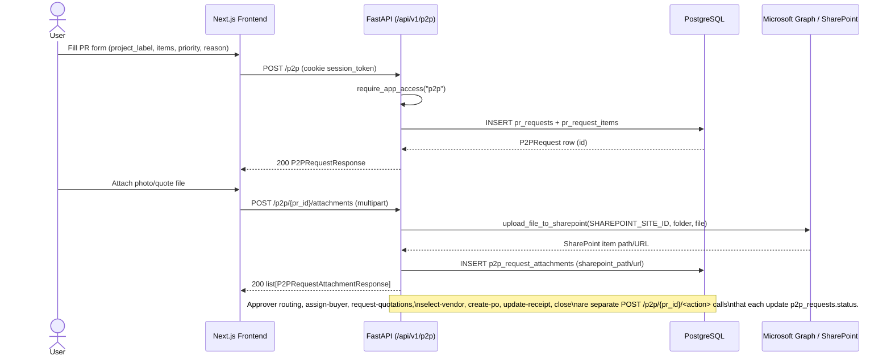
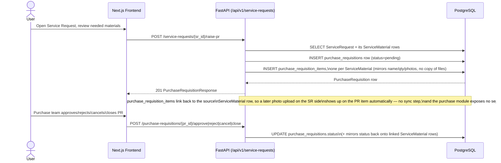

# Data Flow Diagrams

Representative end-to-end flows, grounded in the actual route code referenced under each
diagram. See [ARCHITECTURE.md](ARCHITECTURE.md) for module structure and
[../api/API.md](../api/API.md) for the full endpoint reference.

## 1. Login via Microsoft SSO

Code: `backend/app/modules/main/routes/auth.py`, `frontend/src/store/authStore.ts`.

## 2. Creating a Standalone Purchase Requisition (with SharePoint attachment)

Code: `backend/app/modules/p2p/routes/p2p_requests.py`,
`backend/app/utils/sharepoint.py`, `frontend/src/lib/api.ts` (`prRequestApi`).

## 3. Raising a Purchase Requisition from a Service Request's Materials

Code: `backend/app/modules/erp/routes/service_requests.py` (`raise-pr` handler),
`backend/app/modules/purchase/models/purchase_requisition.py`.

