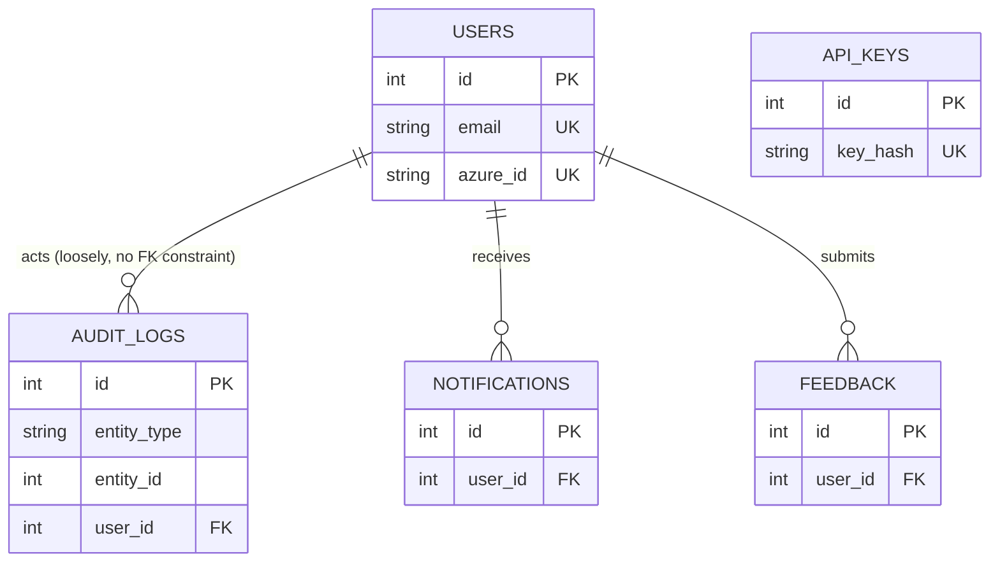
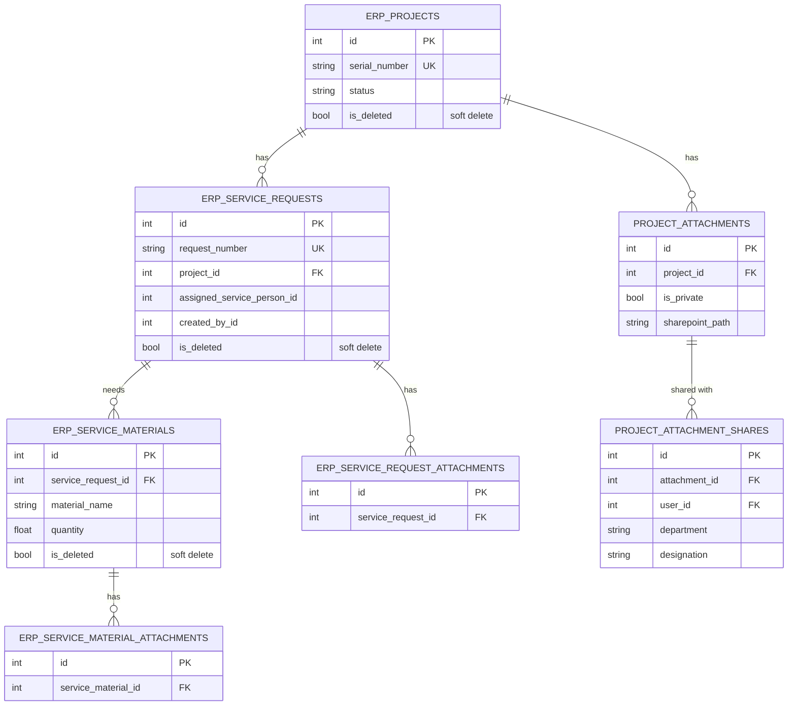
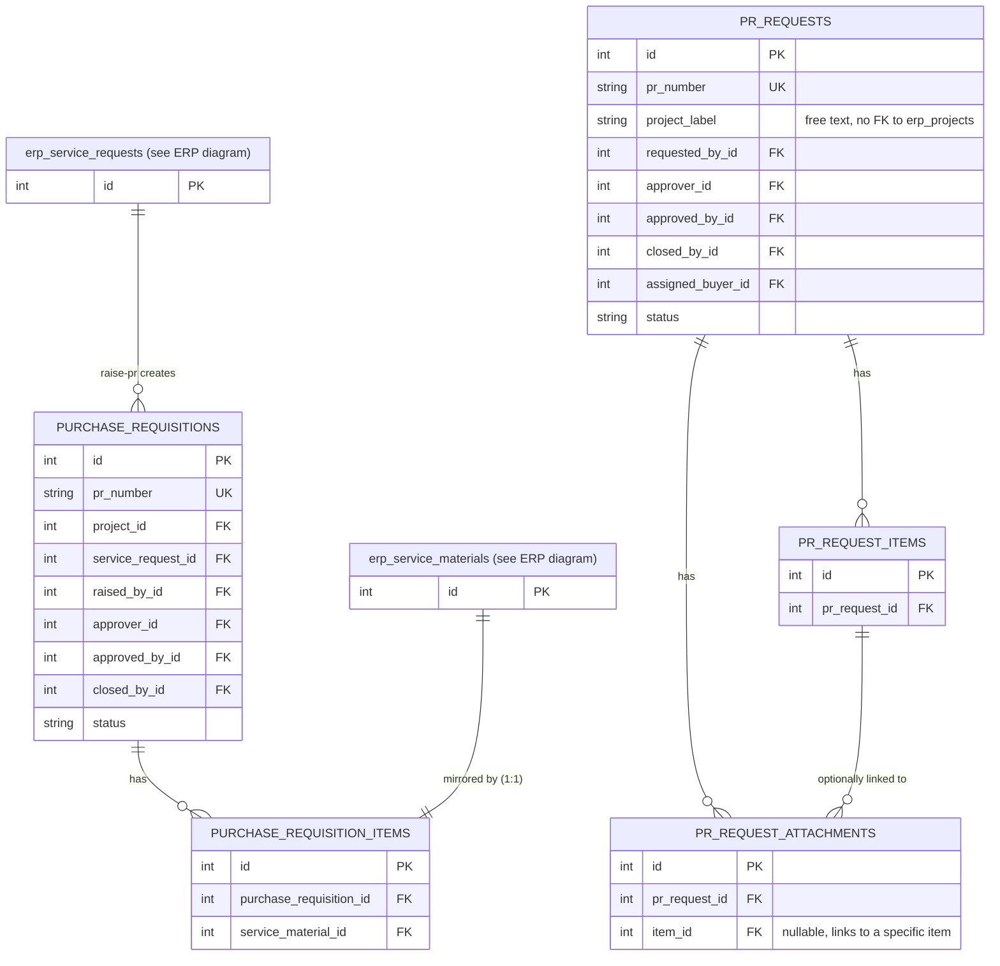
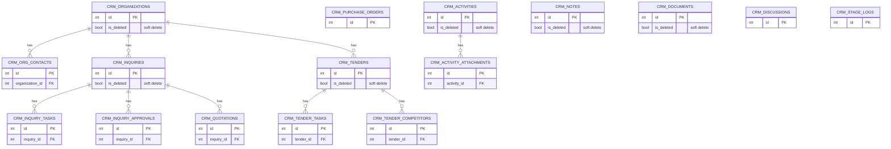

# Entity-Relationship Diagrams

Derived from the real SQLAlchemy models under `backend/app/modules/*/models/*.py` and
cross-checked against `backend/alembic/versions/`. Split into one diagram per module
group because a single company-wide diagram is unreadable at this table count. See
[SCHEMA.md](SCHEMA.md) for full column listings and [RELATIONSHIPS.md](RELATIONSHIPS.md)
for FK/cardinality prose.

## Main module (users, audit, notifications, feedback, API keys)

> Note: `audit_logs.user_id` and `notifications.user_id` / `feedback.user_id` are
> plain indexed integer columns, **not** declared `ForeignKey("users.id")` in the model
> files inspected — see [INDEXES.md](INDEXES.md) and [RELATIONSHIPS.md](RELATIONSHIPS.md)
> for what's an enforced FK vs. an application-level reference only.

## ERP module (Projects → Service Requests → Materials)

## Purchase module (ERP-origin PR) vs. Purchase Requisition module (standalone PR)

Two intentionally decoupled tables/lifecycles — see
[ADR 0003](../adr/0003-independent-p2p-module.md).

Note: `PURCHASE_REQUISITIONS` and `PR_REQUESTS` have **no** relationship to each other in
the schema — they are entirely separate tables with separate numbering, separate status
machines, and (per ADR 0003) deliberately no shared model/table.

## CRM module

## R&D module (calculation tools + history)

```mermaid
erDiagram
    RND_CALCULATION_HISTORY {
        int id PK
        int user_id "indexed, no FK constraint"
        string tool_name
    }
    RND_BRAKING_CALCULATIONS {
        int id PK
        int user_id "indexed, no FK constraint"
    }
    RND_HYDRAULIC_CALCULATIONS {
        int id PK
        int user_id
    }
    RND_LOAD_DISTRIBUTION_CALCULATIONS {
        int id PK
        int user_id
    }
    RND_QMAX_CALCULATIONS {
        int id PK
        int user_id
    }
    RND_SPLINE_CALCULATIONS {
        int id PK
        int user_id
        string doc_no
    }
    RND_TRACTIVE_EFFORT_CALCULATIONS {
        int id PK
        int user_id
    }
    RND_VEHICLE_PERFORMANCE_CALCULATIONS {
        int id PK
        int user_id
    }
```

R&D's per-tool tables (`rnd_braking_calculations`, `rnd_hydraulic_calculations`, etc.)
are independent, flat result-storage tables — none declare a `ForeignKey` to `users` or
to each other in the models inspected; `user_id` is an indexed plain integer, and
`rnd_calculation_history` appears to be a separate, generic save/list/rename/delete
history table alongside (not on top of) the per-tool tables. This is worth flagging: see
[RELATIONSHIPS.md](RELATIONSHIPS.md).
