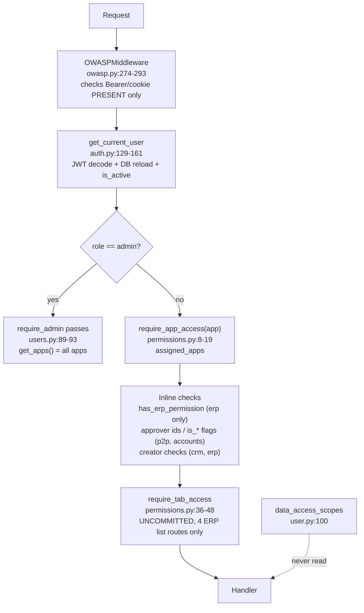
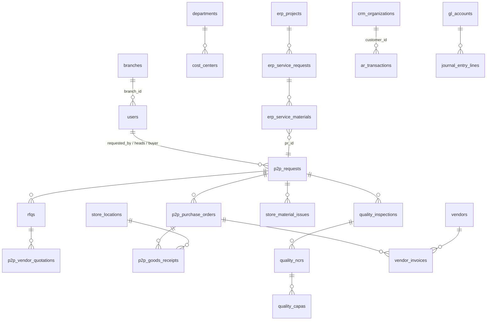

# Phase 0 — Inventory

Premnathrail Portal: Next.js frontend (`frontend/src`) + FastAPI modular monolith (`backend/app`).
Snapshot of the working tree on 2026-09-29, **including uncommitted changes** (Permission Matrix tab enforcement — see §3.7). Read-only review; nothing in the repo or DB was changed.

Conventions: BE = `backend/app/`, FE = `frontend/src/`. All `file:line` refs are relative to those roots unless a full path is given. "(inferred)" = read from code, not executed.

Persona tags used on findings: **[BA]** ERP Business Analyst · **[ARCH]** Software Architect · **[SEC]** Security Expert · **[USER]** End User.

---

## 1. Headline numbers

| Item | Count | Source |
|---|---|---|
| Frontend `page.tsx` routes | 137 (6 public, 131 under `/dashboard`) | FE/app/** |
| Backend endpoints | 478 across 76 routers | BE/main.py:227-302 |
| DB tables (SQLAlchemy models) | 110 across 10 modules | BE/modules/*/models |
| Alembic migrations | 127, linear chain, single head `d0e2f4a6b8c1` | backend/alembic/versions |
| Tour configs | 56 files | FE/lib/tour/configs, FE/lib/tour/registry.ts:46-266 |

Endpoint gating overall: 451 gated by module/admin; 8 fully unauthenticated; 11 `get_current_user` only; 8 `get_current_user` + inline checks with no module gate.

---

## 2. Module map

### 2.1 Backend wiring (`BE/main.py`)

- All routers are mounted with prefix `/api/v1` (main.py:227-302). The exceptions are R&D calculations and history, which use `/api/v1/rnd` (main.py:296-297). The 7 R&D tool routers are mounted through `rnd/routes/calculations.py:15-21`, which carries a router-level `require_app_access("rnd")` at :13.
- Middleware, in order:
  - CORS with credentials (main.py:191-197)
  - TrustedHost (:200-203)
  - Logging (:206)
  - AuditContext (:210)
  - OWASPMiddleware (:214)
  - error handlers (:217)
  - `/static` mount (:222)
- Scheduler (APScheduler, Asia/Kolkata) runs two daily jobs (main.py:332-350):
  - 08:00 CRM activity follow-up reminders
  - 08:30 PO overdue reminders
- `FastAPI()` at main.py:182 does not disable `docs_url`/`redoc_url`/`openapi_url`, so the docs are public in every environment.
- No router file is unmounted. There are no duplicate METHOD+path pairs.
- Dead or empty trees:
  - `modules/service/` has only empty subdirectories and no `__init__.py`. Service Requests actually live in `modules/erp`.
  - `modules/{crm,main,rnd}/api/` are empty.
  - `backend/migrations/` is empty and untracked. `alembic.ini:8` points at `alembic/`.

### 2.2 Per-module inventory

| Module | FE routes (count) | Nav component | BE routers → prefix | Models (tables) |
|---|---|---|---|---|
| **Organization** | `/dashboard/organization/{info, plants(+[id], new), departments, users, roles, audit-logs, cost-centers…}` (11) + `/dashboard/users`, `/dashboard/users/[id]` (2) | `components/organization/OrganizationNav.tsx:9-16` (Info, Branches, Department, Users, Role & Permissions, Audit Logs) | `modules/organization/routes/*` → `/organization/{company, branches, departments, cost-centers, audit-logs}` (49 endpoints); user admin lives in `main/routes/users.py` → `/users` | 11: companies, company_addresses, company_contacts, company_financial_years, company_documents, branches, branch_addresses, branch_documents, branch_user_assignments, cost_centers, departments |
| **Service Module / ERP** | `/dashboard/erp`, `erp/projects(+new, [id], [id]/edit)`, `erp/service-requests(+new, [id], [id]/edit)`, `erp/reports`, `erp/recycle-bin` (11) | `components/erp/ErpNav.tsx:9-15` (Dashboard, Projects, Service Requests, Reports, Recycle Bin) | `erp/routes/projects.py` → `/erp/projects`; `erp/routes/service_requests.py` → `/erp/service-requests` (39 endpoints, including `raise-pr`) | 7: erp_projects, erp_project_attachments, erp_project_attachment_shares, erp_service_requests, erp_service_materials, erp_service_request_attachments, erp_service_material_attachments |
| **CRM** | `/dashboard/crm` + organizations, inquiries, tenders (redirect stubs), activities, followups, documents, bulk-import, products, product-categories, payment-terms, technical-offer/[id] … (17) | `components/crm/CrmNav.tsx:11-19` (Dashboard, Organizations, Inquiries & Tenders, Bulk Import [admin]) | `crm/routes/*` → `/crm/{organizations, inquiries, tenders, activities, documents, products, product-categories, payment-terms, bulk-import, dashboard}` + `/crm` workflow (73 endpoints) | 14: crm_organizations, crm_org_contacts, crm_inquiries, crm_inquiry_line_items, crm_quotations, crm_quotation_line_items, crm_tenders, crm_activities, crm_activity_attachments, crm_documents, crm_stage_logs, crm_payment_terms, crm_products, crm_product_categories |
| **Procurement / P2P** | `/dashboard/p2p` (PR list), `p2p/new`, `p2p/[id]`, `p2p/approval`, `p2p/rfq`, `p2p/rfq/new`, `p2p/rfq/[id]`, `p2p/po-approval`, `p2p/po-tracking`, `p2p/mis` (10). GRN pages live under Store. | `components/p2p/P2PNav.tsx:10-17` (Purchase Requisitions, P.R Approval, R.F.Q*, P.O Approval, P.O Tracking*, M.I.S*; * = `purchaseOnly`) | `p2p/routes/*` → `/p2p/{requests, purchase-orders, rfqs, goods-receipts, mis}` (55 endpoints) | 10: p2p_requests, p2p_request_items, p2p_request_attachments, p2p_purchase_orders, p2p_purchase_order_items, p2p_goods_receipts, p2p_goods_receipt_items, rfqs, rfq_attachments, p2p_vendor_quotations |
| **Store** | `/dashboard/store/{items, categories, locations, bins, stock, issues, returns, transfers, adjustments, reservations, grn, grn/new …}` (22) | `components/store/StoreNav.tsx:8-22` (Items, Categories, Warehouses, Stock, Issues, Returns, Transfers, Adjustments, Reservations, GRN & Inspection) | `store/routes/*` → `/store/{items, categories, locations, bins, stock, material-issues, material-returns, stock-transfers, stock-adjustments, stock-reservations}` (39 endpoints); GRN is `/p2p/goods-receipts` | 15: store_locations, store_item_categories, store_items, store_bins, store_stock_balances, store_stock_transactions, store_material_issues(+_items), store_material_returns(+_items), store_stock_transfers(+_items), store_stock_adjustments(+_items), store_stock_reservations |
| **Purchase** | none of its own. `purchase` is an app key that unlocks the RFQ, PO and GRN parts of P2P and Store GRN | P2PNav `purchaseOnly` tabs (P2PNav.tsx:44-45) | shares the p2p routers (`require_app_access("purchase")`) | none (uses p2p_*) |
| **Quality** | `/dashboard/quality/**` (36) | `components/quality/QualityNav.tsx:9-24` (14 tabs) | `quality/routes/*` → `/quality/{standards, checklists, inspection-plans, inspections, ncr, rejections, capa, complaints, supplier-quality, documents, dashboard}` (50 endpoints) | 13: quality_standards, quality_checklists, quality_checklist_items, quality_inspection_plans, quality_inspections, quality_inspection_results, quality_inspection_attachments, quality_ncrs, quality_rejections, quality_capas, quality_customer_complaints, quality_supplier_scorecards, quality_documents |
| **Project Management** | `/dashboard/projects` (dashboard), all, my, reports, new, `[id]` workspace (6) | `components/projects/ProjectsNav.tsx:9-14` (Dashboard, All, My, Reports); workspace tabs in `ProjectWorkspace.tsx:23-27` | `projects/routes/*` (12 files) → `/projects` and `/projects/{id}/{phases, tasks, milestones, resources, budget, deliverables, documents, issues, risks, changes, approvals}` (55 endpoints) | 13: pm_projects, pm_project_phases, pm_project_tasks, pm_project_milestones, pm_project_resources, pm_project_budget_lines, pm_project_cost_entries, pm_project_deliverables, pm_project_documents, pm_project_issues, pm_project_risks, pm_project_change_requests, pm_project_approvals |
| **R&D Tools** | `/dashboard/rnd` + braking, hydraulic, qmax, load, tractive, vehicle, spline, history (9) | `components/rnd/RndNav.tsx:8-18` | `rnd/routes/calculations.py` → `/rnd/tools/*` (7 tools); `rnd/routes/history.py` → `/rnd/history` (26 endpoints) | 8: rnd_calculation_history + 7 `rnd_*_calculations` |
| **Finance & Accounting** | `/dashboard/finance` (redirect), masters, ledger, ar-ap, banking, reports (6) | `components/finance/FinanceNav.tsx:8-14` (Masters, Ledger, AR/AP, Banking, Reports) | `accounts/routes/*` → `/accounts/{gl-accounts, journal-entries, period-close, vendors, vendor-invoices, payments, ar-transactions, bank-accounts, bank-reconciliations, internal-orders, liquidity-forecast, reports}` (52 endpoints) | 12: gl_accounts, gl_balances, journal_entries, journal_entry_lines, period_close, vendors, vendor_invoices, payment_transactions, ar_transactions, bank_accounts, bank_reconciliations, internal_orders |
| **Shared / main** | `/`, `/login`, `/auth/teams-success`, `/legal/*` ×3; `/dashboard` home | `components/Sidebar.tsx:155-168` | `main/routes/*` → `/auth`, `/users`, `/notifications`, `/feedback`, `/modules`, `/presence` (38 endpoints) + `/health`, `/` | 7: users, audit_logs, notifications, feedback, modules, user_documents, user_sessions |

Frontend placeholders:
- `FE/app/dashboard/{admin, documents, electrical, engineering, hr, hydraulic, maintenance, pm, production, reports, sales, vendors}` contain only empty folders and have no `page.tsx`. Those URLs return 404.
- The matching `FE/components/*` folders are empty too.
- "Coming in a later phase" stubs appear in:
  - `ProjectWorkspace.tsx:117-124`: Activities, Meetings, Reports and Closure tabs
  - `projects/page.tsx:91`: KPIs
  - `finance/ar-ap/page.tsx:283`: an AR note

Shared services: the frontend calls go through `FE/lib/api.ts` (base `NEXT_PUBLIC_API_URL`, default `http://localhost:8000/api/v1`, line 4). There are no direct fetch or axios calls elsewhere. `itemsApi` (`/items`) is defined but unused, and the backend has no `/items` router.

Guided tours:
- Tours exist for CRM, P2P, Store (except GRN) and Organization.
- There are none for ERP, Quality, R&D, Projects, Finance, `store/grn`, `p2p/po-tracking`, `p2p/mis` or `users/[id]`.
- Four configs are never referenced: `crmActivityForm`, `crmInquiryForm`, `crmQuotationForm`, `crmTenderForm`.

---

## 3. Permission layers — where each is stored and enforced

### 3.1 Authentication
- **JWT:** HS256 signed with `SECRET_KEY`, 15-minute expiry, claims `sub`, `email`, `role`, `exp` (`auth/jwt_handler.py:22-37`). The placeholder key is rejected only when environment=production (`core/config.py:61, 92-101`).
- **`get_current_user`** (`main/routes/auth.py:129-161`): reads the `session_token` cookie, falling back to a Bearer header, then reloads the user from the DB and checks `is_active`. The JWT `role` claim is therefore never trusted.
- **Refresh:** opaque token, stored as a sha256 hash in `user_sessions.token_hash`, lasts 7 days and rotates on each use (auth.py:114-126, 459-498).
- **Cookies** (auth.py:91-111): all httponly. `secure` follows `SECURE_COOKIES`, which defaults to False. SameSite is `none` if secure, else `lax`. The refresh cookie is path-scoped to `/api/v1/auth`.
- **Login flows:**
  - Azure web OAuth: state is kept in memory (auth.py:164-183). The callback (auth.py:186-285) checks the email domain, then upserts the user by email and overwrites name and department.
  - Teams popup: a one-time code, kept in memory for 120 s, is exchanged at `/auth/teams-exchange` (auth.py:417-430).
  - Teams silent SSO at `/auth/teams-token`: RS256/JWKS verification plus an on-behalf-of token exchange (auth.py:288-414).
  - Azure directory sync: `POST /users/sync-azure` (`main/routes/users.py:462-550`).
- **OWASP pre-check** (`middleware/owasp.py:274-293`): only tests that a `Bearer ` header or `session_token` cookie is **present**. The public-path list is at owasp.py:123-140.

### 3.2 `role`
- **Stored:** `users.role`, with values `user`/`admin` (`main/models/user.py:25`; users.py:30).
- **Set by:**
  - `PATCH /users/{id}` (users.py:380-385). `usersApi.updateRole` exists, but no page calls it.
  - Azure sync, which promotes tenant Global Admins to admin and never demotes them (users.py:504-506, 516).
- **Backend enforcement:**
  - `require_admin` (users.py:89-93) guards every `/users` admin route, all 49 `/organization` routes, and the admin actions on modules and feedback.
  - A duplicate `require_admin` exists at `rnd/routes/history.py:44-51`.
  - There are many inline `role == "admin"` checks, for example CRM `_can_modify` and `crm/routes/bulk_import.py:71`.
- **Frontend enforcement:** `useRequireAdmin` (`FE/hooks/useAuth.ts:50-62`), `Sidebar.tsx:167`, `dashboard/page.tsx:233-236`.

### 3.3 `assigned_apps` / `get_apps()`
- **Stored:** `users.assigned_apps` (JSON, default `[]`; user.py:38). The app keys are `erp, rnd, crm, p2p, store, purchase, quality, projects, accounts` (user.py:10).
- **`get_apps()`** (user.py:102-107) returns every app for admins.
- **Set by:** `PATCH /users/{id}` (users.py:387-391), validated against the modules table plus `AVAILABLE_APPS` (users.py:74-86). The UI is the "User Permissions" tab on `users/[id]` (page.tsx:357-375).
- **Backend enforcement:**
  - `require_app_access(app)` (`core/permissions.py:8-19`) is applied per route in accounts, crm, erp and store. It is applied at router level in projects, quality and the R&D tools.
  - P2P uses custom wrappers: `_requester_or_purchase` (`p2p/routes/p2p_requests.py:103-110`) and `_require_mis_access` (`p2p/routes/mis.py:36-41`). PR create requires `p2p` (p2p_requests.py:299); RFQ, PO and GRN require `purchase`.
  - `require_any_app_access` (permissions.py:22) is never used, and `Module.is_active` is never checked.
- **Frontend enforcement:** `useRequireApp(app)` (useAuth.ts:66-78) on every module page, and `Sidebar.tsx:159-166`.

### 3.4 `erp_permissions`
- **Stored:** `users.erp_permissions`, a JSON list (user.py:39).
- **Ids** (users.py:54-71):
  - ERP: `project_view`, `project_create`, `project_edit`, `project_delete`, `sr_view`, `sr_create`, `sr_edit`, `sr_delete`
  - P2P: `pr_create`, `approval_view`, `approval_action`, `rfq_view`, `rfq_action`, `grn_view`, `grn_action`
- **Backend enforcement:** `has_erp_permission` (permissions.py:51-57), called inline at:
  - erp/routes/projects.py:97, 140, 173, 212, 380, 471
  - erp/routes/service_requests.py:208, 215, 262 (edit and delete also require being the creator)
- **Frontend enforcement:** `hasErpPermission` and `useRequireErpPermission` (useAuth.ts:11-15, 84-97) on ERP new and edit pages.
- **Gap [ARCH]:** `project_view`, `sr_view` and **all 7 P2P ids are stored but never checked** in the backend or frontend.

### 3.5 Approval-role flags
- **Stored:** `users.is_department_head, is_project_head, is_plant_head, is_purchase_head, is_director, is_md, is_finance_manager` (user.py:46-57).
- **Set by:** `PATCH /users/{id}` (users.py:399-418). The `users/[id]` UI exposes only purchase head, director, MD and finance manager. There is **no UI** for the department, project or plant head flags.
- **PR creation** (p2p_requests.py:299-321):
  - `_validate_head` (286-296) accepts **any active user** for each of the three head slots. The flags are not required, and the requester is not excluded.
  - If no department head is chosen, the first active user in the same `users.department` string with `is_department_head` is used (311-315).
  - The auto-buyer is then set via `resolve_auto_buyer_id` (321).
- **PR approve/reject:** checks the head ids stored on the PR, not the flags (p2p_requests.py:175-218). There is an admin override at 535-542.
- **PO approve/reject:** checks the flags. Purchase Head, Director and MD must all sign every PO, and any flagged user can act on any PO (p2p_requests.py:221-248, 564-594).
- **Finance:** `is_finance_manager` or admin is required for period close (`accounts/routes/period_close.py:20-22`) and invoice variance approval (`accounts/routes/vendor_invoices.py:24-26`).
- **`resolve_auto_buyer_id`** (`p2p/models/p2p_request.py:72-82`):
  - Looks up email addresses from a **hardcoded map** `P2P_CATEGORY_AUTO_BUYERS` (p2p_request.py:62-69): MKT, PNH and RAW → suraj.panwar; ELE → manish.kumar; HWC → mahender.singh; JOB → gaurav.katiyar. `OTH` has no buyer.
  - It does not check whether that user is active or has the `purchase` app.
  - Called at p2p_requests.py:321 and erp/routes/service_requests.py:922.

### 3.6 Frontend `/auth/me` payload
- `main/schemas/auth.py:20-30` returns:
  - `assigned_apps`, `erp_permissions`, `apps`
  - the six flags `is_department_head` through `is_md`
  - `notifications_enabled`
  - `tab_access` (uncommitted)
- **It omits `is_finance_manager`, `granular_permissions` and `data_access_scopes`.** The finance pages read `user.is_finance_manager` (`finance/ar-ap/page.tsx:49`, `finance/ledger/page.tsx:42`). A non-admin finance manager therefore never sees the Close Period or Approve Variance controls, even though the backend would allow them (inferred).

### 3.7 Granular Permission Matrix (partly uncommitted)
- **Stored:**
  - `users.granular_permissions` (user.py:98): ids of the form `module:subtab:action`
  - `users.data_access_scopes` (user.py:100)
  - **`tab_access` is not a column.** It is computed by `restricted_subtabs()` (`core/permission_registry.py:120-134`, uncommitted), which returns `{}` for admins.
- **Registry** (`core/permission_registry.py`):
  - 9 actions (:10) and 5 scopes, `own/department/branch/company/all` (:12)
  - modules (:14-99): organization (5 tabs), erp (5), crm (3), p2p (5, including `grn`), rnd (9), store (0), purchase (0), quality (14), projects (22)
  - There is **no `accounts` module** and no entry for Audit Logs, PO Tracking or MIS.
- **Set by:** `PATCH /users/{id}/permissions` (users.py:188-228), from the `users/[id]` Permission Matrix tab.
- **Semantics:**
  - Opt-in per module. A module with no grants is unrestricted.
  - Only `:view` has any effect (`can_view_tab`, permission_registry.py:106-117). The other 8 actions are never checked.
- **Backend enforcement** (uncommitted `require_tab_access`, permissions.py:36-48) covers only 4 routes:
  - `GET /erp/projects` (erp/routes/projects.py:50)
  - `GET /erp/projects/recycle-bin/list` (:232)
  - `GET /erp/service-requests` (erp/routes/service_requests.py:228)
  - `GET /erp/service-requests/recycle-bin` (:308)
- **Frontend enforcement** (uncommitted `FE/lib/tabAccess.ts:11-22`, `filterTabsByAccess`) is used in 7 Navs:
  - CrmNav:42, ErpNav:38, OrganizationNav:43, P2PNav:45, ProjectsNav:35, QualityNav:65, RndNav:49
  - It is **not** used in StoreNav, FinanceNav or ProjectWorkspace tabs, and no page checks `tab_access`. Every hidden tab still opens by direct URL.
- **`data_access_scopes`:** stored and validated only (users.py:208-218). It is **read nowhere**, in any query or on any page.

### 3.8 Layer matrix

| Layer | Stored | Set by | Enforced backend | Enforced frontend | Gap (carried to later phases) |
|---|---|---|---|---|---|
| Authentication | JWT (jwt_handler.py:22-37); `user_sessions.token_hash` | /auth/callback, /teams-token, /teams-exchange, /refresh (auth.py:186-498) | get_current_user auth.py:129-161 | useAuth.ts:17-37; dashboard/layout.tsx:18-32 | secure cookies default False; OAuth state/Teams codes in memory; OWASP only checks presence |
| role | users.role (user.py:25) | PATCH /users/{id} (API only); Azure sync | require_admin users.py:89-93 + inline | useRequireAdmin useAuth.ts:50-62; Sidebar.tsx:167 | no UI to set; sync never demotes |
| assigned_apps | users.assigned_apps (user.py:38) | PATCH users.py:387-391 | require_app_access permissions.py:8-19; p2p wrappers | useRequireApp useAuth.ts:66-78; Sidebar.tsx:159-166 | `/rnd/history` has no rnd gate; P2P FE requires `p2p`, BE admits purchase-only users and PO approvers |
| erp_permissions | users.erp_permissions (user.py:39) | PATCH users.py:393-397 | has_erp_permission → ERP create/edit/delete only | useAuth.ts:11-15, 84-97 | view + all P2P ids unenforced |
| Approval flags | users.is_* (user.py:46-57) | PATCH users.py:399-418 (UI covers 4 of 7) | p2p_requests.py:175-248, 311-315, 564-594; accounts period_close.py:20, vendor_invoices.py:24 | p2p/[id]/page.tsx:249-255; P2PRequestList.tsx:82-87; finance pages | heads = any user (self-approval possible); /me omits finance flag |
| Auto-buyer | hardcoded dict p2p_request.py:62-69 | code change + deploy | p2p_requests.py:321; service_requests.py:922 | — | no active/app check; OTH unmapped |
| granular_permissions / tab_access | users.granular_permissions (user.py:98); derived tab_access | PATCH /users/{id}/permissions users.py:188-228 | 4 ERP list routes (uncommitted) | 7 Navs (uncommitted) | ERP detail routes and every other module unenforced; pages don't check |
| data_access_scopes | users.data_access_scopes (user.py:100) | PATCH users.py:208-218 | none | none | 0% enforced |

---

## 4. Database tables by module

Conventions for all tables:
- Every primary key is `id` Integer autoincrement.
- TS = `TimestampMixin` (created_at, updated_at; `db/mixins.py:6`). SD = `SoftDeleteMixin` (is_deleted, deleted_at; `db/mixins.py:11`). U = unique.
- **no-FK** = holds an id with no ForeignKey constraint.
- Only two FKs set `ondelete` (both CASCADE, `erp/models/project_attachment.py:59,61`).
- Money is `Float` everywhere except `companies.authorized_capital/paid_up_capital`, which are Numeric(18,2) (`organization/models/company.py:46-47`).

### 4.1 main (7)
| Table | File:line | Key columns | FKs / notes |
|---|---|---|---|
| users | main/models/user.py:13 (TS) | U email, U azure_id, name, role, is_active, department (free text), designation, 7 `is_*` flags, notifications_enabled; JSON assigned_apps, erp_permissions, service_permissions, granular_permissions, data_access_scopes, dismissed_announcements | branch_id→branches; reporting_manager_id→users (self) |
| audit_logs | main/models/audit_log.py:7 | entity_type/entity_id, module_key (idx), performed_at | performed_by_id, branch_id, session_id all no-FK; `before_insert` listener fills ip, UA and session (:58) |
| notifications | main/models/notification.py:7 | entity_type/entity_id, read flag | user_id no-FK (idx) |
| feedback | main/models/feedback.py:7 | — | user_id no-FK |
| modules | main/models/module.py:15 (TS) | U key, is_active (never enforced) | — |
| user_documents | main/models/user_document.py:8 (TS) | JSON tags | user_id→users; created_by_id no-FK |
| user_sessions | main/models/user_session.py:7 | U token_hash, expires_at, revoked_at | user_id→users |

### 4.2 organization (11, all TS)
| Table | File:line | FKs / notes |
|---|---|---|
| companies | organization/models/company.py:8 | U code; default_plant_id→branches; default_warehouse_id→store_locations |
| company_addresses / company_contacts / company_financial_years | …:8 each | company_id→companies |
| company_documents | …:8 | company_id→companies; JSON tags; created_by_id no-FK |
| branches | organization/models/branch.py:9 | U code, status; company_id→companies; head_user_id and manager_user_id→users; default_warehouse_id→store_locations; default_cost_center_id→cost_centers. Circular with users.branch_id |
| branch_addresses | …:8 | branch_id→branches |
| branch_documents | …:8 | branch_id→branches; created_by_id no-FK |
| branch_user_assignments | …:9 | branch_id, user_id, department_id FKs; JSON additional_branch_access |
| cost_centers | organization/models/cost_center.py:9 | U code; branch_id, department_id, head_user_id, parent_cost_center_id (self), gl_account_id FKs |
| departments | organization/models/department.py:9 | U code; branch_id; head_user_id and secondary_head_user_id→users; JSONB additional_head_user_ids (no-FK ids) |

### 4.3 erp (7)
| Table | File:line | Key columns | FKs / notes |
|---|---|---|---|
| erp_projects | erp/models/project.py:14 (TS, SD) | U serial_number, status, po_number, client and operator name/email copies | no FKs |
| erp_project_attachments | erp/models/project_attachment.py:12 (TS) | is_private | project_id→erp_projects; created_by_id no-FK |
| erp_project_attachment_shares | project_attachment.py:46 | department, designation strings | attachment_id and user_id FKs, both CASCADE; DB-only unique constraint `uq_project_attachment_share` (migration a5d2f8c1e4b7:41) |
| erp_service_requests | erp/models/service_request.py:15 (TS, SD) | U request_number, status, priority, costs, invoice_number; copies assigned_to_name, reported_by_name/phone/email | project_id→erp_projects; assigned_service_person_id, created_by_id, locked_by_id no-FK (:58, :60, :99) |
| erp_service_materials | erp/models/service_material.py:13 (TS, SD) | estimated_budget, status; copies pr_number, pr_status | service_request_id→erp_service_requests; pr_id→p2p_requests |
| erp_service_request_attachments | service_request_attachment.py:12 (TS) | — | service_request_id FK; created_by_id no-FK |
| erp_service_material_attachments | service_material_attachment.py:12 (TS) | — | service_material_id FK; created_by_id no-FK |

### 4.4 crm (14)
| Table | File:line | Key columns | FKs / notes |
|---|---|---|---|
| crm_organizations | crm/models/organization.py:15 (TS, SD) | U org_code, U gst_number, name (idx); JSONB additional_phones and additional_emails (:33-34) | gl_reconciliation_account_id→gl_accounts; created_by_id no-FK; DB-only partial unique index on lower(name) where not deleted (c3a9e5f21d47:24) |
| crm_org_contacts | organization.py:52 | JSONB additional_mobiles/emails; `created_at` NOT NULL with no default (:65) | org_id→crm_organizations |
| crm_inquiries | crm/models/inquiry.py:13 (TS, SD) | U universal_id, status, current_stage, priority, budget, expected_value; **people stored as strings**: bd_owner, sales_engineer, followup_assigned_to (:35, :36, :64) | org_id, org_contact_id FKs; created_by_id no-FK |
| crm_inquiry_line_items | inquiry.py:85 | no timestamps | inquiry_id FK |
| crm_quotations | inquiry.py:99 | quot_number (not unique), price, discount, client name/email/phone copies; `created_at` NOT NULL with no default (:130) | inquiry_id FK |
| crm_quotation_line_items | inquiry.py:138 | unit_price, total | quotation_id FK |
| crm_tenders | crm/models/tender.py:13 (TS, SD) | U universal_id, tender_number (idx, not unique), tender_value, contract_value, status, current_stage; bd_owner and decision_by strings | org_id, org_contact_id FKs |
| crm_activities | crm/models/activity.py:10 (TS, SD) | status, assigned_to String(150); JSON mom_items, contact_ids; polymorphic related_module/related_id/universal_id | org_id, org_contact_id FKs |
| crm_activity_attachments | activity_attachment.py:8 (TS) | — | activity_id FK |
| crm_documents | crm/models/document.py:8 (TS, SD) | polymorphic related_*, uploaded_by_name | org_id FK |
| crm_stage_logs | crm/models/stage_log.py:8 | polymorphic related_*, entered_by_id (no-FK) + entered_by_name; `created_at` with no default | — |
| crm_payment_terms / crm_products / crm_product_categories | payment_term.py:8, product.py:8, product_category.py:8 (TS, SD) | product_categories: U name; products: DB-only partial unique index (d7f1a4c8e932:23) | created_by_id no-FK |

### 4.5 p2p (10, all TS)
| Table | File:line | Key columns | FKs / notes |
|---|---|---|---|
| p2p_requests | p2p/models/p2p_request.py:87 | U p2p_number, status, priority, department (string); denormalized approver_name, project_head_name, plant_head_name, purchase_head/director/md_approved_by_name, rejected_by_name; free-text copies vendor, rfq_number, quotation, selected_vendor, po_number, po_value, grn_number, receipt_status, qtys (:156-175) | FKs→users: requested_by_id, approver_id (Dept Head), project_head_id, plant_head_id, approved_by_id, closed_by_id, assigned_buyer_id. **No user-id columns for Purchase Head, Director or MD approvals.** |
| p2p_request_items | p2p_request_item.py:13 | fulfillment_status | p2p_request_id; issued_from_location_id→store_locations; material_issue_id→store_material_issues |
| p2p_request_attachments | p2p_request_attachment.py:17 | — | p2p_request_id, item_id FKs; created_by_id no-FK |
| p2p_purchase_orders | p2p/models/purchase_order.py:17 | U po_number, status, total_value, vendor_name | p2p_request_id, created_by_id FKs; vendor_id and document_uploaded_by_id no-FK |
| p2p_purchase_order_items | purchase_order.py:56 | unit_price, line_total | purchase_order_id FK |
| p2p_goods_receipts | p2p/models/goods_receipt.py:26 | U grn_number, status | purchase_order_id, store_location_id, received_by_id, inspected_by_id FKs |
| p2p_goods_receipt_items | goods_receipt.py:58 | quality_status | goods_receipt_id, po_item_id FKs |
| rfqs | p2p/models/rfq.py:20 | U rfq_number, status | p2p_request_id, created_by_id, locked_by_id FKs |
| rfq_attachments | rfq_attachment.py:12 | vendor_name, vendor_contact | rfq_id FK |
| p2p_vendor_quotations | vendor_quotation.py:20 | quoted_price, technical/commercial status, vendor_name | rfq_id, p2p_request_id, evaluator and creator FKs; vendor_id no-FK |

### 4.6 store (15, all TS)
| Table | File:line | FKs / notes |
|---|---|---|
| store_locations | store/models/location.py:8 | U code; branch_id, manager_user_id |
| store_item_categories | category.py:8 | U code; parent_id self |
| store_items | item.py:15 | U item_code, costs, min/max/reorder, status; preferred_warehouse_id→store_locations |
| store_bins | bin.py:13 | location_id, parent_id self; `code` **not** unique |
| store_stock_balances | stock_balance.py:8 | UniqueConstraint(item_id, location_id) :15 |
| store_stock_transactions | stock_transaction.py:32 | item_id, location_id, bin_id, created_by_id; reference_type/reference_number strings (polymorphic) |
| store_material_issues (+_items) | material_issue.py:9, :37 | U issue_number; location_id, requested_by_id, issued_by_id, department_id, p2p_request_id |
| store_material_returns (+_items) | material_return.py:21, :42 | U return_number; source_issue_id→store_material_issues |
| store_stock_transfers (+_items) | stock_transfer.py:9, :31 | U transfer_number; from/to_location_id |
| store_stock_adjustments (+_items) | stock_adjustment.py:9, :33 | U adjustment_number; approved_by_id, created_by_id |
| store_stock_reservations | stock_reservation.py:17 | U reservation_number, status; item_id, location_id, reserved_by_id |

### 4.7 quality (13, all TS)
| Table | File:line | FKs / notes |
|---|---|---|
| quality_standards | quality/models/quality_standard.py:11 | U standard_code |
| quality_checklists / _items | quality_checklist.py:14, :34 | checklist_id |
| quality_inspection_plans | inspection_plan.py:15 | U plan_number; checklist_id, standard_id |
| quality_inspections | inspection.py:16 | U inspection_number; inspection_plan_id, p2p_request_id, inspected_by_id; vendor_id no-FK plus vendor_name. **No FK to p2p_goods_receipts** (inferred from the column list) |
| quality_inspection_results / _attachments | inspection.py:52, :70 | inspection_id |
| quality_ncrs | ncr.py:13 | U ncr_number; inspection_id, raised_by_id |
| quality_rejections | rejection.py:12 | U rejection_number; ncr_id, inspection_id; vendor_id no-FK |
| quality_capas | capa.py:12 | U capa_number; ncr_id, complaint_id, responsible_user_id |
| quality_customer_complaints | customer_complaint.py:12 | U complaint_number; customer_org_id no-FK (not linked to crm_organizations) |
| quality_supplier_scorecards | supplier_quality.py:10 | vendor_id no-FK |
| quality_documents | quality_document.py:10 (TS, SD) | linked_standard_id, uploaded_by_id |

### 4.8 projects (13)
Every child table has `project_id`→`pm_projects` (indexed). All are TS except `pm_project_approvals`.

| Table | File:line | Notes |
|---|---|---|
| pm_projects | projects/models/project.py:12 | U project_code, status, priority; department_id, branch_id, project_manager_id, sponsor_id, created_by_id, closed_by_id |
| pm_project_phases / _tasks / _milestones | phase.py:11, task.py:12, milestone.py:11 | tasks: phase_id, parent_task_id (self), assignee_id |
| pm_project_resources | resource.py:9 | user_id |
| pm_project_budget_lines / _cost_entries | budget.py:9, :23 | cost_entries: budget_line_id, recorded_by_id |
| pm_project_deliverables | deliverable.py:11 | milestone_id, owner_id |
| pm_project_documents | document.py:10 (TS, SD) | uploaded_by_id plus uploaded_by_name |
| pm_project_issues / _risks / _change_requests | issue.py:12, risk.py:14, change_request.py:11 | user FKs |
| pm_project_approvals | approval.py:11 (no TS) | requested_by_id, approver_id; reference_id no-FK |

`pm_projects` has no link to `erp_projects`. The two "project" concepts are separate [ARCH].

### 4.9 rnd (8)
- Tables: `rnd_calculation_history` (calculation_history.py:8), and in `tool_calculations.py` `rnd_{braking, hydraulic, load_distribution, qmax, spline, tractive_effort, vehicle_performance}_calculations` (:14, :38, :61, :82, :101, :126, :151).
- Each table has `user_id` (no-FK, indexed), NOT NULL JSON `inputs_json`/`results_json`, and a server-default `created_at`. There are no FKs and no TS.

### 4.10 accounts (12, all TS)
| Table | File:line | FKs / notes |
|---|---|---|
| gl_accounts | accounts/models/gl_account.py:11 | U code, account_type, status |
| gl_balances | gl_balance.py:8 | UniqueConstraint(gl_account_id, accounting_period) :16; is_locked |
| journal_entries / journal_entry_lines | journal_entry.py:12, :52 | U entry_number; created_by, posted_by and reversed_by user FKs; reverses_journal_entry_id (self). Lines have FKs to gl_accounts, cost_centers, internal_orders, vendors and crm_organizations. reference_document_* no-FK |
| period_close | period_close.py:11 | U accounting_period; closed_by_id, reopened_by_id |
| vendors | vendor.py:10 | U code; gl_reconciliation_account_id. **Not referenced by p2p or quality `vendor_id` columns** (those have no FK) |
| vendor_invoices | vendor_invoice.py:13 | UniqueConstraint(vendor_id, invoice_number) :19; purchase_order_id→p2p_purchase_orders |
| payment_transactions | payment_transaction.py:12 | U payment_number; bank_account, vendor, vendor_invoice, ar_transaction, journal_entry and bank_reconciliation FKs |
| ar_transactions | ar_transaction.py:12 | U invoice_number; customer_id→crm_organizations; reference_* no-FK |
| bank_accounts / bank_reconciliations | bank_account.py:10, bank_reconciliation.py:11 | U account_no; gl_account_id; bank_account_id |
| internal_orders | internal_order.py:12 | U code; gl_account_id, cost_center_id |

### 4.11 Cross-module links (FK-backed only)

Links that are **missing** (no FK) and matter for later phases:
- `p2p_purchase_orders.vendor_id`, `p2p_vendor_quotations.vendor_id`, `quality_*.vendor_id` → `vendors` (none of these point to the vendor master)
- `quality_inspections` → `p2p_goods_receipts`
- `quality_customer_complaints.customer_org_id` → `crm_organizations`
- `pm_projects` ↔ `erp_projects`
- CRM owners (strings) → `users`

---

## 5. Model import and migration check

- **`alembic/env.py` and `main.py` import the same model list** (env.py:18-102; main.py:12-96). Both are **missing**:
  - `Feedback` (`main/models/feedback.py:7`)
  - `ProductCategory` (`crm/models/product_category.py:8`). It is also absent from `crm/models/__init__.py:1-9`.
  - At runtime these two load only because their routes are imported (main.py:100, 164). Alembic autogenerate does not see them, so a future `--autogenerate` would propose dropping `feedback` and `crm_product_categories` (inferred). **[ARCH]** This matches your saved rule on model-import sync.
- **Migration chain:** 127 files, root `ea1db0867f03`, single head `d0e2f4a6b8c1` (add notifications_enabled to users). No branches or merges.
- **The baseline runs `Base.metadata.create_all()`** (`ea1db0867f03_baseline.py:34`), so a fresh DB gets the *current* model shape at revision 1.
  - 24 pre-Alembic tables (users, audit_logs, notifications, 8 CRM, 5 ERP, 8 R&D) have no `op.create_table`.
  - Later migrations are guarded with has_table checks.
  - [ARCH] (inferred): a fresh DB and an upgraded DB can diverge wherever a later migration's DDL differs from the model.
- **Tables dropped and re-created:**
  - `vendors`: c8d3e5f1a7b2 → dropped in ae88c635814e → re-created in e1f2a3b4c5d6:58
  - `companies`: b6f1c8a3d5e7 → dropped in a6b3d9e1c4f7 → re-created in d8e0f2c4a6b9
- **Dead migration tables** (created, then dropped; no model): asset_*, electrical_work_orders, engineering_documents, manufacturing_*, items, stock_items/balances/transactions, purchase_requisitions.
- **Constraints that exist only in the DB, not in the models:**
  - `uq_project_attachment_share`
  - CRM org name partial unique index
  - CRM product partial unique index
  - complaint-number named constraint
  - users JSON server defaults

---

## 6. Module summary

| Module | Pages | Endpoints | Tables | How access is gated |
|---|---|---|---|---|
| Organization (+ Users admin) | 11 + 2 | 49 (+ `/users` admin routes in main) | 11 | BE `require_admin` on every route (users.py:89-93); FE `useRequireAdmin`; Sidebar hides for non-admins (Sidebar.tsx:167). Matrix tab filter has no effect because only admins reach it. |
| Service Module / ERP | 11 | 39 | 7 | BE `require_app_access("erp")`; `has_erp_permission` on create/edit/delete; creator check on SR edit/delete (service_requests.py:202-215); `require_tab_access` on 4 list routes (uncommitted); detail/attachment routes only app-gated. FE `useRequireApp('erp')`, `useRequireErpPermission` on new/edit, ErpNav matrix filter. |
| CRM | 17 | 73 (1 unauthenticated by design: shared-content) | 14 | BE `require_app_access("crm")`; `_can_modify` = admin or creator; bulk import admin-only (bulk_import.py:71). FE `useRequireApp('crm')`, CrmNav matrix filter + admin-only Bulk Import. |
| Procurement / P2P | 10 | 55 | 10 | BE: create PR needs `p2p`; everything else `purchase` or `_requester_or_purchase`; PR approval by head ids on the PR; PO approval by `is_purchase_head/is_director/is_md`; MIS by `_require_mis_access`. FE `useRequireApp('p2p')` (po-tracking: `purchase`), `purchaseOnly` nav tabs, approver flags on buttons. |
| Store | 22 | 39 (+ GRN via p2p) | 15 | BE `require_app_access("store")` only; GRN create needs `purchase`. FE `useRequireApp('store')`; **StoreNav has no tab gating**; registry has no store tabs. |
| Purchase | — | (shares p2p) | — | App key `purchase` only. |
| Quality | 36 | 50 | 13 | BE router-level `require_app_access("quality")`, no inline role checks. FE `useRequireApp('quality')`, QualityNav matrix filter (nav only). |
| Project Management | 6 | 55 | 13 | BE router-level `require_app_access("projects")` in all 12 files, no inline checks (no PM/owner check). FE `useRequireApp('projects')`, ProjectsNav filter; workspace tabs unfiltered. |
| R&D Tools | 9 | 26 | 8 | BE tools: `require_app_access("rnd")` at router level; **`/rnd/history` has only `get_current_user`** + owner/admin inline checks (history.py:153-295). FE `useRequireApp('rnd')`, RndNav filter. |
| Finance & Accounting | 6 | 52 | 12 | BE `require_app_access("accounts")`; `is_finance_manager` or admin only for period close and invoice variance. FE `useRequireApp('accounts')`; **FinanceNav has no tab gating**; no `accounts` module in the Permission Matrix. |
| Shared (auth, users, notifications, feedback, modules, presence) | 6 public + 1 home | 38 + 2 | 7 | Auth routes public; notifications/presence/directory `get_current_user` only; users/modules/feedback admin actions `require_admin`. |
| **Total** | **137** | **478** | **110** | |

---

## 7. Early flags surfaced by the inventory

These are recorded here with evidence. Each will be analysed in the phase shown.

| # | Persona | Finding | Evidence | Phase |
|---|---|---|---|---|
| F0-1 | [SEC] | The OWASP auth pre-check accepts any `Authorization: Bearer x` header. It is not a real gate; real auth depends on each route having `get_current_user`. | owasp.py:275-292 | 4 |
| F0-2 | [USER]/[BA] | The external CRM document share link (`/crm/documents/{id}/shared-content`) is not in `PUBLIC_PATHS`, so a vendor with no portal session gets a 401 and the Technical Offer Request link does not work for them. | documents.py:109-121; owasp.py:123-140 | 2, 4 |
| F0-3 | [SEC]/[BA] | PR approver slots accept any active user, including the requester, so a user can self-approve. "All three heads required" is enforced only in the frontend. | p2p_requests.py:286-296; p2p/new/page.tsx:115-117; p2p/schemas/p2p_request.py:87-92 | 2, 4 |
| F0-4 | [ARCH] | Auto-buyer assignment is hardcoded by email in code. There is no check that the buyer is active or has the `purchase` app, and category OTH has no buyer. | p2p_request.py:62-82 | 2, 3 |
| F0-5 | [USER] | `/auth/me` omits `is_finance_manager`, so finance managers who aren't admins can't see the Close Period or Approve Variance UI. | schemas/auth.py:20-30; finance/ar-ap/page.tsx:49; finance/ledger/page.tsx:42 | 1 |
| F0-6 | [SEC] | Permission Matrix view grants are enforced on the backend only for 4 ERP list routes. Detail routes (e.g. `GET /erp/projects/{id}`) and every other module are nav-only, and pages never check `tab_access`. | permissions.py:36-48; projects.py:50,232; service_requests.py:228,308; tabAccess.ts:11-22 | 4 |
| F0-7 | [ARCH] | `data_access_scopes` and 8 of the 9 matrix actions are stored and edited in the UI but enforced nowhere. `project_view`, `sr_view` and all 7 P2P `erp_permissions` ids are also never checked. | user.py:98-100; permission_registry.py:10-12; users.py:54-71 | 3, 4 |
| F0-8 | [ARCH] | The `Feedback` and `ProductCategory` models are missing from alembic/env.py and main.py model imports. | env.py:18-102; crm/models/__init__.py:1-9 | 3 |
| F0-9 | [SEC] | `/rnd/history` has no `rnd` app gate. `/presence/{type}/{id}` exposes viewer names and emails for any record. `/users/directory` is open to every user. | history.py:153,188; presence.py:42; users.py:123 | 4 |
| F0-10 | [ARCH]/[BA] | The PO approval chain (Purchase Head → Director → MD) records only `*_approved_by_name` strings and no user-id columns, so the audit trail can't be joined to users. | p2p_request.py:87-175 | 3 |
| F0-11 | [USER] | P2P frontend pages require the `p2p` app, but the backend lets purchase-only users and PO approvers act. A Director without `p2p` can approve via the API but is redirected away in the UI (inferred). | useAuth.ts:66-78; p2p_requests.py:103-110, 221-248 | 1 |
| F0-12 | [ARCH] | There are two unrelated "project" models (`erp_projects`, `pm_projects`), and vendors are free-text or no-FK in P2P and Quality even though an accounts `vendors` master exists. | §4.3, §4.8, §4.11 | 3 |
| F0-13 | [SEC] | OpenAPI docs are public in every environment. `SECURE_COOKIES` defaults to False. OAuth state and Teams codes are kept in process memory, which breaks with more than one worker. | main.py:182; auth.py:91-111, 164-183, 417-430 | 4 |
