# Phase 2 — Workflows End to End

This phase traces seven business processes through the code. Each process has:
- Mermaid state diagrams showing the transitions as coded, with each edge labelled by its endpoint;
- a Mermaid flowchart with one swimlane per actor;
- a step table: step | actor | screen | API call | DB write | status change | notification/email | audit;
- a gap list with finding IDs `P2-<WF>-<n>`, tagged with a persona.

It is a read-only review of the working tree on 2026-09-29, including the uncommitted Permission Matrix work.

Conventions:
- FE = `frontend/src/`, BE = `backend/app/`. `file:line` references are relative to those roots.
- "(inferred)" means read from the code, not executed.
- Personas: **[BA]** ERP Business Analyst · **[ARCH]** Software Architect · **[SEC]** Security Expert · **[USER]** End User.

| § | Workflow | Gap IDs | Gaps |
|---|---|---|---|
| 2.1 | Procure-to-Pay: PR → head approval → auto-buyer → RFQ → quotations → PO → PO approval → GRN → stock → closure | P2-P2P-1…39 | 39 |
| 2.2 | ERP Service Request lifecycle, including Raise PR from the Materials tab | P2-ERP-1…39 | 39 |
| 2.3 | CRM Inquiry / Tender lifecycle and Bulk Import | P2-CRM-1…41 | 41 |
| 2.4 | Store: items, stock, issues, returns, transfers, adjustments, reservations | P2-STO-1…42 | 42 |
| 2.5 | Quality: plans → inspection → NCR → rejection → CAPA → complaints | P2-QA-1…37 | 37 |
| 2.6 | Project Management lifecycle to closure | P2-PM-1…24 | 24 |
| 2.7 | User onboarding: Azure AD login → provisioning/sync → module access → Permission Matrix | P2-USR-1…24 | 24 |
| | **Total** | | **246** |

---

## 1. Cross-workflow summary

### 1.1 How the modules actually connect today

Solid edges are links that exist in code. Dashed edges are hand-offs the business needs but that don't exist.

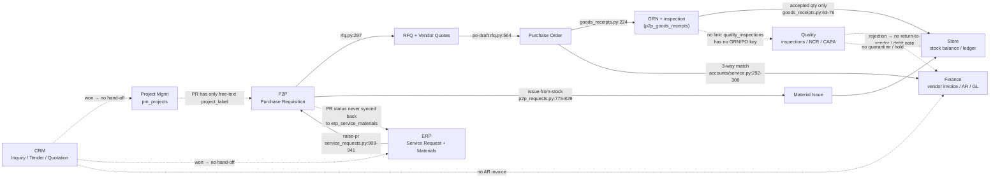
```mermaid
flowchart LR
    CRM["CRM<br/>Inquiry / Tender / Quotation"]
    ERP["ERP<br/>Service Request + Materials"]
    PM["Project Mgmt<br/>pm_projects"]
    PR["P2P<br/>Purchase Requisition"]
    RFQ["RFQ + Vendor Quotes"]
    PO["Purchase Order"]
    GRN["GRN + inspection<br/>(p2p_goods_receipts)"]
    STK["Store<br/>stock balance / ledger"]
    ISS["Material Issue"]
    QA["Quality<br/>inspections / NCR / CAPA"]
    FIN["Finance<br/>vendor invoice / AR / GL"]

    ERP -->|"raise-pr<br/>service_requests.py:909-941"| PR
    PR -->|"rfq.py:297"| RFQ
    RFQ -->|"po-draft rfq.py:564"| PO
    PO -->|"goods_receipts.py:224"| GRN
    GRN -->|"accepted qty only<br/>goods_receipts.py:63-76"| STK
    PR -->|"issue-from-stock<br/>p2p_requests.py:775-829"| ISS
    ISS --> STK
    PO -->|"3-way match<br/>accounts/service.py:292-308"| FIN

    CRM -.->|"won → no hand-off"| PM
    CRM -.->|"won → no hand-off"| ERP
    CRM -.->|"no AR invoice"| FIN
    PM -.->|"PR has only free-text project_label"| PR
    GRN -.->|"no link: quality_inspections<br/>has no GRN/PO key"| QA
    QA -.->|"rejection → no return-to-vendor / debit note"| FIN
    QA -.->|"no quarantine / hold"| STK
    PR -.->|"PR status never synced back<br/>to erp_service_materials"| ERP
```

The only end-to-end chain in code is **ERP/Requester → PR → RFQ → PO → GRN → Stock**, with a thin link into Finance. CRM, Project Management and Quality are islands: nothing enters or leaves them automatically.

### 1.2 Status and state-machine discipline

| Workflow | Status values defined in BE? | Transitions enforced? | Notes |
|---|---|---|---|
| P2P PR | Yes (`p2p/models/p2p_request.py`) | **Partly.** Dedicated endpoints check the current status (e.g. `p2p_requests.py:520`), but `PATCH /p2p/requests/{id}` can set **any** status (`p2p_requests.py:477-505`). | Nothing leaves `rejected` or `cancelled`. The evaluation branch (technical → commercial → vendor_selected) has no FE caller. `/close` is never called from the FE. |
| P2P PO | Yes | **No.** PATCH sets any status, with no audit row (`purchase_orders.py:127-160`). | PO approval is recorded on the **PR**, not the PO row. |
| GRN | draft → completed | Status check only, with **no row lock** (`goods_receipts.py:332-333`). | No cancel or reversal. |
| ERP SR | **No.** Free `String(50)`; the 11 values exist only in FE `types/index.ts:159-170`. | **No.** Any → any (`service_requests.py:366-384`). | An SR can be created already `closed`. The close email fires once per SR ever. |
| CRM inquiry/tender | **Two conflicting lists.** BE 15/12 stages (`inquiries.py:33-37`, `tenders.py:34-38`) vs FE 6/7 (`components/crm/constants.ts:77-94`). The lists share no values. | **No.** The FE uses an unvalidated PATCH; the validated `POST /stages` is never called. | |
| Store documents | Post on create. No draft/approved/cancelled states. | n/a | Transfers are instant, with no in-transit state. |
| Quality NCR/CAPA/complaint/rejection | Enum lists exist | **No.** Any → any (`ncr.py:119-132`, `capa.py:104-115`, `complaints.py:113-121`, `rejections.py:106-119`). | An NCR can be closed with open CAPAs. `closed_at` is not reset on reopen. |
| PM project / CR / approval | Enum lists exist | **No.** Any → any, and there is no `closed` project status. | Project status can't be changed from the UI at all. |

### 1.3 Segregation of duties and approvals

| Control | P2P | Store | Quality | PM | ERP |
|---|---|---|---|---|---|
| Approver ≠ requester enforced | **No.** The requester can pick themselves as all three heads (`p2p_requests.py:286-296`). | **No.** The adjustment "approver" is any user, including the creator (`stock_adjustments.py:73-74`). | No approval step exists | **No.** Anyone can decide any approval, and no `decided_by` column exists (`approvals.py:109-140`). | Raise-PR sets no heads (`service_requests.py:921-941`) |
| Approval order enforced | **No.** The MD can approve before the Purchase Head (`p2p_request.py:205-216`). | — | — | — | — |
| Value-based thresholds | **None** | None | — | None (budget overrun is only coloured red) | — |
| Concurrent-approval safety | **No.** `approve` and `approve-po` read without `with_for_update`; only `create-po` locks (`p2p_requests.py:519` vs `:924`). | — | — | Last write wins | Last write wins; the edit lock is never set |

### 1.4 Notifications: who is told, and can they act?

| Event | Notified? | Can the recipient act? |
|---|---|---|
| PR submitted → heads | Yes (in-app + email) | **Only if the head has the `p2p` app.** Otherwise every P2P page redirects and approve returns 403 (`useAuth.ts:66-78`, `p2p_requests.py:108`). Notification rows have no link target (`NotificationBell.tsx:9-16`). The Approve button shows only when the URL has `?from=approval`. |
| PO submitted for approval (the live path, `submit_po_draft`) | **No** (`rfq.py:763-798`; `rfq.py` doesn't import `notify_user`) | Approvers without `purchase` get 403 on the PO value, RFQ and PO document (`purchase_orders.py:42`, `rfq.py:142/157/742`). |
| PO approved by each role → next role / requester / buyer / store | **No** (`p2p_requests.py:564-594`) | — |
| PO overdue | Yes, daily at 08:30 | The reminder also fires for unapproved POs and for rejected or cancelled PRs (`tasks/po_overdue_reminders.py:27,50-56`). |
| ERP SR closed → client | Yes (email) | The greeting interpolates `reported_by_name` unescaped (`utils/email.py:136,149`). |
| CRM TOR → R&D | Email to one shared mailbox (`utils/email.py:529`) | No R&D task and no way to return the offer. The external share link is blocked for non-portal users by the OWASP pre-check (Phase 0, F0-2). |
| CRM follow-up due | In-app only, 08:00 | Only for activities created at inquiry create. Delivered to the user whose name matches free-text `assigned_to` (`followup_reminders.py:29-37`). |
| Store, Quality, Projects events | **None.** Zero `notify_user` or email calls in `modules/store`, `modules/quality` or `modules/projects`. | — |
| New user signs in | **None.** No welcome email, no admin alert, no access-request flow. | The user lands on an empty dashboard (`dashboard/page.tsx:233-265`). |

### 1.5 Audit trail coverage

| Area | Audited | Not audited |
|---|---|---|
| P2P | PR create, approve, reject and status changes | PO create/PATCH, PO draft edit, vendor quotation edit, attachment deletes, PRs raised from ERP |
| ERP | SR/project field changes | Attachment and photo deletes (`service_requests.py:639-664,880-906`), the per-SR cascade on project delete |
| CRM | Inquiry spec revisions, stage logs | Quotation create/delete/response, activities, contacts, documents, `POST /stages` |
| Store | **Nothing.** No Store route writes `audit_logs`. | Everything |
| Quality | **Nothing.** Zero audit hits in `modules/quality`, and records are **hard-deleted**. | Everything |
| PM | Every field change | Child-record changes are logged against the project without identifying which task, risk or CR changed |
| Users/access | Permission Matrix changes, with no old/new values (`users.py:219-225`) | Module/app grants, approval flags, role, activate/deactivate, Azure sync, login/logout (`users.py:368-459,462-550`) |

### 1.6 Race conditions and number generation

- **Document numbers are safe on Postgres.** Every series takes `pg_advisory_xact_lock(hashtext(prefix))` before reading `MAX()`:
  - `core/sequential_id.py:24`
  - `p2p/service.py`, `store/service.py:15-16`, `quality/service.py:16-29`
  - `accounts/service.py`, `projects/service.py`
  - ERP (`service_requests.py:135` via `_lock_number_series`)

  There are two shared edge cases:
  - **[ARCH] Lexical MAX.** `MAX()` over a text column breaks at the 10,000th number in a series: `…-10000` sorts below `…-9999`, so every later insert recomputes 10000 and fails the unique constraint. A manually typed PO number such as `PO-2026-12A` breaks `int(rsplit)` and 500s every later auto PO (P2-P2P-13).
  - **[ARCH] Exceptions to the locking.** The CRM quotation number comes from a count, with no lock and no unique constraint (P2-CRM-14). Bulk import bypasses the locked daily sequence and holds the ORG advisory lock until its final commit, which blocks UI org creation meanwhile (P2-CRM-35/36).
- **Stock posting is concurrency-safe at balance level.** `post_stock_transaction` does `SELECT … FOR UPDATE` on the (item, location) balance before reading it (`store/services/stock_ledger.py:33-35,66-78`). The ledger row and the balance are written in one transaction.
- **Unsafe double-submits:**

| ID | Where | Effect |
|---|---|---|
| P2-STO-1 / P2-P2P-12 / P2-QA-22 | GRN inspect: status check with no lock (`goods_receipts.py:332-333`, stock at :370) | Receipt posted to stock twice |
| P2-STO-2 | Reservation cancel/fulfil with no lock (`stock_reservations.py:100,107`) | Reserved stock released twice |
| P2-P2P-10 | PR `approve` / `approve-po` with no lock | Two approvers at once can each miss the other's timestamp, leaving the PR stuck until an admin intervenes |
| P2-P2P-11 | `create_po_draft` has no lock or duplicate check (`rfq.py:579-607`) | Orphan duplicate PO |
| P2-ERP-14 | Raise-PR reads materials before taking the lock (`service_requests.py:995-999`) | Same materials on two PRs |
| P2-STO-9 | Return cap checked per line and before the lock (`material_returns.py:98 vs 130`) | Over-return against an issue |

### 1.7 Top 15 workflow gaps (ranked by business impact)

| # | ID | Persona | Gap | Evidence |
|---|---|---|---|---|
| 1 | P2-P2P-27 | [BA]/[SEC] | POs are approved with **no value** (FE sends only vendor + PO number; lines copied without price). The 3-way match then treats a null PO amount as zero variance and accepts any invoice. | `rfq/[id]/page.tsx:154-157`; `rfq.py:614-620,643`; `accounts/service.py:292-296` |
| 2 | P2-P2P-16/17 | [SEC] | Both approval chains can be bypassed: PATCH PR to `po_approved` opens GRN; an ad-hoc PO PATCHed to `issued` needs no approval. | `p2p_requests.py:491`; `goods_receipts.py:240-246`; `purchase_orders.py:55,127` |
| 3 | P2-P2P-15 | [SEC] | No segregation of duties anywhere in P2P: self-approval as head, any purchase user approves when no heads are set, one user holding all three PO flags clears the chain alone. | `p2p_requests.py:183,240-247,286-296` |
| 4 | P2-P2P-21 | [BA] | The live PO submit path notifies nobody. PO approvals don't notify the next approver. | `rfq.py:763-798`; `p2p_requests.py:564-594` |
| 5 | P2-STO-1 | [ARCH] | GRN inspect double-submit double-posts stock. | `goods_receipts.py:332-333,370` |
| 6 | P2-STO-23 | [BA] | GRN lines match the Item Master by **exact item name** and location is optional. Unmatched lines post no stock, yet the GRN and PR still complete. | `goods_receipts.py:60,66,364-379` |
| 7 | P2-QA-1/3 | [BA] | Two unconnected inspection systems. Quality inspections change nothing downstream. Accepted GRN qty goes straight to stock with no quarantine, and rejected qty goes nowhere. | `goods_receipts.py:321-380`; `quality/models/inspection.py:16-49` |
| 8 | P2-STO-16 | [BA] | No cancel, void or reversal for any posted Store document or GRN. Errors can only be "fixed" with manual stock entries. | store routes (list/get/create only) |
| 9 | P2-CRM-34 | [BA] | A won inquiry or awarded tender hands off to nothing: no ERP/PM project, sales order or AR invoice. | `erp/models/project.py:40`; `projects/models/project.py:26`; `accounts/models/ar_transaction.py:33-35` |
| 10 | P2-ERP-13 | [BA]/[SEC] | ERP Raise-PR defaults category OTH (no buyer mapped), sets no heads and hard-codes priority, contradicting commit c765df7's mandatory heads. | `[id]/page.tsx:470`; `service_requests.py:921-941` |
| 11 | P2-ERP-11/12 | [ARCH] | PR status never syncs back to the ERP material. A rejected or cancelled PR leaves the material permanently locked to it. | `service_requests.py:955,995-999,1081-1084` |
| 12 | P2-USR-15/16 | [SEC] | Leavers keep access until an admin manually runs Sync (no scheduled sync; refresh checks only local `is_active`). Sync re-activates users an admin deactivated. | `auth.py:459-498`; `users.py:503` |
| 13 | P2-USR-19 | [SEC] | Logout after 15 min idle fails silently. The session isn't revoked and cookies aren't cleared, so the next `/login` signs straight back in (shared shop-floor PCs). | `auth.py:501-502`; `api.ts:54,80-86` |
| 14 | P2-USR-18/14 | [BA] | Leavers' and movers' pending approvals are never reassigned. `is_department_head` survives a department change, so a mover becomes auto-approver for the new department. | `p2p_requests.py:312-315,670`; `p2p_request.py:62-82` |
| 15 | P2-PM-6/7 | [SEC]/[BA] | PM approvals and change requests: anyone can decide, including the requester; no decider is recorded; approving a CR changes no scope, cost or date. | `approvals.py:109-140`; `change_requests.py:115-129` |

---

## 2. Workflow detail

Sections 2.1–2.7 below give the full analysis for each workflow.

---

## 2.1 Procure-to-Pay (PR → PO → GRN → Closure)

Read-only review of the working tree on 2026-09-29. Paths are relative to `backend/app/` (BE) or `frontend/src/` (FE). "(inferred)" means I worked it out from the code around it and did not read the exact line.

**Checks on findings from the earlier phase**

| Earlier claim | Result |
|---|---|
| `submit_po_draft` sends no notifications | **Confirmed.** `modules/p2p/routes/rfq.py` does not import `notify_user` or any email helper, and `submit_po_draft` (rfq.py:762-796) only writes an audit row. This is the only path the FE uses to raise a PO, so PO approvers never get an in-app or email alert in practice. |
| PO lines are copied without price | **Confirmed, and it goes further.** In rfq.py:614-620, when `payload.items` is empty, `unit_price`/`tax_rate` are set to `None`. The FE (`app/dashboard/p2p/rfq/[id]/page.tsx:154-157`) sends only `vendor_name` and `po_number`, so `total_value` is `None` whenever no VendorQuotation was selected, which is always the case in the FE flow. `P2PPurchaseOrderUpdate` (schemas/purchase_order.py:41-44) has no items, price or total fields, so a price can never be added afterwards. |
| Heads can be any user, including the requester | **Confirmed.** `_validate_head` (p2p_requests.py:286-296) only checks that the user exists and is active. The FE sets `departmentHeads = projectHeads = plantHeads = directoryUsers` (p2p/new/page.tsx:95-98). `_check_approve_access` (p2p_requests.py:189-194) then clears every slot the user holds in one click, so a requester who names themselves in all three slots approves their own PR alone. The department-head auto-fallback (p2p_requests.py:312-315) can also pick the requester. |
| Purchase PATCH can set any status | **Confirmed**, in two places. On the PR, p2p_requests.py:491-498 only checks the value is a member of `P2P_REQUEST_STATUSES` (an audit row is written). On the PO, purchase_orders.py:139-155 allows any PO status and writes no audit. |
| Approval order is not enforced | **Confirmed**, for both chains. PR heads approve in parallel (p2p_requests.py:189-192). `_check_po_approve_access` (p2p_requests.py:245) accepts any pending role, so the MD can approve before the Purchase Head. |
| PO approvers without the `p2p` app are redirected on the FE | **Confirmed.** `po-approval/page.tsx:19` and `p2p/[id]/page.tsx:72` use `useRequireApp('p2p')`, which redirects to `/dashboard` (`hooks/useAuth.ts:71-75`). The BE lets them in (`_requester_or_purchase`, p2p_requests.py:108). **Also new:** even with the `p2p` app, they get 403 on the PO, RFQ and PO-document endpoints, which require `purchase`. See P2-P2P-14. |

---

### 1. State machines (as coded)

#### 1.1 Status values and where they are defined

| Entity | Table.column | Values | Defined at |
|---|---|---|---|
| PR | `p2p_requests.status` | submitted, approved, vendor_quotations, technical_evaluation, commercial_evaluation, vendor_selected, po_drafted, po_raised, po_approved, partially_received, received, closed, rejected, cancelled | `modules/p2p/models/p2p_request.py:32-39` (default `"submitted"` at :142) |
| PR head sign-off (per slot) | `department_head_approved_at`, `project_head_approved_at`, `plant_head_approved_at` | null = pending, timestamp = approved | p2p_request.py:115-124. Pending list is computed at :202-207 |
| PO sign-off (stored on the **PR**) | `purchase_head_approved_at`, `director_approved_at`, `md_approved_at` | null = pending, timestamp = approved | p2p_request.py:129-137. Pending list is computed at :209-214 |
| PR item | `p2p_request_items.fulfillment_status` | pending, stock_issued, sent_to_procurement (no constant; string literals only) | `models/p2p_request_item.py:34`. Set at p2p_requests.py:829 and :864 |
| PR receipt (legacy mirror) | `p2p_requests.receipt_status` | pending, partial, received | goods_receipts.py:143-152 |
| RFQ | `rfqs.status` | draft, locked | `models/rfq.py:15` |
| Vendor quotation, technical | `p2p_vendor_quotations.technical_status` | pending, qualified, disqualified | `models/vendor_quotation.py:14` |
| Vendor quotation, commercial | `p2p_vendor_quotations.commercial_status` | pending, approved, rejected | vendor_quotation.py:17 |
| PO | `p2p_purchase_orders.status` | draft, issued, acknowledged, partially_fulfilled, fulfilled, cancelled | `models/purchase_order.py:14` |
| GRN | `p2p_goods_receipts.status` | draft, completed | `models/goods_receipt.py:18` |
| GRN line | `p2p_goods_receipt_items.quality_status` | pending, passed, failed, partial | goods_receipt.py:23 |
| Vendor invoice (downstream) | `vendor_invoices.matching_status` | matched, variance, approved_variance (others inferred) | `modules/accounts/service.py:302`, :346 |

#### 1.2 PR state machine (`p2p_requests.status`)

Edges marked **FE-unused** have a BE endpoint that no FE file calls. I checked this by grepping `frontend/src` for each API function name.

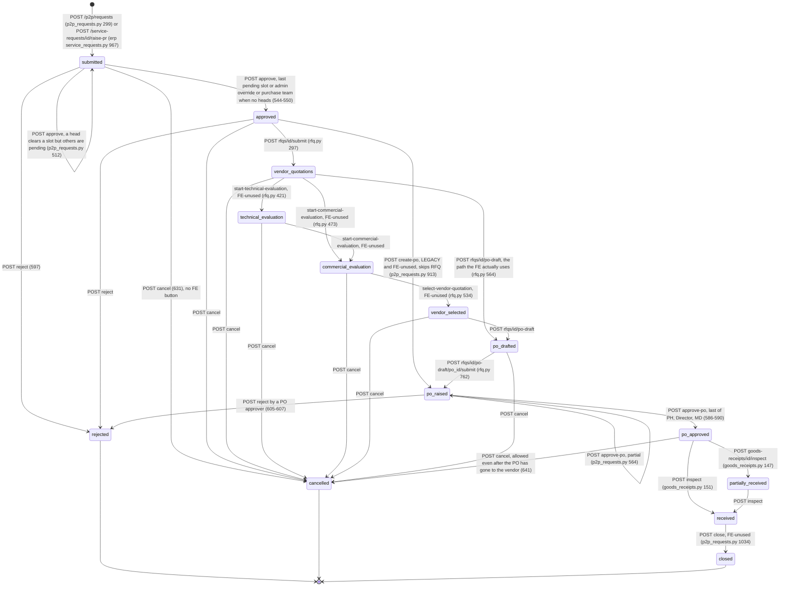
```mermaid
stateDiagram-v2
    [*] --> submitted : POST /p2p/requests (p2p_requests.py 299) or POST /service-requests/id/raise-pr (erp service_requests.py 967)
    submitted --> submitted : POST approve, a head clears a slot but others are pending (p2p_requests.py 512)
    submitted --> approved : POST approve, last pending slot or admin override or purchase team when no heads (544-550)
    submitted --> rejected : POST reject (597)
    submitted --> cancelled : POST cancel (631), no FE button
    approved --> vendor_quotations : POST rfqs/id/submit (rfq.py 297)
    approved --> po_raised : POST create-po, LEGACY and FE-unused, skips RFQ (p2p_requests.py 913)
    approved --> rejected : POST reject
    approved --> cancelled : POST cancel
    vendor_quotations --> technical_evaluation : start-technical-evaluation, FE-unused (rfq.py 421)
    vendor_quotations --> commercial_evaluation : start-commercial-evaluation, FE-unused (rfq.py 473)
    technical_evaluation --> commercial_evaluation : start-commercial-evaluation, FE-unused
    commercial_evaluation --> vendor_selected : select-vendor-quotation, FE-unused (rfq.py 534)
    vendor_quotations --> po_drafted : POST rfqs/id/po-draft, the path the FE actually uses (rfq.py 564)
    vendor_selected --> po_drafted : POST rfqs/id/po-draft
    po_drafted --> po_raised : POST rfqs/id/po-draft/po_id/submit (rfq.py 762)
    po_raised --> po_raised : POST approve-po, partial (p2p_requests.py 564)
    po_raised --> po_approved : POST approve-po, last of PH, Director, MD (586-590)
    po_raised --> rejected : POST reject by a PO approver (605-607)
    po_approved --> partially_received : POST goods-receipts/id/inspect (goods_receipts.py 147)
    po_approved --> received : POST inspect (goods_receipts.py 151)
    partially_received --> received : POST inspect
    received --> closed : POST close, FE-unused (p2p_requests.py 1034)
    vendor_quotations --> cancelled : POST cancel
    technical_evaluation --> cancelled : POST cancel
    commercial_evaluation --> cancelled : POST cancel
    vendor_selected --> cancelled : POST cancel
    po_drafted --> cancelled : POST cancel
    po_approved --> cancelled : POST cancel, allowed even after the PO has gone to the vendor (641)
    rejected --> [*]
    cancelled --> [*]
    closed --> [*]
```

**Transitions not drawn above (they would clutter the diagram):**
- `ANY → ANY` through `PATCH /p2p/requests/{id}` with a `status` value (purchase app, p2p_requests.py:477-505).
- The same PATCH can reassign `approver_id`, `project_head_id` and `plant_head_id` at any stage (schemas/p2p_request.py:105-110).
- There is **no** transition out of `rejected` or `cancelled`: no resubmit, no rework.
- There is **no** backward transition from technical_evaluation or commercial_evaluation when every vendor fails.
- There is **no** transition out of `po_drafted` other than submit or cancel: the draft cannot be deleted or re-drafted.

#### 1.3 RFQ, PO and GRN state machines

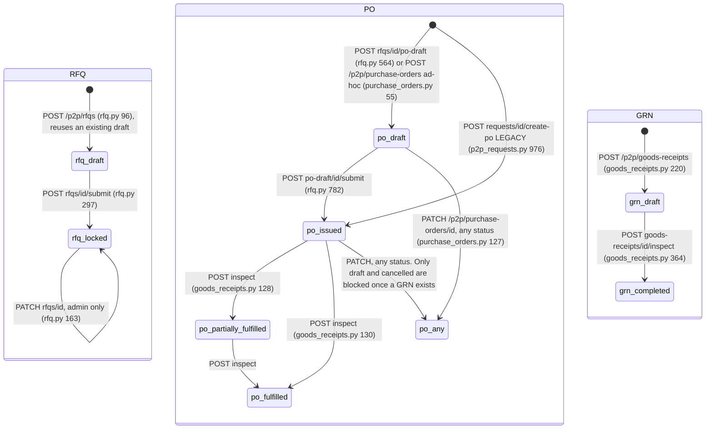
```mermaid
stateDiagram-v2
    state RFQ {
        [*] --> rfq_draft : POST /p2p/rfqs (rfq.py 96), reuses an existing draft
        rfq_draft --> rfq_locked : POST rfqs/id/submit (rfq.py 297)
        rfq_locked --> rfq_locked : PATCH rfqs/id, admin only (rfq.py 163)
    }
    state PO {
        [*] --> po_draft : POST rfqs/id/po-draft (rfq.py 564) or POST /p2p/purchase-orders ad-hoc (purchase_orders.py 55)
        [*] --> po_issued : POST requests/id/create-po LEGACY (p2p_requests.py 976)
        po_draft --> po_issued : POST po-draft/id/submit (rfq.py 782)
        po_issued --> po_partially_fulfilled : POST inspect (goods_receipts.py 128)
        po_issued --> po_fulfilled : POST inspect (goods_receipts.py 130)
        po_partially_fulfilled --> po_fulfilled : POST inspect
        po_draft --> po_any : PATCH /p2p/purchase-orders/id, any status (purchase_orders.py 127)
        po_issued --> po_any : PATCH, any status. Only draft and cancelled are blocked once a GRN exists
    }
    state GRN {
        [*] --> grn_draft : POST /p2p/goods-receipts (goods_receipts.py 220)
        grn_draft --> grn_completed : POST goods-receipts/id/inspect (goods_receipts.py 364)
    }
```

What the diagram does not show:
- `acknowledged` is only reachable through PATCH.
- A PO approval (`approve-po`) **never changes `P2PPurchaseOrder.status`**. It stays `issued` from submit onward, whether the PR is later approved or rejected.
- Rejecting or cancelling a PR does not cascade to its RFQ or PO.
- There is no RFQ cancel, no GRN cancel or reversal, and no route to delete a draft GRN.

---

### 2. Business process (swimlanes)

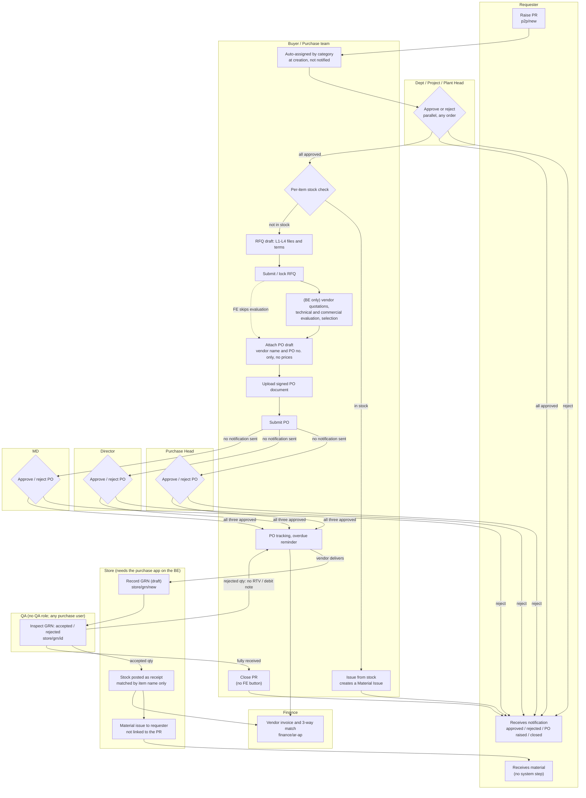
```mermaid
flowchart TB
    subgraph REQ["Requester"]
        R1["Raise PR<br/>p2p/new"]
        R2["Receives notification<br/>approved / rejected / PO raised / closed"]
        R9["Receives material<br/>(no system step)"]
    end
    subgraph HEAD["Dept / Project / Plant Head"]
        H1{"Approve or reject<br/>parallel, any order"}
    end
    subgraph BUY["Buyer / Purchase team"]
        B0["Auto-assigned by category<br/>at creation, not notified"]
        B1{"Per-item stock check"}
        B2["Issue from stock<br/>creates a Material Issue"]
        B3["RFQ draft: L1-L4 files and terms"]
        B4["Submit / lock RFQ"]
        B5["(BE only) vendor quotations,<br/>technical and commercial evaluation, selection"]
        B6["Attach PO draft<br/>vendor name and PO no. only, no prices"]
        B7["Upload signed PO document"]
        B8["Submit PO"]
        B9["PO tracking, overdue reminder"]
        B10["Close PR<br/>(no FE button)"]
    end
    subgraph PH["Purchase Head"]
        P1{"Approve / reject PO"}
    end
    subgraph DIR["Director"]
        D1{"Approve / reject PO"}
    end
    subgraph MD["MD"]
        M1{"Approve / reject PO"}
    end
    subgraph STORE["Store (needs the purchase app on the BE)"]
        S1["Record GRN (draft)<br/>store/grn/new"]
        S2["Stock posted as receipt<br/>matched by item name only"]
        S3["Material issue to requester<br/>not linked to the PR"]
    end
    subgraph QA["QA (no QA role; any purchase user)"]
        Q1["Inspect GRN: accepted / rejected<br/>store/grn/id"]
    end
    subgraph FIN["Finance"]
        F1["Vendor invoice and 3-way match<br/>finance/ar-ap"]
    end

    R1 --> B0 --> H1
    H1 -- reject --> R2
    H1 -- all approved --> R2
    H1 -- all approved --> B1
    B1 -- in stock --> B2 --> R2
    B1 -- not in stock --> B3 --> B4 --> B5 --> B6
    B4 -. FE skips evaluation .-> B6
    B6 --> B7 --> B8
    B8 -- no notification sent --> P1
    B8 -- no notification sent --> D1
    B8 -- no notification sent --> M1
    P1 & D1 & M1 -- reject --> R2
    P1 & D1 & M1 -- all three approved --> B9
    B9 -- vendor delivers --> S1 --> Q1
    Q1 -- accepted qty --> S2 --> S3 --> R9
    Q1 -- rejected qty: no RTV / debit note --> B9
    Q1 -- fully received --> B10 --> R2
    B9 --> F1
    S2 --> F1
```

---

### 3. Step table

In the audit column, "PR audit" means `AuditLog(entity_type="p2p_request")`. All BE line numbers are in `modules/p2p/routes/…` unless another file is named.

| # | Step | Actor | Screen (FE) | API (BE file:line) | DB write | Status change | Notification / email | Audit |
|---|---|---|---|---|---|---|---|---|
| 1 | Raise PR | Requester (`p2p` app) | `app/dashboard/p2p/new/page.tsx:110-150` | `POST /p2p/requests` p2p_requests.py:299 | `p2p_requests` insert (number from service.py:29 under an advisory lock; heads; `assigned_buyer_id`); `p2p_request_items` | ∅ → submitted | `notify_user` to each head (p2p_requests.py:362-368); background email `send_p2p_pr_approval_email` (p2p_requests.py:372 → utils/email.py:367) to each head. **Buyer is not notified.** | p2p_requests.py:360, plus `email_sent`/`email_failed` rows (email.py:~409) |
| 1b | Raise PR from an ERP Service Request | ERP user | ERP SR Materials tab (inferred) | `POST /service-requests/{id}/raise-pr` erp/routes/service_requests.py:967 → `_create_p2p_request_for_sr` :909 | same, plus `service_materials.pr_id/pr_number/pr_status` | ∅ → submitted | `notify_user` to the **auto-buyer** (:950-957), not the approver; `broadcast_notification` to all `p2p` app users (:1020); email to the purchase team (bg) | SR audit only (:1015). **No `p2p_request` "created" row.** |
| 2 | Attach supporting/spec files | Requester | new/page.tsx:141-147 (errors swallowed, `catch {}`) | `POST /p2p/requests/{id}/attachments` :1064 | `p2p_request_attachments`, SharePoint | none | none | :1103 (delete :1141 has **no audit**) |
| 3 | Auto-buyer assignment | System | none | `resolve_auto_buyer_id` models/p2p_request.py:72-82, called at :321 | `assigned_buyer_id`, `assignment_date` | none | none | none. Manual `assign-buyer` (:655) is FE-unused, notifies the buyer, and is audited at :672 |
| 4 | Head approval | Dept/Project/Plant Head | `p2p/approval/page.tsx:60` → `p2p/[id]?from=approval` (`[id]/page.tsx:159`) | `POST /p2p/requests/{id}/approve` :512 | `*_approved_at`, `*_comment`; on the last slot `approved_by_id`, `approved_at` | submitted → approved (last slot) | `notify_user` requester (:551-557). **Buyer and store are not notified.** | :533 or :541 per slot, plus :549 on completion |
| 5 | Head rejection | Head / admin / purchase team (no heads) | `[id]/page.tsx:158` | `POST …/reject` :597 | `rejected_reason/_by_role/_by_name` (reason is optional) | submitted or approved → rejected | `notify_user` requester :618 | :615 |
| 6 | Cancel | Requester or purchase team | Dialog exists (`[id]/page.tsx:627`) but **nothing opens it** | `POST …/cancel` :631 | `cancelled_reason` | most statuses → cancelled (blocked list at :641) | **none** (buyer, heads, approvers not told) | :648 |
| 7 | Stock check per item | Buyer (`purchase`) | `[id]/page.tsx:180` | `GET …/items/{item}/stock-check` :723 | read only | none | none | none (read) |
| 8 | Issue from stock | Buyer | `[id]/page.tsx:193` | `POST …/items/{item}/issue-from-stock` :770 | `store_material_issues` + item, `store_stock_transactions` (issue), `store_stock_balances` (row-locked), `p2p_request_items.fulfillment_status/issued_*` | item pending → stock_issued; PR unchanged | `notify_user` requester :837 | :834 |
| 9 | Send item to procurement | Buyer | `[id]/page.tsx:198` | `POST …/send-to-procurement` :850 | `fulfillment_status` | item pending → sent_to_procurement | none | :865 |
| 10 | Start RFQ | Buyer | `p2p/rfq/new/page.tsx:130` | `POST /p2p/rfqs` rfq.py:96 | `rfqs` (number from service.py:57) | RFQ ∅ → draft | none | rfq.py:129 (entity `rfq`) |
| 11 | Upload L1-L4 quotes, set terms | Buyer | rfq/new:134, :136 | `POST rfqs/{id}/attachments` :186; `PATCH rfqs/{id}` :163 | `rfq_attachments`; `rfqs` terms | none | none | :224, :178. Attachment PATCH :233 and DELETE :254 have **no audit** |
| 12 | Submit / lock RFQ | Buyer | rfq/new:143 | `POST rfqs/{id}/submit` :297 | `rfqs.status/locked_*`; `p2p_requests.status, rfq_number` | RFQ draft → locked; PR approved → vendor_quotations | **none** (requester and heads not told) | :338 (rfq) + :341 (PR) |
| 13 | Vendor quotations, technical and commercial evaluation, selection | Buyer | **FE-unused** | rfq.py:355, :399, :421, :446, :473, :505, :534 | `p2p_vendor_quotations`; PR status/selected_vendor | vendor_quotations → technical_evaluation → commercial_evaluation → vendor_selected | none | :379, :438, :466, :497, :527, :556. VQ PATCH :399 has **no audit** |
| 14 | Attach PO draft | Buyer | `p2p/rfq/[id]/page.tsx:150-163` | `POST rfqs/{id}/po-draft` :564 | `p2p_purchase_orders` (draft; manual or generated number, service.py:43), `p2p_purchase_order_items` (**no price**), `p2p_requests.po_number` | PR vendor_quotations/vendor_selected → po_drafted; PO ∅ → draft | none | :648 |
| 15 | Upload signed PO document | Buyer | rfq/[id]:159, :168 | `POST …/po-draft/{po}/document` :689 | `document_*` on the PO | none | none | :726 |
| 16 | Edit PO draft | Buyer | **FE-unused** | `PATCH …/po-draft/{po}` :659 | `expected_delivery`, `delivery_terms` only | none | none | **none** |
| 17 | Submit PO for approval | Buyer | rfq/[id]:176 | `POST …/po-draft/{po}/submit` :762 | PO.status; PR `po_date, po_value (null), expected_delivery, ordered_quantity` | PO draft → issued; PR po_drafted → po_raised | **none** (earlier finding confirmed) | :788 |
| 17b | Legacy direct PO (bypasses RFQ) | Buyer | **FE-unused** | `POST /p2p/requests/{id}/create-po` :913 | PR po_*; PO issued + priced items | PR approved → po_raised | requester :1001; every PH/Director/MD :1009-1017; email bg :1021 → email.py:419 | :997 |
| 18 | PO approval | Purchase Head, Director, MD (flag holders) | `p2p/po-approval/page.tsx:60` → `components/p2p/P2PRequestList.tsx:93` or `[id]?from=po-approval` | `POST /p2p/requests/{id}/approve-po` :564 | PR `purchase_head_/director_/md_approved_at/_by_name/_comment` | po_raised → po_approved (all three). **PO row unchanged** | **none** (requester, buyer, next approver and store not told) | :583, :588 |
| 19 | PO rejection | PO approver / admin | P2PRequestList.tsx:108; `[id]/page.tsx:158` | `POST …/reject` :597 (role check :221) | PR rejected_* | PR po_raised → rejected. **PO stays `issued`** | `notify_user` requester :618 (buyer not told) | :615 |
| 20 | PO tracking | Buyer | `p2p/po-tracking/page.tsx:54` | `GET /p2p/purchase-orders` purchase_orders.py:34 | read | none | none | none |
| 21 | Overdue reminder | Scheduler 08:30 IST | none | main.py:344-349 → `tasks/po_overdue_reminders.py:46` | `notifications` | none | `notify_user` buyer (or PO creator) :65; `send_po_overdue_email` :75 → email.py:467 | `email_sent/failed` rows (entity `p2p_purchase_order`), email.py:~497 |
| 22 | Ad-hoc PO | Purchase | **FE-unused** | `POST /p2p/purchase-orders` :55; `PATCH` :127 | PO + items; any status | draft → anything via PATCH | none | **none** (no AuditLog import in purchase_orders.py) |
| 23 | Record GRN | Store (BE requires `purchase`) | `store/grn/new/page.tsx:76` | `POST /p2p/goods-receipts` goods_receipts.py:220 (PO row-locked :233-235) | `p2p_goods_receipts` (number from service.py:71), items | GRN ∅ → draft | `notify_user` PO creator :308-314 (not the requester or QA) | :306 |
| 24 | Quality inspection | "QA" (any purchase user) | `store/grn/[id]/page.tsx:108` | `POST /p2p/goods-receipts/{id}/inspect` :321 (**no row lock**) | GRN items accepted/rejected/quality; GRN completed; PO status; PR ordered/received qty, receipt_status, grn_number, status | GRN draft → completed; PO → partially_fulfilled/fulfilled; PR → partially_received/received | **none** (requester and buyer not told) | :373, plus :154 only when PR status changes |
| 25 | Stock posting | System (inside 24) | none | `_sync_stock_for_grn` goods_receipts.py:51-77 → `store/services/stock_ledger.py:44` | `store_stock_transactions` (receipt, no cost), `store_stock_balances` (row lock :33-35) | none | none | ledger row only, no AuditLog |
| 26 | Issue purchased material to requester | Store | `store/issues` (not linked to the PR) (inferred) | no P2P linkage (grep: no `p2p_request_id` in `modules/store/routes`) | none from P2P | none | none | none |
| 27 | Close PR | Buyer | **no FE caller** | `POST /p2p/requests/{id}/close` :1034 | `closed_by_id`, `closed_at` | received → closed | `notify_user` requester :1051 | :1048 |
| 28 | Vendor invoice and 3-way match | Finance (`accounts`) | `finance/ar-ap/page.tsx:98` (calls a `purchase`-gated PO list) | `POST /accounts/vendor-invoices` accounts/routes/vendor_invoices.py:88 → service.py:308 / :281 | `vendor_invoices` (qty_po, qty_gr, matching_status) | matched / variance | none (inferred) | vendor_invoices.py:104 |

---

### 4. Gaps

Tags: [BA] business or process, [ARCH] architecture or data, [SEC] authorization, integrity or segregation of duties, [USER] usability or dead-end.

#### A. Missing states, dead ends, no rework or cancel

- **P2-P2P-1 [BA][USER] The PR can never be closed from the UI.** `POST /close` (p2p_requests.py:1034) has no FE caller (`p2pApi.close` is unused). Every fulfilled PR stays at `received` forever, and "closed" never appears in MIS.
- **P2-P2P-2 [USER] No Cancel or Edit button on the PR.** The `cancel` PromptDialog (`p2p/[id]/page.tsx:627`) and the `edit` panel (`:291`) are never opened: no `setPromptAction('cancel')` and no `setActivePanel('edit')` exists. A requester cannot withdraw a PR at all.
- **P2-P2P-3 [BA] Rejection is terminal, with no rework.** `reject` (p2p_requests.py:605-616) sets `rejected`. No endpoint leaves `rejected`, so there is no "return for clarification" or resubmit. A PO rejected by the MD kills the whole PR, including the RFQ, quotes and document, and the requester has to raise a new PR with a new number. The rejection reason is optional (schemas/p2p_request.py:115-116; the FE placeholder says "optional").
- **P2-P2P-4 [BA][ARCH] PO rejection and PR cancellation leave the PO row live and orphaned.** Rejecting at `po_raised` (p2p_requests.py:610) or cancelling at `po_approved` (:641 does not block `po_approved`) never touches `P2PPurchaseOrder.status`, which stays `issued` (set at rfq.py:782). Effects:
  - The overdue job keeps nagging the buyer daily (`po_overdue_reminders.py:27,53`).
  - Finance can still invoice it (`create_vendor_invoice` has no PO or PR status check, accounts/service.py:308-321).
  - The RFQ stays `locked`.
- **P2-P2P-5 [BA][SEC] A requester can cancel after the PO is approved and sent.** In the cancel block-list (p2p_requests.py:641), `po_approved`, `po_drafted` and all evaluation states are cancellable by the requester (:639). There is no confirmation from purchase and no notification (:644-651).
- **P2-P2P-6 [BA][USER] Technical and commercial evaluation and vendor selection are dead code in the UI.** No FE file calls `addVendorQuotation`, `startTechnicalEvaluation`, `evaluateTechnical`, `startCommercialEvaluation`, `evaluateCommercial` or `selectVendorQuotation`. `create_po_draft` explicitly accepts `vendor_quotations` (rfq.py:581) so the FE can skip straight to PO. As a result:
  - no structured price comparison or L1 enforcement;
  - the vendor on the PO is free text (rfq.py:585, FE `poVendorName`);
  - no "reason for not choosing L1".
  If someone does use the BE path and every vendor is disqualified or rejected, the PR is stuck in `technical_evaluation` or `commercial_evaluation` with no backward edge (rfq.py:482-493).
- **P2-P2P-7 [BA] A draft PO cannot be discarded or re-drafted.** Once at `po_drafted` there is no delete route. `update_po_draft` edits only `expected_delivery` and `delivery_terms` (schemas/purchase_order.py:41-44). The PO document is "permanently locked" after one upload (rfq.py:710-711), so a wrong upload can only be fixed by cancelling the entire PR.
- **P2-P2P-8 [BA] A PR fully issued from stock has no end state.** If every item is `stock_issued` (p2p_requests.py:829), the PR stays `approved`. `close` requires `received` (:1041), so the only exit is cancel, which misreports the outcome. The `sent_to_procurement` decision is informational only: PO drafts include `pending` items too (rfq.py:619).
- **P2-P2P-9 [ARCH] `acknowledged` is unreachable except by manual PATCH.** It is in P2P_PO_STATUSES (purchase_order.py:14) and never set by code. There is no vendor acknowledgement step at all, and no email sends the PO to the vendor.

#### B. Race conditions and double-submit

- **P2-P2P-10 [ARCH][SEC] Concurrent approvals can strand a PR or PO in `submitted` / `po_raised`.** `approve` (p2p_requests.py:519) and `approve-po` (:571) load the PR without `for_update`. Say the Dept Head and Project Head (or the Director and MD) approve at the same moment. Each writes only its own `*_approved_at` column, and each still sees the other slot pending in its snapshot (:544, :586). Both commits succeed and **neither flips the status**. After that, every assigned approver gets 403 "already approved" (:201, :248), and only an admin override (:535-550) can unstick it. `reject` racing `approve` is also last-writer-wins on `status`.
- **P2-P2P-11 [ARCH] Double-submitting a PO draft creates two POs.** `create_po_draft` (rfq.py:579-607) has no row lock and no "existing non-cancelled PO" check, unlike `create_po` at p2p_requests.py:924 and :929-933, which has both. Two clicks both see `vendor_quotations` and insert two draft POs. The FE shows `list[0]` (rfq/[id]/page.tsx:120-121), so the other one is orphaned. With a generated number, the advisory lock serialises the two inserts but does not stop the duplicate. With a manual `po_number`, the check-then-insert at rfq.py:588-590 falls back to the unique index (a 409-style error through core/db_errors.py).
- **P2-P2P-12 [ARCH][SEC] Double-submitting a GRN inspection posts stock twice.** `inspect_goods_receipt` (goods_receipts.py:332-334) reads `grn.status` without `with_for_update`. Two concurrent submits both pass the `completed` check and both call `_sync_stock_for_grn` → `post_stock_transaction(receipt)` (:71-76), which doubles on-hand stock. GRN *create* is correctly locked on the PO (:233-235).
- **P2-P2P-13 [ARCH] Number generation.** Concurrency is fine: `_lock_number_series` (service.py:13-26) takes an advisory lock and then reads `MAX`. Three weaker spots remain:
  - (a) `MAX()` is a **string** max, and numbers are padded to 4 digits (:39, :53, :67, :81). The 10,000th number in a year (`…-10000`) sorts below `…-9999`, so the generator repeats `10000` and every later insert hits the unique constraint.
  - (b) A manual PO number (rfq.py:588-591, p2p_requests.py:927) that begins with `PO-YYYY-` but has a non-numeric tail (e.g. `PO-2026-12A`) makes `int(last.rsplit("-",1)[-1])` raise. From then on, every auto-numbered PO fails with a 500 (inferred; depends on user input).
  - (c) Manual numbers can also jump the series (e.g. typing `PO-2026-5000`).

#### C. Authorization and segregation of duties

- **P2-P2P-14 [USER][SEC] PO approvers approve blind.**
  - FE: `po-approval` and `p2p/[id]` require the `p2p` app (`useRequireApp('p2p')`, po-approval/page.tsx:19, [id]/page.tsx:72), so pure approvers are redirected.
  - BE: approvers with the `p2p` app still get 403 on `GET /p2p/purchase-orders` (purchase_orders.py:42), `GET /p2p/rfqs*` (rfq.py:142, :157) and the PO document (rfq.py:742), because all of these require `purchase`. The Director and MD cannot see PO value, lines, vendor comparison or the signed PO they are approving.
  - PR attachments (specs) are also 403 for heads and PO approvers (p2p_requests.py:1122-1123 and :1149-1150 allow only purchase team or requester).
- **P2-P2P-15 [SEC] Self-approval and one-person chains.**
  - (a) Heads can be anyone, including the requester (p2p_requests.py:286-296, new/page.tsx:95-98). One user in all three slots clears them in one click (:189-194).
  - (b) The Dept Head auto-fallback can pick the requester (:312-315).
  - (c) If no heads are set (possible through the API or the ERP SR path, which also skips `_validate_head`: erp service_requests.py:934), *any* `purchase` user, including the requester, approves (:183-186).
  - (d) One user holding `is_purchase_head` + `is_director` + `is_md` clears the whole PO chain in one click (:240-247).
  - (e) The buyer who created the PO can approve it as Purchase Head. There is no creator ≠ approver check.
- **P2-P2P-16 [SEC] Status PATCH bypasses both approval chains.**
  - `PATCH /p2p/requests/{id}` with `status=po_approved` (p2p_requests.py:491-498) skips PH, Director and MD. GRN only gates on PR status (goods_receipts.py:35, :240-246), so goods can then be received.
  - The same PATCH can swap `approver_id/project_head_id/plant_head_id` to self mid-flow (schemas/p2p_request.py:105-110). There is no status guard.
  - `PATCH /p2p/purchase-orders/{id}` sets any PO status (purchase_orders.py:139-155) with **no audit** and no PR sync.
- **P2-P2P-17 [SEC][BA] Ad-hoc POs have no approval at all.** `POST /p2p/purchase-orders` (purchase_orders.py:55) then `PATCH status=issued` (:127) produces a PO with `p2p_request_id=None`. GRN skips the approval gate when there is no PR (goods_receipts.py:240), and Finance can invoice it. This is invisible in the audit log.
- **P2-P2P-18 [SEC][BA] The legacy `create-po` skips the RFQ entirely.** p2p_requests.py:913-926 raises a PO straight from an `approved` PR with any typed `po_number`/price and no quotation. It is FE-unused but callable by any `purchase` user.
- **P2-P2P-19 [SEC][USER] Store and QA have no role of their own in GRN.** Every GRN route requires `purchase` (goods_receipts.py:167, :185, :215, :224, :326), while the FE pages require `store` (store/grn/*/page.tsx:20, :31, :41). Store keepers therefore need the `purchase` app, which also grants the PR status PATCH, PO PATCH and create-po. Receiver and inspector can be the same person, and the `quality` module is not involved.
- **P2-P2P-20 [SEC] Assigned buyer is decorative.** Any `purchase` user can act on any PR, RFQ or PO. `assigned_buyer_id` is never checked in routes. Auto-buyer emails are hard-coded in source (models/p2p_request.py:62-69), there is no mapping for `OTH`, and `resolve_auto_buyer_id` does not check `is_active` or the purchase app (:81).

#### D. Notifications (notified but can't act, or acted on but not notified)

- **P2-P2P-21 [BA][USER] The live PO path notifies no one.** `submit_po_draft` (rfq.py:762-796) sends no in-app or email alert to PH, Director or MD. Only the FE-unused `create_po` does (p2p_requests.py:1009-1021). Separately, `approve-po` (:564-594) notifies nobody: not the next approver, the requester, the buyer, or the store that should expect delivery.
- **P2-P2P-22 [USER] Approvers are notified but cannot act.**
  - PR approval emails (email.py:367-417) contain no portal link.
  - In-app P2P notifications are not clickable: `ENTITY_LINK` in `components/erp/NotificationBell.tsx:9-16` has no `p2p_request`, `p2p_purchase_order` or `p2p_goods_receipt`.
  - The Approve buttons only render when the page is opened with `?from=approval` or `?from=po-approval` ([id]/page.tsx:76-77, :251-255). A head arriving from a notification or a shared link sees no Approve button.
  - PO approvers get redirected anyway (P2-P2P-14).
- **P2-P2P-23 [BA] Other missing notifications:**
  - the buyer when the PR is approved (p2p_requests.py:551-557 notifies only the requester);
  - the requester when the RFQ is locked (rfq.py:297-347);
  - anyone on cancel (:631-652);
  - the requester or buyer on GRN inspection completion (goods_receipts.py:321-380);
  - the requester when stock is posted and ready to issue;
  - heads in the ERP SR path (erp service_requests.py:950-957 notifies the buyer instead, and :1020 broadcasts to every `p2p` user).
- **P2-P2P-24 [BA] Overdue reminders fire for unapproved or dead POs.** `_OVERDUE_STATUSES` includes `issued` (po_overdue_reminders.py:27), and the PR's status is never checked (:50-56). POs still in `po_raised` (not yet approved, maybe never sent) or with a rejected or cancelled PR get daily "overdue" emails.
- **P2-P2P-25 [SEC] Low: HTML injection in P2P emails.** `_p2p_email_shell` interpolates `title` unescaped (email.py:354). `title` is `po.po_number`, which can be free-text user input (rfq.py:591, p2p_requests.py:973). It reaches the overdue email (email.py:493) and the legacy approval email (:451). The `Dear {approver.name}` / `{buyer.name}` lines (email.py:387, :435, :483) are also unescaped. Table rows are escaped (email.py:100-106).

#### E. Audit trail

- **P2-P2P-26 [ARCH][SEC] Writes with no audit row:**
  - PO create and PATCH (purchase_orders.py:55-112 and :127-160, the whole file);
  - PO draft edit (rfq.py:659-686);
  - vendor quotation edit (rfq.py:399-418);
  - RFQ attachment vendor edit and delete (rfq.py:233-268);
  - PR attachment delete (p2p_requests.py:1141-1160);
  - stock posting from GRN (ledger row only, goods_receipts.py:71-76);
  - PR creation from an ERP SR (no `p2p_request` entity row, erp service_requests.py:1015).
- The PR audit (`_write_audit`, p2p_requests.py:121-126) records status changes but not field-level diffs of the free-edit PATCH (:500-501).

#### F. Data integrity and what Finance receives downstream

- **P2-P2P-27 [BA][ARCH] The approved PO has no value, and the 3-way match then passes any amount.**
  - The FE PO draft has no prices (rfq.py:614-620, rfq/[id]/page.tsx:154-157), so `total_value` is `None` (rfq.py:643) and `pr.po_value = None` (rfq.py:785). Nothing requires prices, total or document before submit (rfq.py:778-790), so the PH, Director and MD approve a PO with no value.
  - In `check_three_way_match` (accounts/service.py:292, :296), `po_amount = po.total_value or 0`, and when `po_amount` is 0 the amount variance is set to 0. **Every invoice amount therefore matches.**
  - `qty_reference` falls back to the PO quantity when nothing has been received (:294), so an invoice can match before any GRN.
  - There is no PO status gate, no cumulative check across several invoices on one PO, and matching is done on header totals rather than per line.
  - The Finance screen's PO picker calls the `purchase`-gated `GET /p2p/purchase-orders` (finance/ar-ap/page.tsx:98; purchase_orders.py:42) with no `.catch`, so it is empty for pure Finance users.
- **P2-P2P-28 [ARCH] Loose matching of items and vendors.**
  - GRN stock posting matches Item Master by exact name only (goods_receipts.py:67), while PR stock-check uses name + part code (p2p_requests.py:694-703). Duplicate names post to the first match, and unmatched lines are silently skipped with a note (:68-70).
  - PO `vendor_id` has no FK to a vendor master (purchase_order.py:28), and vendor names are free text, so Finance invoicing fails late on a name mismatch (accounts/service.py:316-318).
  - PR and PO lines have no Item Master FK.
  - Money is stored as `Float` (purchase_order.py:36, :67-69).
  - Receipts post no unit cost, so inventory is not valued (stock_ledger.py:44-58).
- **P2-P2P-29 [BA] Issue-from-stock after the PO exists causes double fulfilment.** `issue_item_from_stock` is allowed in every status except submitted, rejected and cancelled (p2p_requests.py:779), including `po_raised` and `po_approved`, after the item is already on the PO. PO drafts only exclude `stock_issued` items at creation time (rfq.py:619). The item is then both issued and bought.
- **P2-P2P-30 [ARCH] PO approval stamps live on the PR, not the PO** (p2p_request.py:129-137), and are never cleared. If a PO is replaced (cancelled via PATCH, PR PATCHed back), the new PO inherits the old approvals. `pending_po_approval_roles` is then empty, and `approve-po` 403s for everyone (p2p_requests.py:245-248). Approvals are not tied to the PO version or value.
- **P2-P2P-31 [BA] Input validation gaps.** No `>0` validation on PR item `quantity` or on PO `unit_price`/`tax_rate` (schemas/p2p_request.py:18-26, schemas/purchase_order.py:5-12). The FE turns 0 into 1 (new/page.tsx:133), but the API accepts negatives, which produce negative line totals (service.py:85-91). Attachment upload failures on PR create are swallowed (`catch {}`, new/page.tsx:144), against the app-wide rule on real error messages.

#### G. Business rules a rail manufacturer would expect but that are missing

- **P2-P2P-32 [BA] No budget or cost-centre check.** There is no budget, cost centre or project-budget field or check anywhere in `modules/p2p` (grep "budget": 0 hits), although an Organization cost-centre module exists.
- **P2-P2P-33 [BA] No value-based approval thresholds (DoA).** Every PO needs all of PH, Director and MD whatever its value (`pending_po_approval_roles`, p2p_request.py:209-214). Since the value is usually null (P2-P2P-27), a threshold could not even be computed today.
- **P2-P2P-34 [BA] No PO amendment or revision.** There are no revision or version fields, and no amend and re-approve flow (purchase_order.py:17-49). The only change mechanism is the unaudited PATCH (P2-P2P-16).
- **P2-P2P-35 [BA] Rejected GRN quantity goes nowhere.**
  - No return-to-vendor or debit note document.
  - Rejected quantity is not posted to any quarantine or reject location; it is physically in the store but invisible (goods_receipts.py:63-66 posts accepted quantity only).
  - Accepted + rejected may be *less* than received (:350). The unaccounted remainder silently reopens the PO balance (:264, where completed GRNs count accepted quantity only).
  - `quality_status="failed"` with accepted > 0 is allowed.
  - There is no QC-hold stage: stock is available the moment inspection is saved.
- **P2-P2P-36 [BA] Partial GRN is supported, but its lifecycle is thin.**
  - A draft GRN counts its full received quantity against the PO (goods_receipts.py:264) and has no delete or cancel, so a mis-keyed draft blocks that quantity until it is "inspected".
  - A GRN has no vendor challan or invoice number, no e-way bill, vehicle or LR number, and no batch or heat number, which matters for rail-part traceability (schemas/goods_receipt.py:35-40). Finance's 3-way match has nothing to reconcile the invoice against.
  - Short-close of a PO (vendor won't supply the balance) does not exist.
- **P2-P2P-37 [BA] No closed loop to the requester.** After GRN, goods sit in store. Store Material Issue has a `p2p_request_id` column, but only issue-from-stock sets it (p2p_requests.py:813); `modules/store/routes` never reference a PR. Nothing links "PR item received" to "issued to requester", and PR closure ignores issue status.
- **P2-P2P-38 [BA] No GST structure on PO lines.** A single `tax_rate` (purchase_order.py:67) with no HSN/SAC or CGST/SGST/IGST split, and no currency or freight fields. Import purchases of raw material cannot be represented.
- **P2-P2P-39 [BA][ARCH] Vendor quotations are free text.** RFQ vendors and PO vendors are typed names with no vendor-master lookup (`vendor_id` is optional everywhere). There is no approved-vendor-list or vendor-rating gate, which is typically required for RDSO/railway-grade suppliers (inferred as expected practice).

---

## 2.2 ERP Service Request lifecycle

Read-only review of the working tree (branch `main`, with uncommitted edits in `erp/routes/*.py` that only add `require_tab_access` to list endpoints).
Paths: BE = `backend/app`, FE = `frontend/src`. SR = Service Request (`erp_service_requests`), MAT = Service Material (`erp_service_materials`), PR = P2P request (`p2p_requests`).
Findings marked "(inferred)" come from reasoning, not from code I read.

---

### 1. State machine

#### 1.1 SR `status` values

The backend has **no enum and no validation**. `ServiceRequest.status` is `String(50)`, default `"open"` (BE `modules/erp/models/service_request.py:31`). `ServiceRequestCreate.status: str = "open"` (BE `modules/erp/schemas/service_request.py:100`) and `ServiceRequestUpdate.status: str | None` (`schemas/service_request.py:111`) accept any string. The allowed set lives only in the FE:

| Value | Label | Defined at |
|---|---|---|
| `open` | Reported / Open | FE `types/index.ts:160`, `app/dashboard/erp/service-requests/[id]/page.tsx:25`, `components/erp/ServiceRequestForm.tsx:40` |
| `acknowledged` | Acknowledged | `types/index.ts:161`, `[id]/page.tsx:26` |
| `assigned` | Assigned | `types/index.ts:162`, `[id]/page.tsx:27` |
| `scheduled` | Scheduled | `types/index.ts:163`, `[id]/page.tsx:28` |
| `in_progress` | In Progress | `types/index.ts:164`, `[id]/page.tsx:29` |
| `pending_parts` | Pending Parts | `types/index.ts:165`, `[id]/page.tsx:30` |
| `on_hold` | On Hold | `types/index.ts:166`, `[id]/page.tsx:31` |
| `work_completed` | Work Completed | `types/index.ts:167`, `[id]/page.tsx:32` |
| `review` | Review | `types/index.ts:168`, `[id]/page.tsx:33` |
| `closed` | Closed | `types/index.ts:169`, `[id]/page.tsx:34`. Side effects: `closed_at=now`, broadcast, client+team email (BE `modules/erp/routes/service_requests.py:377-379, 390-408, 436-437`) |
| `cancelled` | Cancelled | `types/index.ts:170`, `[id]/page.tsx:36` (banner only, `:190-197`). No side effects. |
| *(soft-deleted)* | Recycle bin | `is_deleted/deleted_at` from SoftDeleteMixin, set at `service_requests.py:454-455` and cleared at `:490-491`. Cascades from project delete at `routes/projects.py:181-183` and restore at `:219-221`. |

Flags that act as part of the state:
- `closed_at`: set on the change to closed (`:379`) and cleared on the change away from closed (`:380-382`). **It is never set when an SR is created with status=closed.**
- `closed_notification_sent` / `created_notification_sent` (`models/service_request.py:104-105`): flipped once at `service_requests.py:155-162` and **never reset**.
- `is_locked`, `locked_by_id`, `lock_reason` (`models/service_request.py:98-100`): **nothing ever writes them.** Only PATCH reads `is_locked` (`service_requests.py:360`).

#### 1.2 Material status fields (three separate fields)

| Field | Values | Written at |
|---|---|---|
| `status` (issue status) | `pending` (default, `models/service_material.py:30`, `service_requests.py:703`), `issued` (auto-set on full receipt, `service_requests.py:1078`), `returned` (FE badge only, `[id]/page.tsx:398`; can only be set by free-text PATCH, `service_requests.py:729-731`) | add/patch/receive |
| `receiving_status` | `pending` / `partial` / `received` (`models/service_material.py:45`, computed at `service_requests.py:1070-1075`) | `POST .../receive` |
| `pr_status` (copy of `P2PRequest.status`) | null, then `submitted` at raise (`service_requests.py:955`). Refreshed **only** inside `receive_material` (`:1081-1084`). P2P never writes it (grep: no reference to `ServiceMaterial` outside `erp/`). Possible P2P values: submitted, approved, technical_evaluation, vendor_quotations, commercial_evaluation, vendor_selected, po_drafted, po_raised, po_approved, partially_received, received, closed, rejected, cancelled (`modules/p2p/routes/*`). The FE badge map knows only 8 of them (`[id]/page.tsx:402-411`) and shows every other value as "Submitted" (`:543`). | raise-pr, receive |
| `phase` | `expected` default (`models/service_material.py:29`). Never read or written anywhere else. | none |

#### 1.3 SR transitions as coded

Every status can go to every other status in one PATCH. The diagram shows the "normal" arrows the FE stepper suggests, but **the stepper itself lets you click any circle** (`[id]/page.tsx:205, 213`), and the Overview `<select>` offers all 11 values (`:270-279`). So the true graph is complete (any to any).

```mermaid
stateDiagram-v2
    direction LR
    [*] --> AnyStatus : POST /erp/service-requests (status = any string, default open; SR form "Initial Status" select)
    state "Active (open / acknowledged / assigned / scheduled / in_progress / pending_parts / on_hold / work_completed / review)" as Active
    AnyStatus --> Active
    Active --> Active : PATCH /erp/service-requests/{id} {status}  (any to any, no guard)
    Active --> closed : PATCH {status: closed}  sets closed_at, broadcast, client+team email (once ever)
    closed --> Active : PATCH {status: x}  reopen, clears closed_at, no reopen email or reason
    Active --> cancelled : PATCH {status: cancelled}  no reason, no client email
    cancelled --> Active : PATCH {status: x}
    closed --> cancelled : PATCH
    cancelled --> closed : PATCH
    Active --> Deleted : DELETE /erp/service-requests/{id}  or DELETE /erp/projects/{pid} (cascade)
    closed --> Deleted : DELETE
    cancelled --> Deleted : DELETE
    Deleted --> Active : POST /{id}/restore  or POST /erp/projects/{pid}/restore (restores ALL deleted SRs of the project)
    Deleted --> Deleted : no purge endpoint, no purge job ("auto-purged after 10 days" is not implemented)
```

#### 1.4 Material transitions as coded

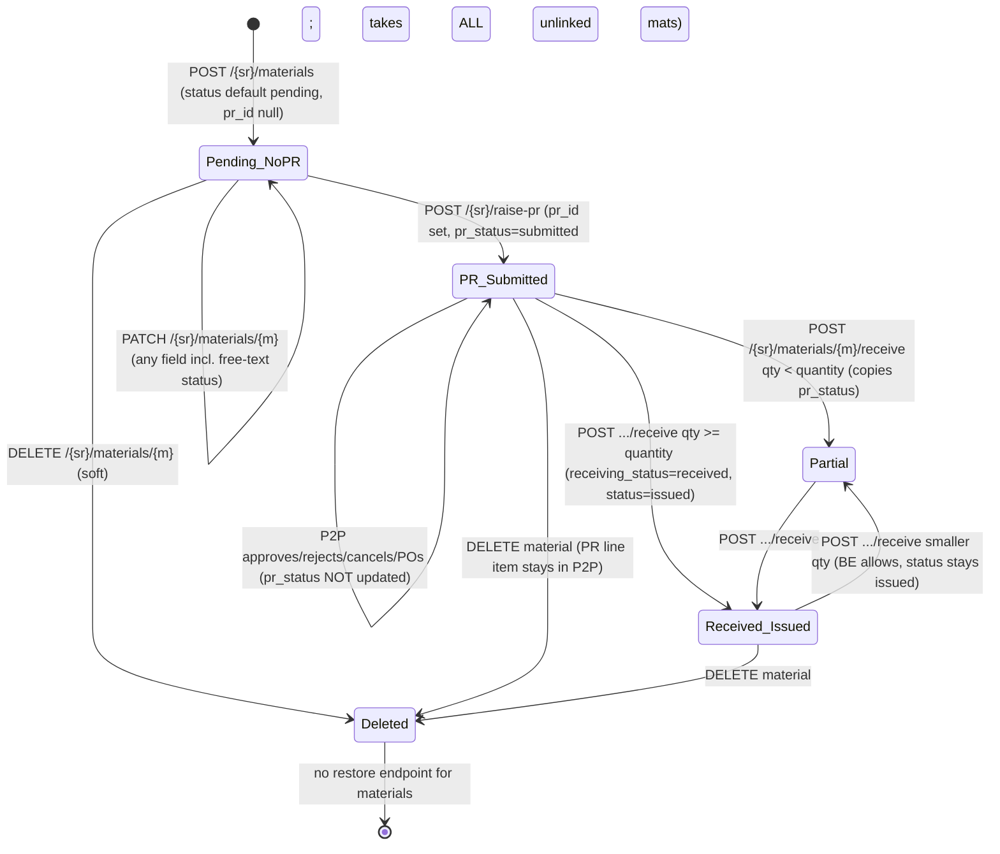
```mermaid
stateDiagram-v2
    [*] --> Pending_NoPR : POST /{sr}/materials (status default pending, pr_id null)
    Pending_NoPR --> Pending_NoPR : PATCH /{sr}/materials/{m} (any field incl. free-text status)
    Pending_NoPR --> Deleted : DELETE /{sr}/materials/{m} (soft)
    Pending_NoPR --> PR_Submitted : POST /{sr}/raise-pr (pr_id set, pr_status=submitted; takes ALL unlinked mats)
    PR_Submitted --> PR_Submitted : P2P approves/rejects/cancels/POs (pr_status NOT updated)
    PR_Submitted --> Partial : POST /{sr}/materials/{m}/receive qty < quantity (copies pr_status)
    PR_Submitted --> Received_Issued : POST .../receive qty >= quantity (receiving_status=received, status=issued)
    Partial --> Received_Issued : POST .../receive
    Received_Issued --> Partial : POST .../receive smaller qty (BE allows, status stays issued)
    PR_Submitted --> Deleted : DELETE material (PR line item stays in P2P)
    Received_Issued --> Deleted : DELETE material
    Deleted --> [*] : no restore endpoint for materials
```

---

### 2. Business-process flowchart (as coded)

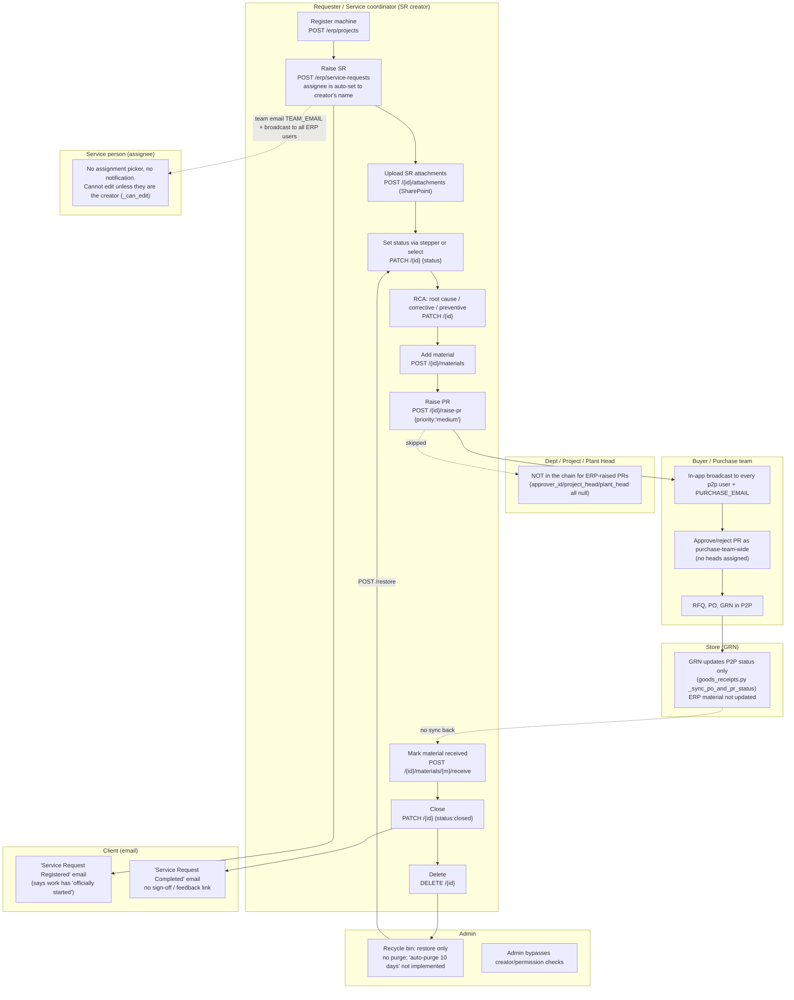
```mermaid
flowchart TB
  subgraph REQ["Requester / Service coordinator (SR creator)"]
    R0["Register machine<br/>POST /erp/projects"]
    R1["Raise SR<br/>POST /erp/service-requests<br/>assignee is auto-set to creator's name"]
    R2["Upload SR attachments<br/>POST /{id}/attachments (SharePoint)"]
    R3["Set status via stepper or select<br/>PATCH /{id} {status}"]
    R4["RCA: root cause / corrective / preventive<br/>PATCH /{id}"]
    R5["Add material<br/>POST /{id}/materials"]
    R6["Raise PR<br/>POST /{id}/raise-pr {priority:'medium'}"]
    R7["Mark material received<br/>POST /{id}/materials/{m}/receive"]
    R8["Close<br/>PATCH /{id} {status:closed}"]
    R9["Delete<br/>DELETE /{id}"]
  end
  subgraph SP["Service person (assignee)"]
    S1["No assignment picker, no notification.<br/>Cannot edit unless they are the creator (_can_edit)"]
  end
  subgraph CL["Client (email)"]
    C1["'Service Request Registered' email<br/>(says work has 'officially started')"]
    C2["'Service Request Completed' email<br/>no sign-off / feedback link"]
  end
  subgraph DH["Dept / Project / Plant Head"]
    D1["NOT in the chain for ERP-raised PRs<br/>(approver_id/project_head/plant_head all null)"]
  end
  subgraph BUY["Buyer / Purchase team"]
    B1["In-app broadcast to every p2p user + PURCHASE_EMAIL"]
    B2["Approve/reject PR as purchase-team-wide<br/>(no heads assigned)"]
    B3["RFQ, PO, GRN in P2P"]
  end
  subgraph ST["Store (GRN)"]
    G1["GRN updates P2P status only<br/>(goods_receipts.py _sync_po_and_pr_status)<br/>ERP material not updated"]
  end
  subgraph AD["Admin"]
    A1["Recycle bin: restore only<br/>no purge; 'auto-purge 10 days' not implemented"]
    A2["Admin bypasses creator/permission checks"]
  end

  R0 --> R1 --> C1
  R1 --> R2 --> R3 --> R4 --> R5 --> R6
  R1 -. team email TEAM_EMAIL + broadcast to all ERP users .-> S1
  R6 --> B1 --> B2 --> B3 --> G1
  R6 -. skipped .-> D1
  G1 -. no sync back .-> R7
  R7 --> R8 --> C2
  R8 --> R9 --> A1
  A1 -->|POST /restore| R3
```

---

### 3. Step table

| # | Step | Actor | Screen (FE) | API call (BE file:line) | DB write | Status change | Notification / email (recipients) | Audit log |
|---|---|---|---|---|---|---|---|---|
| 1 | Register machine / asset | Coordinator with `project_create` | `app/dashboard/erp/projects/new/page.tsx` + `components/erp/ProjectForm.tsx` | `POST /erp/projects`, `routes/projects.py:91-118` | `erp_projects` (all cols; `serial_number` unique, checked first at `:99` then inserted, which is a race) | `status='active'` default (`models/project.py:29`) | `broadcast_notification` (`utils/notifications.py:85`) to all active ERP-app users except actor (`projects.py:107-115`) | yes, `projects.py:106` (entity_type=project) |
| 2 | Upload project document (private/shared) | `project_edit` holder | `app/dashboard/erp/projects/[id]/page.tsx` + `components/erp/SharePicker.tsx` | `POST /erp/projects/{id}/attachments` (form `is_private`, shares), `projects.py:369-431` | `erp_project_attachments`, `erp_project_attachment_shares` | n/a | none | yes, `projects.py:428` |
| 2a | Change doc privacy | uploader or admin | same | `PATCH /erp/projects/{id}/attachments/{aid}/permissions`, `projects.py:434-461` | same two tables | n/a | none | yes, `projects.py:455` |
| 2b | Delete project doc | `project_delete` (no visibility check) | same | `DELETE /erp/projects/{id}/attachments/{aid}`, `projects.py:464-487` | hard delete row + SharePoint file (errors swallowed) | n/a | none | **none** |
| 3 | Raise SR | creator with `sr_create` | `app/dashboard/erp/service-requests/new/page.tsx` + `ServiceRequestForm.tsx:127-186` | `POST /erp/service-requests`, `service_requests.py:254-301` | `erp_service_requests` (`request_number` from `_generate_sr_number` `:135-142` under advisory lock; `created_by_id`, `opened_at`, `assigned_to_name`=creator name) | initial = any value from the form select (`ServiceRequestForm.tsx:354`), default `open` | broadcast to all ERP users (`:279-287`), `notify_user` creator (`:288-296`); background `_run_sr_emails_background('created')` (`:300`, `:145-174`): `send_client_sr_email` (`utils/email.py:123`) to `reported_by_email`, `send_team_sr_notification` (`utils/email.py:169`) to `settings.TEAM_EMAIL` | yes, `:278`; email result audited at `utils/email.py:163`, `:234-238` |
| 3a | Upload SR attachments | creator / admin | `ServiceRequestForm` queued files; `[id]/page.tsx` Attachments tab | `POST /{id}/attachments`, `service_requests.py:530-584` | `erp_service_request_attachments`; SharePoint folder `ERP-media/<uploader name>/<serial>/<SR no>` (`utils/sharepoint.py:334-339`) | none | none | yes, `:578` (upload); delete `:639-664` **none** |
| 4 | Assign to service person | nobody (no UI) | `ServiceRequestForm.tsx:121-123, 344-346` (disabled input = creator name) | only a side effect of PATCH `assigned_to_name` / `assigned_service_person_id` (`schemas/service_request.py:113-114`) | `assigned_to_name` (id never set by FE) | optional manual `assigned` | none to the assignee; only generic broadcast "SR updated" | yes if changed via PATCH (`service_requests.py:366-376`) |
| 5 | Move through statuses (ack, schedule, in progress, pending parts, on hold, ...) | creator / admin | `[id]/page.tsx:132` stepper (ConfirmDialog `:170-182`), Overview `<select>` `:270-279` (**no confirm**), edit page status select | `PATCH /erp/service-requests/{id}`, `service_requests.py:346-439` | `status`, `closed_at` | any to any | broadcast "SR Updated" to all ERP users + notify creator if actor differs (`:409-431`) | yes per field (`:370-376`) |
| 6 | Attend / RCA | creator / admin | `[id]/page.tsx:326-394` RcaTab | `PATCH /{id}` {root_cause, resolution_description, preventive_actions} | same cols | none | broadcast "SR updated" | yes (`preventive_actions` logged under its raw key, not in `_TRACKED_FIELDS` `:59-73`) |
| 6a | Actual attend/complete dates, duration, downtime | nobody | **no UI** (fields absent from FE) | PATCH accepts `actual_date_attended/actual_completion_date` (`schemas:121-122`); duration/downtime not in schema | none in practice | none | n/a | n/a |
| 7 | Add material | creator / admin | `[id]/page.tsx:437-453, 518-526` (name, part no, qty, remarks; **no budget field**) | `POST /{id}/materials`, `service_requests.py:680-711` | `erp_service_materials`; `_recompute_billing` (`:101-126`) | mat `pending` | none | yes, `:708` |
| 7a | Edit / delete material | creator / admin | delete only (`:455-463, 608-611`); no edit UI | `PATCH /{id}/materials/{m}` `:714-738`, `DELETE` `:741-762` (soft) | same | free-text `status` | none | yes `:735`, `:760` (the update audit does not record which fields changed) |
| 7b | Material photos | creator / admin | `MaterialPhotoGallery` `[id]/page.tsx:632+` | `POST .../materials/{m}/attachments` `:767-833`; `DELETE` `:880-906` | `erp_service_material_attachments` | none | none | upload yes `:824`; delete **none** |
| 8 | Raise PR from materials | creator / admin (ERP access only; P2P access not checked) | `[id]/page.tsx:465-482` sends only `{priority:'medium'}` | `POST /{id}/raise-pr`, `service_requests.py:967-1039` calling `_create_p2p_request_for_sr` `:909-964` | `p2p_requests` (`status='submitted'`, category `OTH`, no heads, `assigned_buyer_id` from `resolve_auto_buyer_id` `p2p/models/p2p_request.py:72-82`, which has no mapping for OTH so it is null), `p2p_request_items`, MAT.`pr_id/pr_number/pr_status` | PR `submitted`; mat `pr_status=submitted` | `notify_user(auto_buyer)` if any (`:957-963`); broadcast to all p2p users (`:1021-1029`); background `send_purchase_requisition_email` (`utils/email.py:241`) to `settings.PURCHASE_EMAIL` (`:177-199`). No head approval emails (compare `p2p/routes/p2p_requests.py:362-375`) | SR audit yes `:1016-1019`; **no `p2p_request` "created" audit row** (the normal path writes one at `p2p_requests.py:360`) |
| 9 | PR approval / RFQ / PO | Purchase team (heads skipped) | `app/dashboard/p2p/...` | `POST /p2p/requests/{id}/approve` `p2p_requests.py:512-561` (no heads, so `_check_approve_access` `:175-200` allows any purchase-team member) | `p2p_requests` | PR submitted → approved → ... | P2P-side notifications only | P2P audit |
| 10 | PR status copied back to material | nobody (only a side effect of step 11) | Materials tab PR badge `[id]/page.tsx:570-580` | none; copied only inside receive `:1081-1084` | MAT.`pr_status` | stale until someone clicks "Mark" | none | none |
| 11 | Store GRN | Store / Buyer | P2P GRN screens | `p2p/routes/goods_receipts.py:104, 369` (`_sync_po_and_pr_status`) | P2P PO/PR only | PR received/closed | P2P | P2P |
| 12 | Material received at site | creator / admin | `[id]/page.tsx:484-496, 581-607` (only when `pr_id` is set) | `POST /{id}/materials/{m}/receive`, `service_requests.py:1042-1106` | MAT.`received_quantity`, `receiving_status`, `status='issued'`, `pr_status` | mat pending/partial/received | broadcast to p2p users only if PR is already `received` (`:1093-1102`) | yes `:1086-1089` |
| 13 | Costs / billing | nobody (no UI) | **none**; FE only reads `total_bill`/`service_cost` in `app/dashboard/erp/reports/page.tsx:71, 122` | PATCH `service_cost, transport_cost, accommodation_cost, miscellaneous_cost, tax_percentage` (`schemas:123-127`) triggers `_recompute_billing` (`service_requests.py:386-388`) | `total_material_cost`, `tax_amount`, `total_bill` | none | none | only generic `field_updated` rows with raw field names |
| 14 | Invoice / payment | nobody (no UI) | none | PATCH `invoice_number`, `payment_status` free text (`schemas:128-129`); no link to finance AR | same | none | none | `field_updated` |
| 15 | Customer sign-off / feedback | nobody | none | **not settable**: `customer_feedback, customer_satisfaction, customer_sign_off_name/date` exist in the model (`models/service_request.py:78-81`) but not in any schema | none | none | none | none |
| 16 | Close SR | creator / admin | stepper (confirm) or Overview select (**no confirm**) or edit form status | `PATCH /{id}` {status:'closed'} `:377-379, 390-408, 436-437` | `status`, `closed_at` | → closed | broadcast "SR Closed" to all ERP users, `notify_user` actor; background client "Completed" email to `reported_by_email` + team email to `TEAM_EMAIL`, sent **at most once per SR ever** (flag `:152-162`) | yes, field audit + email audit |
| 16a | Resend client email | any ERP user (no ownership check) | **no FE caller** | `POST /{id}/resend-client-email?event_type=created\|closed` `:1111-1129` | none | none | client email | email audit `utils/email.py:163` |
| 17 | Soft delete SR | creator with `sr_delete` / admin | `[id]/page.tsx:124-125, 162-168` | `DELETE /{id}` `:442-476` (no check for open PR; runs even if already deleted, which resets `deleted_at`) | `is_deleted`, `deleted_at` | → recycle bin | broadcast to all ERP users + notify actor ("restorable for 10 days") | yes `:456` |
| 17a | Soft delete machine (cascade) | `project_delete` | project detail | `DELETE /erp/projects/{id}` `projects.py:164-203` | project + all its SRs `is_deleted` | SRs → recycle bin | broadcast + actor | project audit only; **no per-SR audit** |
| 18 | Recycle bin list | anyone with `recycle_bin` tab | `app/dashboard/erp/recycle-bin/page.tsx` | `GET /erp/service-requests/recycle-bin` `:304-329`; `GET /erp/projects/recycle-bin/list` `projects.py:228-244` | none | `days_remaining` computed; stays at 0 forever | none | none |
| 19 | Restore | SR creator with `sr_delete` / admin; project: `project_delete` | recycle-bin `:58-75` | `POST /{id}/restore` `:479-494`; `POST /erp/projects/{id}/restore` `projects.py:206-225` | clears `is_deleted`; project restore also restores SRs that were deleted **individually** before | back to previous status | none | SR yes `:492`; project cascade: project row only |
| 20 | Purge | nobody | UI text "auto-purged after 10 days" (`recycle-bin/page.tsx:82`) | **no endpoint; no scheduler job** (`main.py:332-350` registers only activity follow-ups and PO-overdue jobs) | none | none | none | none |
| 21 | Presence ("who's viewing") | n/a | **no FE caller** (grep `presence`/`heartbeat` in FE: 0 hits) | `POST /presence/heartbeat`, `GET /presence/{type}/{id}` `main/routes/presence.py:31-50` (in-memory per worker, any `resource_type` string) | in-process dict | n/a | n/a | n/a |
| 22 | Edit lock | nobody | `[id]/page.tsx:132, 272, 284` disable controls if `is_locked` | checked only in PATCH `service_requests.py:360`; never set | none | none | n/a | n/a |

---

### 4. Gaps

Tags: [BA] business/process, [ARCH] architecture/data integrity, [SEC] security/authorization, [USER] UX.

#### 4.1 State machine / workflow

- **P2-ERP-1 [BA][ARCH] Status is any-to-any with no server-side enum or transition rules.** Evidence: `schemas/service_request.py:100, 111` (free `str`), `service_requests.py:366-384` (blind `setattr`), FE stepper `[id]/page.tsx:205-213` (any circle clickable), select `:270-279`. A typo or API client can store `"clsoed"`, and cancelled→closed or closed→open need no reason. Fix: server-side `SR_STATUSES` plus an allowed-transition map and a 409 on illegal moves.
- **P2-ERP-2 [BA] Can create an SR directly as `closed` or `cancelled`.** Evidence: `ServiceRequestForm.tsx:353-356` "Initial Status" select, `schemas:100`, `service_requests.py:269-274`. With closed as the initial status: no `closed_at`, the client gets the "created / work has started" email and never a "completed" email, and the closed flag stays false.
- **P2-ERP-3 [BA][USER] Closing emails the client with no confirm and no preconditions.** Evidence: Overview `<select onChange={onPatch}>` `[id]/page.tsx:273` (the stepper confirm at `:170-182` is bypassed); the edit form status select also closes. Closing is not blocked by open PRs, un-received materials, empty RCA or missing customer sign-off (`service_requests.py:377-379, 436-437`).
- **P2-ERP-4 [BA] Reopen is silent and the second close never emails.** Evidence: `:380-382` clears `closed_at`; there is no `reopened` state, no reason and no audit summary beyond the field diff. `closed_notification_sent` is never reset (`:152-162`), so close → reopen → close sends no second "completed" mail to client or team.
- **P2-ERP-5 [BA] Cancel has no reason, no client notice and no knock-on effects.** Evidence: cancelled is just a status string (`[id]/page.tsx:36`). Linked PRs stay live in P2P and materials stay linked. No `cancel_reason` column exists (`models/service_request.py`).
- **P2-ERP-6 [BA] No rejection or rework loop.** The `review` status exists (`[id]/page.tsx:33`) but has no reviewer role, no approve/reject endpoint and no "send back to in_progress with comments". No customer-rejection path either.
- **P2-ERP-7 [BA] `pending_parts` and `on_hold` are not linked to materials or PRs.** Raising a PR does not move the SR to `pending_parts`, and receiving all parts does not move it on (`service_requests.py:967-1039, 1042-1106`). No hold reason or resume date.

#### 4.2 Assignment, roles, notified-but-cannot-act

- **P2-ERP-8 [BA][USER] No real assignment step.** The assignee is hard-wired to the creator's name (`ServiceRequestForm.tsx:121-123, 344-346`). `assigned_service_person_id` is never set by the FE, and no endpoint or notification targets an assignee. The team email still says "New Service Request Assigned" (`utils/email.py:183-186`).
- **P2-ERP-9 [SEC][BA] Only the creator (or an admin) can act on an SR.** `_can_edit`/`_can_delete` require `created_by_id == user.id` (`service_requests.py:202-215`). The service person, coordinator and team leads who get the broadcast (`:279-287, 409-431`) cannot update status, RCA, materials or receipts. Notified-but-cannot-act. There is also no handover when the creator leaves.
- **P2-ERP-10 [USER][ARCH] Notification fan-out to every ERP user on every edit.** `broadcast_notification` loops over all active users (`utils/notifications.py:96-108`) on create, update, close and delete (`service_requests.py:279, 413, 391, 457`), plus a Teams push per user (`:108`). Saving an RCA pings the whole ERP org. There is no targeted recipient list (assignee, coordinator, head).

#### 4.3 Materials, PRs and P2P sync

- **P2-ERP-11 [ARCH][BA] PR status never syncs back; material rows go stale.** `pr_status` is written at raise (`:955`) and copied only inside `receive_material` (`:1081-1084`). P2P has no reference to `ServiceMaterial` (grep outside `erp/`: only `main.py` imports). PR rejected or cancelled → the material shows "Submitted" forever.
- **P2-ERP-12 [ARCH][BA] Materials whose PR was rejected or cancelled are stuck and cannot be re-raised.** Raise-PR selects only `pr_id IS NULL` (`service_requests.py:995-999`) and nothing clears `pr_id` on reject or cancel (`p2p/routes/p2p_requests.py:610, 645`). The only workaround is to delete the material and add it again.
- **P2-ERP-13 [BA][SEC] Raise-PR skips the approval chain and hard-codes values.** The FE sends `{priority:'medium'}` only (`[id]/page.tsx:470`). The backend sets `category_code='OTH'` (`service_requests.py:921`), which has no auto-buyer mapping (`p2p/models/p2p_request.py:62-69`), so `assigned_buyer_id` is null and no buyer is notified. No Dept/Project/Plant Head is set and there is no dept-head fallback (compare `p2p_requests.py:311-317`), so `_check_approve_access` falls to "any purchase-team member may approve" (`p2p_requests.py:183-186`). This contradicts commit c765df7 ("require Department/Project/Plant Head on Purchase Requisitions"). `required_by_date` and `reason` are never captured.
- **P2-ERP-14 [ARCH] Two concurrent Raise-PR calls can double-order the same materials.** Materials are read without `FOR UPDATE` (`:995-999`). The P2P advisory lock is taken later, in `generate_p2p_number` (`p2p/service.py:33`). Both transactions build item rows for the same materials and the second overwrites `mat.pr_id`, leaving the first PR with orphan items. (Race inferred from code order; not reproduced.)
- **P2-ERP-15 [ARCH] Materials stay editable after the PR is raised.** `update_material` (`:714-738`) lets you change quantity or name after `pr_id` is set, so the MAT row and `p2p_request_items` drift apart. `delete_material` (`:741-762`) soft-deletes a line whose PR item stays in P2P.
- **P2-ERP-16 [ARCH][BA] Receipt is recorded twice and never reconciled.** The store GRN (`p2p/routes/goods_receipts.py:104-369`) and the site "Mark received" (`service_requests.py:1042-1106`) are independent. The site user can mark goods received that were never GRN'd, and vice versa. The `pr_received` broadcast (`:1093`) "will rarely fire", as the code comment admits. Lowering the quantity after a full receipt keeps `status='issued'` (`:1070-1078`).
- **P2-ERP-17 [BA] No material consumption or return flow.** `returned` exists only as an FE badge (`[id]/page.tsx:398`). `phase` (`models/service_material.py:29`) and `is_warranty_covered` (`:28`) are unused and not in any schema.
- **P2-ERP-18 [USER] The PR badge is wrong for 6 of the 14 P2P statuses.** Missing from `PR_STATUS_BADGE` (`[id]/page.tsx:402-411`) and shown as "Submitted" (`:543`): technical_evaluation, vendor_quotations, commercial_evaluation, vendor_selected, po_drafted, po_approved.
- **P2-ERP-19 [SEC] Raise-PR checks only ERP access, not P2P access.** `service_requests.py:973` uses `require_app_access("erp")`. The PR link `/dashboard/p2p/{id}` (`[id]/page.tsx:572`) returns 403 for a requester without the `p2p`/`purchase` app (`p2p_requests.py:103-110`), so the requester cannot track or cancel their own PR.

#### 4.4 Billing, invoice, sign-off, SLA

- **P2-ERP-20 [BA] Billing is always 0.** No FE input exists for `service_cost/transport_cost/accommodation_cost/miscellaneous_cost/tax_percentage` (FE grep: only read in `erp/reports/page.tsx:71, 122`). The material add form has no `estimated_budget` field (`[id]/page.tsx:442-447`), so `total_material_cost` is 0 too (`service_requests.py:113-116`). The Reports "Total billed" figure is therefore meaningless.
- **P2-ERP-21 [BA] Invoice and payment are free text with no finance link.** `invoice_number`/`payment_status` are PATCH-only strings (`schemas:128-129`) with no UI and no AR invoice creation (compare `app/dashboard/finance/ar-ap`). Nothing prevents closing an unbilled SR.
- **P2-ERP-22 [BA] Customer sign-off cannot be captured.** `customer_feedback, customer_satisfaction, customer_sign_off_name/date` (`models/service_request.py:78-81`) are missing from Create and Update schemas. The closing email has no acknowledge/feedback link (`utils/email.py:145-158`).
- **P2-ERP-23 [BA] No SLA or escalation.** The SLA columns (`models/service_request.py:44-50`) are never set: `first_response_at`/`resolution_at` stay null. No scheduler job exists (`main.py:332-350`). "Overdue" is a client-side filter over the current page only, and it counts cancelled SRs (`erp/service-requests/page.tsx:134-139`). No reminder goes to the assignee or a head.
- **P2-ERP-24 [BA] Execution data is never captured.** `actual_date_attended`/`actual_completion_date` are PATCH-able but have no UI. `actual_service_duration_hours`/`downtime_hours` and the warranty claim fields are not in any schema (`models/service_request.py:38-42, 67-70`).

#### 4.5 Concurrency and locking

- **P2-ERP-25 [ARCH] The edit lock is dead code and there is no optimistic concurrency.** Nothing sets `is_locked`/`locked_by_id` (`models/service_request.py:97-100`). Only PATCH checks it (`service_requests.py:360`). Materials, attachments, raise-pr and receive ignore it. No `updated_at`/version precondition exists, so two editors get last-write-wins silently (the RcaTab keeps local state from first load, `[id]/page.tsx:327-329`).
- **P2-ERP-26 [ARCH] Presence is not wired and could not scale.** No FE caller exists. The store is an in-memory dict (`main/routes/presence.py:13`) that is per-worker and lost on restart. Any `resource_type`/id can be queried, which exposes names and emails of viewers of any resource to any logged-in user (`:42-50`) [SEC].
- **P2-ERP-27 [ARCH] SR numbering is safe on Postgres, with caveats.** `_generate_sr_number` takes `pg_advisory_xact_lock` (`service_requests.py:137`, `p2p/service.py:26`). Remaining risks: (a) `MAX(request_number)` is a string compare, so after `...-9999` the value `...-10000` sorts lower and generates a duplicate, and the unique index then 500s (inferred); (b) it is not portable to SQLite tests (inferred). `core/sequential_id.py:5-29` duplicates the same logic and is not reused here. `Project.serial_number` has a check-then-insert race (`projects.py:99-106`) that ends in an IntegrityError instead of a 409 (inferred; `core/db_errors.py` covers some SQLSTATEs).
- **P2-ERP-28 [ARCH] The closed-email flag is burned before sending.** `_run_sr_emails_background` commits the flag first (`:155-160`). If Graph fails, the flag stays true with no retry, and the FE has no caller for `POST /resend-client-email` (`:1111`).

#### 4.6 Soft delete, recycle bin, orphans

- **P2-ERP-29 [BA][USER] "Auto-purged after 10 days" is false.** It is claimed in `recycle-bin/page.tsx:82`, `service_requests.py:470` and `projects.py:198`, but there is no purge endpoint or job (`main.py:332-350`). `days_remaining` bottoms out at 0 (`:319`). Deleted SRs, SharePoint files and PR links persist forever. There is also no admin hard-delete for data-retention requests.
- **P2-ERP-30 [ARCH][BA] Deleting an SR ignores its open PRs.** `delete_service_request` (`:442-476`) does not check linked PRs. P2P keeps processing a PR whose SR is invisible, and its remark text points to a deleted SR (`:938`). Machine delete cascades SRs the same way (`projects.py:181-183`).
- **P2-ERP-31 [ARCH] Restore cascade over-restores and under-audits.** Project restore revives every deleted SR of that machine, including SRs deleted individually earlier (`projects.py:219-221`), and writes no per-SR audit row. SR restore does not check whether the parent machine is still deleted (`service_requests.py:479-494`), so an active SR can point at a deleted machine. Deleting an already-deleted SR resets `deleted_at` (`:448, 455`).
- **P2-ERP-32 [ARCH] Deleted SRs can still be mutated.** `add_material`, `update_material`, `delete_material`, `upload_material_attachments` and `receive_material` load the SR without an `is_deleted` filter (`:687, 725, 751, 781, 1062`). `list_materials` (`:669-677`) and the material photo content endpoints also skip the SR check.

#### 4.7 Security / authorization

- **P2-ERP-33 [SEC] Material photo IDOR.** `delete_material_attachment` authorizes against the path `sr_id` but filters the photo only by `mat_id` (`service_requests.py:888-896`). The owner of SR A can delete photos of any other SR's material by passing `sr_id=A`. The `content`/`preview` endpoints (`:836-877`) never check that `mat_id` belongs to `sr_id` or that the SR is not deleted.
- **P2-ERP-34 [SEC] HTML injection in client and purchase emails.** `issue_title`, `reported_by_name`, `client_company` and material names are put into the HTML unescaped (`utils/email.py:131-157, 188-210, 272-289`). A requester can inject links or markup into mail sent to the client from the company mailbox.
- **P2-ERP-35 [SEC] Email endpoints are open to any ERP user.** `resend-client-email` (`service_requests.py:1111-1129`) has no ownership or permission check, so any ERP user can repeatedly email any SR's client. `test-email` (`:1132-1159`) lets any ERP user trigger Graph sends.
- **P2-ERP-36 [SEC] Project doc privacy has holes.** `delete_project_attachment` needs only `project_delete` and does not run `_can_view_attachment` (`projects.py:464-487`), so a user can delete private docs they cannot see, with no audit. Privacy is app-level only: files sit in a shared SharePoint path (`utils/sharepoint.py:334-339`), so anyone with SharePoint site access bypasses `is_private` (inferred). `sharepoint_path` is returned to all viewers (`schemas/project.py:14`).
- **P2-ERP-37 [SEC] Reads have no per-record or tab checks.** `GET /{sr_id}`, `/audit`, attachments and materials require only ERP app access (`service_requests.py:332-343, 497-525, 587-636, 669-677`). A user denied the `service_requests` tab by the permission matrix (the new `require_tab_access` at `:228`) can still read every SR by id.

#### 4.8 Audit trail

- **P2-ERP-38 [ARCH] Audit trail has holes.** No audit on: SR attachment delete (`:639-664`), material photo delete (`:880-906`), project attachment delete (`projects.py:464-487`), per-SR rows on project delete/restore cascade (`projects.py:181-183, 219-221`), the P2P `created` row for ERP-raised PRs (`:909-964`), or `pr_status` changes. `material_updated` records no field diffs (`:735`). `_write_audit` accepts `request` but ignores it (`:76-98`); IP/UA come from `core/audit_context.py` middleware instead, which is fine but misleading. `preventive_actions` and all cost/invoice fields are logged under raw column names because they are missing from `_TRACKED_FIELDS` (`:59-73`).
- **P2-ERP-39 [BA] The "created" client email text is wrong.** It says "work on your requested service has officially started" (`utils/email.py:134`) when the SR has only just been logged.

---

#### Top 10 (priority order)

1. P2-ERP-9: only the creator can act; the assignee and team are notified but cannot act (`service_requests.py:202-215`).
2. P2-ERP-13: Raise-PR has no heads, category OTH, no buyer, and self-service approval by the purchase team (`service_requests.py:921-941`, `[id]/page.tsx:470`).
3. P2-ERP-11/12: no PR→material status sync; rejected or cancelled PRs leave materials stuck (`:955, 995-999, 1081-1084`).
4. P2-ERP-1/2: any-to-any free-text status, and SRs can be created closed (`schemas/service_request.py:100, 111`; `ServiceRequestForm.tsx:354`).
5. P2-ERP-3/4: close emails the client with no confirm or preconditions; re-close is silent (`[id]/page.tsx:273`; `service_requests.py:152-162, 377-382`).
6. P2-ERP-20/22: billing always 0; customer sign-off cannot be captured (`[id]/page.tsx:442-447`; `models/service_request.py:78-91`).
7. P2-ERP-33/34: material photo IDOR and HTML injection in client emails (`service_requests.py:888-896`; `utils/email.py:131-157`).
8. P2-ERP-29/30/31: fake auto-purge, SR delete ignores open PRs, restore cascade over-restores (`recycle-bin/page.tsx:82`; `main.py:332-350`; `projects.py:219-221`).
9. P2-ERP-25/14: dead edit lock, last-write-wins, Raise-PR double-order race (`service_requests.py:360, 995-999`).
10. P2-ERP-23/8: no SLA or escalation and no assignment step (`models/service_request.py:44-50`; `ServiceRequestForm.tsx:121-123`).

---

## 2.3 CRM Inquiry / Tender lifecycle and Bulk Import

Read-only review, 2026-09-29. BE = `backend/app`, FE = `frontend/src`. Every reference is file:line in the working tree. "(inferred)" marks a claim based on code I did not read end to end.

Files read in full: `modules/crm/routes/{inquiries,tenders,workflow,activities,documents,bulk_import,dashboard}.py`, `modules/crm/models/*`, `modules/crm/schemas/{inquiry,tender,workflow,activity,document}.py`, `modules/crm/services/{cascade,org_code}.py`, `core/sequential_id.py`, `tasks/followup_reminders.py`, `utils/notifications.py`, `utils/email.py:509-598`, `auth/jwt_handler.py:40-67`, `main.py:327-357`, FE `components/crm/constants.ts`. Files scanned by grep and partial reads: `organizations.py`, `utils/sharepoint.py`, `middleware/owasp.py`, FE `InquiryDetailPanel.tsx`, `TenderDetailPanel.tsx`, `InquiryForm.tsx`, `TenderForm.tsx`, `ui.tsx` (StageProgress), `lib/api.ts`, the pages under `app/dashboard/crm/*`, and `csv_templates/*`.

---

### 1. State / stage machines

#### 1.1 Value lists: backend and frontend side by side

**Inquiry: `status` and `current_stage` are two separate, unrelated fields**

| Field | BE model default | BE schema default | BE validation | FE list (constants.ts) | How the FE writes it |
|---|---|---|---|---|---|
| `Inquiry.status` | `"Requirement Received"` models/inquiry.py:38 | `"Requirement Received"` schemas/inquiry.py:26 | **none**, free `str` | `INQUIRY_STATUSES` :57-64: Requirement Received, Quotation Under Creation, Quotation Sent, Negotiation, Closed - Ordered, Closed - Not Ordered (ASCII hyphen) | InquiryForm.tsx:380 (create/edit), InquiryDetailPanel.tsx:364 inline select, both through `PATCH /crm/inquiries/{id}` |
| `Inquiry.current_stage` | `"Requirement Received"` models/inquiry.py:39 | `"Requirement Received"` schemas/inquiry.py:27 | none on PATCH. `POST /stages` validates against BE `INQ_STAGES` inquiries.py:432 | `INQ_STAGES` :77-84: Requirement Received, Requirement Qualified, Quotation Sent, Negotiation, Order Received, Closed – Not Ordered (en dash) | StageProgress, InquiryDetailPanel.tsx:185/190, then ConfirmDialog, then `patch({current_stage})` :298 = **PATCH**, not POST /stages |
| BE `INQ_STAGES` inquiries.py:33-37 | n/a | n/a | only used by `POST /{id}/stages` :420-443 | 15 values: Customer Requirement, Design, R&D, Costing, Management Approval, Quotation Submission, Purchase Order, Project, Manufacturing, Inspection, Dispatch, Installation, Commissioning, Warranty, Service | `crmApi.addInquiryStage` is defined (lib/api.ts:315) but **no component calls it** |

The FE and BE stage vocabularies share **no values**. The BE default `"Requirement Received"` is also missing from the BE's own `INQ_STAGES`, so `POST /stages` would reject every stage the FE uses.

**Tender**

| Field | BE model default | BE schema default | BE validation | FE list | FE write path |
|---|---|---|---|---|---|
| `Tender.status` | `"Requirement Received"` models/tender.py:31 | **`"Active"`** schemas/tender.py:16 (not in the FE list) | none | `TENDER_STATUSES` :96-108: Requirement Received, Tender Published, Tender Participation, Tender Submitted, Technical Evaluation, Commercial Evaluation, Negotiation, LOA / Order Received, Closed – Ordered, Closed – Not Ordered, Tender Cancelled (en dashes) | TenderForm.tsx:377, TenderDetailPanel.tsx:286, both through PATCH |
| `Tender.current_stage` | `"Tender Published"` models/tender.py:32 | `"Tender Published"` schemas/tender.py:17 | PATCH none. POST /stages validates against `TND_STAGES` tenders.py:426 | `TND_STAGES` :86-94 (7): Tender Published, Documents Downloaded, Participate Decision, Bid Submitted, Technical Qualified, Financial Opened, Awarded / Lost | TenderDetailPanel.tsx:156/161, then `patch({current_stage})` :263 (PATCH) |
| BE `TND_STAGES` tenders.py:34-38 (12) | | | | The FE 7 plus 5 stages only the BE has: **Design Started, Costing Completed, Technical Offer Prepared, Commercial Offer Prepared, Management Approval** | `addTenderStage` lib/api.ts:364 is unused |
| Award fields | `participate`, `decision_by`, `decision_date`, `reason_no_participate`, `awarded_to`, `loi_number`, `contract_value`, `loss_reason` models/tender.py:55-63 | all optional | none, and none tied to status | TenderForm.tsx:45-52, :82-89 | PATCH |

**Quotation**

| Field | BE | FE |
|---|---|---|
| `customer_response` | model default `"— Awaiting —"` models/inquiry.py:124, schema workflow.py:45, free `str`, no validation | `CUSTOMER_RESPONSES` constants.ts:132: — Awaiting —, Accepted, Rejected, Negotiating. The select is at InquiryDetailPanel.tsx:885-893 and sends `value \|\| undefined` (:478). Choosing "— Awaiting —" (value `""`) sends `undefined`, and `exclude_unset` drops it, so the user **cannot revert to Awaiting**. |
| `revision_number` / `quot_number` | `QT-<inq suffix>-NN` at creation workflow.py:31-36. Each PATCH that touches `payment_terms`/`valid_until`/`delivery_time`/line `unit_price` does `revision_number += 1` and `quot_number = base-rN` (workflow.py:112-115) | shown in the Quotations tab |
| lifecycle | create (workflow.py:54), revise (:83), PDF (:153), **hard delete, admin only** (:204-213) | no "sent to customer", "approved" or "expired" state |

**Activity (follow-up)**

| Field | BE | FE |
|---|---|---|
| `status` | model default `"Open"` models/activity.py:24, schema activity.py:46, free `str` | `FOLLOW_UP_STATUSES` constants.ts:15: Open, Closed, Hold. The scheduler docstring talks about "Done/Cancelled" (followup_reminders.py:7), which do not exist. Bulk import accepts any `followup_status` text (bulk_import.py:557). |
| `activity_type` | free `str` | `ACTIVITY_TYPES` :13: Call, Email, Meet at Client/Site Office, Meet at Own Office. The BE auto-creates "Follow-up" (inquiries.py:141) and "Submission" (tenders.py:149), neither of which is in the FE list |
| Reminder trigger | only `status == "Open"` and `next_followup <= tomorrow` (followup_reminders.py:55-59) | |

#### 1.2 Inquiry stateDiagram (as coded)

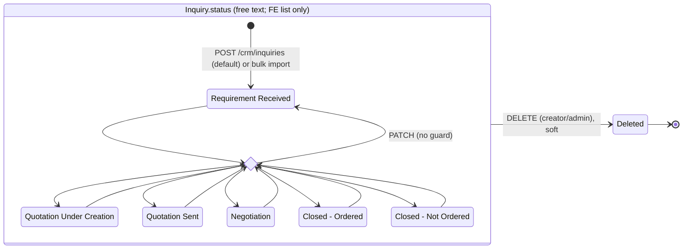
```mermaid
stateDiagram-v2
    direction LR
    state "Inquiry.status (free text; FE list only)" as S {
        state "Requirement Received" as RR
        state "Quotation Under Creation" as QUC
        state "Quotation Sent" as QS
        state "Negotiation" as NEG
        state "Closed - Ordered" as CO
        state "Closed - Not Ordered" as CNO
        state anyS <<choice>>
        [*] --> RR : POST /crm/inquiries (default) or bulk import
        RR --> anyS
        QUC --> anyS
        QS --> anyS
        NEG --> anyS
        CO --> anyS
        CNO --> anyS
        anyS --> RR : PATCH (no guard)
        anyS --> QUC
        anyS --> QS
        anyS --> NEG
        anyS --> CO
        anyS --> CNO
    }
    S --> Deleted : DELETE (creator/admin), soft
    Deleted --> [*]
```

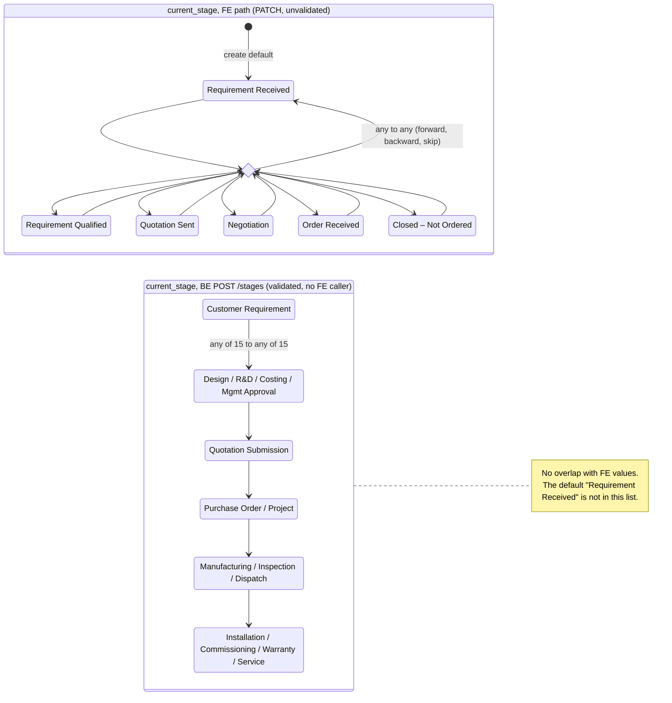
```mermaid
stateDiagram-v2
    direction LR
    state "current_stage, FE path (PATCH, unvalidated)" as FE {
        state "Requirement Received" as f1
        state "Requirement Qualified" as f2
        state "Quotation Sent" as f3
        state "Negotiation" as f4
        state "Order Received" as f5
        state "Closed – Not Ordered" as f6
        state pick <<choice>>
        [*] --> f1 : create default
        f1 --> pick
        f2 --> pick
        f3 --> pick
        f4 --> pick
        f5 --> pick
        f6 --> pick
        pick --> f1 : any to any (forward, backward, skip)
        pick --> f2
        pick --> f3
        pick --> f4
        pick --> f5
        pick --> f6
    }
    state "current_stage, BE POST /stages (validated, no FE caller)" as BE {
        state "Customer Requirement" as b1
        state "Design / R&D / Costing / Mgmt Approval" as b2
        state "Quotation Submission" as b3
        state "Purchase Order / Project" as b4
        state "Manufacturing / Inspection / Dispatch" as b5
        state "Installation / Commissioning / Warranty / Service" as b6
        b1 --> b2 : any of 15 to any of 15
        b2 --> b3
        b3 --> b4
        b4 --> b5
        b5 --> b6
    }
    note right of BE
      No overlap with FE values.
      The default "Requirement Received" is not in this list.
    end note
```

#### 1.3 Tender stateDiagram (as coded)

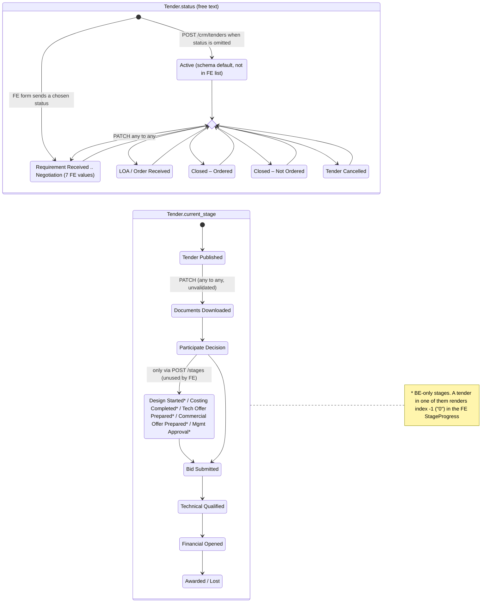
```mermaid
stateDiagram-v2
    direction LR
    state "Tender.status (free text)" as TS {
        state "Active (schema default, not in FE list)" as act
        state "Requirement Received .. Negotiation (7 FE values)" as open
        state "LOA / Order Received" as loa
        state "Closed – Ordered" as won
        state "Closed – Not Ordered" as lost
        state "Tender Cancelled" as canc
        state x <<choice>>
        [*] --> act : POST /crm/tenders when status is omitted
        [*] --> open : FE form sends a chosen status
        act --> x
        open --> x
        loa --> x
        won --> x
        lost --> x
        canc --> x
        x --> open : PATCH any to any
        x --> loa
        x --> won
        x --> lost
        x --> canc
    }
    state "Tender.current_stage" as TG {
        state "Tender Published" as t1
        state "Documents Downloaded" as t2
        state "Participate Decision" as t3
        state "Design Started* / Costing Completed* / Tech Offer Prepared* / Commercial Offer Prepared* / Mgmt Approval*" as tBE
        state "Bid Submitted" as t4
        state "Technical Qualified" as t5
        state "Financial Opened" as t6
        state "Awarded / Lost" as t7
        [*] --> t1
        t1 --> t2 : PATCH (any to any, unvalidated)
        t2 --> t3
        t3 --> tBE : only via POST /stages (unused by FE)
        tBE --> t4
        t3 --> t4
        t4 --> t5
        t5 --> t6
        t6 --> t7
    }
    note right of TG : * BE-only stages. A tender in one of them renders index -1 ("0") in the FE StageProgress
```

#### 1.4 Quotation and Activity stateDiagrams

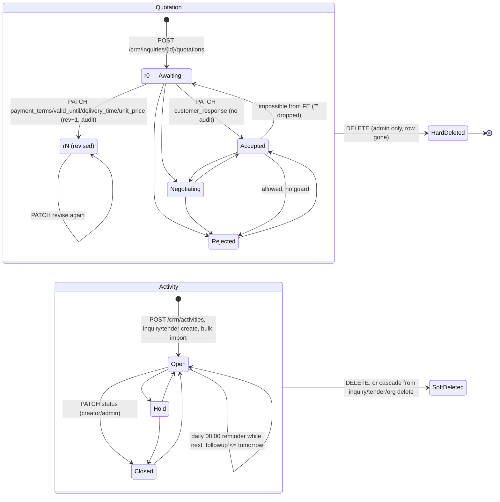
```mermaid
stateDiagram-v2
    direction LR
    state "Quotation" as Q {
        state "r0 — Awaiting —" as q0
        state "rN (revised)" as qn
        state "Accepted" as qa
        state "Rejected" as qr
        state "Negotiating" as qg
        [*] --> q0 : POST /crm/inquiries/{id}/quotations
        q0 --> qn : PATCH payment_terms/valid_until/delivery_time/unit_price (rev+1, audit)
        qn --> qn : PATCH revise again
        q0 --> qa : PATCH customer_response (no audit)
        q0 --> qr
        q0 --> qg
        qg --> qa
        qg --> qr
        qa --> qr : allowed, no guard
        qa --> qg
        qr --> qa
        qa --> q0 : impossible from FE ("" dropped)
    }
    Q --> HardDeleted : DELETE (admin only, row gone)
    HardDeleted --> [*]

    state "Activity" as A {
        state "Open" as ao
        state "Closed" as ac
        state "Hold" as ah
        [*] --> ao : POST /crm/activities, inquiry/tender create, bulk import
        ao --> ac : PATCH status (creator/admin)
        ao --> ah
        ah --> ao
        ac --> ao
        ah --> ac
        ao --> ao : daily 08:00 reminder while next_followup <= tomorrow
    }
    A --> SoftDeleted : DELETE, or cascade from inquiry/tender/org delete
```

---

### 2. Business process flowchart (as coded)

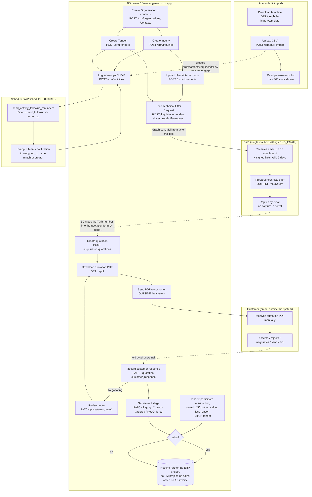
```mermaid
flowchart TB
    subgraph ADMIN["Admin (bulk import)"]
        A1[Download template<br/>GET /crm/bulk-import/template]
        A2[Upload CSV<br/>POST /crm/bulk-import]
        A3[Read per-row error list<br/>max 300 rows shown]
    end
    subgraph BD["BD owner / Sales engineer (crm app)"]
        B1[Create Organization + contacts<br/>POST /crm/organizations, /contacts]
        B2[Create Inquiry<br/>POST /crm/inquiries]
        B2T[Create Tender<br/>POST /crm/tenders]
        B3[Log follow-ups / MOM<br/>POST /crm/activities]
        B4[Upload client/internal docs<br/>POST /crm/documents]
        B5[Send Technical Offer Request<br/>POST /inquiries or tenders /id/technical-offer-request]
        B6[Create quotation<br/>POST /inquiries/id/quotations]
        B7[Download quotation PDF<br/>GET .../pdf]
        B8[Send PDF to customer<br/>OUTSIDE the system]
        B9[Record customer response<br/>PATCH quotation customer_response]
        B10[Revise quote<br/>PATCH price/terms, rev+1]
        B11[Set status / stage<br/>PATCH inquiry: Closed - Ordered / Not Ordered]
        B12[Tender: participate decision, bid, award/LOI/contract value, loss reason<br/>PATCH tender]
        B13{Won?}
        B14[(Nothing further: no ERP project,<br/>no PM project, no sales order, no AR invoice)]
    end
    subgraph RND["R&D (single mailbox settings.RND_EMAIL)"]
        R1[Receives email + PDF attachment<br/>+ signed links valid 7 days]
        R2[Prepares technical offer<br/>OUTSIDE the system]
        R3[Replies by email<br/>no capture in portal]
    end
    subgraph CUST["Customer (email, outside the system)"]
        C1[Receives quotation PDF manually]
        C2[Accepts / rejects / negotiates / sends PO]
    end
    subgraph SCHED["Scheduler (APScheduler, 08:00 IST)"]
        S1[send_activity_followup_reminders<br/>Open + next_followup <= tomorrow]
        S2[In-app + Teams notification<br/>to assigned_to name match or creator]
    end

    A1 --> A2 --> A3
    A2 -. creates orgs/contacts/inquiries/follow-ups, no tenders .-> B3
    B1 --> B2
    B1 --> B2T
    B2 --> B3
    B2T --> B3
    B2 --> B4 --> B5
    B2T --> B5
    B5 -->|Graph sendMail from actor mailbox| R1 --> R2 --> R3
    R3 -. BD types the TOR number into the quotation form by hand .-> B6
    B6 --> B7 --> B8 --> C1 --> C2
    C2 -. told by phone/email .-> B9
    B9 -->|Negotiating| B10 --> B7
    B9 --> B11
    B12 --> B13
    B11 --> B13
    B13 -->|yes| B14
    B13 -->|no| B14
    B3 --> S1 --> S2 --> B3
```

---

### 3. Step table

| # | Step | Actor | Screen (FE) | API (BE file:line) | DB write | Status/stage change | Notification / email (recipients) | Audit / stage log |
|---|---|---|---|---|---|---|---|---|
| 1 | Create organization | BD | app/dashboard/crm/organizations/new/page.tsx:24 → OrganizationForm | `POST /crm/organizations` organizations.py:149-195 | `crm_organizations` (org_code from services/org_code.py:8-25, advisory lock) | n/a | `broadcast_notification` organizations.py:180 (every active CRM user except the actor) + `notify_user` :186 (actor). In-app + Teams (utils/notifications.py:85-133) | AuditLog `organization/created` :179 |
| 2 | Add contact | BD | InquiryForm.tsx:176 (inline) or org detail | `POST /crm/organizations/{id}/contacts` organizations.py:348-360 | `crm_org_contacts` | n/a | none | **none** (inferred from grep: no `_write_audit` in 348-399) |
| 3 | Create inquiry | BD / Sales engr | app/dashboard/crm/inquiries/new/page.tsx:68 → InquiryForm.tsx | `POST /crm/inquiries` inquiries.py:113-157 | `crm_inquiries` (universal_id `INQ-YYYYMMDD-NNNN` via core/sequential_id.py:5-29), `crm_inquiry_line_items`, optional `crm_activities` "Follow-up" :139-144 | status/stage from the payload (default "Requirement Received") | broadcast to all CRM users :146-150 + actor :151-154 | AuditLog `inquiry/created` :145. CrmStageLog "Inquiry created" :138 |
| 3T | Create tender | BD | inquiries/new/page.tsx:77 → TenderForm.tsx | `POST /crm/tenders` tenders.py:117-165 | `crm_tenders` (TND-YYYYMMDD-NNNN :63-65), optional Activity "Submission" :147-151. Duplicate check on (tender_number, zone, division) :131-139, app-level only | status default **"Active"** if omitted | broadcast :154-158 + actor :159-162 | AuditLog `tender/created` :153. StageLog "Tender created" :146 |
| 4 | Edit inquiry info / status | BD (creator or admin) | InquiryDetailPanel.tsx:79,93,364; InquiryForm edit | `PATCH /crm/inquiries/{id}` inquiries.py:172-222 | row fields, full replace of additional_items :199-202 | `status` changes silently. `org_id`/`org_contact_id` are not re-validated | **none for a status change** (only current_stage triggers a notification) | AuditLog `inquiry_spec/spec_revision` :204-205 (JSON old/new). No stage log for status |
| 5 | Move stage | BD (creator/admin) | StageProgress InquiryDetailPanel.tsx:185 → ConfirmDialog :297-298 | `PATCH /crm/inquiries/{id}` {current_stage} inquiries.py:186, 206-218 | current_stage | any to any, unvalidated | broadcast "Inquiry Stage Updated" :208-213 + actor :214-218 | StageLog "Stage updated / Moved to X" :207. AuditLog: **none** (current_stage is excluded from info_changed :191) |
| 5b | Move stage (alternate, unused) | n/a | none (api.ts:315 unused) | `POST /crm/inquiries/{id}/stages` :420-443 | CrmStageLog + current_stage | validated against the 15-item BE list | **none** | StageLog only. No AuditLog |
| 6 | Log follow-up / MOM | BD | InquiryDetailPanel.tsx:1266-1268 (ActivityForm), crm/followups/page.tsx | `POST /crm/activities` activities.py:149-161; `PATCH` :164-181; attachments :184-233 | `crm_activities`, `crm_activity_attachments` (SharePoint) | Activity Open/Closed/Hold | none at creation | **none** (no AuditLog in activities.py) |
| 7 | Follow-up reminder | Scheduler | n/a | `send_activity_followup_reminders` tasks/followup_reminders.py:109-119, registered in main.py:338-343 (08:00 Asia/Kolkata) | `notifications` rows | none | `notify_user` :85-104 → the user whose `name` exactly matches free-text `assigned_to` :29-37, else the creator. In-app + Teams. **No email** | none |
| 8 | Upload document | BD | InquiryDetailPanel.tsx:1127 DocumentsTab | `POST /crm/documents` documents.py:47-106 | `crm_documents` + SharePoint file | n/a | none | **none** |
| 9 | Send Technical Offer Request | any CRM user (**no creator check** in the FE button :202-215 or the BE :281-291) | InquiryDetailPanel.tsx:135-140 (TechnicalOfferPickerDialog); TenderDetailPanel.tsx:109-115 | `POST /crm/inquiries/{id}/technical-offer-request` inquiries.py:281-374; tender twin tenders.py:278-368 | TOR PDF built (:316), uploaded to SharePoint (:321, overwrite on same path), `crm_documents` row `shared_via_tor=True` (:324-333); selected ref docs flagged (:352-353); on success `technical_offer_number`, `technical_offer_sent_at` (:370-371) | none (stage not advanced) | `send_technical_offer_request_email` utils/email.py:509-598 → **`settings.RND_EMAIL` only** (one mailbox), sent from the actor's mailbox, PDF attached, links = unauthenticated signed tokens valid 168 h (jwt_handler.py:40-53). No in-app notification to anyone | AuditLog `technical_offer_sent`/`technical_offer_failed` email.py:593-597. No stage log |
| 10 | R&D views TOR in portal | R&D user | app/dashboard/crm/technical-offer/[id]/page.tsx (no crm gate) | `GET /crm/documents/{id}/content` documents.py:137-172 (`shared_via_tor` bypass :162), or `GET /{id}/shared-content?token=` :109-134 (no login) | none | none | n/a | none |
| 11 | R&D returns technical offer | R&D | **no screen** | **no endpoint** | n/a | n/a | n/a | n/a |
| 12 | Create quotation | BD (any CRM user, BE has no ownership check) | InquiryDetailPanel.tsx:688 QuotationsTab | `POST /crm/inquiries/{id}/quotations` workflow.py:54-80 | `crm_quotations` (quot_number from a count, :31-36), `crm_quotation_line_items` with server-computed totals :70-76 | **no inquiry status change** | none | **none** |
| 13 | Revise quotation | quotation creator/admin | InquiryDetailPanel.tsx:1010 ReviseQuotationForm | `PATCH .../quotations/{qid}` workflow.py:83-119 | fields + unit_price, revision_number++, quot_number `-rN` | quotation revision | none | AuditLog `quotation_revision/revision` :112-115 |
| 14 | Quotation PDF | any CRM user | InquiryDetailPanel.tsx:550 | `GET .../quotations/{qid}/pdf` workflow.py:153-201 → reports/quotation_pdf.py | none (not archived) | none | none (no email to the customer) | none |
| 15 | Record customer response | BD (creator/admin of the quotation in the BE; FE gates on the inquiry creator) | InquiryDetailPanel.tsx:477-480, 885-893 | `PATCH .../quotations/{qid}` {customer_response} workflow.py:94-98 | customer_response | "Accepted" does **not** move the inquiry to Closed - Ordered | none | **none** (not in QUOTATION_REVISION_FIELDS :42) |
| 16 | Close won/lost | BD | InquiryDetailPanel.tsx:364 (status) / :298 (stage) | PATCH inquiries.py:172 | status = Closed - Ordered / Not Ordered | manual. No lost-reason field on Inquiry | stage change only | spec revision / stage log as in steps 4-5 |
| 16T | Tender award / loss | BD | TenderForm.tsx (edit) | PATCH tenders.py:180-219 | awarded_to, loi_number, contract_value, loss_reason | manual, no coupling to status | stage change only | AuditLog `tender_spec` :201-202; StageLog on stage :204 |
| 17 | Hand-off to execution | n/a | **none** | **none**. ERP `Project.client_name` is free text (modules/erp/models/project.py:40); PM `projects/models/project.py:26` the same; AR `ARTransaction.customer_id` → org, but `reference_type/id` is free, unvalidated text (modules/accounts/models/ar_transaction.py:24, 33-35) | n/a | n/a | n/a | n/a |
| 18 | Delete inquiry / tender | creator/admin | InquiryDetailPanel.tsx:103 | DELETE inquiries.py:225-254 / tenders.py:222-251 | soft delete + `cascade_delete_children` (activities + documents only, services/cascade.py:26-40) | Deleted | broadcast + actor | AuditLog `deleted` |
| 19 | Delete quotation | admin | QuotationsTab | DELETE workflow.py:204-213 | **hard** delete (row + line items) | n/a | none | **none** |

---

### 4. Bulk import sub-flow

#### 4.1 Sequence

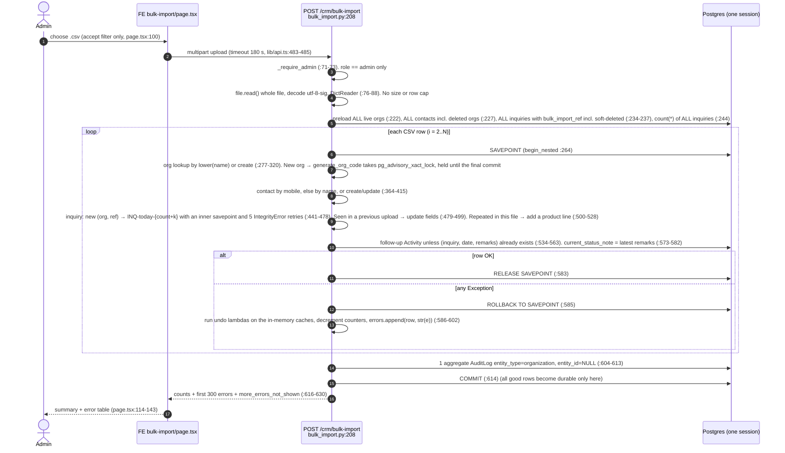
```mermaid
sequenceDiagram
    autonumber
    actor Admin
    participant FE as FE bulk-import/page.tsx
    participant API as POST /crm/bulk-import<br/>bulk_import.py:208
    participant DB as Postgres (one session)
    Admin->>FE: choose .csv (accept filter only, page.tsx:100)
    FE->>API: multipart upload (timeout 180 s, lib/api.ts:483-485)
    API->>API: _require_admin (:71-73). role == admin only
    API->>API: file.read() whole file, decode utf-8-sig, DictReader (:76-88). No size or row cap
    API->>DB: preload ALL live orgs (:222), ALL contacts incl. deleted orgs (:227), ALL inquiries with bulk_import_ref incl. soft-deleted (:234-237), count(*) of ALL inquiries (:244)
    loop each CSV row (i = 2..N)
        API->>DB: SAVEPOINT (begin_nested :264)
        API->>API: org lookup by lower(name) or create (:277-320). New org → generate_org_code takes pg_advisory_xact_lock, held until the final commit
        API->>API: contact by mobile, else by name, or create/update (:364-415)
        API->>API: inquiry: new (org, ref) → INQ-today-{count+k} with an inner savepoint and 5 IntegrityError retries (:441-478). Seen in a previous upload → update fields (:479-499). Repeated in this file → add a product line (:500-528)
        API->>DB: follow-up Activity unless (inquiry, date, remarks) already exists (:534-563). current_status_note = latest remarks (:573-582)
        alt row OK
            API->>DB: RELEASE SAVEPOINT (:583)
        else any Exception
            API->>DB: ROLLBACK TO SAVEPOINT (:585)
            API->>API: run undo lambdas on the in-memory caches, decrement counters, errors.append(row, str(e)) (:586-602)
        end
    end
    API->>DB: 1 aggregate AuditLog entity_type=organization, entity_id=NULL (:604-613)
    API->>DB: COMMIT (:614) (all good rows become durable only here)
    API-->>FE: counts + first 300 errors + more_errors_not_shown (:616-630)
    FE-->>Admin: summary + error table (page.tsx:114-143)
```

#### 4.2 Per-row validations

| Entity | Rule | Code | Notes |
|---|---|---|---|
| Org | `org_name` required on every row | :278-279 | |
| Org | `org_type` required when the org is new | :283-284 | not checked against FE `ORG_TYPES` |
| Org | GST format + unique among **live** orgs in the cache | :285-287, :328-330 | the DB unique constraint on `gst_number` (models/organization.py:30) also covers **soft-deleted** orgs, so a deleted org's GST surfaces as a raw IntegrityError text |
| Org | official_email format + unique | :288-290, :331-333 | |
| Org | match key = `name.strip().lower()`, exact | :280 | no fuzzy or GST-based match: "Northern Railway HQ" and "Northern Railway Headquarters" become two orgs |
| Contact | match by exact `contact_mobile` within the org, else by name | :369-372 | no mobile normalisation (+91 / spaces) |
| Contact | `contact_name` required for a new contact | :374-375 | |
| Contact | email format + unique within the org | :376-378, :395-399 | |
| Inquiry | number fields `float()`; dates `%Y-%m-%d`, `%d-%m-%Y`, `%d/%m/%Y` | :95-114 | |
| Inquiry | `lead_source` defaults to "Bulk Import"; `priority` defaults to "Medium", with no check against `PRIORITIES` | :456-457 | |
| Inquiry | `org_contact_id` may be NULL | :454 | contradicts `InquiryCreate.org_contact_id: int` (schemas/inquiry.py:20) and the model comment (models/inquiry.py:20-21) |
| Inquiry | status / current_stage **cannot be set**; always the model default | n/a | historical closed deals import as "Requirement Received" |
| Product line | skipped if the same product name already exists on the inquiry | :509-515 | |
| Follow-up | created only if any `followup_*` column is filled; duplicate if same (inquiry, activity_date, remarks) | :538-548 | the duplicate query has no `is_deleted` filter, so a deleted follow-up blocks re-import |
| Follow-up | `followup_status` is free text | :557 | a typo such as "open" never triggers reminders (reminder filter `== "Open"`) |
| Tenders | **not supported at all** | n/a | the template (`_HEADER` :121-135) has no tender columns |

#### 4.3 Transactions, partial failure, duplicates, limits

- **Partial failure**: each row runs in its own SAVEPOINT (:264, :583, :585). Good rows are kept and bad rows are rolled back and reported. Nothing becomes durable until the single `db.commit()` at :614, so a crash, timeout or connection drop mid-file loses **everything**. A 180 s FE timeout (api.ts:485) on a large file shows the admin an error while the server may still be working and then commit (inferred), so a re-upload is needed and dedup has to absorb it.
- **Duplicates**: orgs by case-insensitive name. Contacts by mobile. Inquiries by `(org_id, bulk_import_ref)`, and **rows without an inquiry_ref always create a new inquiry**, so re-uploading a file without refs duplicates every inquiry. The ref cache includes soft-deleted inquiries (:234-237), so a re-import updates, and attaches follow-ups to, an inquiry nobody can see.
- **Numbering**: `inquiry_seq = count(all inquiries ever)` (:244) plus a hand-built `INQ-{today}-{seq}` (:453). This bypasses `next_sequential_id` and its advisory lock. It does not collide (IntegrityError retry :450-471), but it produces daily numbers like `INQ-20260929-0513` right after `-0003`, and a concurrent UI create can lose the retry race 5 times and fail the row.
- **Lock hold**: `generate_org_code` (services/org_code.py:18) takes `pg_advisory_xact_lock` for `ORG-{year}-`, and it is released only at the final commit. Every UI "create organization" is **blocked for the whole import**.
- **Limits**: no file-size check (the OWASP middleware allows multipart up to 10 GB, middleware/owasp.py:62), no row cap, whole file read into memory, all orgs/contacts preloaded. Errors are truncated to 300 (:68, :616). There is no downloadable error CSV.
- **Error text**: `str(e)` (:602) for any exception, including SQLAlchemy IntegrityError/DataError dumps (SQL + params). This violates the "real error message + how to fix" rule for DB-level errors.
- **Audit / notifications / stage log**: one aggregate AuditLog with `entity_id=None` (:605-613). Nothing per org or inquiry, **no CrmStageLog "Inquiry created"**, no notifications. Imported inquiries therefore have an empty Timeline and an empty `/audit` (inquiries.py:257-278).
- `csv_templates/` at the repo root is **not** the bulk-import template. It holds header-only DB dumps (`crm_inquiries.csv`, `crm_quotations.csv`, ...) and includes `crm_inquiry_approvals.csv` and `crm_inquiry_tasks.csv`, tables with **no model** in code (see `check_unknown_tables.sql`). These are legacy approval/task tables that the current lifecycle has dropped.

---

### 5. Gaps

Tags: [BA] business/process, [ARCH] architecture/data integrity, [SEC] security, [USER] UX.

#### Lifecycle and state model

- **P2-CRM-1 [BA][ARCH]** The inquiry has two unrelated vocabularies. FE `INQ_STAGES` (constants.ts:77-84) and BE `INQ_STAGES` (inquiries.py:33-37) share zero values. The BE list describes an execution pipeline (Manufacturing, Dispatch, Commissioning) that CRM never reaches. The BE default "Requirement Received" (schemas/inquiry.py:27) is not in the BE list either. `POST /stages` (:420) is effectively dead (api.ts:315 has no caller).
- **P2-CRM-2 [BA][ARCH]** Tender stages: the FE has 7 and the BE has 12 (tenders.py:34-38 vs constants.ts:86-94). The 5 BE-only bid-preparation stages (Design, Costing, Tech/Commercial Offer, Mgmt Approval) are unreachable in the UI, and a record holding one of them renders as index -1 in StageProgress (ui.tsx:169).
- **P2-CRM-3 [ARCH]** No server-side validation of `status`/`current_stage` on PATCH (inquiries.py:185-195, tenders.py:193-199). Any string is accepted, and forward, backward and skip moves are all allowed with no transition rules or preconditions (e.g. "Quotation Sent" with zero quotations, "Closed - Ordered" with no accepted quotation or PO).
- **P2-CRM-4 [BA]** Status and stage are decoupled and duplicated: an inquiry can be status "Closed - Not Ordered" and stage "Negotiation" at the same time. Stage changes notify people and write a stage log. Status changes, which carry the actual won/lost outcome, notify nobody and only produce a generic spec revision (inquiries.py:204-218).
- **P2-CRM-5 [BA]** The inquiry has no lost-reason, no competitor, no lost-to price and no won PO number / order value / order date field (models/inquiry.py:13-82). Tender has `loss_reason`/`awarded_to`/`loi_number`/`contract_value` (models/tender.py:60-63), but none of them is required or checked when status becomes Closed/Awarded.
- **P2-CRM-6 [BA]** No explicit cancel, re-open or on-hold for inquiry. "Tender Cancelled" exists only as a free status. Re-open works only as an unaudited-in-intent free PATCH back to an open status. Delete (soft) is the only "cancel", and it cascades away the follow-ups and documents (services/cascade.py:26-40).
- **P2-CRM-7 [ARCH]** Tender schema default status is `"Active"` (schemas/tender.py:16), while the model default is "Requirement Received" (models/tender.py:31). "Active" is not in `TENDER_STATUSES`, so an API/test-created tender falls outside every FE filter/colour, yet it still counts as "pending" on the dashboard (dashboard.py:36-39).
- **P2-CRM-8 [USER]** Dash inconsistency: inquiry statuses use an ASCII hyphen ("Closed - Ordered", constants.ts:62-63), while inquiry stages and tender statuses use an en dash ("Closed – Not Ordered", :83, :105-106). Filters or reports matching by string will miss one or the other (the dashboard hard-codes en dashes, dashboard.py:38).
- **P2-CRM-9 [USER]** The InquiryForm duplicate warning treats tenders as open unless status is 'Won'/'Lost'/'Cancelled' (InquiryForm.tsx:255). Those values do not exist in `TENDER_STATUSES`, so every tender is reported as "open".
- **P2-CRM-10 [USER]** The inquiry number preview is `INQ-today-(count of first 200 inquiries + 1)` (InquiryForm.tsx:222-228), which never matches the BE daily sequence (sequential_id.py:24-29).

#### Quotation

- **P2-CRM-11 [BA]** No quotation approval step, even though the BE stage list has "Management Approval" and a `crm_inquiry_approvals` table exists in prod (csv_templates/crm_inquiry_approvals.csv) with no model. Any CRM user can create a legally-facing quotation on any inquiry: `create_quotation` has no ownership check (workflow.py:54-58).
- **P2-CRM-12 [BA]** The quotation is never sent from the system. The PDF is generated on the fly (workflow.py:153-201) and neither archived to SharePoint nor emailed, `submitted_date` is typed by hand, and there is no record of what version the customer actually received.
- **P2-CRM-13 [BA]** Customer response "Accepted" does not update the inquiry (workflow.py:94-98). Win is a separate manual PATCH, so the quotation and inquiry outcomes can contradict each other. `valid_until` has no expiry job.
- **P2-CRM-14 [ARCH]** Quotation number race and reuse: `seq = count(quotations on inquiry) + 1` (workflow.py:34) with no lock and no unique constraint (models/inquiry.py:104). Two concurrent creates get the same `QT-…-02`. After an admin hard-deletes quotation 01 of 2, the next one reuses `-02`.
- **P2-CRM-15 [ARCH]** Orphaned quotations. Deleting an inquiry soft-deletes it but not its quotations (cascade.py only touches activities/documents). `list_quotations`, `update_quotation` and `download_quotation_pdf` never check `Inquiry.is_deleted` (workflow.py:28, :85, :155-158), so quotations on deleted inquiries stay readable, revisable and printable by URL.
- **P2-CRM-16 [ARCH][SEC]** Quotation delete is a hard delete with no audit (workflow.py:204-213). Customer-response changes are unaudited (workflow.py:42, :95). Quotation create is unaudited. The FE gates quotation controls on the *inquiry* creator (InquiryDetailPanel.tsx:73), while the BE gates revision on the *quotation* creator (workflow.py:88), so the inquiry owner can get a 403 on a colleague's quote.
- **P2-CRM-17 [USER]** The customer response cannot be reset to "— Awaiting —": the FE sends `undefined` (InquiryDetailPanel.tsx:478) and `exclude_unset` drops it. The dropdown also lists "— Awaiting —" twice (:891-892).

#### Technical Offer Request / R&D

- **P2-CRM-18 [BA]** R&D is notified but cannot act. The TOR goes to one shared mailbox (`settings.RND_EMAIL`, utils/email.py:529). There is no R&D user, task, queue, due date or in-app notification, and no endpoint for R&D to upload the technical offer or mark it done. The BD re-types the TOR number into the quotation by hand (InquiryDetailPanel.tsx:735). A `crm_inquiry_tasks` table (department/assigned_user/due_date) exists in prod with no model (csv_templates/crm_inquiry_tasks.csv).
- **P2-CRM-19 [SEC]** Any CRM user can fire a TOR for any inquiry or tender: there is no `_can_modify` (inquiries.py:281-291, tenders.py:278-288) and the FE button is not gated on canModify (InquiryDetailPanel.tsx:202-215). The "already sent" and "missing requirement details" checks exist only in the FE (:114-122). Tender TOR has no missing-details check at all (TenderDetailPanel.tsx:109-115).
- **P2-CRM-20 [ARCH]** Orphaned TOR on email failure. The PDF is uploaded to SharePoint and a `CrmDocument(shared_via_tor=True)` row is committed even when the email fails (inquiries.py:366-368, tenders.py:360-362), and the selected reference docs are also flagged `shared_via_tor=True` permanently. Retries pile up duplicate TOR document rows.
- **P2-CRM-21 [ARCH]** The TOR number is fixed per record (`TOR-<suffix>`, inquiries.py:294-295), and SharePoint simple upload replaces files on the same path (utils/sharepoint.py, conflictBehavior replace, :188). Each re-send overwrites the previous PDF, so earlier CrmDocument rows and still-valid 7-day links serve the new content. There is no TOR revision history.
- **P2-CRM-22 [SEC]** Two unauthenticated or over-broad paths to shared docs. (1) `/shared-content?token=` needs no login; the token is a 168 h bearer JWT with no revocation or recipient binding (jwt_handler.py:40-53, documents.py:109-134), and it is forwardable from the R&D mailbox to anyone. (2) `/content` lets **any logged-in user** fetch any `shared_via_tor` doc by sequential integer id (documents.py:162), so documents are enumerable across departments.
- **P2-CRM-23 [BA]** Tender TOR maps `requirement_desc = tender.reason_no_participate` (tenders.py:309), so R&D receives the "reason we are NOT participating" as the requirement description. `project_details = tender_authority` (:305).

#### Activities, reminders, notifications

- **P2-CRM-24 [BA]** Changing `next_followup_date` on an inquiry after creation creates no Activity. Only create does (inquiries.py:139-144), and PATCH does not (:172-222). The inquiry's "next follow-up" field and the reminder engine therefore drift apart. Tender `submission_date` behaves the same way (tenders.py:147-151).
- **P2-CRM-25 [ARCH]** Reminder targeting is a free-text `assigned_to` matched by exact `lower(User.name)` (followup_reminders.py:29-37). Renamed or duplicate-named users misroute, and non-matches fall back silently to the creator. Only in-app + Teams, no email. The scheduler runs inside the uvicorn process (main.py:329-350), so more than one replica sends duplicates, and `_already_sent_today` is check-then-insert (inferred).
- **P2-CRM-26 [ARCH]** Activity create does not validate `related_module`/`related_id`/`org_id` (activities.py:149-161). Follow-ups can point at non-existent or deleted inquiries. Activities have no audit trail, and neither do documents or contacts.
- **P2-CRM-27 [USER]** Notification noise: every inquiry/tender/org create, stage change and delete is broadcast to **every** active CRM user (utils/notifications.py:85-110, e.g. inquiries.py:146, :208), with a Teams push each. Nothing targets the BD owner or sales engineer, who are free-text fields (models/inquiry.py:35-36), not user FKs.

#### Integrity, races, audit

- **P2-CRM-28 [ARCH]** Tender duplicate check (tender_number + zone + division) is app-level only (tenders.py:131-139) with no DB unique index, so it races. It is also not re-checked on PATCH (tenders.py:180-219).
- **P2-CRM-29 [ARCH]** Inquiry PATCH accepts `org_id`/`org_contact_id` without verifying the org exists or the contact belongs to it (inquiries.py:185-195, schemas/inquiry.py:52-53). Create does check (:119-125).
- **P2-CRM-30 [ARCH]** Org create maps *any* IntegrityError to "An organization with this name already exists" (organizations.py:174-178). A GST clash with a soft-deleted org (DB unique covers deleted rows, models/organization.py:30) gets the wrong message. Org name uniqueness is enforced by a partial unique index (alembic c3a9e5f21d47), so the duplicate-org race is covered at the DB.
- **P2-CRM-31 [ARCH]** `next_sequential_id` takes `MAX()` on a string column (sequential_id.py:25). This is correct only while the suffix stays 4 digits (fine per day). It is safe against races thanks to the advisory lock. Bulk import bypasses it (P2-CRM-35).
- **P2-CRM-32 [SEC]** CRM subtab permissions (`permission_registry.py:35-41`: dashboard, organizations, inquiries_tenders) are not enforced on any CRM route: `require_tab_access` is not used in modules/crm. Anyone with the `crm` app sees all inquiries, tenders, quotations and pricing, with no owner/team scoping on list endpoints (inquiries.py:70-110).
- **P2-CRM-33 [ARCH]** The audit trail is split and incomplete. Stage moves write only CrmStageLog. Status and info changes write AuditLog `inquiry_spec`. `/audit` (inquiries.py:257-278) shows only `entity_type="inquiry"` rows. POST /stages writes no AuditLog. Quotation create/delete/response, activities, contacts and documents write none.

#### Hand-off and bulk import

- **P2-CRM-34 [BA][ARCH]** No hand-off from a won inquiry or awarded tender to execution. There is no ERP project, PM project, sales order or AR invoice creation, and no FK from ERP/PM projects to CRM (`client_name` free text: modules/erp/models/project.py:40, modules/projects/models/project.py:26). AR `ARTransaction.reference_type/id` is unvalidated free text (modules/accounts/models/ar_transaction.py:33-35). Contract value and LOI never flow to Finance. The BE stage list ("Purchase Order", "Project", ...) implies a hand-off that was never built.
- **P2-CRM-35 [ARCH]** Bulk import numbering uses `count(*)` of all inquiries (bulk_import.py:244, :453) instead of the locked daily sequence. It produces gaps and out-of-order daily numbers and can lose retry races against the UI.
- **P2-CRM-36 [ARCH]** Bulk import holds the `ORG-{year}` advisory lock from the first new org until the final commit (services/org_code.py:18 + bulk_import.py:305, :614), which blocks every UI org create for the whole import. Everything is committed once at the end (:614), so a timeout or crash loses the whole run even though per-row savepoints exist.
- **P2-CRM-37 [ARCH]** Bulk import updates soft-deleted inquiries: the ref cache has no `is_deleted` filter (bulk_import.py:234-237). It also loads all contacts, including those of deleted orgs (:227).
- **P2-CRM-38 [SEC][ARCH]** Bulk import has no file-size or row limit (the whole file is read into memory, :215, :76-88; the middleware allows 10 GB multipart, owasp.py:62). It runs synchronously in the request with a 180 s client timeout (api.ts:485) and has no background job or progress reporting.
- **P2-CRM-39 [BA]** Bulk import cannot set status/stage and cannot import tenders or quotations (template :121-135). It leaves `org_contact_id` NULL when a row has no contact (:454), which contradicts the "contact required" rule, and writes no per-record audit, no stage log and no notification (:604-613). Imported records have an empty Timeline.
- **P2-CRM-40 [USER]** Bulk import errors are raw `str(e)`, which exposes SQL/IntegrityError internals for DB-level failures (bulk_import.py:602). Only the first 300 are returned (:68), and there is no downloadable error CSV to fix and re-upload.
- **P2-CRM-41 [ARCH]** Legacy prod tables `crm_inquiry_approvals` and `crm_inquiry_tasks` exist (csv_templates headers, `check_unknown_tables.sql`) with no model or route. Data may be stranded there (inferred). Empty FE route folders `app/dashboard/crm/demand/*` and `companies/*` contain no files.

---

## 2.4 Store & Inventory flows

Scope: read-only review of `backend/app/modules/store/**`, `backend/app/modules/p2p/routes/goods_receipts.py`, the store-issue parts of `backend/app/modules/p2p/routes/p2p_requests.py`, `backend/app/utils/notifications.py`, `backend/app/core/sequential_id.py`, `backend/app/main.py` (scheduler), and the Store FE pages under `frontend/src/app/dashboard/store/**`.
Paths: BE = `backend/app/`, FE = `frontend/src/`. Line numbers are from the current working tree (2026-09-29).

---

### 0. Headline: stock-posting concurrency

| Question | Answer (as coded) | Evidence |
|---|---|---|
| Does `post_stock_transaction` lock the balance row? | **Yes.** It runs `SELECT ... FOR UPDATE` on `store_stock_balances(item_id, location_id)` before it reads the balance and changes it in memory. | BE `modules/store/services/stock_ledger.py:32-41` (`_get_or_create_balance` uses `.with_for_update()` at :35), used at :66 and :108 |
| Can two concurrent issues drive stock negative? | **No, if the balance row already exists.** The second transaction waits on the row lock, then re-reads the committed `on_hand_qty`, and the available check at :70-78 rejects it. | `stock_ledger.py:66-79` |
| Is there a first-posting race? | **Yes (error, not corruption).** When no balance row exists yet, `FOR UPDATE` locks nothing. Two concurrent first postings for the same (item, location) both `INSERT`, and the second fails on `uq_store_stock_balance_item_location` with an `IntegrityError`. That is not a `ValueError`, so callers do not catch it and the user gets a 500. | `stock_ledger.py:33-41`, `models/stock_balance.py:15` |
| Are the balance and the ledger row written in one DB transaction? | **Yes.** Both go into the same `Session`, with `flush()` only (:97, :117). The route then commits everything once. Any `ValueError` rolls the whole document back. | e.g. `routes/material_issues.py:99-115` |
| Is there a DB-level guard against negative stock? | **No.** There is no `CHECK (on_hand_qty >= 0)`. The only guard is the Python check, so any code that writes the balance without going through `post_stock_transaction` is unguarded. | migration `alembic/versions/101e320829cb_add_store_stock_ledger.py:27-31` |
| Is valuation (average cost) kept up to date? | **No.** Transactions have no unit cost or value column. `StoreItem.moving_average_cost` is never computed and can be edited by hand through `PATCH /store/items/{id}`. | `models/stock_transaction.py:32-49`, `models/item.py:53-54`, `schemas/item.py:65`, `routes/items.py:71-85` |
| What is NOT concurrency-safe around the ledger? | (a) GRN inspect: the GRN row is not locked, so a double submit posts the receipt twice. (b) Reservation cancel/fulfil: the reservation row is not locked, so the earmark can be released twice. (c) Material return against an issue: the cap is checked and then written without a lock, so concurrent returns can over-return. (d) Deadlock risk between multi-line documents that lock balances in a different order (inferred). | see P2-STO-1, -2, -9, -21 |
| Numbering | Safe. Every Store series takes `pg_advisory_xact_lock(hashtext(prefix))` before `MAX()` (`service.py:15-16`), the same pattern as `core/sequential_id.py:24`. Side effect: all issues (and likewise all transfers, returns and so on) are serialised end-to-end while each transaction is open. Numbers use `date.today()` in the server's timezone, not `issue_date`. | `modules/store/service.py:19-89` |

---

### 1. Document status values (as coded)

| Document | Table | Status field / values | File:line | Notes |
|---|---|---|---|---|
| Material Issue | `store_material_issues` | **No status column.** It is posted when it is created. | BE `modules/store/models/material_issue.py:9-34` (docstring :10-13) | No draft, approve or cancel. Has an optional `p2p_request_id` (:26) |
| Material Return | `store_material_returns` | **No status column.** `source_type` ∈ `issue`, `other` (:11). Line `condition` ∈ `good`, `damaged`, `rejected` (:18) | `models/material_return.py:11,18,21-39` | Only `good` lines post `return_in` |
| Stock Transfer | `store_stock_transfers` | **No status column.** Out and in are posted at the same moment. | `models/stock_transfer.py:9-28` | No in-transit state |
| Stock Adjustment | `store_stock_adjustments` | **No status column.** `approved_by_id` is a plain field the creator fills in. | `models/stock_adjustment.py:9-30` (:24) | Posts immediately |
| Stock Reservation | `store_stock_reservations` | `active` → `fulfilled` / `cancelled` | `models/stock_reservation.py:14`, `:31` | No `expired` state, no job |
| Stock Transaction (ledger) | `store_stock_transactions` | `transaction_type` ∈ `receipt, issue, return_in, return_out, transfer_in, transfer_out, adjustment_in, adjustment_out, damage` | `models/stock_transaction.py:13-23` | Direction: `services/stock_ledger.py:9-10`. Reservation-aware outbound: `:19`. Manual-allowed: `routes/stock.py:25` |
| Ledger reference type | same | `grn, material_issue, material_return, stock_transfer, stock_adjustment, manual` (not enforced) | `models/stock_transaction.py:29` | The P2P issue writes `p2p_request`, which is not in the list (`p2p/routes/p2p_requests.py:822`) |
| GRN | `p2p_goods_receipts` | `draft` → `completed` | `p2p/models/goods_receipt.py:18,44` | Line `quality_status` ∈ `pending, passed, failed, partial` (:23) |
| PR item (store decision) | `p2p_request_items.fulfillment_status` | `pending` → `stock_issued` / `sent_to_procurement` | `p2p/models/p2p_request_item.py:34-37`; set at `p2p/routes/p2p_requests.py:829,864` | |
| Item Master | `store_items.status` | `active, inactive, discontinued` | `models/item.py:12,56` | **Never checked when posting** |
| Location | `store_locations.status` / `is_active` | free text / bool | `models/location.py:21-22` | **Never checked when posting** |

#### 1.1 State diagrams (as coded)

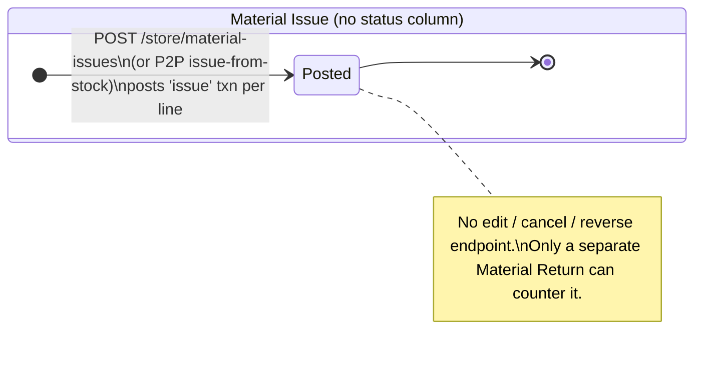
```mermaid
stateDiagram-v2
    direction LR
    state "Material Issue (no status column)" as MI {
        [*] --> Posted: POST /store/material-issues\n(or P2P issue-from-stock)\nposts 'issue' txn per line
        Posted --> [*]
        note right of Posted: No edit / cancel / reverse endpoint.\nOnly a separate Material Return can counter it.
    }
```

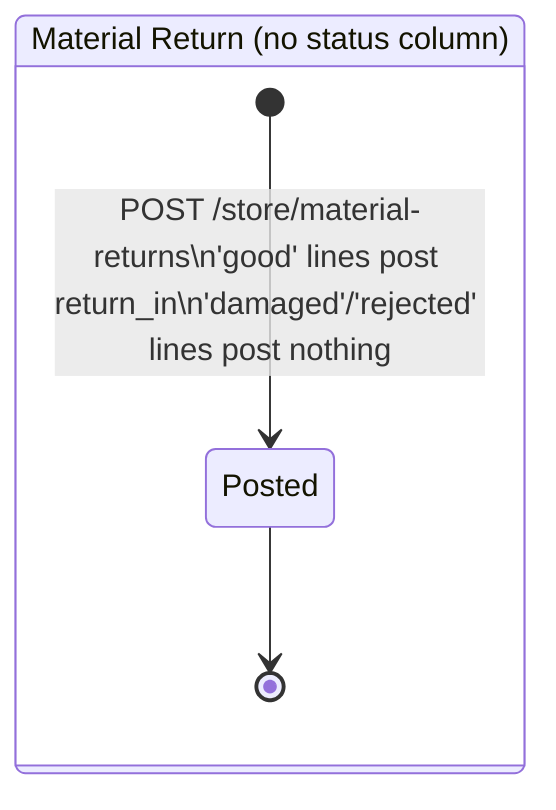
```mermaid
stateDiagram-v2
    direction LR
    state "Material Return (no status column)" as MR {
        [*] --> Posted: POST /store/material-returns\n'good' lines post return_in\n'damaged'/'rejected' lines post nothing
        Posted --> [*]
    }
```

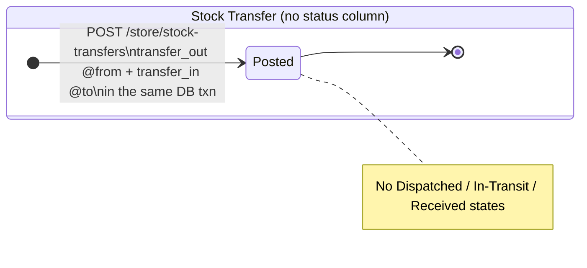
```mermaid
stateDiagram-v2
    direction LR
    state "Stock Transfer (no status column)" as ST {
        [*] --> Posted: POST /store/stock-transfers\ntransfer_out @from + transfer_in @to\nin the same DB txn
        Posted --> [*]
        note right of Posted: No Dispatched / In-Transit / Received states
    }
```

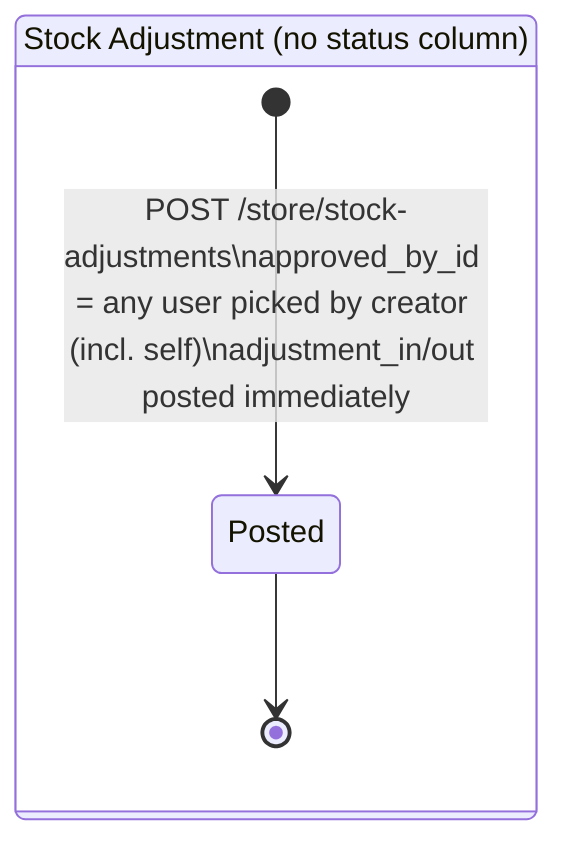
```mermaid
stateDiagram-v2
    direction LR
    state "Stock Adjustment (no status column)" as SA {
        [*] --> Posted: POST /store/stock-adjustments\napproved_by_id = any user picked by creator (incl. self)\nadjustment_in/out posted immediately
        Posted --> [*]
    }
```

```mermaid
stateDiagram-v2
    direction LR
    [*] --> active: POST /store/stock-reservations\nreserved_qty += qty
    active --> fulfilled: POST /{id}/fulfill\nreserved_qty -= qty (no issue required)
    active --> cancelled: POST /{id}/cancel\nreserved_qty -= qty
    fulfilled --> [*]
    cancelled --> [*]
    note right of active: required_date is informational only - no expiry job\n(main.py:329-350 schedules only CRM + PO reminders)
```

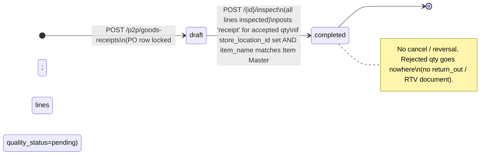
```mermaid
stateDiagram-v2
    direction LR
    [*] --> draft: POST /p2p/goods-receipts\n(PO row locked; lines quality_status=pending)
    draft --> completed: POST /{id}/inspect\n(all lines inspected)\nposts 'receipt' for accepted qty\nif store_location_id set AND item_name matches Item Master
    completed --> [*]
    note right of completed: No cancel / reversal. Rejected qty goes nowhere\n(no return_out / RTV document).
```

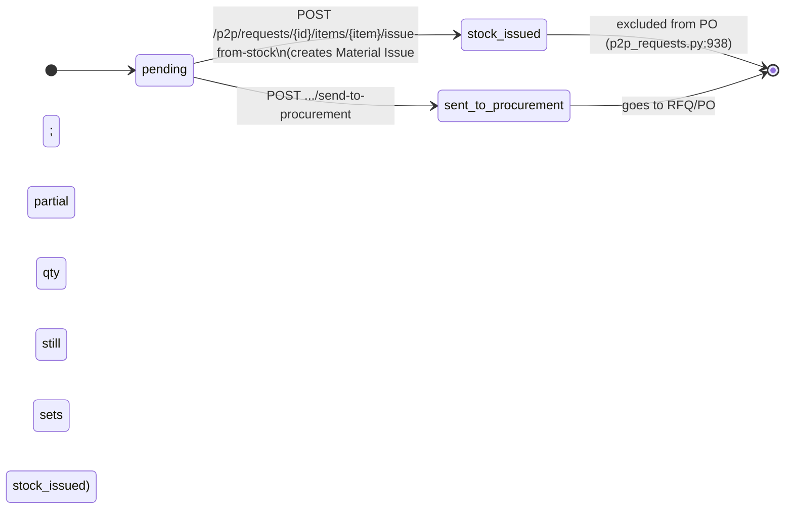
```mermaid
stateDiagram-v2
    direction LR
    [*] --> pending
    pending --> stock_issued: POST /p2p/requests/{id}/items/{item}/issue-from-stock\n(creates Material Issue; partial qty still sets stock_issued)
    pending --> sent_to_procurement: POST .../send-to-procurement
    stock_issued --> [*]: excluded from PO (p2p_requests.py:938)
    sent_to_procurement --> [*]: goes to RFQ/PO
```

---

### 2. Material flow (as coded)

```mermaid
flowchart LR
    subgraph Vendor
        V[Vendor delivery]
    end

    subgraph Buyer["Buyer / Purchase team ('purchase' app)"]
        PO[PO issued + PR po_approved]
        GRNc["Create GRN (draft)<br/>POST /p2p/goods-receipts"]
        SC["Stock check on PR item<br/>GET .../stock-check"]
        IFS["Issue from stock<br/>POST .../issue-from-stock"]
        STP["Send to procurement"]
    end

    subgraph QA["QA / Inspector (same 'purchase' app - no separate role)"]
        INS["Inspect GRN<br/>POST /p2p/goods-receipts/{id}/inspect"]
    end

    subgraph Store["Store keeper ('store' app - all actions)"]
        LOC[(store_stock_balances<br/>per item x location)]
        LED[(store_stock_transactions)]
        MAN["Manual stock entry<br/>POST /store/stock/transactions<br/>receipt/issue/adj_in/adj_out/damage"]
        MI["Material Issue<br/>POST /store/material-issues"]
        MR["Material Return<br/>POST /store/material-returns"]
        TR["Stock Transfer<br/>POST /store/stock-transfers"]
        RES["Reservation create/fulfil/cancel<br/>/store/stock-reservations"]
    end

    subgraph Approver["Store manager / approver"]
        APR["Named as approved_by_id only<br/>(never acts in system)"]
        ADJ["Stock Adjustment<br/>POST /store/stock-adjustments"]
    end

    subgraph Dept["Requester / Department"]
        REQ[Raises PR]
        USE[Consumes material]
        RET[Hands back surplus]
    end

    V --> GRNc
    PO --> GRNc --> INS
    INS -- "accepted qty, name-matched item,<br/>store_location_id set → receipt (+on_hand)" --> LOC
    INS -. "no location / no name match →<br/>note in response only, NO stock" .-> MAN
    INS -. "rejected qty → nowhere" .-> V

    REQ --> SC --> IFS
    SC --> STP --> PO
    IFS -- "issue (-on_hand), MI row,<br/>ref=PR number" --> LOC
    IFS -- notify requester --> USE

    MI -- "issue (-on_hand, reservation-aware)" --> LOC
    MI --> USE
    RET --> MR
    MR -- "good: return_in (+on_hand)<br/>damaged/rejected: nothing" --> LOC
    TR -- "transfer_out @A / transfer_in @B<br/>same instant" --> LOC
    MAN -- "any +/- (receipt uncapped)" --> LOC
    APR -. "picked from user directory" .-> ADJ
    ADJ -- "adjustment_in/out = count - on_hand" --> LOC
    RES -- "reserved_qty +/- (no ledger row)" --> LOC
    LOC --- LED
```

---

### 3. Step tables per flow

Legend: "Balance Δ" is the change to `store_stock_balances` for (item, location). "Audit" means an `audit_logs` row. **No Store route writes audit logs or notifications**: grepping `modules/store` for `AuditLog`, `log_audit` and `notify_user` finds nothing. `notify_user` (BE `utils/notifications.py:113-133`) creates an in-app notification plus a Teams message and sends no email.

#### 3.1 Master setup

| # | Step | Actor | Screen (FE) | API (BE file:line) | DB write | Status change | Notification | Audit |
|---|---|---|---|---|---|---|---|---|
| 1 | Create category/subcategory | Store user | `app/dashboard/store/categories/page.tsx` | POST `/store/categories` `modules/store/routes/categories.py:31` | `store_item_categories` | – | none | none |
| 2 | Create warehouse (location) | Store user | `app/dashboard/store/locations/page.tsx` | POST `/store/locations` `routes/locations.py:137` | `store_locations` | – | none | none |
| 3 | Create rack/shelf/bin | Store user | `app/dashboard/store/locations/page.tsx` (bins panel) | POST `/store/bins` `routes/bins.py:29` | `store_bins` | – | none | none |
| 4 | Create item | Store user | `app/dashboard/store/new/page.tsx` | POST `/store/items` `routes/items.py:56` | `store_items` (min/max/reorder/cost as typed) | `status` default `active` | none | none |
| 5 | Edit item (including `moving_average_cost` and `status`) | Store user | `app/dashboard/store/[id]/page.tsx` | PATCH `/store/items/{id}` `routes/items.py:71` | `store_items` any field | free | none | none |
| 6 | Delete item / location / bin / category | Store user | same pages | DELETE `items.py:88`, `locations.py:169`, `bins.py:61`, `categories.py:63` | hard `DELETE` | – | none | none |

#### 3.2 Stock in: GRN (P2P) → receipt

| # | Step | Actor | Screen (FE) | API (BE file:line) | DB write / Balance Δ | Status change | Notification | Audit |
|---|---|---|---|---|---|---|---|---|
| 1 | List POs pending receipt | Buyer / store (needs `purchase` app) | `app/dashboard/store/grn/new/page.tsx:50` | GET `/p2p/goods-receipts/pending-purchase-orders` `p2p/routes/goods_receipts.py:182` | – | – | – | – |
| 2 | Record GRN (lines + optional `store_location_id`) | Buyer / store | `store/grn/new/page.tsx:76` | POST `/p2p/goods-receipts` `goods_receipts.py:220` (PO `FOR UPDATE` :233-235; over-receipt cap :250-277) | `p2p_goods_receipts` (draft), `p2p_goods_receipt_items` (quality `pending`). Balance Δ 0 | GRN → `draft` (:285) | in-app + Teams to PO creator (:309-314) | `audit_logs` entity `p2p_request` "grn_recorded" (:306) |
| 3 | Quality inspection per line | "QA" (any `purchase` user, including the receiver) | `app/dashboard/store/grn/[id]/page.tsx:108` | POST `/p2p/goods-receipts/{id}/inspect` `goods_receipts.py:321` (GRN **not** locked, :332) | GRN items accepted/rejected; `p2p_purchase_orders.status`, `p2p_requests.receipt_status/status` (:369 → `_sync_po_and_pr_status` :103-158) | GRN → `completed` (:364); PO → `partially_fulfilled`/`fulfilled`; PR → `partially_received`/`received` | none | "grn_inspected" (:373). PR status audit (:153-158) |
| 4 | Stock posting of accepted qty | system | – | `_sync_stock_for_grn` `goods_receipts.py:51-78` → `post_stock_transaction` (:71) | `store_stock_transactions` `receipt`, ref `grn`/GRN no. Balance Δ **+accepted** at `grn.store_location_id` | – | none. Unposted lines are returned only as `stock_sync_notes` in the response (:370, :379), shown once at `store/grn/[id]/page.tsx:109` | none for the stock posting |
| 4a | Line not posted (no location / no exact `item_name` match) | system → Store keeper | same | :60-61, :66-69 | nothing; the GRN still completes | – | none (the note is not saved) | none |

#### 3.3 Stock in/out: manual stock entry

| # | Step | Actor | Screen | API | DB write / Balance Δ | Status | Notif | Audit |
|---|---|---|---|---|---|---|---|---|
| 1 | Post manual txn (`receipt, issue, adjustment_in, adjustment_out, damage`) with free `reference_number`, `transaction_date`, `bin_id` | any `store` user | `app/dashboard/store/stock/page.tsx:102` (types :13-19) | POST `/store/stock/transactions` `routes/stock.py:91` (allow-list :25, post :107) | ledger row, ref `manual` by default. Balance Δ ±qty (outbound checked: issue is reservation-aware, the rest only check `on_hand`) | – | none | none |
| 2 | View balances / ledger | Store | `store/stock/page.tsx:57-58` | GET `/store/stock/balances` `stock.py:42`; GET `/store/stock/transactions` `stock.py:72` (limit 500, :87) | – | – | – | – |

#### 3.4 Material issue

| # | Step | Actor | Screen | API | DB write / Balance Δ | Status | Notif | Audit |
|---|---|---|---|---|---|---|---|---|
| 1a | Standalone issue (location, dept, requested_by, lines, issue_date) | Store keeper | `app/dashboard/store/issues/new/page.tsx` | POST `/store/material-issues` `routes/material_issues.py:69` (number :87, post :105, commit :115) | `store_material_issues`, `store_material_issue_items`; ledger `issue` ref MI no. Balance Δ **−qty** (fails if `on_hand − reserved < qty`) | none (posted) | none | none |
| 1b | PR path: stock check | Buyer | `app/dashboard/p2p/[id]/page.tsx:174-189` | GET `/p2p/requests/{id}/items/{item}/stock-check` `p2p/routes/p2p_requests.py:723` | – | – | – | – |
| 1c | PR path: issue from stock (only from the ship-to location the UI recognises, `p2p/[id]/page.tsx:544-562`) | Buyer (`purchase` app, **not** store) | `p2p/[id]/page.tsx:191-195` | POST `/p2p/requests/{id}/items/{item}/issue-from-stock` `p2p_requests.py:770` (PR item `FOR UPDATE` :786-788) | `store_material_issues` (+`p2p_request_id`, no `department_id`) :805-816; issue item :817; ledger `issue` **ref_type `p2p_request`, ref_no = PR number** :820-825; `p2p_request_items.issued_from_location_id/issued_qty/material_issue_id` :829-832. Balance Δ −qty | PR item → `stock_issued` (:829) even when partial | in-app + Teams to requester (:838-843) | "item_issued_from_stock" on the PR (:834) |

#### 3.5 Material return

| # | Step | Actor | Screen | API | DB write / Balance Δ | Status | Notif | Audit |
|---|---|---|---|---|---|---|---|---|
| 1 | Return against an issue (`source_type=issue` + `source_issue_id`) | Store keeper for a dept | `app/dashboard/store/returns/new/page.tsx:69-70` | POST `/store/material-returns` `routes/material_returns.py:69`; cap check :98-127 (no lock, per line) | `store_material_returns`, items; `good` → ledger `return_in` (:152-158). Balance Δ **+good qty** at **any** `location_id` in the payload | none | none | none |
| 2 | Return without a source (`other`, or `issue` with no id) | Store keeper | same | same; cap skipped (:98) | same, **uncapped** | none | none | none |

#### 3.6 Stock transfer

| # | Step | Actor | Screen | API | DB write / Balance Δ | Status | Notif | Audit |
|---|---|---|---|---|---|---|---|---|
| 1 | Transfer A→B | Store keeper | `app/dashboard/store/transfers/new/page.tsx` | POST `/store/stock-transfers` `routes/stock_transfers.py:64` (post :104-115) | `store_stock_transfers`, items; ledger `transfer_out` @A and `transfer_in` @B. Balance Δ A −qty (reservation-aware), B +qty, both at once | none | none (not even to B's `manager_user_id`) | none |

#### 3.7 Stock adjustment

| # | Step | Actor | Screen | API | DB write / Balance Δ | Status | Notif | Audit |
|---|---|---|---|---|---|---|---|---|
| 1 | Enter physical count per item + pick "Approved By" from the user directory | Store keeper | `app/dashboard/store/adjustments/new/page.tsx:39,78,122-126` | POST `/store/stock-adjustments` `routes/stock_adjustments.py:63`; approver existence check only (:73); balance locked before reading (:102) | `store_stock_adjustments` (`approved_by_id`, `created_by_id`), items (existing/actual/difference); ledger `adjustment_in`/`adjustment_out`. Balance Δ = actual − on_hand (not reservation-aware) | none (posted) | none, and the named approver is **not told** | none |

#### 3.8 Stock reservation

| # | Step | Actor | Screen | API | DB write / Balance Δ | Status | Notif | Audit |
|---|---|---|---|---|---|---|---|---|
| 1 | Reserve qty (project / production order / required date) | Store user | `app/dashboard/store/reservations/page.tsx:82` | POST `/store/stock-reservations` `routes/stock_reservations.py:62` (`adjust_reserved_qty` :76 → `stock_ledger.py:101-117`) | `store_stock_reservations`. **reserved_qty +qty**, on_hand unchanged, no ledger row | → `active` (:90) | none | none |
| 2 | Issue the reserved material | Store keeper | `store/issues/new/page.tsx` | POST `/store/material-issues` | fails while reserved stock blocks `available` (`stock_ledger.py:70-76`); the issue has no reservation link | – | – | – |
| 3 | Fulfil (only releases the earmark) | any store user | `reservations/page.tsx:104` | POST `/{id}/fulfill` `stock_reservations.py:125` → `_release_reservation` :99-110 (reservation not locked) | reserved_qty −qty | `active` → `fulfilled` (:107) | none | none |
| 4 | Cancel | any store user | `reservations/page.tsx:103` | POST `/{id}/cancel` `stock_reservations.py:113` | reserved_qty −qty | `active` → `cancelled` | none | none |
| 5 | Expiry | – | – | **none** (scheduler `main.py:329-350` runs only followup and PO-overdue jobs) | – | – | – | – |

#### 3.9 Reorder / min-stock alerts

| # | Step | Actor | Screen | API | DB | Status | Notif | Audit |
|---|---|---|---|---|---|---|---|---|
| 1 | Maintain `minimum_stock`, `maximum_stock`, `reorder_level`, `safety_stock`, `reorder_quantity` | Store user | `store/new/page.tsx:80-82`, `store/[id]/page.tsx:97-99,260-266` | POST/PATCH `/store/items` | `store_items` | – | – | – |
| 2 | Alert / low-stock report / auto-PR | – | **none**. The items list only shows min/max as text (`store/page.tsx:112`) | **none** (grep shows no BE use of `reorder_level` or `minimum_stock` outside the model and schema) | – | – | – | – |

---

### 4. Gaps

Tags: [BA] business-process gap, [ARCH] design or technical, [SEC] control or segregation, [USER] usability.

#### A. Concurrency, integrity and data correctness

- **P2-STO-1 [ARCH][SEC] GRN inspection can be double-posted.** `inspect_goods_receipt` loads the GRN without `FOR UPDATE` (`p2p/routes/goods_receipts.py:332`, via `_get_grn_or_404` :38-44) and checks `status == "completed"` (:333). Two concurrent or double-clicked inspect calls both pass the check, and both run `_sync_stock_for_grn` (:370), so two `receipt` rows are posted and stock is inflated. The balance lock only serialises them; it does not stop the second one. Fix: lock the GRN row, or use a conditional `UPDATE ... WHERE status='draft'`.
- **P2-STO-2 [ARCH] Reservation release can happen twice.** `_release_reservation` checks `reservation.status != "active"` on a row read without a lock (`routes/stock_reservations.py:100,119,135`). Concurrent cancel+fulfil or cancel+cancel calls both release `reserved_qty`, which then understates reserved stock and lets other reservations' stock be issued. The guard at `stock_ledger.py:110-111` catches this only when no other reservation exists.
- **P2-STO-3 [ARCH] First-posting race returns a 500.** `_get_or_create_balance` (`services/stock_ledger.py:33-41`) runs `SELECT ... FOR UPDATE` and then `INSERT` when the row is missing. Two concurrent first postings for a new (item, location) hit the unique constraint (`models/stock_balance.py:15`). The resulting `IntegrityError` is not caught (routes only catch `ValueError`, e.g. `material_issues.py:111`), so the user sees a 500 with no real reason, which breaks the "real error messages" rule. Fix: `INSERT ... ON CONFLICT DO NOTHING` and then re-select `FOR UPDATE`.
- **P2-STO-4 [ARCH] No DB constraint on negative stock or reserved > on_hand.** Migration `alembic/versions/101e320829cb_add_store_stock_ledger.py:27-31` adds no `CHECK`. The invariant depends entirely on Python. Adjustments and `damage` are deliberately allowed to leave `reserved_qty > on_hand_qty` (`stock_ledger.py:12-19`), after which `available` is negative (`routes/stock.py:66`).
- **P2-STO-5 [ARCH] Quantities are `Float`, not `Numeric`.** See `models/stock_balance.py:21-22`, `models/stock_transaction.py:41` and every line table. The running balance builds up binary rounding drift, which the code works around with `1e-9` epsilons (`stock_ledger.py:72,78,110,112`).
- **P2-STO-6 [BA][ARCH] No inventory valuation.** The ledger has no `unit_cost`/`value` (`models/stock_transaction.py:32-49`). The GRN posts quantity only (`goods_receipts.py:71-75`) even though PO line prices exist (`p2p_requests.py:949`). `moving_average_cost` is never computed and can be edited by hand (`schemas/item.py:65`, `routes/items.py:81-82`). There is no stock value report and no COGS/issue valuation.
- **P2-STO-7 [ARCH] Ledger and balance can drift outside the helper.** The docstring says `post_stock_transaction` is "the only way `store_stock_balances` should ever be mutated" (`stock_ledger.py:59-62`), but nothing enforces it: no trigger, no reconciliation job, no rebuild endpoint. There is no periodic ledger-vs-balance check.
- **P2-STO-8 [ARCH] Serialisation bottleneck, plus the number year comes from `date.today()`.** The advisory lock on `MI-{year}-` (`service.py:15-23`) is held until commit, so every Material Issue in the company, standalone or from P2P (`p2p_requests.py:806`), runs one at a time. The number's year comes from the server clock, not `issue_date`, so a back-dated issue gets the current year's number.
- **P2-STO-9 [BA][ARCH] The return-against-issue cap can be bypassed.** (a) Duplicate lines for the same item in one payload are each checked against the same `already_returned` (`material_returns.py:111-127`), so issuing 10 and returning 10 + 10 on two lines passes. (b) The cap is checked before the `MR-` advisory lock (:98 vs :130) with no lock on the source issue, so concurrent returns against the same issue can both pass. (c) The return `location_id` is not checked against the issue's `location_id`, so stock can be "returned" into a warehouse it never left.
- **P2-STO-10 [BA] Returns without a source issue are uncapped (confirmed).** With `source_type="other"`, or `"issue"` with no `source_issue_id`, the cap is skipped (`material_returns.py:98`) and `good` lines post `return_in` (:152-158) for any quantity. That is an unapproved stock receipt under another name.
- **P2-STO-11 [SEC] Manual stock entry is unrestricted (confirmed).** Any `store` app user can post `receipt`, `issue`, `adjustment_in`, `adjustment_out` or `damage` with any quantity, free-text reference and any `transaction_date` (`routes/stock.py:25,91-125`). There is no approval, no reason code and no link to a source document. The code comment at :21-24 says receipt and issue "should normally be posted by their owning doc type", yet both are allowed. FE: `store/stock/page.tsx:13-19`.
- **P2-STO-12 [BA] Inactive items and locations can still be posted (confirmed).** No posting route checks `StoreItem.status` (`models/item.py:12,56`) or `StoreLocation.status/is_active` (`models/location.py:21-22`). See `material_issues.py:77-84`, `stock_transfers.py:74-84`, `stock.py:102-105`, `stock_adjustments.py:71-81`, `stock_reservations.py:70-73`, `p2p_requests.py:792-797`. `discontinued` items can be received, issued and reserved.
- **P2-STO-13 [ARCH] Back- and forward-dating are unrestricted.** `issue_date`, `return_date`, `transfer_date`, `adjustment_date` and manual `transaction_date` come from the client (`schemas/material_issue.py` `issue_date`, `schemas/stock.py:14`), and the ledger is sorted by `transaction_date` (`stock.py:87`). A back-dated row makes any historical running balance wrong. There is no period lock.
- **P2-STO-14 [ARCH] Hard deletes of masters that have history.** `DELETE /store/items/{id}` (`routes/items.py:88-99`) and `/store/locations/{id}` (`locations.py:169-183`, which checks only the branch default warehouse) run `db.delete` with no check for ledger or balance rows. With plain FKs (no `ondelete`), the FK violation comes back as an unhandled 500 (inferred). There is no soft-delete path, even though `status`/`is_active` exist.

#### B. Missing states, approvals and reversals

- **P2-STO-15 [SEC][BA] Adjustments are self-approvable and post immediately (confirmed).** `approved_by_id` is just a required field and is only checked to exist (`routes/stock_adjustments.py:73-74`). It can be the creator. The adjustment posts at once (:95-121), with no pending-approval state and no action or notification for the approver. FE picks from the whole user directory (`store/adjustments/new/page.tsx:39,126`). No value threshold applies, because there is no valuation (P2-STO-6).
- **P2-STO-16 [BA] Posted documents cannot be cancelled, voided or reversed (confirmed).** Issue, return, transfer, adjustment, manual txn and GRN have only list, get and POST endpoints (`routes/material_issues.py`, `material_returns.py`, `stock_transfers.py`, `stock_adjustments.py`, `stock.py`, `p2p/routes/goods_receipts.py:320-380`). The only way to fix a mistake is an unlinked counter-document (reverse transfer, unsourced return, manual receipt), which leaves no reversal trail.
- **P2-STO-17 [BA] Transfers are instant, with no in-transit state (confirmed).** Out and in are posted in the same transaction (`routes/stock_transfers.py:104-115`). There is no dispatch/receive split, no in-transit balance, no confirmation by the receiving warehouse and no notification to the destination `manager_user_id` (`models/location.py:16`).
- **P2-STO-18 [BA] Material issues have no request or approval step.** Standalone issues post on create (`models/material_issue.py:10-13`). There is no internal indent or material requisition document; `requested_by_id` and `department_id` are free fields and `department_id` is not validated (`material_issues.py:86-95`).
- **P2-STO-19 [BA] Reservations block the issue they are for (confirmed).** Issue is reservation-aware (`stock_ledger.py:19,70-76`), but a Material Issue has no `reservation_id`. To issue reserved stock, the user must first `fulfill` (release) the reservation (`stock_reservations.py:125-138`), which briefly makes the stock available to anyone, and `fulfill` does not need any issue to exist. Reservations are also single-item (`models/stock_reservation.py:22`).
- **P2-STO-20 [BA] Reservations never expire.** `required_date` is stored (`models/stock_reservation.py:29`) but no job reads it. The scheduler has only two jobs (`main.py:338-349`). There is no `expired` status (`stock_reservation.py:14`). Stale reservations lock stock indefinitely.
- **P2-STO-21 [ARCH] Deadlock risk between multi-line documents (inferred).** Each document type holds a different advisory lock (MI-, ST-, SA-) and then locks balance rows in payload order (`material_issues.py:100-110`, `stock_transfers.py:99-115`, `stock_adjustments.py:96-121`). An issue for [X, Y] and a transfer for [Y, X] at the same location can deadlock. Postgres aborts one of them with an `OperationalError`, which is not caught, so the user gets a 500. Fix: sort lines by (item_id, location_id) before posting.
- **P2-STO-22 [SEC] No role separation inside Store.** `store` has no sub-tabs in the permission registry (`core/permission_registry.py:67`), and every Store route uses only `require_app_access("store")` (e.g. `routes/stock_adjustments.py:67`). The same user can create items, set costs, post receipts, issue, adjust, name the approver and delete masters.

#### C. GRN → Store integration

- **P2-STO-23 [BA][ARCH] GRN stock sync fails silently and leaves orphans.** Accepted lines are matched to the Item Master by exact case-insensitive `item_name` (`goods_receipts.py:66`), because GRN and PO lines have no item FK. If there is no match, or the GRN has no `store_location_id` (optional in the schema and FE: `p2p/schemas/goods_receipt.py:37`, `store/grn/new/page.tsx:78`), nothing is posted. The GRN still becomes `completed` and the PR becomes `received` (:364-369). The only trace is `stock_sync_notes` in that one response (:379), which is not saved. The note tells the user to "adjust stock in manually", i.e. through the unrestricted manual receipt (P2-STO-11), with no link back to the GRN.
- **P2-STO-24 [BA] Rejected GRN quantity goes nowhere.** `rejected_quantity` is stored (`goods_receipts.py:356`), but there is no return-to-vendor document, no `return_out` posting (the type exists at `models/stock_transaction.py:17` but nothing posts it) and no quarantine or QC-hold stock bucket. Material waiting for inspection is not in stock at all.
- **P2-STO-25 [SEC] No segregation between receiving and inspection.** Both use `require_app_access("purchase")` (`goods_receipts.py:224,326`). The receiver can inspect and accept their own GRN. There is no QA role, and a store keeper without the `purchase` app cannot use the "GRN & Inspection" tab in the Store nav (`components/store/StoreNav.tsx:18-21`).
- **P2-STO-26 [BA] GRN location is not validated.** `store_location_id` is saved as given (`goods_receipts.py:284`) with no existence or active check. A bad id fails on the FK at commit with a 500 (inferred).

#### D. P2P issue-from-stock

- **P2-STO-27 [BA] A partial issue closes the whole PR line.** When `quantity < item.quantity`, `fulfillment_status` is still set to `stock_issued` (`p2p_requests.py:808-813,829`), and `create_po` excludes those lines (`:938`). The shortfall is never bought and there is no split into an issued part plus a procurement part.
- **P2-STO-28 [SEC] Purchase users post Store issues.** `issue-from-stock` requires only the `purchase` app (`p2p_requests.py:775`). The buyer takes stock out of a warehouse without the store keeper or the `store` app being involved.
- **P2-STO-29 [ARCH] The ledger reference is inconsistent for P2P issues.** The ledger row is written with `reference_type="p2p_request"`, `reference_number=pr.p2p_number` (`p2p_requests.py:822`), not the MI number used by standalone issues (`material_issues.py:107-108`). The ledger therefore cannot be traced back to the MI document, and `p2p_request` is not in `STORE_STOCK_TXN_REFERENCE_TYPES` (`models/stock_transaction.py:29`). The MI also leaves `department_id` empty (`p2p_requests.py:805-814`).
- **P2-STO-30 [BA] Cancelling a PR leaves its stock issues orphaned.** `cancel_p2p_request` allows cancelling an approved PR whose lines are already `stock_issued` (`p2p_requests.py:641-642`), and nothing reverses the linked Material Issue (`p2p_request_items.material_issue_id`).
- **P2-STO-31 [USER] You can only issue from the ship-to location.** The UI's Issue button only uses `check.ship_to_location`, which is resolved by an exact name/code match against `ship_to` (`p2p_requests.py:747-753`; FE `p2p/[id]/page.tsx:544-562`). Stock held in other warehouses is shown (:538) but cannot be issued.
- **P2-STO-32 [ARCH] Item matching is fuzzy.** `_match_store_item` uses `ilike(item_name)` and takes `.first()` (`p2p_requests.py:698-703`). With duplicate names it can silently pick the wrong item.

#### E. Missing inventory capabilities

- **P2-STO-33 [BA] No reorder or min-stock alerts.** `minimum_stock`, `reorder_level`, `safety_stock` and `reorder_quantity` are stored (`models/item.py:48-52`) but never read by any BE code, job or report. There is no low-stock report, notification or auto-PR. The scheduler has no inventory job (`main.py:338-349`).
- **P2-STO-34 [BA] Batch, serial and expiry control are not implemented.** The `batch_controlled`, `serial_controlled`, `expiry_controlled` and `shelf_life_days` flags (`models/item.py:43-46`) are never enforced. `batch_number` is free text on ledger rows only. Balances are per (item, location), not per batch (`models/stock_balance.py:15`), so there is no FEFO/FIFO, no expiry date field and no serial table.
- **P2-STO-35 [BA] Bins are not used for stock.** `store_bins` exist (`models/bin.py`), but only the manual txn accepts a `bin_id` (`schemas/stock.py:8`, not validated against the location in `routes/stock.py:102-105`). Balances ignore bins, and issue, transfer and GRN take no bin, so you cannot answer "what is in bin X".
- **P2-STO-36 [BA] No stock-take or cycle-count workflow.** The FE folder `app/dashboard/store/cycle-count/` is empty, as are `reports/`, `transactions/`, `warehouses/`, `stock-items/`, `item-master/{[id],new}` and `items/new`, which look like leftovers from an earlier pass. Adjustments are the only counting tool: there is no count sheet, stock freeze, blind count or variance approval, and `existing_quantity` is read when the adjustment is posted, not when counting started.
- **P2-STO-37 [BA] Damaged or rejected returns are not tracked in stock.** Those lines post nothing (`models/material_return.py:13-18`, `material_returns.py:152`). There is no scrap or quarantine bucket and no disposal document.
- **P2-STO-38 [BA] Units of measure are not converted.** `secondary_uom`/`conversion_factor` (`models/item.py:31-32`) are unused, and GRN lines carry the PO `unit` free text (`goods_receipts.py:299`) with no check against the item's `uom`.

#### F. Audit, notifications and UX

- **P2-STO-39 [SEC] No Store audit trail.** No Store route writes `audit_logs` (grep finds no AuditLog/log_audit in `modules/store`). Item edits (including cost and status), master deletes, reservation cancel/fulfil and adjustments are not audited. The ledger's `created_by_id` is the only trace of who did what, and it covers only postings. Masters use only `TimestampMixin`.
- **P2-STO-40 [USER] No Store notifications.** No `notify_user` call exists in `modules/store`. Nobody is notified when stock is received into a warehouse, a transfer arrives, a reservation is made for a project, an adjustment names someone as approver, or stock is low. The only stock-related notifications are in P2P (`goods_receipts.py:309`, `p2p_requests.py:838`), and they are in-app plus Teams with no email (`utils/notifications.py:113-133`).
- **P2-STO-41 [ARCH][USER] Lists are unpaginated with N+1 queries.** Issue, return, transfer, adjustment, reservation and item lists run `.all()` without paging and run several queries per row in `_to_response` (e.g. `material_issues.py:19-38,53-54`, `stock_reservations.py:18-28,46-47`). The ledger is capped at 500 rows with no paging (`stock.py:87`), so older history cannot be reached in the UI.
- **P2-STO-42 [ARCH] Some DB errors return a generic 500.** P2-STO-3, -14, -21 and -26 all raise non-`ValueError` exceptions that routes do not translate, which conflicts with the project's "real error messages" rule.

---

## 2.5 Quality: Inspection → NCR → Rejection → CAPA → Complaints

Scope read: `backend/app/modules/quality/**` (all models, routes, schemas, service.py), `backend/app/modules/p2p/models/goods_receipt.py`, `backend/app/modules/p2p/routes/goods_receipts.py`, `backend/app/modules/store/services/stock_ledger.py` (head), `store/models/material_return.py` (head), `core/permissions.py`, `core/permission_registry.py`, FE `frontend/src/app/dashboard/quality/**` (grep-level + full read of incoming-inspection/new), `store/grn/[id]/page.tsx` (grep), `components/quality/QualityNav.tsx`, `lib/api.ts` qualityApi.
Paths below: BE = `backend/app/modules/`, FE = `frontend/src/app/dashboard/`.

**Headline:** The Quality module is 11 independent CRUD tables. There is **no workflow engine, no transition guard, no notification, no audit log, no approval, and no integration** with P2P/Store/Accounts/CRM. GRN inspection in P2P is a **second, completely separate inspection system** that is the only one that actually affects stock.

---

### 1. Status values per entity (as coded)

| Entity | Table | Status values (file:line) | Initial value set by | Transition guard |
|---|---|---|---|---|
| Quality Standard | quality_standards | `active, draft, obsolete` — BE quality/models/quality_standard.py:8 | payload (standards.py:58,69) | none — PATCH any (standards.py:93-104) |
| Checklist | quality_checklists | `active, inactive` — quality_checklist.py:11 | model default `active` (:26) | none (checklists.py:84-90) |
| Checklist item | quality_checklist_items | — (no status) | — | — |
| Inspection Plan | quality_inspection_plans | `active, inactive` — inspection_plan.py:12; types `incoming, in_process, final` :10 | model default `active` (:30) | none (inspection_plans.py:105-116) |
| Inspection | quality_inspections | `pending, in_progress, passed, failed, conditionally_passed` — inspection.py:12 | **forced `pending`** (routes/inspections.py:100); FE-sent `status` silently dropped (schema has no status: schemas/inspection.py:36-51) | none — PATCH any (inspections.py:138-147) |
| Inspection result | quality_inspection_results | `pass, fail, na` — inspection.py:13 (nullable) | payload; FE default `na` (incoming-inspection/new/page.tsx:16) | replaced wholesale on PATCH (inspections.py:149-169) |
| Inspection attachment | quality_inspection_attachments | — | **no endpoint writes it** | — |
| NCR | quality_ncrs | `open, under_review, capa_assigned, closed, rejected, cancelled` — ncr.py:10; sources `inspection, complaint, internal` :8; severity `minor, major, critical` :9 | `open` (routes/ncr.py:90) | none (ncr.py:119-132); `closed_at` stamped on first close only (:128-129) |
| Rejection | quality_rejections | `open, in_progress, closed` — rejection.py:9; disposition `return_to_vendor, scrap, rework, use_as_is` :8 | `open` (rejections.py:80) | none (rejections.py:106-119) |
| CAPA | quality_capas | `open, in_progress, pending_verification, closed, overdue` — capa.py:9; action_type `corrective, preventive` :8 | `open` (routes/capa.py:78) | none (capa.py:104-115); `closed_at` first close only (:111-112) |
| Customer Complaint | quality_customer_complaints | `open, under_investigation, capa_assigned, resolved, closed, rejected` — customer_complaint.py:9; severity :8 | `open` (complaints.py:87) | none (complaints.py:113-121); `closed_at` first close (:117-118) |
| Supplier Scorecard | quality_supplier_scorecards | `draft, final` — supplier_quality.py:7 | payload, default draft (supplier_quality routes :63,74) | none — `final` still fully editable/deletable (:90-116) |
| Quality Document | quality_documents | no status; soft-delete only (quality_document.py:10, documents.py:130-131) | — | — |
| *(P2P)* GRN | p2p_goods_receipts | `draft, completed` — p2p/models/goods_receipt.py:18 | `draft` (goods_receipts.py:285) | only `draft→completed` via /inspect (:333, :364) |
| *(P2P)* GRN item quality | p2p_goods_receipt_items.quality_status | `pending, passed, failed, partial` — goods_receipt.py:23 | `pending` (goods_receipts.py:302) | set once in /inspect (:343-359) |

#### State diagrams AS CODED

Every Quality entity has the same shape: POST creates in one fixed state, then **any PATCH can set any listed status** (no guard, no role check, no precondition). The diagrams show that literally with an `ANY` hub.

```mermaid
stateDiagram-v2
    direction LR
    state "Inspection (quality_inspections)" as INSP {
        [*] --> pending : POST /quality/inspections (forced, inspections.py:100)
        pending --> ANY_I
        ANY_I --> pending : PATCH status
        ANY_I --> in_progress : PATCH status
        ANY_I --> passed : PATCH status
        ANY_I --> failed : PATCH status
        ANY_I --> conditionally_passed : PATCH status
        in_progress --> ANY_I
        passed --> ANY_I
        failed --> ANY_I
        conditionally_passed --> ANY_I
        state "ANY (no guard, inspections.py:138-147)" as ANY_I
    }
    INSP --> [*] : DELETE (hard, inspections.py:176)
```

```mermaid
stateDiagram-v2
    direction LR
    state "NCR (quality_ncrs)" as NCR {
        [*] --> open : POST /quality/ncr (ncr.py:90)
        state "ANY (no guard, ncr.py:119-132)" as ANY_N
        open --> ANY_N
        under_review --> ANY_N
        capa_assigned --> ANY_N
        closed --> ANY_N : reopen allowed, closed_at kept stale
        rejected --> ANY_N
        cancelled --> ANY_N
        ANY_N --> open
        ANY_N --> under_review
        ANY_N --> capa_assigned : manual only (CAPA create never sets it)
        ANY_N --> closed : even with open CAPAs / rejections
        ANY_N --> rejected
        ANY_N --> cancelled
    }
    NCR --> [*] : DELETE (hard; 500 if CAPA/rejection references it)
```

```mermaid
stateDiagram-v2
    direction LR
    state "CAPA (quality_capas)" as CAPA {
        [*] --> open : POST /quality/capa (capa.py:78)
        state "ANY (no guard, capa.py:104-115)" as ANY_C
        open --> ANY_C
        in_progress --> ANY_C
        pending_verification --> ANY_C
        overdue --> ANY_C
        closed --> ANY_C : reopen, closed_at stale
        ANY_C --> open
        ANY_C --> in_progress
        ANY_C --> pending_verification
        ANY_C --> overdue : manual only (no scheduler)
        ANY_C --> closed : no verification required
    }
```

```mermaid
stateDiagram-v2
    direction LR
    state "Rejection" as REJ {
        [*] --> r_open : POST (rejections.py:80)
        r_open --> r_any
        r_in_progress --> r_any
        r_closed --> r_any
        r_any --> r_open
        r_any --> r_in_progress
        r_any --> r_closed : no disposition executed
        state "open" as r_open
        state "in_progress" as r_in_progress
        state "closed" as r_closed
        state "ANY (rejections.py:106-119)" as r_any
    }
    state "Complaint" as CMP {
        [*] --> c_open : POST (complaints.py:87)
        c_open --> c_any
        c_any --> c_open
        c_any --> under_investigation
        c_any --> c_capa : manual only
        c_any --> resolved
        c_any --> c_closed : even with open CAPA
        c_any --> c_rejected
        under_investigation --> c_any
        c_capa --> c_any
        resolved --> c_any
        c_closed --> c_any
        c_rejected --> c_any
        state "open" as c_open
        state "capa_assigned" as c_capa
        state "closed" as c_closed
        state "rejected" as c_rejected
        state "ANY (complaints.py:113-121)" as c_any
    }
```

```mermaid
stateDiagram-v2
    direction LR
    state "Supplier Scorecard" as SC {
        [*] --> draft : POST default
        [*] --> final : POST status=final
        draft --> final : PATCH
        final --> draft : PATCH (no lock)
    }
    state "Plan / Checklist" as PL {
        [*] --> active : POST (model default)
        active --> inactive : PATCH
        inactive --> active : PATCH
    }
    state "Standard" as ST {
        [*] --> st_any : POST payload status
        state "active | draft | obsolete (any to any)" as st_any
    }
    state "P2P GRN (the only guarded one)" as GRN {
        [*] --> grn_draft : POST /p2p/goods-receipts (goods_receipts.py:285)
        grn_draft --> completed : POST /{id}/inspect, all lines non-pending (:361-364)
        completed --> [*]
        state "draft" as grn_draft
    }
```

---

### 2. Intended business process vs. code

Solid arrow = exists in code (API/FK/side-effect actually implemented). Dashed arrow = missing (no code path, or only a manually typed raw id). Labels on dashed arrows say what's absent.

```mermaid
flowchart TB
    subgraph QAM["QA Manager"]
        STD["Standard<br/>POST /quality/standards"]
        CHK["Checklist + items<br/>POST /quality/checklists"]
        PLAN["Inspection Plan<br/>POST /quality/inspection-plans"]
        DOC["Quality Document (SharePoint)<br/>POST /quality/documents"]
        NCRREV["NCR review / disposition decision<br/>PATCH /quality/ncr/{id}"]
        CAPAVER["CAPA verification & effectiveness"]
        SC["Supplier Scorecard<br/>POST /quality/supplier-quality (manual)"]
        CLOSE["NCR / Complaint closure"]
    end
    subgraph STORE["Store / GRN"]
        GRN["GRN draft<br/>POST /p2p/goods-receipts"]
        GRNI["GRN line inspect accept/reject<br/>POST /p2p/goods-receipts/{id}/inspect"]
        STK["Stock ledger receipt (accepted qty only)"]
        QUAR["Quarantine / under-inspection stock"]
        HOLD["Hold / release"]
    end
    subgraph QAI["QA Inspector"]
        INC["Incoming inspection<br/>POST /quality/inspections type=incoming"]
        RES["Results per parameter<br/>PATCH /quality/inspections/{id}"]
        NCR["NCR<br/>POST /quality/ncr"]
        REJ["Rejection + disposition<br/>POST /quality/rejections"]
    end
    subgraph PROD["Production"]
        WO["Work order / operation"]
        IPI["In-process inspection<br/>type=in_process"]
        FIN["Final inspection<br/>type=final"]
        RWK["Rework + re-inspection"]
        DISP["Dispatch release"]
    end
    subgraph PUR["Purchase / Vendor / Finance"]
        PO["Purchase Order"]
        RTV["Return to vendor / replacement"]
        DN["Debit note"]
        INV["Vendor invoice 3-way match"]
    end
    subgraph CUST["Customer"]
        CC["Customer complaint<br/>POST /quality/complaints"]
    end
    subgraph OWN["CAPA owner"]
        CAPA["CAPA<br/>POST /quality/capa"]
        CAPAW["Root cause, action, due date<br/>PATCH /quality/capa/{id}"]
    end

    STD --> PLAN
    CHK --> PLAN
    STD -. "no FK, no link" .-> DOC
    PO --> GRN
    GRN --> GRNI
    GRNI --> STK
    GRNI --> INV
    GRN -. "no GRN id on inspection; not auto-raised" .-> INC
    PLAN -. "plan chosen but checklist items NOT copied" .-> INC
    PLAN -->|"optional FK inspection_plan_id"| INC
    INC --> RES
    RES -. "status not derived from results; no stock effect" .-> HOLD
    GRN -. "no under-inspection bucket" .-> QUAR
    QUAR -. missing .-> HOLD
    HOLD -. missing .-> STK
    RES -->|"FK inspection_id (FE lists failed only)"| NCR
    GRNI -. "GRN failures never create NCR" .-> NCR
    WO -. "no WO link; project_label free text" .-> IPI
    IPI -->|"same table"| NCR
    FIN -->|"same table"| NCR
    FIN -. "no gate" .-> DISP
    NCR -->|"FK ncr_id typed as raw number"| REJ
    RES -->|"FK inspection_id typed as raw number"| REJ
    GRNI -. "rejected qty never becomes a Rejection" .-> REJ
    REJ -. "disposition is a label only" .-> RTV
    RTV -. "no model" .-> DN
    DN -. "no model" .-> INV
    REJ -. "no rework order / re-inspection" .-> RWK
    RWK -. missing .-> FIN
    NCR --> NCRREV
    NCR -->|"FK ncr_id typed as raw number; NCR status not updated"| CAPA
    NCRREV -. "no auto CAPA for major/critical" .-> CAPA
    CC -. "no complaint_id input in CAPA form; list filter ignored" .-> CAPA
    CC -. "NCR has no complaint_id column" .-> NCR
    CAPA --> CAPAW
    CAPAW -. "free-text notes only; no verifier/sign-off" .-> CAPAVER
    CAPAVER -. "close not gated on verification" .-> CLOSE
    NCR -. "close allowed with open CAPA/Rejection" .-> CLOSE
    REJ -. "counts typed by hand" .-> SC
    NCR -. "NCR has no vendor field" .-> SC
    GRNI -. "GRN reject/on-time data unused" .-> SC
```

---

### 3. Step table

Audit column: "none" means no `AuditLog` write (grep `AuditLog|log_audit|audit` in `modules/quality` → 0 hits). Notification column: grep `notify_user|send_*email` in `modules/quality` → 0 hits.

| # | Step | Actor | Screen (FE) | API call (BE file:line) | DB write | Status change | Notification / email | Audit log |
|---|---|---|---|---|---|---|---|---|
| 1 | Define standard | QA Mgr | quality/standards/new/page.tsx | POST /quality/standards — quality/routes/standards.py:52 | quality_standards | payload status | none | none |
| 2 | Define checklist + items | QA Mgr | quality/checklists/new/page.tsx | POST /quality/checklists — checklists.py:41 | quality_checklists, quality_checklist_items | active (default) | none | none |
| 3 | Define inspection plan (item + type + checklist + standard + sampling text) | QA Mgr | quality/inspection-plans/new/page.tsx | POST /quality/inspection-plans — inspection_plans.py:58 | quality_inspection_plans (IP-YYYY-NNNN, service.py:32) | active (default) | none | none |
| 4 | Record goods receipt (draft) | Store | store/grn/new/page.tsx | POST /p2p/goods-receipts — p2p/routes/goods_receipts.py:220 (PO row-locked :233-235) | p2p_goods_receipts, p2p_goods_receipt_items (quality_status=pending :302) | GRN draft | notify PO creator "pending quality inspection" (:309-314) | yes, `grn_recorded` on p2p_request (:306) |
| 5 | GRN line inspection (accept / reject split, reason) | Store (page gated `store`, store/grn/[id]/page.tsx:41) but API needs `purchase` (goods_receipts.py:326) | store/grn/[id]/page.tsx:108 | POST /p2p/goods-receipts/{id}/inspect — goods_receipts.py:321 | GRN items accepted/rejected/quality_status; PO/PR status (:104-158); **stock receipt for accepted qty only** (:51-77, :370) | GRN draft→completed (:364); PO issued/partially_fulfilled/fulfilled; PR partially_received/received | **none** on inspect | yes, `grn_inspected` (:373) + `receipt_updated` (:154) |
| 6 | Incoming inspection (Quality module) | QA Inspector | quality/incoming-inspection/new/page.tsx:71 | POST /quality/inspections — inspections.py:68 | quality_inspections (INSP-INC-YYYY-NNNN, service.py:102), quality_inspection_results from payload only | **forced pending** (:100), FE status dropped | none | none |
| 7 | Enter results / set pass/fail | QA Inspector | quality/incoming-inspection/[id]/page.tsx:106 | PATCH /quality/inspections/{id} — inspections.py:129 | results delete+reinsert (:149-169) | any→any (:138-147) | none | none |
| 8 | In-process / final inspection | QA Inspector / Production | quality/in-process-inspection/*, quality/final-inspection/* (copies of #6/#7) | same endpoints, type in_process/final | same; project_label free text | same | none | none |
| 9 | Attach MTC / photos / report | QA Inspector | none | **no endpoint** (model inspection.py:70-82 only) | — | — | — | — |
| 10 | Raise NCR | QA Inspector | quality/ncr/new/page.tsx:58 (inspection picker lists `status=failed` only :46) | POST /quality/ncr — ncr.py:63 | quality_ncrs (NCR-YYYY-NNNN) | open (:90) | none | none |
| 11 | Review NCR / set status | QA Mgr | quality/ncr/[id]/page.tsx:102 (free status dropdown :177-182) | PATCH /quality/ncr/{id} — ncr.py:104 | quality_ncrs | any→any; closed_at on close (:128) | none | none |
| 12 | Create rejection + disposition | QA Inspector / Mgr | quality/rejections/new/page.tsx:47 (NCR ID, Inspection ID typed numbers :96-97) | POST /quality/rejections — rejections.py:54 | quality_rejections (REJ-YYYY-NNNN) | open (:80) | none | none |
| 13 | Execute disposition (RTV / scrap / rework / use-as-is) | Store / Purchase / Production | none | **none** — no ledger posting, no RTV, no debit note, no rework order | — | manual PATCH rejections.py:94 | none | none |
| 14 | Raise CAPA from NCR | QA Mgr | quality/capa/new/page.tsx:55 (NCR ID typed :105-106; no complaint field) | POST /quality/capa — capa.py:58 | quality_capas (CAPA-YYYY-NNNN) | CAPA open (:78); **NCR status not touched** | none (responsible user not told) | none |
| 15 | CAPA progress, root cause, verification notes | CAPA owner / QA Mgr | quality/capa/[id]/page.tsx:84 (free status :153-157) | PATCH /quality/capa/{id} — capa.py:92 | quality_capas | any→any; closed_at (:111) | none | none |
| 16 | Close NCR | QA Mgr | quality/ncr/[id]/page.tsx | PATCH /quality/ncr/{id} status=closed — ncr.py:128 | quality_ncrs.closed_at | closed (no check on CAPA/rejection) | none | none |
| 17 | Log customer complaint | QA / Sales | quality/complaints/new/page.tsx:49 (customer_org_id typed number :51) | POST /quality/complaints — complaints.py:66 | quality_customer_complaints (COMP-YYYY-NNNN) | open (:87) | none | none |
| 18 | Complaint → CAPA | QA Mgr | **no UI** (CAPA form has no complaint_id); complaint detail lists **all** CAPAs (complaints/[id]/page.tsx:61, filter ignored by capa.py:41-45) | POST /quality/capa with complaint_id (API only, not validated :65-72) | quality_capas.complaint_id | none on complaint | none | none |
| 19 | Close complaint | QA Mgr | quality/complaints/[id]/page.tsx:94 | PATCH /quality/complaints/{id} — complaints.py:101 | closed_at (:117) | any→any | none (customer not informed) | none |
| 20 | Supplier scorecard | QA Mgr | quality/supplier-quality/new/page.tsx:45 (vendor_id typed :90, counts typed) | POST /quality/supplier-quality — supplier_quality.py:57 | quality_supplier_scorecards | draft/final | none | none |
| 21 | Upload quality document | QA Mgr | quality/documents/page.tsx | POST /quality/documents — documents.py:36 (SharePoint) | quality_documents | — | none | none |
| 22 | Dashboard / reports | QA Mgr | quality/page.tsx, quality/reports/page.tsx (client-side aggregation of full lists :55-100) | GET /quality/dashboard — dashboard.py:21 | — | — | — | — |

---

### 4. Gaps

#### Integration (GRN ↔ Quality ↔ Store ↔ Finance)

- **P2-QA-1 [ARCH][BA] Two inspection systems with no link between them.** P2P GRN has its own line-level accept/reject (p2p/models/goods_receipt.py:49-50, 78-82; routes goods_receipts.py:321-380). Quality has `quality_inspections` (quality/models/inspection.py:16-49) with no `grn_id`, `grn_item_id`, `po_id` or `po_item_id` column. It only has `p2p_request_id` (:37), and no FE page ever sends it (grep of `p2p_request_id` in FE quality returns 0). Completing a GRN never creates a Quality inspection, and a Quality inspection result never updates the GRN or stock. The Quality incoming-inspection screen is effectively a paper record.
- **P2-QA-2 [SEC][USER] The wrong module gates GRN inspection.** `/inspect` requires `purchase` access (goods_receipts.py:326; all GRN routes :167,185,215,224). The FE page lives under Store and checks `store` (store/grn/[id]/page.tsx:41). A Store-only user sees the page but gets a 403. A QA inspector with only `quality` access can't do the one inspection that matters.
- **P2-QA-3 [BA] Stock is released when the GRN is inspected, with no hold or quarantine.** Accepted qty posts straight to on-hand stock (goods_receipts.py:63-76, :370). Draft-GRN goods sit in no ledger bucket. Rejected qty is posted nowhere and simply drops out. Store has no rejected/quarantine bucket (store/models/material_return.py:13-18 says so). There is no "under inspection", "on hold", or "released by QA" state anywhere.
- **P2-QA-4 [BA] Rejection disposition is only a label.** `return_to_vendor/scrap/rework/use_as_is` (rejection.py:8) triggers nothing:
  - no `return_out`/`damage` stock posting (stock_ledger.py:10-11 types exist but are unused here);
  - no debit note (no model anywhere in `backend/app`);
  - no replacement-delivery tracking against the PO;
  - no rework order or re-inspection;
  - `use_as_is` needs no concession or deviation approval.

  Finance's 3-way match uses GRN accepted qty (accounts/models/vendor_invoice.py:15), so a Quality-module rejection has no effect on payables at all.
- **P2-QA-5 [BA] Vendors are free text even though a vendor master exists.** `vendor_id` has no FK on inspection (inspection.py:33), rejection (rejection.py:27) or scorecard (supplier_quality.py:17), even though `vendors` exists (accounts/models/vendor.py:18). The comment "vendors aren't a first-class table yet" (inspection.py:34-35, rejection.py:28-29) is out of date. The FE never sends vendor_id for inspections and types it as a raw number for scorecards (supplier-quality/new/page.tsx:90).
- **P2-QA-6 [BA] Supplier scorecards are entered by hand.** `rejection_count`, `ncr_count`, `quality_score` and `on_time_delivery_score` are typed in (supplier_quality.py:66-77). They can't be computed: NCRs have no vendor field (ncr.py:13-32), rejections match only on vendor_name text, and GRN reject qty and PO dates are never read. Nothing stops duplicate scorecards for the same vendor and period, and a `final` scorecard can still be edited or deleted (:90-116).
- **P2-QA-7 [ARCH] In-process and final inspections are not linked to production or dispatch.** `project_label` is free text (inspection.py:38). There is no work order, operation or serial number. A final-inspection pass doesn't gate dispatch or delivery, and a fail doesn't block it (inferred: no dispatch module reference in quality).

#### Workflow / state

- **P2-QA-8 [BA] No transition guards on any Quality entity.** Every status can be PATCHed to any other: inspection (inspections.py:138-147), NCR (ncr.py:119-132), CAPA (capa.py:104-115), rejection (rejections.py:106-119), complaint (complaints.py:113-121), scorecard (supplier_quality.py:99-104). The FE shows plain dropdowns with every status (ncr/[id]/page.tsx:177-182, capa/[id]/page.tsx:153-157, rejections/[id]/page.tsx:165-167, complaints/[id]/page.tsx:177-182).
- **P2-QA-9 [BA] Closures aren't gated on anything.**
  - An NCR can close with open CAPAs or rejections (ncr.py:128-132).
  - A complaint can close with an open CAPA (complaints.py:117-121).
  - A CAPA can close without verification notes or an effectiveness check (capa.py:111-115).
  - Reopening leaves a stale `closed_at`, because it is only set when null and never cleared (ncr.py:128, capa.py:111, complaints.py:117).
- **P2-QA-10 [BA] Creating an inspection forces status to `pending`, and results don't drive status.**
  - The FE offers a status dropdown and sends `status` (incoming-inspection/new/page.tsx:45, 82, 164-170).
  - `QualityInspectionCreate` has no `status` field (schemas/inspection.py:36-51), so the value is silently dropped, and `inspections.py:100` hard-codes `pending`.
  - Status is never derived from results: an inspection with `fail` rows can be marked `passed`.
  - There's no check that `accepted + rejected <= inspected` (inspections.py:83-101). GRN does check this (goods_receipts.py:350).
- **P2-QA-11 [BA] Plans don't seed checklist items.** The checklist docstring says items "are copied onto a QualityInspection's results when an inspection is raised against a plan" (quality_checklist.py:16-18). Create only inserts `payload.results` (inspections.py:105-116), and the FE plan picker doesn't load the checklist (incoming-inspection/new/page.tsx:150-156). So the inspector retypes parameters, which defeats plans and checklists. The plan isn't picked automatically by item code either. `sampling_plan` is free text (inspection_plan.py:29), with no AQL or sample-size logic.
- **P2-QA-12 [BA] Nothing is automated between NCR and CAPA.** Creating a CAPA doesn't set NCR→`capa_assigned` (capa.py:58-83). A critical or major NCR doesn't require a CAPA. The dashboard (dashboard.py:26) and NCR list treat `capa_assigned` as meaningful, but it is only ever set by hand.
- **P2-QA-13 [BA][USER] The complaint → CAPA / NCR chain is broken.**
  - The CAPA create form has no complaint field (capa/new/page.tsx:55-63).
  - `list_capas` ignores `complaint_id` (capa.py:41-45), so the complaint detail page (complaints/[id]/page.tsx:61) shows **every CAPA in the system**.
  - `complaint_id` isn't validated on create (capa.py:65-72), so a bad id is an FK IntegrityError, which surfaces as a 500.
  - NCR has `source='complaint'` (ncr.py:8) but no `complaint_id` column.
- **P2-QA-14 [BA] There's no rework path or re-inspection loop.** Rework isn't linked to a new inspection; a re-inspection can't reference the original; no inspection "revision" exists.
- **P2-QA-15 [ARCH] "Overdue" has two sources of truth.** It's a manual CAPA status (capa.py:9, FE capa/[id]/page.tsx:157), but the dashboard computes overdue from `due_date` (dashboard.py:35-39). No scheduler sets it.
- **P2-QA-16 [USER] The NCR inspection picker lists only `status=failed` inspections** (ncr/new/page.tsx:46, ncr/[id]/page.tsx:66). Since create forces `pending` (P2-QA-10), the user must edit the inspection before they can raise an NCR. `conditionally_passed` inspections and GRN failures can't be linked. The inspection detail page has no "Raise NCR" action. NCRs have no quantity, batch, vendor or containment field (ncr.py:13-32).

#### Approval / accountability / audit

- **P2-QA-17 [SEC][BA] The Quality module has no audit trail.** grep for `AuditLog`/`log_audit` in `modules/quality` returns 0. PATCH handlers don't even take the current user (e.g. inspections.py:130-134, ncr.py:105-109, capa.py:93-97), so there's no `updated_by`. Status changes, result edits and closures leave no history. ISO 9001 §7.5.3 and ISO 22163 require retained quality records.
- **P2-QA-18 [SEC] Hard deletes on quality records.** DELETE removes rows for inspections (inspections.py:176-181, results/attachments cascade model :44-49), NCR (ncr.py:139-144), CAPA (capa.py:122-127), rejection (rejections.py:126-131), complaint (complaints.py:128-133), standard (standards.py:110-115), checklist (checklists.py:112-117) and plan (inspection_plans.py:123-128). Any Quality user can delete. Only documents are soft-deleted and restricted to uploader/admin (documents.py:121-131).
- **P2-QA-19 [SEC] Authorization is app-level only.** Every router uses just `require_app_access("quality")` (e.g. inspections.py:16-19). `require_tab_access` exists (core/permissions.py:36-48) but no Quality route uses it, so the sub-tab matrix (permission_registry.py:69-86) is enforced only in the FE nav (QualityNav.tsx:65). There's no separation between inspector, QA manager and CAPA owner: an inspector can pass their own inspection, close NCRs, and verify their own CAPA.
- **P2-QA-20 [BA] No sign-off or approval step.**
  - `inspected_by_id` is always the record creator (inspections.py:97), so the actual inspector can't be recorded.
  - There are no `approved_by`, `verified_by`, `closed_by` or `effectiveness_checked_on` fields on NCR or CAPA (capa.py:12-32, ncr.py:13-32).
  - `verification_notes` is plain text.
  - Rejections have no `created_by` at all (rejection.py:12-32; create takes no user, rejections.py:55-58).
- **P2-QA-21 [BA] No notifications or email at all.** grep `notify_user|send_*email` in `modules/quality` returns 0.
  - The CAPA responsible user is never told they own a CAPA.
  - Nobody is alerted to overdue CAPAs or escalated on critical NCRs.
  - Vendors aren't told about rejections, and customers aren't told when a complaint is resolved.
  - The GRN `/inspect` step sends none either (goods_receipts.py:321-380; only create notifies, :309).
  - The Quality nav has a bell (QualityNav.tsx:101), but no Quality event ever feeds it.

#### Data integrity / races / errors

- **P2-QA-22 [ARCH] Double-submitting GRN inspect posts stock twice.** `_get_grn_or_404` takes no row lock (goods_receipts.py:38-44). The `status == "completed"` check (:333) races, so two concurrent `/inspect` calls both post `receipt` stock (:370) and both write audit rows. By contrast, GRN create locks the PO (:233-235).
- **P2-QA-23 [ARCH] The number series breaks after 9999 per year.** The advisory lock is correct (service.py:16-29). But the next number comes from `MAX()` over a **string** (service.py:37-43, 51-57, 65-71, 79-85, 93-99, 108-114). After `...-9999`, `"...-10000" < "...-9999"` in string order, so MAX keeps returning 9999 and the next insert hits a unique violation. Low risk for NCR/CAPA; plausible for INSP-INC on a busy receiving dock. Separately, concurrent PATCHes are last-write-wins with no version column, and results replace-all (inspections.py:149-169) drops a concurrent inspector's rows.
- **P2-QA-24 [ARCH][USER] FK violations surface as generic 500s.** The Quality migrations (alembic/versions/1da47fa70f0e_add_quality_module_phase1.py, 1224c89b0740_add_quality_module_phase2.py) have no `ondelete`, and there's no IntegrityError handler (main.py). These all raise an unhandled IntegrityError:
  - deleting an inspection referenced by an NCR or rejection;
  - deleting an NCR referenced by a CAPA or rejection;
  - deleting a checklist or standard used by a plan or document;
  - deleting a complaint referenced by a CAPA;
  - an unvalidated `complaint_id` (capa.py:72), `responsible_user_id` (:76) or `linked_standard_id` (documents.py:64).

  That breaks the "real error messages" rule.
- **P2-QA-25 [USER] Inspection attachments have no endpoint.** The model and response schema exist (inspection.py:70-82, schemas/inspection.py:26-33, 97), but nothing uploads, downloads or deletes an attachment. So MTCs, test reports and photos can't go on an inspection.
- **P2-QA-26 [USER] The CAPA form doesn't mark "Action Plan" as required** (capa/new/page.tsx:131, sends `undefined` at :60). The BE requires it (schemas/capa.py `action_plan: str`, model nullable=False capa.py:27), so the user gets a 422.
- **P2-QA-27 [USER] Links are typed as raw IDs.** NCR ID on CAPA (capa/new/page.tsx:105-106, capa/[id]:86), NCR ID and Inspection ID on rejections (rejections/new/page.tsx:96-97), and customer_org_id on complaints (complaints/new/page.tsx:51) are all typed as numbers. Rejections don't even show the inspection number (rejections.py:23-29 fills only ncr_number). Complaint `customer_org_id` is a plain int with no FK to CRM (customer_complaint.py:23-25).
- **P2-QA-28 [ARCH] Quality documents have no document control.**
  - `version` is free text (quality_document.py:20).
  - There's no approval, effective date, review-due date, superseded link or controlled-copy distribution.
  - `linked_standard_id` isn't validated (documents.py:41, 64).
  - SharePoint delete failures are swallowed (documents.py:125-128), which leaves orphaned files.

  Standards have no revision history either (quality_standard.py:11-25).
- **P2-QA-29 [ARCH] FE duplication and dead routes.** Incoming, in-process and final inspection pages are near-identical copies (new = 240 lines each, [id] = 300 lines each; `diff` shows only type/labels differ), so fixes will drift. There are empty route folders: `quality/audits/`, `quality/inspections/`, `quality/plans/`. "Audits" is implied but not built. The reports page loads every NCR, inspection, CAPA and scorecard and aggregates on the client (reports/page.tsx:55-100); that's fine at low volume but has no date filter.
- **P2-QA-30 [ARCH] GRN → stock matching uses item name.** It does a case-insensitive `item_name` match to Item Master (goods_receipts.py:67). A mismatch skips the stock posting and only returns a note, and no `batch_number` is posted even though the ledger supports it (stock_ledger.py:52, stock_transaction.py:42). That breaks lot traceability at the very first step.

#### Rail-industry expectations that are absent (IRIS / ISO 22163, RDSO/RITES practice)

- **P2-QA-31 [BA] No heat / cast / lot traceability.** `batch_number` is free text on the inspection only (inspection.py:29). There's no heat or cast number, no MTC (mill test certificate) per GRN line, and no forward/backward trace from raw-material heat → GRN → issue → work order → final inspection → dispatch → customer complaint. Store's `batch_controlled` (store/models/item.py:43) isn't connected to Quality.
- **P2-QA-32 [BA] No FAI (first article inspection) or PPAP-style approval** for a new part or vendor. There's no inspection type beyond incoming/in_process/final (inspection_plan.py:10), and no "approved vendor per item" gate.
- **P2-QA-33 [BA] No calibration management for gauges or instruments.** There's no instrument master, calibration due date or certificate. The result's `method` is free text (inspection.py:61), so results can't prove they were measured with a calibrated gauge. ISO 9001 §7.1.5 and ISO 22163 require this.
- **P2-QA-34 [BA] No third-party or customer inspection** (RDSO / RITES / Railway inspection calls, Inspection Certificate number, TPI agency, call date). No release note gates dispatch on it (inferred: no such fields in any Quality or P2P model read).
- **P2-QA-35 [BA] No concession or deviation process** (customer or design-authority approval for `use_as_is`). There's no special-process qualification (welding WPS/PQR, welder or NDT personnel qualification, NDT method and level).
- **P2-QA-36 [BA] CAPA has no structure.** Root cause is one free-text field (capa.py:26). There's no 8D, 5-Why or Ishikawa structure, no containment action, and no link to FMEA or control-plan updates. There are no quality KPIs of the IRIS kind (PPM, first-pass yield, cost of poor quality, on-time CAPA closure).
- **P2-QA-37 [BA] No internal audit, management review or supplier audit module.** The `quality/audits/` directory is empty. There's no RAMS or LCC record linkage (inferred).

---

### Top 10 (for the summary)

1. **P2-QA-1** Two parallel inspection systems. GRN inspect (p2p/routes/goods_receipts.py:321-380) and `quality_inspections` (quality/models/inspection.py:16-49) share no GRN or PO key. `p2p_request_id` (:37) is never set by the FE.
2. **P2-QA-3** Accepted GRN qty goes straight to stock (goods_receipts.py:63-76, :370). There's no quarantine, hold or release, and rejected qty isn't posted anywhere (store/models/material_return.py:13-18).
3. **P2-QA-4** Rejection disposition is a label (quality/models/rejection.py:8). There's no RTV stock-out, debit note, replacement tracking or rework order.
4. **P2-QA-8 / P2-QA-9** No transition guards; any status can go to any other (ncr.py:119-132, capa.py:104-115, complaints.py:113-121). An NCR can close with open CAPAs, a CAPA can close without verification, and `closed_at` goes stale on reopen.
5. **P2-QA-17 / P2-QA-18** No audit log anywhere in Quality (0 grep hits), and every Quality record is hard-deleted (e.g. inspections.py:176-181, ncr.py:139-144).
6. **P2-QA-19 / P2-QA-20** Only app-level auth; `require_tab_access` is unused. There's no inspector/manager separation and no sign-off. `inspected_by_id` is always the creator (inspections.py:97).
7. **P2-QA-13** Complaint → CAPA is broken: there's no complaint field in the CAPA form (capa/new/page.tsx:55-63), and the complaint page lists every CAPA because the filter is ignored (capa.py:41-45 vs complaints/[id]/page.tsx:61).
8. **P2-QA-10 / P2-QA-11** Inspection status is forced to `pending` and the FE status is dropped (inspections.py:100, schemas/inspection.py:36-51). Plans don't seed checklist items, contrary to the docstring (quality_checklist.py:16-18 vs inspections.py:105-116).
9. **P2-QA-21** Zero notifications or emails in Quality. CAPA owners, overdue CAPAs and critical NCRs trigger nothing, and GRN `/inspect` notifies no one (goods_receipts.py:321-380).
10. **P2-QA-22 / P2-QA-2** GRN `/inspect` has no row lock, so a double submit posts stock twice (goods_receipts.py:38-44, :333, :370). It is also gated on `purchase` (:326) while the page is gated on `store` (store/grn/[id]/page.tsx:41).

---

## 2.6 Project Management lifecycle

Read-only review of the Project Management module (tables `pm_*`). BE = `backend/app`, FE = `frontend/src`.
Everything below is based on code that was read. Anything marked "(inferred)" was not read directly.

Files read: every file under `modules/projects/**` (12 routes, 12 models, 12 schemas, service.py); the 4 PM Alembic migrations; `core/permissions.py`, `core/permission_registry.py`, `core/db_errors.py`, `middleware/error_handler.py`; `p2p/models/p2p_request.py`; FE `app/dashboard/projects/**` (all pages, `ProjectWorkspace.tsx`, all 14 tabs), `components/projects/*`, `lib/api.ts` (`projectsApi`), `types/index.ts`.

**Summary.** The module is a set of CRUD registers that hang off a `pm_projects` row. It has **no workflow engine**:
- Every status on every entity can move to any other value, through a free PATCH or an inline `<select>`.
- It has no roles: anyone with the `projects` app can create, edit, approve, delete or close anything.
- It sends no notifications and has no integration with P2P, ERP or CRM.
- Change requests and approvals are free-standing records. Approving one changes nothing else.
- Closure exists only as columns. Nothing in the UI, and no dedicated endpoint, drives it.
- The audit trail is decent: field-level AuditLog rows for every create, update and delete. But child rows are not identified in it.

---

### 1. Status values (as coded)

| Entity | Table | Status values | Default on create | Defined at | Transition guard |
|---|---|---|---|---|---|
| Project | `pm_projects` | `planning, active, on_hold, completed, cancelled` (**no `closed`**) | `planning` (forced) | `modules/projects/models/project.py:8`; forced at `routes/project.py:125` | Membership check only, `routes/project.py:157-159` |
| Project priority | `pm_projects` | `low, medium, high, critical` | `medium` | `models/project.py:9` | membership check |
| Project `final_status` | `pm_projects` | free text String(20), no enum | null | `models/project.py:44` | **none** |
| Phase | `pm_project_phases` | `not_started, in_progress, completed, delayed` | `not_started` (forced) | `models/phase.py:8`; `routes/phases.py:68` | membership only, `routes/phases.py:92-94` |
| Task | `pm_project_tasks` | `not_started, in_progress, blocked, completed, cancelled` | `not_started` (forced), `percent_complete=0` | `models/task.py:8`; `routes/tasks.py:103-104` | membership only, `routes/tasks.py:128-130`; pct 0..100 `:134-137` |
| Milestone | `pm_project_milestones` | `pending, achieved, missed` | `pending` (forced) | `models/milestone.py:8`; `routes/milestones.py:81` | membership only; `achieved` auto-stamps `actual_date=today` if not sent, `routes/milestones.py:108-109` |
| Deliverable | `pm_project_deliverables` | `not_started, in_progress, submitted, accepted, rejected` | `not_started` (forced) | `models/deliverable.py:8`; `routes/deliverables.py:98` | membership only, `routes/deliverables.py:122-124` |
| Issue | `pm_project_issues` | `open, in_progress, resolved, closed` (severity `low, medium, high, critical`) | `open` | `models/issue.py:8-9`; `routes/issues.py:97` | membership only; `resolved/closed` auto-stamps `resolved_date`, `routes/issues.py:134-135` |
| Risk | `pm_project_risks` | `identified, monitoring, mitigated, occurred, closed` (prob/impact `low, medium, high`, score = product, 1-9) | `identified` | `models/risk.py:7-11,30-35`; `routes/risks.py:95` | membership only, `routes/risks.py:127-129` |
| Change request | `pm_project_change_requests` | `submitted, under_review, approved, rejected, implemented` | `submitted` | `models/change_request.py:8`; `routes/change_requests.py:86` | membership only; `approved/rejected` stamps `decided_at`/`decided_by_id` **only if still null**, `routes/change_requests.py:115-119` |
| Approval | `pm_project_approvals` | `pending, approved, rejected`; types `budget, change_request, closure, other` | `pending` | `models/approval.py:7-8`; `routes/approvals.py:95` | membership only; `approved/rejected` stamps `decided_at` only if null, `routes/approvals.py:125-126`. **No `decided_by` column exists** |
| Document | `pm_project_documents` | no status; `doc_type` in `charter, plan, specification, contract, report, other`; soft delete | n/a | `models/document.py:7` | n/a |
| Resource, budget line, cost entry | | no status | | `models/resource.py`, `models/budget.py` | |

#### 1a. Project state machine (as coded)

```mermaid
stateDiagram-v2
    [*] --> planning : POST /projects (project.py:125 forces planning)
    state "PATCH /projects/{id} {status} - any to any, API only (project.py:157-183). No UI control exists" as anyT
    planning --> anyT
    active --> anyT
    on_hold --> anyT
    completed --> anyT
    cancelled --> anyT
    anyT --> planning
    anyT --> active
    anyT --> on_hold
    anyT --> completed
    anyT --> cancelled
    note right of completed
      No "closed" status exists.
      closure_date / closed_by_id / final_status /
      lessons_learned / client_signoff / closure_report
      are plain PATCH fields, independent of status
      (project.py:170-172). No UI writes them.
      completed/cancelled projects stay fully editable.
    end note
    planning --> [*] : DELETE /projects/{id} (only succeeds if no child rows, FK RESTRICT)
```

#### 1b. Change request state machine (as coded)

```mermaid
stateDiagram-v2
    [*] --> submitted : POST /projects/{id}/changes (change_requests.py:86)
    state "PATCH {status} any to any via inline select (ChangesTab.tsx:192-197, change_requests.py:99-133)" as crAny
    submitted --> crAny
    under_review --> crAny
    approved --> crAny
    rejected --> crAny
    implemented --> crAny
    crAny --> submitted
    crAny --> under_review
    crAny --> approved : stamps decided_by_id=caller, decided_at=now ONLY IF null
    crAny --> rejected : same one-time stamp
    crAny --> implemented : no check it was approved
    note right of approved
      No side effect on scope, budget, dates, tasks or approvals.
      Requester can approve their own CR.
      approved to rejected keeps the ORIGINAL decided_by/at.
    end note
    submitted --> [*] : DELETE (hard delete, any status)
```

#### 1c. Approval state machine (as coded)

```mermaid
stateDiagram-v2
    [*] --> pending : POST /projects/{id}/approvals (approvals.py:95), approver_id optional
    pending --> approved : PATCH (approvals.py:109-140), anyone with projects app
    pending --> rejected : PATCH, anyone
    approved --> rejected : allowed, decided_at NOT refreshed
    rejected --> approved : allowed
    approved --> pending : allowed, decided_at left stale
    rejected --> pending : allowed
    note right of approved
      No decided_by column (approval.py:22-31).
      Caller is not checked against approver_id.
      reference_id is a free int, never validated
      and never acted on (approval.py:25).
      Decision comments overwrite request comments.
    end note
    pending --> [*] : DELETE (any status, including decided)
```

---

### 2. Lifecycle flowchart (actors as intended versus as coded)

The code has **no role separation**. Every box below can be done by any user whose `get_apps()` includes `projects` (`core/permissions.py:8-19`). The swimlanes show the intended business actor. Dashed notes mark what the code actually does.

```mermaid
flowchart TB
    subgraph SP[Sponsor]
        S1[Named as sponsor_id on create<br/>new/page.tsx]
        S9[Sign-off closure<br/>client_signoff field - NO UI]
    end
    subgraph PM[Project manager]
        P1[Create project<br/>POST /projects -> PRJ-YYYY-NNNN, status=planning]
        P2[Edit details and scope<br/>PATCH /projects/id - no status, dept or branch fields in UI]
        P3[Planning: phases<br/>POST/PATCH phases]
        P4[Milestones]
        P5[Tasks - parent_task_id API-only, no UI]
        P6[Assign resources<br/>no conflict or over-allocation check]
        P7[Deliverables]
        P8[Log issues and risks]
        P9[Raise change request]
        P10[Raise approval request<br/>type + free reference_id + approver]
        P11[Change project status<br/>API ONLY - no UI]
        P12[Closure tab<br/>'coming in a later phase']
        P13[Reports page<br/>counts by status/priority only]
    end
    subgraph TM[Team member / assignee]
        T1[Update task status and %<br/>independent fields]
        T2[Work issue, resolve]
        T3[Submit deliverable<br/>status=submitted]
    end
    subgraph AP[Approver]
        A1[Decide approval<br/>any user; no decided_by]
        A2[Approve/reject CR<br/>inline select; no side-effect]
        A3[Accept/reject deliverable<br/>inline select; no reason or by-whom]
    end
    subgraph FI[Finance]
        F1[Budget lines<br/>float, no approval, no baseline]
        F2[Cost entries<br/>manual; overrun only shown red]
        F3[(P2P PR spend<br/>NOT linked)]
    end

    S1 --> P1 --> P2 --> P3 --> P4 --> P5 --> P6
    P5 --> T1
    P4 --> P7 --> T3 --> A3
    P2 --> F1 --> F2
    F3 -. no FK/integration .-> F2
    P8 --> T2
    P9 --> A2
    P10 --> A1
    A2 -. no effect on scope/budget/dates .-> P2
    A1 -. reference_id never resolved .-> A2
    T1 --> P11
    P11 --> P12 --> S9
    P12 --> P13
    NOTIF{{No notify_user / email anywhere in modules/projects}}
    P5 -.-> NOTIF
    P10 -.-> NOTIF
```

---

### 3. Step table

Every route is also gated router-wide by `require_app_access("projects")`. No route uses `require_tab_access` (`core/permissions.py:36-48`), although subtabs are registered in `core/permission_registry.py:88-98`. Audit rows are written through the per-file `_write_audit` helper with `entity_type="pm_project"`, `entity_id=project_id` and `subtab_key=<tab>`.

| # | Step | Actor (coded) | Screen | API call (BE file:line) | DB write | Status change | Notification/email | Audit log |
|---|---|---|---|---|---|---|---|---|
| 1 | Create project | any `projects` user | `app/dashboard/projects/new/page.tsx:60-74` | POST `/projects`, `routes/project.py:99-138` | `pm_projects` insert; code from `service.py:27-38` (advisory lock `:24`) | → `planning` (`:125`) | none | yes, `project.py:134` ("created") |
| 2 | Edit details/scope/PM/sponsor | any | `[id]/tabs/DetailsScopeTab.tsx:59-87` | PATCH `/projects/{id}`, `project.py:147-187` | `pm_projects` update | none from UI (status not sent) | none | yes, per changed field, `project.py:174-183` |
| 3 | Change project status | any (API only) | **no UI**. Header only displays a pill, `ProjectWorkspace.tsx:78` | PATCH `/projects/{id}` `{status}`, `project.py:157-159` | `pm_projects.status` | any → any | none | yes, field-level |
| 4 | Add phase | any | `PlanningTab.tsx:70-80` (status select `:178` is ignored by BE) | POST `/projects/{id}/phases`, `phases.py:52-77` | `pm_project_phases` | → `not_started` (`:68`) | none | yes `:73` |
| 5 | Edit/delete phase | any | `PlanningTab.tsx:108-134` | PATCH `phases.py:80-108` / DELETE `:111-123` | update / hard delete (FK RESTRICT if tasks/milestones reference it) | any → any | none | yes `:96-104`, `:120` |
| 6 | Add milestone | any | `MilestonesTab.tsx:~75-85` | POST `milestones.py:63-90` | `pm_project_milestones` | → `pending` | none | yes `:86` |
| 7 | Mark milestone achieved/missed | any | `MilestonesTab.tsx:92-95,196` inline select | PATCH `milestones.py:93-126` | status (+`actual_date` auto, `:108-109`) | any → any | none | yes, field-level |
| 8 | Add task | any | `TasksTab.tsx:86-95` (no parent-task field; status sent but ignored) | POST `tasks.py:72-113` | `pm_project_tasks` | → `not_started`, pct 0 | **none to assignee** | yes `:109` |
| 9 | Update task status / % | any | `TasksTab.tsx:105-109, 236-252` | PATCH `tasks.py:116-163` | status / percent_complete, independent | any → any | none | yes, field-level `:151-159` |
| 10 | Delete task | any | `TasksTab.tsx:120` | DELETE `tasks.py:166-183` | subtasks orphaned (`:178`), hard delete | n/a | none | yes `:180` |
| 11 | Assign resource | any | `ResourcesTab.tsx` (create/delete only; no edit UI) | POST/DELETE `resources.py:58-87 / 122-135`; PATCH `:90-119` unused by FE | `pm_project_resources` | n/a | **none to resource** | yes `:83`, `:132` |
| 12 | Add budget line | any (Finance intended) | `BudgetCostTab.tsx:78` | POST `/budget/lines`, `budget.py:88-109` | `pm_project_budget_lines` (Float) | n/a | none | yes `:105` |
| 13 | Record cost entry | any | `BudgetCostTab.tsx:112` | POST `/budget/entries`, `budget.py:180-209` | `pm_project_cost_entries` | n/a; overrun only coloured red `BudgetCostTab.tsx:213` | none | yes `:205` |
| 14 | Delete budget line / cost | any | `BudgetCostTab.tsx:97,133` | DELETE `budget.py:139-159` (409 if entries exist, `:149-154`) / `:245-258` | hard delete | n/a | none | yes `:156`, `:255` |
| 15 | Add deliverable | any | `DeliverablesTab.tsx:84-91` (status sent, ignored) | POST `deliverables.py:74-107` | `pm_project_deliverables` | → `not_started` | none to owner | yes `:103` |
| 16 | Submit / accept / reject deliverable | any | `DeliverablesTab.tsx:102-105, 225-228` inline select | PATCH `deliverables.py:110-146` | status only; no accepted_by, accepted_at or reason | any → any | none | yes, field-level |
| 17 | Upload document | any | `DocumentsTab.tsx` | POST `/documents`, `documents.py:63-113` (SharePoint) | `pm_project_documents` | n/a | none | yes `:110` (count only) |
| 18 | View/download document | any | `DocumentsTab.tsx` | GET `/documents/{id}/content`, `documents.py:116-135` | none | n/a | none | **none** |
| 19 | Delete document | uploader or admin (`documents.py:146-147`) | `DocumentsTab.tsx` | DELETE `documents.py:138-159` | soft delete; SharePoint error swallowed `:150-153` | n/a | none | yes `:157` |
| 20 | Raise / update / resolve issue | any | `IssuesTab.tsx:110-114` | POST `issues.py:78-109`, PATCH `:112-149` | `pm_project_issues`; `resolved_date` auto `:134-135` | any → any | **none to assignee** | yes |
| 21 | Raise / update risk | any | `RisksTab.tsx:116` | POST `risks.py:73-106`, PATCH `:109-146` | `pm_project_risks` | any → any | none to owner | yes |
| 22 | Raise change request | any | `ChangesTab.tsx:71` | POST `/changes`, `change_requests.py:72-96` | `pm_project_change_requests` | → `submitted` | none | yes `:92` |
| 23 | Approve / reject CR | **any, including requester** | `ChangesTab.tsx:86-92, 192-197` inline select | PATCH `change_requests.py:99-133` | status; `decided_by_id`/`decided_at` once (`:115-119`) | any → any | none | yes, field-level |
| 24 | Raise approval request | any | `ApprovalsTab.tsx:82-87` (free numeric Reference ID `:174-182`) | POST `/approvals`, `approvals.py:75-106` | `pm_project_approvals` | → `pending` | **none to approver** | yes `:102` |
| 25 | Decide approval | **any** (not checked vs approver_id) | `ApprovalsTab.tsx:100-111, 244-275` "Decide" | PATCH `approvals.py:109-140` | status, comments (overwritten), decided_at once | any → any, including back to pending | none to requester | yes, field-level (only way to know who decided) |
| 26 | Delete approval / CR / issue / risk / deliverable / milestone | any | respective tabs | DELETE `approvals.py:143-156`, `change_requests.py:136-149`, `issues.py:152-165`, `risks.py:149-162`, `deliverables.py:149-162`, `milestones.py:129-141` | hard delete, any status | n/a | none | yes (summary only) |
| 27 | Closure | nobody (no UI) | `ProjectWorkspace.tsx:117-124`: "Closure is coming in a later phase" | PATCH `/projects/{id}` closure fields, `schemas/project.py:39-45` | `closure_date, closed_by_id (client-supplied!), final_status, lessons_learned, client_signoff, closure_report` | none implied (`project.py:170-172`) | none | yes, field-level |
| 28 | Delete project | any | `DetailsScopeTab.tsx:89-99,184` | DELETE `project.py:190-200` | hard delete. Fails with "still linked" (`core/db_errors.py:167-169`) if ANY child row exists, including soft-deleted docs | n/a | none | yes `:197` (rolled back if FK fails) |
| 29 | Project history | any | `ProjectHistoryTab.tsx:13` | GET `/projects/{id}/audit`, `project.py:203-230` | read | n/a | n/a | n/a |
| 30 | Reports | any | `app/dashboard/projects/reports/page.tsx:23-56` | GET `/projects` | read | n/a | n/a | n/a (counts by status/priority only) |
| 31 | Workspace tabs Activities, Meetings, Reports, Closure | n/a | `ProjectWorkspace.tsx:117-124` placeholder | none | none | none | none | none |

---

### 4. Gaps

Tags: [BA] business process, [ARCH] architecture/data, [SEC] security/authorization, [USER] UX/usability.

#### Lifecycle, closure and status

- **P2-PM-1 [BA][USER] No closure procedure.** The Closure tab is a placeholder (`FE app/dashboard/projects/[id]/ProjectWorkspace.tsx:117-124`). Closure fields are plain PATCH columns, not tied to status (`BE modules/projects/routes/project.py:170-172`, `models/project.py:39-47`). Nothing checks for open tasks, issues, risks, pending approvals, unaccepted deliverables, CRs or budget reconciliation before closing. The `closure` approval type (`models/approval.py:7`) is never consumed. There is also no `closed` status (`models/project.py:8`).
- **P2-PM-2 [SEC][BA] `closed_by_id` is client-supplied.** `PmProjectUpdate` accepts `closed_by_id` and `closure_date` from the payload (`schemas/project.py:40-41`). It is set verbatim with no user-exists check (`routes/project.py:174-183`), so anyone can attribute a closure to someone else. `final_status` is free text with no enum (`models/project.py:44`).
- **P2-PM-3 [USER][BA] Project status cannot be changed in the UI.** `DetailsScopeTab.tsx:66-79` never sends `status`, and the header only displays it (`ProjectWorkspace.tsx:78`). `GET /projects/meta` (`project.py:64-66`) is unused. The BE allows any-to-any transitions (`project.py:157-159`). Dashboard counts of Active, On Hold and Completed (`app/dashboard/projects/page.tsx:39-41`) therefore stay at 0 unless someone uses the API.
- **P2-PM-4 [BA] Completed or cancelled projects are not locked.** No child route checks the parent status. For example, `tasks.py:79` and `budget.py:187` only call `_get_project_or_404`. Tasks, costs and approvals can still be added to a cancelled or completed project.
- **P2-PM-5 [USER] Some UI fields cannot be saved.** Department and branch are accepted by BE (`schemas/project.py:13-14`) but appear in neither the create form (`new/page.tsx`) nor the edit form (`DetailsScopeTab.tsx`). Clearing a text field or date sends `undefined` (`DetailsScopeTab.tsx:68-78`), so it is excluded by `exclude_unset` and old values can never be blanked. There is no `end_date >= start_date` check on project, phase, task or resource.

#### Approvals and change requests

- **P2-PM-6 [SEC][ARCH] Approvals have no decided-by, and anyone can decide.** `pm_project_approvals` has no `decided_by_id` column (`models/approval.py:22-31`). `update_approval` never compares the caller to `approver_id` (`routes/approvals.py:109-140`). `approver_id` is optional (`schemas/approval.py:8`). Decisions can be reversed or reset to `pending`, and `decided_at` is then left stale (`approvals.py:125-126`). The decision `comments` overwrite the requester's comments (`schemas/approval.py:14`). Decided approvals can be hard-deleted (`approvals.py:143-156`). The FE shows "Decide" to everyone (`ApprovalsTab.tsx:244`).
- **P2-PM-7 [BA] Approving a change request has no effect.** `update_change_request` only sets status, `decided_by` and `decided_at` (`change_requests.py:115-129`). The model has no structured impact fields (cost delta, date delta, scope delta; `models/change_request.py:18-26`) and no link to budget lines, milestones or end_date. `implemented` can be set without `approved` first. The requester can approve their own CR (`ChangesTab.tsx:192-197`), and there is no segregation of duties. `decided_by_id` and `decided_at` are stamped only once (`:116-119`), so approved-then-rejected keeps the original approver.
- **P2-PM-8 [ARCH] Approvals and CRs are not linked.** `reference_id` is a free integer that is never validated and never resolved (`models/approval.py:25`, `routes/approvals.py:89-98`). The FE asks the user to type a raw ID (`ApprovalsTab.tsx:174-182`). Approving an approval of type `change_request` or `budget` changes nothing on the referenced row. There are no approval chains, levels or thresholds.
- **P2-PM-9 [BA] Deliverable accept/reject is just a dropdown.** `DeliverablesTab.tsx:225-228` goes to PATCH `deliverables.py:110-146`. There is no acceptor, acceptance date or rejection reason (`models/deliverable.py:18-25`), no restriction to sponsor or client, and no rework loop.

#### Budget and finance

- **P2-PM-10 [BA] Budget vs actual is not enforced.** Cost entries are accepted regardless of remaining budget (`budget.py:180-209`). Overrun is only coloured red (`BudgetCostTab.tsx:213`). Nothing validates that `amount > 0` or `budgeted_amount > 0` (`schemas/budget.py:5-8,34-38`), so negative costs and budgets are possible. `budget_line_id` is optional, so costs not assigned to a line never appear in any line's spent total (`budget.py:56-58`). There is no project-level total budget and no approval of budget lines.
- **P2-PM-11 [ARCH] Money is stored as Float.** `budgeted_amount` and `amount` use `Float` (`models/budget.py:19,33`), which risks rounding drift. There is no currency or GST, and no link to Accounts or cost centres.
- **P2-PM-12 [BA][ARCH] No baseline.** There are no baseline or snapshot tables and no baseline_start/end/budget columns: planned dates are overwritten in place (`routes/phases.py:96-104`, `milestones.py:114-122`, `project.py:174-183`). Budget lines can be edited freely via PATCH (`budget.py:112-136`), so the original versus revised plan cannot be reported. Only the AuditLog keeps old values.

#### Planning, tasks and resources

- **P2-PM-13 [BA] Task % and status are independent.** `percent_complete` and `status` are separate PATCHes (`tasks.py:128-137`, `TasksTab.tsx:105-109`). So `completed` can sit at 0%, and 100% can still be `not_started`. Parent progress is not rolled up from subtasks, and phase status is not rolled up from tasks. `delayed` and `missed` are never auto-derived from dates (`models/phase.py:8`, `models/milestone.py:8`). Sending `percent_complete: null` or `status: null` passes validation (`:128`, `:134`) and hits NOT NULL, giving a DB error. The % input fires on every blur, and an empty value becomes 0 (`TasksTab.tsx:251-252`).
- **P2-PM-14 [ARCH] Parent/child tasks are only half built.** Only self-parenting is blocked (`tasks.py:142-146`), so A→B→A cycles are possible. There is no UI to set `parent_task_id` (grep: no "parent" in `TasksTab.tsx`). Deleting a parent orphans its subtasks (`tasks.py:178`). There are no task dependencies (FS/SS).
- **P2-PM-15 [USER] Create forms offer a status that BE ignores.** Phase, task, milestone and deliverable create payloads send `status` (`PlanningTab.tsx:76,178`, `TasksTab.tsx:92`, `MilestonesTab.tsx:80`, `DeliverablesTab.tsx:90`). The `*Create` schemas have no `status` field (`schemas/phase.py:5-11`, `schemas/task.py:5-13`, `schemas/milestone.py:5-9`, `schemas/deliverable.py:5-10`), so the user's choice is silently dropped. This breaks the "real error messages" rule.
- **P2-PM-16 [BA] Resource allocation is unchecked.** The same user can be added twice to a project. There is no check that a user's allocation stays at or below 100% across projects, and no date check (`resources.py:58-87`). The FE has no edit UI (PATCH `resources.py:90-119` is unused). The sponsor is excluded from "My Projects" (`project.py:88-94` checks only PM, creator and resource).

#### Notifications

- **P2-PM-17 [BA][USER] No notifications anywhere.** A grep for `notify|send_.*email|Notification` in `modules/projects` returns nothing. Assignees (`tasks.py:93-113`), issue assignees (`issues.py:92-101`), approvers (`approvals.py:89-98`), deliverable owners, risk owners and resources get no in-app notification or email. There is no "My pending approvals" or "My tasks" inbox across projects either: approvals are listed only per project (`approvals.py:58-72`). The per-user notification preferences added in commit c765df7 are not wired to this module (inferred).

#### Deletes, audit and concurrency

- **P2-PM-18 [ARCH][USER] Deletes are FK RESTRICT with a generic error, or hard deletes of decided records.** None of the PM FKs has `ondelete` (for example `alembic/versions/babf5e1cadcf_...phase2.py:26,44-45,64` and `f69e88802329_...phase4.py:26,45,62,79`). As a result:
  - `DELETE /projects/{id}` (`project.py:190-200`) fails whenever any child exists, even a soft-deleted document (`models/document.py:10`). The user only gets the generic "still linked to other records" message (`core/db_errors.py:167-169`), with no list of what is blocking. The "deleted" audit row is rolled back with it.
  - Phase delete is blocked by tasks or milestones (`phases.py:111-123`), and milestone delete by deliverables (`milestones.py:129-141`), with the same vague message.
  - Approvals, CRs, issues and risks are hard-deleted even after a decision. There is no soft delete or recycle bin, unlike the ERP projects module (`modules/erp/routes/projects.py:206,228`).
- **P2-PM-19 [ARCH] The audit trail is present but ambiguous.** Every child change is logged as `entity_type="pm_project", entity_id=project_id` with only `field_name` (for example `tasks.py:18-24,151-158`). The child's id and title are not in the row, so a history line like "status: in_progress → completed" does not say which task, risk or CR. Document views and downloads are not audited (`documents.py:116-135`). A SharePoint delete failure is swallowed silently (`documents.py:150-153`). The positive side: IP, user-agent and session are auto-stamped (`core/audit_context.py`).
- **P2-PM-20 [ARCH] Race conditions and lost updates.** Project-code generation is serialized by `pg_advisory_xact_lock` (`service.py:24`), so that part is fine. However:
  - `MAX(project_code)` is a string max (`service.py:32-37`). From `PRJ-YYYY-10000` onward, `'…9999' > '…10000'`, which gives a duplicate and a unique-constraint error.
  - Deleting the newest project frees its code for reuse.
  - No PM table has a version or row-lock column. Two approvers deciding concurrently, or two editors, are last-write-wins (`approvals.py:128-138`, `project.py:174-185`).
  - The approval PATCH does not require `status == 'pending'` before deciding.

#### Security

- **P2-PM-21 [SEC] No object-level or tab-level authorization.** Every route relies only on `require_app_access("projects")` (for example `project.py:15-18`). `require_tab_access` (`core/permissions.py:36-48`) is never used, even though subtabs such as `approvals`, `budget_cost` and `closure` are registered (`core/permission_registry.py:88-98`). The FE workspace tabs are not filtered either (`ProjectWorkspace.tsx:86-100`; only the top nav uses `filterTabsByAccess` in `components/projects/ProjectsNav.tsx:6`). Any `projects` user can read every project's budget, edit or delete any project, and approve anything. PM and sponsor fields grant nothing.

#### Integration

- **P2-PM-22 [ARCH][BA] No integration with procurement, ERP or CRM.** No file outside `modules/projects` imports it, apart from `main.py`.
  - P2P PRs carry a free-text `project_label` (`modules/p2p/models/p2p_request.py:99`) and a `project_head_id` that is just a user (`:117`). There is no FK to `pm_projects`, so PR, PO and GRN spend never flows into `pm_project_cost_entries`, and a PR cannot be checked against project budget.
  - ERP `erp_projects` is an unrelated machine registry (`models/project.py:13-16`; `modules/erp/routes/projects.py:24`).
  - CRM won inquiries only have a text `project_details` (`modules/crm/models/inquiry.py:52`). No "convert to project" flow exists, and `client_name` is free text instead of an FK to a CRM organization.

#### Reports and performance

- **P2-PM-23 [USER][BA] Reporting is thin.** The reports page only counts projects by status and priority (`app/dashboard/projects/reports/page.tsx:23-30`). It has no budget vs actual, schedule variance, overdue tasks or milestones, risk heat-map, or an Excel export. The workspace "Reports" tab is a placeholder (`ProjectWorkspace.tsx:117-124`).
- **P2-PM-24 [ARCH] N+1 queries.** `_to_response` runs 1 users query plus separate department and branch queries per project (`project.py:30-54`), and `list_projects` calls it per row (`:96`). Child lists also query users per row (for example `tasks.py:43-49`, `approvals.py:45-55`). This will slow down as data grows.

---

## 2.7 User onboarding: Azure AD login → provisioning/sync → module access → Permission Matrix

Read-only review. Repo `D:\Desktop\PremnathrailPortal-Ideal` (BE = `backend/app`, FE = `frontend/src`). Line numbers are from the working tree, which has uncommitted changes. In this flow those changes add `tab_access` to `/auth/me` (auth.py:26, 455; schemas/auth.py:30), `can_view_tab`/`restricted_subtabs` (core/permission_registry.py:106-134), `require_tab_access` (core/permissions.py:36-48, applied to 4 ERP list routes only) and FE `lib/tabAccess.ts`. Anything marked "(inferred)" was not verified in code or at runtime.

Key facts that the rest of this doc relies on:
- Auth is Microsoft SSO only. The portal session is an HS256 JWT `session_token` cookie that lasts 15 min (config.py:68) plus an opaque `refresh_token` cookie that lasts 7 days, rotates on each use, is stored hashed in `user_sessions` (config.py:73; auth.py:114-126) and is scoped to `path=/api/v1/auth` (auth.py:107-111).
- `get_current_user` reloads the `User` row on every request and rejects `is_active=False` (auth.py:157-160). Role, app and flag changes therefore take effect on the next request, even though the JWT still carries a `role` claim.
- A single uvicorn process runs per container (docker-entrypoint.sh:7). All OAuth state, Teams one-time codes, the Teams replay cache and the JWKS cache live in process memory (auth.py:35-50).
- There is no scheduled Azure sync. APScheduler runs only two reminder jobs (main.py:338-350).

---

### 1. Sequence diagrams

#### (a) Web OAuth login and first-time provisioning

```mermaid
sequenceDiagram
    autonumber
    actor U as Employee (browser)
    participant FE as Next.js /login
    participant BE as FastAPI /api/v1/auth
    participant MEM as In-process dicts
    participant AAD as Azure AD (login.microsoftonline)
    participant G as MS Graph
    participant DB as Postgres

    U->>FE: open /login
    FE->>BE: GET /auth/me (fetchUser, authStore.ts:50)
    BE-->>FE: 401 (no cookie) -> interceptor POST /auth/refresh -> 401 -> clearSession
    U->>FE: click "Sign in with Microsoft" (login/page.tsx:110-117)
    FE->>BE: window.location = GET /auth/microsoft-login (no ?next from web)
    BE->>MEM: _oauth_states[state] = {next_path "/", expiry +600s} (auth.py:174-179)
    BE-->>U: 302 to AAD authorize (scope User.Read, prompt=select_account; microsoft.py:18-27)
    U->>AAD: credentials + MFA
    AAD-->>U: 302 to AZURE_REDIRECT_URI ?code&state
    U->>BE: GET /auth/callback?code&state (auth.py:186)
    BE->>MEM: pop state (not bound to the browser, so login-CSRF is possible)
    BE->>AAD: acquire_token_by_authorization_code (microsoft.py:30-40)
    AAD-->>BE: Graph access token (delegated User.Read)
    BE->>G: GET /me ($select id, mail, UPN, jobTitle, department, mobilePhone, officeLocation)
    G-->>BE: profile
    BE->>BE: DOMAIN_EMAIL suffix check -> 302 /login?error=unauthorized (auth.py:212-215)
    alt no users row WHERE email = mail|UPN (case-sensitive)
        BE->>DB: INSERT users (email, name, azure_id, role='user', is_active=true, designation, department, phone, office_location; assigned_apps defaults to [])
    else existing row
        BE->>DB: UPDATE users SET name, azure_id, designation, department, phone, office_location (unconditional overwrite, even with NULL; auth.py:228-234)
    end
    BE->>G: GET /me/manager (best effort, usually 403 on User.Read)
    BE->>DB: UPDATE users.reporting_manager_id (if the manager is found locally)
    BE->>DB: sync_user_org_links: get-or-create branches (office_location), departments (department, head from manager), INSERT branch_user_assignments once per (user, branch); sets users.branch_id (provisioning.py:101-115)
    BE->>BE: if not is_active -> 302 /login?error=inactive (auth.py:260-261)
    BE->>BE: create_access_token {sub, email, role, exp +15m}
    BE->>DB: INSERT user_sessions (token_hash, expires_at +7d, user_agent)
    BE-->>U: 302 FRONTEND_URL + next_path. Set-Cookie session_token (httpOnly, 15m), ms_access_token (httpOnly, 1h, raw Graph token, no consumer), refresh_token (httpOnly, 7d, path=/api/v1/auth). SameSite=None+Secure if SECURE_COOKIES, otherwise Lax
    U->>FE: land on "/" then /dashboard
    FE->>BE: GET /auth/me (auth.py:433-456)
    BE-->>FE: {role, assigned_apps: [], apps: [], flags, tab_access: {}}
    FE->>FE: persist user in localStorage 'auth-storage' (authStore.ts:87-93)
    FE-->>U: Dashboard "YOUR APPLICATIONS" with empty grid, sidebar shows only "Dashboard" (dashboard/page.tsx:233-265, Sidebar.tsx:157-168)
    Note over BE,DB: No audit_logs row, no admin notification, no welcome email
```

#### (b) Teams silent SSO, with popup fallback

```mermaid
sequenceDiagram
    autonumber
    actor U as Employee (Teams tab)
    participant FE as /login inside Teams iframe
    participant TJS as teams-js SDK
    participant BE as FastAPI /api/v1/auth
    participant MEM as In-process dicts
    participant AAD as Azure AD (JWKS, OBO)
    participant DB as Postgres

    FE->>TJS: app.initialize() raced against a 1.5 s timeout (login/page.tsx:59-72)
    FE->>TJS: authentication.getAuthToken()
    TJS-->>FE: AAD SSO JWT (aud api://.../client_id)
    FE->>BE: POST /auth/teams-token {token} (auth.py:288)
    BE->>BE: decode unverified: aud endswith /client_id, iss prefix, tid == AZURE_TENANT_ID
    BE->>MEM: _check_replay(jti) runs BEFORE signature verification (auth.py:339)
    BE->>AAD: GET discovery/v2.0/keys (cached 1 h in _jwks_cache)
    BE->>BE: jose.decode RS256, issuer in (v2, sts)
    BE->>BE: DOMAIN_EMAIL check on preferred_username/upn -> 403
    alt new email (UPN, not the Graph `mail` used by web login)
        BE->>DB: INSERT users (email, name, azure_id=oid, role='user') with no dept/branch/designation and no sync_user_org_links
    else existing
        BE->>DB: UPDATE users.azure_id only
    end
    BE->>BE: not is_active -> 403 "Account deactivated"
    BE->>AAD: MSAL acquire_token_on_behalf_of (User.Read, Directory.Read.All, User.Read.All), best effort
    BE->>DB: INSERT user_sessions
    BE-->>FE: 200 {ok}. Set-Cookie session_token, ms_access_token (OBO Graph token), refresh_token
    FE->>BE: GET /auth/me, then router.push('/dashboard')
    opt silent SSO fails (consent needed, replayed token, OBO failure is ignored)
        FE-->>U: "Sign-in required — tap below to continue."
        U->>FE: tap -> teams.authentication.authenticate(url = /auth/microsoft-login?next=/auth/teams-success)
        Note over BE: runs flow (a) in the popup; callback stores {session_token, ms_access_token, refresh_token} in _teams_exchange_codes[code] with a 120 s TTL (auth.py:267-278)
        BE-->>TJS: 302 /auth/teams-success?code=... -> notifySuccess(code)
        FE->>BE: POST /auth/teams-exchange {code} (auth.py:417-430), pop once
        BE-->>FE: Set-Cookie session_token, ms_access_token, refresh_token (in the main-frame jar)
    end
```

#### (c) Token refresh (401 → rotate → retry)

```mermaid
sequenceDiagram
    autonumber
    participant FE as axios apiClient (lib/api.ts)
    participant BE as FastAPI
    participant DB as Postgres

    FE->>BE: any API call, cookie session_token (and Bearer from localStorage token if set)
    BE-->>FE: 401 "Invalid or expired token" (JWT past 15 min)
    FE->>FE: interceptor: single in-flight refreshSession() per tab (api.ts:32-45)
    FE->>BE: POST /auth/refresh, cookie refresh_token (path /api/v1/auth) (auth.py:459)
    BE->>DB: SELECT user_sessions WHERE token_hash = sha256(raw)
    alt missing / revoked / expired
        BE-->>FE: 401 (no family revocation on reuse of an already-rotated token)
        FE->>FE: clearSession(), window.location = /login
    else user inactive
        BE->>DB: UPDATE user_sessions.revoked_at = now
        BE-->>FE: 401 "User not found or inactive"
    else ok
        BE->>DB: UPDATE old row revoked_at = last_used_at = now; INSERT new user_sessions row
        BE-->>FE: 200. Set-Cookie session_token (new JWT with current role), refresh_token (new)
        FE->>BE: retry the original request once (_retried)
    end
```

#### (d) Logout

```mermaid
sequenceDiagram
    autonumber
    actor U as User
    participant SB as Sidebar.handleLogout (Sidebar.tsx:150-153)
    participant ST as authStore.logout (authStore.ts:64-74)
    participant BE as POST /auth/logout (auth.py:501-517)
    participant DB as Postgres

    U->>SB: click Logout
    SB->>ST: logout()
    ST->>BE: POST /auth/logout (skipRefresh, so the interceptor never refreshes first)
    alt session_token still valid (< 15 min since mint)
        BE->>DB: UPDATE user_sessions.revoked_at for the presented refresh_token
        BE-->>ST: 200. delete_cookie session_token, ms_access_token, refresh_token(path=/api/v1/auth)
    else session_token expired (the usual case after 15 min idle)
        BE-->>ST: 401 from the get_current_user dependency. Refresh row NOT revoked, cookies NOT cleared
    end
    ST->>ST: user=null, token=null, localStorage.removeItem('auth-storage') (always)
    SB->>U: router.push('/login')
    Note over U,BE: In the 401 branch the next visit to /login calls fetchUser -> /auth/me 401 -> /auth/refresh with the surviving cookie -> user is silently signed back in. No Microsoft sign-out (end_session) either.
```

---

### 2. Access lifecycle flowchart (joiner → mover → leaver)

```mermaid
flowchart TB
  subgraph EMP[New employee]
    J1[First sign-in: web or Teams]
    J5[Sees an empty dashboard: no apps, no guidance, no request button]
    J6[Asks an admin out of band: mail, Teams, walk-up]
    L3[Leaves the company]
  end

  subgraph AAD[Azure AD]
    A0[HR/IT creates the account: mail, dept, jobTitle, officeLocation, manager]
    A1[Mover: dept / officeLocation / manager / Global Admin role edited]
    A2[Leaver: accountEnabled=false or deleted]
  end

  subgraph BE[Portal backend]
    B1["callback / teams-token: upsert users by EMAIL<br/>role=user, assigned_apps=[]<br/>web: overwrite name/dept/designation/phone/office<br/>Teams: azure_id only"]
    B2["sync_user_org_links: auto-create Branch/Department,<br/>BranchUserAssignment once per branch"]
    B3["Each request: get_current_user checks is_active<br/>/auth/refresh checks is_active"]
    B4["POST /users/sync-azure (manual only):<br/>upsert, is_active=True for everyone listed,<br/>promote Global Admins to admin, never demote,<br/>deactivate azure_ids not listed"]
    B5["PR routing: dept head = same department string<br/>+ is_department_head; auto-buyer by email,<br/>no is_active filter"]
    B6["Login again after a move: dept overwritten,<br/>head flags unchanged, old BranchUserAssignment<br/>stays active and primary"]
  end

  subgraph ADM[Portal admin]
    D1["Users & Roles: Sync Azure Users"]
    D2["users/[id] Module Access: PATCH /users/{id}<br/>assigned_apps, erp_permissions,<br/>purchase_head/director/md/finance flags<br/>(dept/project/plant head: no UI)"]
    D3["Permission Matrix: PATCH /users/{id}/permissions<br/>(audited, count only)"]
    D4["Deactivate: PATCH /users/{id}/deactivate<br/>(no confirm, no audit, no session revoke)"]
    D5[Manually re-point approvals? No UI exists]
  end

  subgraph SCH[Scheduler]
    S0["None: no Azure sync job, no leaver sweep,<br/>no user_sessions cleanup (main.py:338-350)"]
  end

  A0 --> J1 --> B1 --> B2 --> J5 --> J6 --> D2 --> D3
  A0 -.optional pre-provision.-> D1 --> B4
  A1 --> B6
  A1 -.only when an admin clicks sync.-> D1
  B6 --> B5
  L3 --> A2
  A2 -.no push, no job.-> S0
  A2 -.admin must click.-> D1
  D1 --> B4 -->|is_active=False| B3
  D4 -->|is_active=False| B3
  B4 -.re-activates anyone still in Azure,<br/>undoing D4.-> B3
  B3 --> D5
  D2 -.approval flags persist across moves.-> B5
```

---

### 3. Step table

| # | Step | Actor | Screen | API call (METHOD path, BE file:line) | DB write | State change | Notification/email | Audit log? |
|---|---|---|---|---|---|---|---|---|
| 1 | Account created in Azure AD | IT/HR | Entra admin center | none (outside portal) | none | none | none | none |
| 2 | (Optional) Admin pre-provisions from the directory | Portal admin | `/dashboard/users` "Sync Azure Users" (users/page.tsx:76-89) | POST /api/v1/users/sync-azure (users.py:462-550) | `users` INSERT/UPDATE (email, name, azure_id, department, designation, phone, office_location, is_active=True, is_azure_admin, role, reporting_manager_id, branch_id); `branches`/`departments` auto-created; `branch_user_assignments` INSERT | new users: role=user (admin if Global Admin), apps=[]; listed users forced active; unlisted azure-linked users set inactive | none | none |
| 3 | Open portal, start login | Employee | `/login` (login/page.tsx:110-117) | GET /api/v1/auth/microsoft-login (auth.py:164-183) | in-memory `_oauth_states` | none | none | none |
| 4 | Microsoft sign-in and callback | Employee / Azure AD | Microsoft pages → 302 | GET /api/v1/auth/callback (auth.py:186-285); Graph /me, /me/manager | `users` INSERT (new) or UPDATE name/azure_id/designation/department/phone/office_location (auth.py:217-235); `users.reporting_manager_id` (247); branches/departments/branch_user_assignments via provisioning.py:101-115; `user_sessions` INSERT (auth.py:114-126) | new: role=user, is_active=True, assigned_apps=[] | none | none (no login event logged) |
| 4b | Teams silent SSO (alternative to 3-4) | Employee | Teams tab `/login` (login/page.tsx:76-86) | POST /api/v1/auth/teams-token (auth.py:288-414) | `users` INSERT (email/name/azure_id only) or UPDATE azure_id; `user_sessions` INSERT | same as 4 | none | none |
| 4c | Teams popup fallback | Employee | popup → `/auth/teams-success` | GET microsoft-login?next=/auth/teams-success → callback → POST /api/v1/auth/teams-exchange (auth.py:417-430) | as 4, plus in-memory `_teams_exchange_codes` | as 4 | none | none |
| 5 | Load session | FE | `/dashboard` | GET /api/v1/auth/me (auth.py:433-456) | none | none | none | none |
| 6 | First landing with no apps | Employee | `/dashboard`: empty "YOUR APPLICATIONS" grid; sidebar shows only "Dashboard" (dashboard/page.tsx:245-265; Sidebar.tsx:157-168) | none | none | none | none, and no admin notified | none |
| 7 | Request access | Employee | none (only `/legal/permissions` text says "contact your admin", legal/permissions/page.tsx:29) | none | none | none | out-of-band | none |
| 8 | Assign modules, ERP/P2P permissions, approval flags | Portal admin | `/dashboard/users/[id]` Module Access tab (users/[id]/page.tsx:375) | PATCH /api/v1/users/{id} (users.py:368-425) | `users.assigned_apps`, `erp_permissions`, `is_purchase_head`, `is_director`, `is_md`, `is_finance_manager` (dept/project/plant head are API-only) | apps granted | none | **none** |
| 9 | Permission Matrix grants | Portal admin | `/dashboard/users/[id]` Permission Matrix (page.tsx:507) | PATCH /api/v1/users/{id}/permissions (users.py:188-228) | `users.granular_permissions`, `data_access_scopes`; `audit_logs` INSERT | tab_access restricted per touched module | none | yes, users.py:219-225 (summary +n/-m only; old_value/new_value=None; data_access_scopes diff not recorded) |
| 10 | User picks up new access | Employee | any page reload | GET /auth/me (fetchUser on mount) | none | apps visible | none | none |
| 11 | Silent token refresh | FE | any | POST /api/v1/auth/refresh (auth.py:459-498) | `user_sessions` UPDATE revoked_at, last_used_at + INSERT new | none | none | none |
| 12 | Mover: Azure dept/office/manager changes | IT/HR in Azure | none | picked up at the next login (auth.py:228-233) or manual sync (users.py:495-506) | `users.department`/`office_location`/`branch_id`/`reporting_manager_id`; new `branch_user_assignments` (old one untouched, stays primary); new Department possibly auto-created | head flags unchanged | none | none |
| 13 | Mover: admin moves user between departments | Portal admin | Organization > Department > Members | POST /api/v1/organization/departments/{id}/members (organization/routes/department.py:100-123) | `users.department`, `users.branch_id` | reverted by the next web login if Azure differs | none | none (inferred: no AuditLog in that route) |
| 14 | Role change user↔admin | Azure Global Admin assignment | no portal UI (`usersApi.updateRole` unused, api.ts:125) | PATCH /users/{id} {role} (users.py:380-385) API-only, or sync promotion (users.py:504-506) | `users.role`, `is_azure_admin` | admin gets every module (user.py:102-107) | none | none |
| 15 | Leaver: Azure account disabled | IT | none | nothing until an admin runs sync (step 2) | none | portal session keeps working; refresh rotation extends it 7 days at a time | none | none |
| 16 | Leaver: admin deactivates | Portal admin | `/dashboard/users/[id]` "Deactivate User" (page.tsx:156-167; no ConfirmDialog) | PATCH /api/v1/users/{id}/deactivate (users.py:428-443) | `users.is_active=False` only; `user_sessions` NOT revoked | inactive → next request 401 (auth.py:159), refresh 401 + revokes that row (auth.py:483-486) | none | **none** |
| 17 | Leaver's pending work | nobody | none | none | PRs keep approver_id/project_head_id/plant_head_id; `departments.head_user_id` keeps the leaver; auto-buyer still resolves the leaver by email | none | none | none |
| 18 | Reactivate | Portal admin or any sync | `/dashboard/users/[id]` "Activate User" | PATCH /users/{id}/activate (users.py:446-459) | `users.is_active=True` | old unexpired refresh tokens become usable again | none | none |
| 19 | Logout | Employee | Sidebar menu (Sidebar.tsx:150-153) | POST /api/v1/auth/logout (auth.py:501-517) | `user_sessions.revoked_at` (only if the access JWT is still valid) | none | none | none |

---

### 4. Gaps

Tags: [BA] business process, [ARCH] architecture/data model, [SEC] security, [USER] UX.

#### Joiner

- **P2-USR-1 [USER][BA] A new user lands on an empty dashboard with no explanation.** `/auth/me` returns `apps: []` (auth.py:445-447, user.py:102-107). The dashboard shows the "YOUR APPLICATIONS" heading over an empty grid (dashboard/page.tsx:233-265), and the sidebar shows only "Dashboard" (Sidebar.tsx:157-168). There is no "You have no modules yet, ask X" state, no named admin contact and no link to `/legal/permissions`. Fix: add an empty-state card that names the portal admins and has a Request-access CTA (see P2-USR-2).
- **P2-USR-2 [BA] There is no access-request flow and admins are not told about new users.** Searches for "request access"/"welcome"/"onboard" in BE and FE turn up only static text (legal/permissions/page.tsx:29). First login creates the row silently (auth.py:218-226) with no notification, email or audit row. Admins find new users only by browsing Users & Roles. Fix: add an `access_requests` table (requested modules + justification, routed to the admin or department head), fire a "new user signed in" notification to admins, and send an "access granted" mail/Teams message when PATCH /users/{id} changes `assigned_apps`.
- **P2-USR-3 [ARCH][USER] Teams-first users are provisioned with no profile or org links.** teams-token creates `User(email, name, azure_id)` only (auth.py:372-381). There is no designation, department, office_location or `sync_user_org_links` call. Department-head routing (p2p_requests.py:312-315) and branch scoping therefore find nothing until the user signs in on the web or an admin runs sync. The OBO Graph token that could fetch `/me` is already in hand (auth.py:399-407) but is unused.
- **P2-USR-4 [USER] Callback failures dump raw JSON on the API origin instead of going back to `/login?error=`.** Invalid or expired state (auth.py:191-192), OAuth `ValueError` (284-285), missing `code` when the user cancels at Microsoft (FastAPI 422 because `code: str` is required, auth.py:187), and Graph `RuntimeError` (microsoft.py:52-53, not caught, so 500) all leave the user on a bare error page. Only `unauthorized`/`inactive` map to friendly FE text (login/page.tsx:11-14). This conflicts with the "real error messages" rule.

#### Identity, linking and provisioning data

- **P2-USR-5 [SEC][ARCH] Accounts are linked by email, not by the immutable Azure `oid`, and the email match is case-sensitive.** Web login keys on `mail || UPN` (auth.py:204, 217), Teams on `preferred_username || upn` (auth.py:363, 372), sync on `mail || UPN` (users.py:489, 495). `azure_id` is UNIQUE (user.py:24) but is never the lookup key. Effects:
  - (a) When an employee's email or UPN is renamed in Azure, the next login INSERTs a second row with the same `azure_id`, which raises an IntegrityError (500) and locks them out (inferred).
  - (b) When `mail` differs from the UPN (alias domains), web and Teams logins resolve to different rows, or collide on `azure_id`.
  - (c) A reused mailbox (a new hire given a leaver's address) inherits the leaver's row, including `assigned_apps`, approval flags, Permission Matrix grants and history. The upsert even overwrites `azure_id` to the new person (auth.py:229, 379).
  - (d) Mixed-case email from Graph against the lowercase stored value creates duplicates (inferred).
  Fix: look up by `azure_id` first, fall back to `lower(email)` only when `azure_id` is null, and treat an `oid` mismatch on an existing email as a new identity that needs admin review.
- **P2-USR-6 [BA][ARCH] Web login overwrites admin-edited profile/org fields, and with NULL too.** The callback assigns name/designation/department/phone/office_location unconditionally, including None when Graph has no value (auth.py:228-233). Sync, by contrast, keeps the old value on empty (`or target.x`, users.py:498-502). An admin moving a user via Organization > Department > Members (department.py:117-120) or renaming them (users.py:420-421) is silently reverted on their next login. Department membership is a free-text string match (user.py:42-45), so PR routing changes too. Decide the system of record per field: either make these fields read-only in the portal everywhere, or stop login from overwriting fields an admin has changed.
- **P2-USR-7 [ARCH][BA] Free-text Azure values auto-create Branch/Department master rows on every login.** `_get_or_create_branch`/`_get_or_create_department` insert a new master for any new spelling of officeLocation/department (provisioning.py:35-69). The user's Azure manager is seeded as department head, or silently becomes `secondary_head_user_id` (provisioning.py:56-61). One typo in Entra creates a junk Branch/Department with a head, and it happens during an end-user's login, not under admin control.

#### Access assignment, role and Permission Matrix

- **P2-USR-8 [SEC][ARCH] Azure sync promotes to admin but never demotes.** `if is_az_admin and target.role == "user": target.role = "admin"` (users.py:505-506) has no inverse. `is_azure_admin` is refreshed (504), but `role` stays admin after Global Admin is removed. There is also no portal UI to change role (`usersApi.updateRole` api.ts:125 is unused, users/[id] shows role read-only at page.tsx:192), so demotion needs a raw API call or DB edit. And if `get_azure_admin_ids` returns a non-200, it returns an empty set (microsoft.py:170-171), which quietly clears `is_azure_admin` for everyone. Fix: make portal admin an explicit, audited grant (or an Entra app role/group), and demote on sync when the grant came from Azure.
- **P2-USR-9 [BA][USER] Department, Project and Plant Head flags have no admin UI and duplicate `Department.head_user_id`.** The FE sends only purchase_head/director/md/finance_manager (api.ts:135-146; users/[id]/page.tsx:375). `is_department_head`/`is_project_head`/`is_plant_head` are writable only via raw PATCH (users.py:399-406). The PR department-head fallback relies on `is_department_head` plus an exact department string (p2p_requests.py:312-315), while Organization > Department keeps its own `head_user_id`/`secondary_head_user_id` (provisioning.py:56-61). There are two unsynchronised sources of truth for "who approves for department X".
- **P2-USR-10 [SEC] The Permission Matrix fails open and is barely enforced server-side.** `can_view_tab` treats a module with zero grants as unrestricted (permission_registry.py:106-117). Removing a user's last grant in a module therefore widens their access to every tab of it. Granting only a non-view action (for example `p2p:rfq:create`) hides all tabs. BE enforcement (`require_tab_access`) is applied to only 4 ERP list routes (erp/routes/projects.py:50,232; service_requests.py:228,308). Every other module is filtered in the FE nav only (lib/tabAccess.ts), and `data_access_scopes` has no reader at all (user.py:93-100). `erp_permissions` P2P ids are stored but "nothing reads them yet" (users.py:59-69).
- **P2-USR-11 [BA][SEC] Most access changes leave no audit trail.** Only the Permission Matrix PATCH writes `audit_logs` (users.py:219-225), and even that stores `old_value/new_value=None` with a count-only summary and no record of `data_access_scopes` changes. There is **no** audit for: module assignment, ERP/P2P permissions and approval flags (users.py:368-425), role change (380-385), deactivate/activate (428-459), Azure sync create/deactivate/promote (462-550), department member moves (department.py:100-123), and login/logout/refresh (auth.py). The permission-history tab (users.py:231-241) therefore shows almost nothing an auditor would ask for ("who gave X Purchase Head, when?").
- **P2-USR-12 [SEC][ARCH] Audit `session_id` is never captured outside `/auth`.** The before_insert listener resolves the session from the `refresh_token` cookie (audit_context.py:54; audit_log.py:59-80), but that cookie is scoped to `path=/api/v1/auth` (auth.py:110). Browsers never send it to `/api/v1/users/...` or `/api/v1/p2p/...`, so `audit_logs.session_id` is always NULL for business actions. Also, `ip_address` trusts the client-supplied `X-Forwarded-For` first hop (audit_context.py:49-51). That is fine behind a proxy that overwrites the header, spoofable otherwise (inferred).
- **P2-USR-13 [USER] The Users & Roles list silently truncates at 100.** `list_users` defaults to `limit=100` (users.py:112-113) and filters after paging (119). `usersApi.list()` passes no params (api.ts:120-122), so in a tenant with more than 100 employees, admins cannot find or grant access to everyone after A-to-Z. By contrast, the sync response returns all users unfiltered (users.py:549-550), so the list changes size depending on whether you just synced.

#### Mover

- **P2-USR-14 [BA] Moving department leaves stale approval authority.**
  - `is_department_head` and the other head flags are never re-evaluated when `users.department` changes, whether by login overwrite (auth.py:231), sync (users.py:499) or member move (department.py:117). A department head who moves from Stores to Production immediately becomes the auto-assigned approver for Production PRs (p2p_requests.py:312-315), and Stores loses its head.
  - Already-raised PRs keep `approver_id`/`project_head_id`/`plant_head_id` pointing at the mover (p2p_requests.py:333-338, matched by id at 411-413), so they can still approve their old department's PRs.
  - `Department.head_user_id` is not cleared (provisioning.py:56-61).
  - On a branch move a new `branch_user_assignments` row is added as non-primary, and the old one stays `status=active, is_primary_branch=True` (provisioning.py:81-98).
  Fix: add a mover hook that clears or reviews head flags, ends the old assignment, and lists in-flight approvals for reassignment.

#### Leaver

- **P2-USR-15 [SEC] Azure leavers keep portal access until someone manually clicks Sync.** There is no scheduled directory sync (main.py:338-350 schedules only reminders). Login/refresh never re-checks Azure (auth.py:459-498 checks only local `is_active`). With 7-day refresh rotation, an employee disabled in Entra who keeps a browser or Teams tab open retains access indefinitely. Fix: add a nightly (or hourly) sync job that deactivates, plus optionally a periodic Graph `accountEnabled` check on refresh, or Entra CAE/SCIM provisioning.
- **P2-USR-16 [SEC][BA] Azure sync re-activates users an admin deliberately deactivated.** Every Azure-listed user gets `target.is_active = True` (users.py:503). A portal-level offboarding (for example, access removed pending investigation while the Entra account stays enabled for handover) is undone the next time any admin clicks Sync. Nothing records the reason or source of a deactivation. Fix: split `is_active` into `azure_enabled` and `portal_suspended` (with reason, by, at), and have sync touch only the former.
- **P2-USR-17 [SEC] Deactivation does not revoke sessions, and there is no "sign out everywhere".** `deactivate_user` only sets `is_active=False` (users.py:440-441), despite the UserSession docstring promising that deactivation revokes (user_session.py:8-13). Practical impact today is limited because every request re-reads `is_active` (auth.py:159) and refresh revokes lazily (483-486). The gaps are:
  - (a) Reactivation (users.py:446-459, or sync at 503) revives every unexpired refresh token on every device.
  - (b) The raw Graph `ms_access_token` cookie (1 h, and with Teams OBO it carries `Directory.Read.All`/`User.Read.All`, auth.py:399-407) remains valid in the browser. No backend code reads it (grep shows only tests), so it is pure exposure.
  - (c) There is no admin endpoint to revoke a session, even though `/users/{id}/sessions` lists them (users.py:244-252).
  Fix: `UPDATE user_sessions SET revoked_at=now() WHERE user_id=? AND revoked_at IS NULL` on deactivate and on role/permission downgrade, add a revoke-session action, and stop setting `ms_access_token`.
- **P2-USR-18 [BA] Leavers keep their pending approvals and auto-buyer queue, with no reassignment tool.**
  - PRs awaiting the leaver as dept/project/plant head are stuck. There is no reassign endpoint for approvers; only the buyer is reassignable (p2p_requests.py:670).
  - `resolve_auto_buyer_id` looks up the hardcoded email with no `is_active` filter (p2p_request.py:62-82), so new PRs in categories like MKT/PNH/RAW keep auto-assigning to a deactivated buyer, whose notifications go nowhere.
  - The auto-buyer map is code (p2p_request.py:62-69), so replacing a buyer needs a deploy.
  - `Department.head_user_id` and `users.reporting_manager_id` of their reports still point to the leaver.
  - The `/users/directory` picker hides inactive users (users.py:131), so the FE never shows who is blocking a PR.
  Fix: build an offboarding checklist screen ("N PRs awaiting this user, M departments headed, auto-buyer for X") with bulk reassignment, and add an `is_active` filter plus admin-configurable mapping for auto-buyer.

#### Session / OAuth mechanics

- **P2-USR-19 [SEC] Logout silently fails after 15 minutes idle, and the user is auto-logged back in.** `/auth/logout` depends on `get_current_user` (auth.py:502), so an expired access JWT gives 401 before the refresh row is revoked or cookies are deleted. The interceptor deliberately skips refresh for `/auth/logout` (api.ts:54), and `authApi.logout` swallows the error (api.ts:80-86). The FE clears only localStorage (authStore.ts:64-74). The surviving `refresh_token` cookie then signs the user straight back in on the next `/login` visit (login/page.tsx:44-50 → refresh). This is serious on shared shop-floor PCs. Fix: make logout authenticate by the refresh cookie alone (no `get_current_user`), always clear cookies, and optionally redirect to the Entra end-session endpoint.
- **P2-USR-20 [SEC] OAuth state is not bound to the browser (login CSRF), and a legacy `?token=` also enables session fixation.** State lives only in the server dict (auth.py:174-179, 189-192) with no cookie or nonce tying it to the initiating browser. An attacker can complete their own login up to the callback and send the victim `.../auth/callback?code=<attacker code>&state=<attacker state>`, which logs the victim in as the attacker (classic login-CSRF). There is no PKCE or OIDC nonce (microsoft.py:18-40). Separately, `/login?token=<jwt>` stores any supplied JWT as a Bearer in localStorage (login/page.tsx:36-39; authStore.ts:87-93; api.ts:15-20), a second fixation vector and a JWT readable by XSS. The `next` redirect itself is safe: it is path-only and host-anchored to FRONTEND_URL (auth.py:175-178, 280). Fix: add a signed short-lived `oauth_state` cookie compared at callback (or MSAL auth-code flow with PKCE), and remove the `?token=` back-compat path.
- **P2-USR-21 [ARCH][SEC] Multi-worker / restart fragility of in-memory auth state.** `_oauth_states`, `_teams_exchange_codes`, `_used_token_ids` and `_jwks_cache` are process-local (auth.py:35-50). Today there is one uvicorn process (docker-entrypoint.sh:7), but any `--workers N`, second replica, or restart/deploy mid-login causes "Invalid or expired state", "Invalid or expired Teams auth code" and broken replay protection. APScheduler (main.py:329) would also double-fire across replicas. Other details:
  - Replay check runs before signature verification (auth.py:339), so a forged token with a victim's `jti` can burn it.
  - The cache stops recording once full (auth.py:86-87), which disables replay protection.
  - Teams caches `getAuthToken()` results for their lifetime (inferred), so the jti replay block can make a second silent SSO within the hour fail and push users to the popup.
  - JWKS is not refetched on an unknown `kid` (auth.py:342-348), so key rotation causes up to 1 h of Teams failures (inferred).
  Fix: move these stores to the DB/Redis, and check replay after `jose.decode`.
- **P2-USR-22 [SEC] Refresh-token reuse is "detectable" but not acted on.** A revoked token presented again just gets 401 (auth.py:479-480). The session family is not revoked and no alert is raised, despite the docstring (auth.py:467-471). `user_sessions` rows are never purged (no job), and each login adds one. Two tabs refreshing at once can log one tab out (inferred: the in-flight dedupe is per tab, api.ts:32-45).
- **P2-USR-23 [USER][ARCH] Azure sync is one synchronous request and one failure aborts it all.** Manager lookups run as an unbounded `asyncio.gather` over every user (microsoft.py:106-127). A single Graph 429 or 5xx raises and aborts the whole sync with 503 (users.py:473-474). The FE axios timeout is 10 s (api.ts:8), so a large tenant sync likely shows "timeout" while the BE finishes or half-finishes (inferred). No summary is returned ("12 created, 3 deactivated, 1 promoted"), and nothing is written to `audit_logs`.
- **P2-USR-24 [SEC] With `DOMAIN_EMAIL` unset (the default) any tenant member, including B2B guests, can log in and gets a user row.** The default is empty, meaning "allow all" (config.py:53). The callback/Teams check is skipped (auth.py:212, 367), while sync filters guests (users.py:37-49). Guests (UPN `#EXT#`) then appear in no admin list, because `list_users` filters them out (users.py:119), yet they hold active sessions. Verify production sets `DOMAIN_EMAIL`, and fail closed when it is empty in non-dev environments.

---

### Top 10 (priority order)

1. P2-USR-19: logout fails after 15 min idle and the refresh cookie auto-re-logs the user (auth.py:502, api.ts:54, 80-86).
2. P2-USR-15: no scheduled Azure sync, so Entra leavers keep access indefinitely (main.py:338-350; auth.py:459-498).
3. P2-USR-16: sync forces `is_active=True`, undoing admin deactivations (users.py:503).
4. P2-USR-5: identity keyed by email, not `oid`; email rename breaks login and a reused email inherits access (auth.py:217, 372; users.py:495; user.py:24).
5. P2-USR-20: OAuth state not browser-bound (login CSRF) and `?token=` fixation (auth.py:174-192; login/page.tsx:36-39).
6. P2-USR-8: sync promotes Global Admins to admin, never demotes, with no role UI (users.py:505-506; api.ts:125).
7. P2-USR-18: leaver approvals stuck with no reassignment; auto-buyer ignores `is_active` (p2p_request.py:72-82; p2p_requests.py:312-338).
8. P2-USR-14: mover keeps `is_department_head` and becomes approver for the new department (p2p_requests.py:312-315; auth.py:231).
9. P2-USR-11 / P2-USR-12: access changes unaudited (users.py:368-459, 462-550) and audit `session_id` always NULL (auth.py:110 vs audit_context.py:54).
10. P2-USR-1 / P2-USR-2: new user gets an empty dashboard, no request flow and no admin notification (dashboard/page.tsx:233-265; auth.py:218-226).
