# Phase 3 — Data Storage

This phase covers how the data is stored, what the schema looks like, and where it can drift or rot:
- per-module and cross-module ER diagrams;
- the storage for each workflow;
- integrity problems;
- whether the models match the migrations and the real schema.

This is a read-only review of the working tree on 2026-09-29.

**How it was produced**
- The ER diagrams and structural facts (Appendix A) were **generated from the SQLAlchemy metadata** of all 110 models. They were loaded with the backend's own interpreter, with no database connection.
- Schema drift comes from Alembic `compare_metadata`, run against the **local dev database only** (`localhost`). The session was forced read-only (`default_transaction_read_only=on`), and the database was at head `d0e2f4a6b8c1`. No DDL or DML was run.
- Everything else comes from reading the code, with `file:line` cited.

Conventions:
- BE = `backend/app/`, and `file:line` references are relative to it unless stated otherwise.
- "(inferred)" means read, not executed.
- Personas: **[BA]** ERP Business Analyst · **[ARCH]** Software Architect · **[SEC]** Security Expert.
- Finding IDs:
  - `P3-STOR-n`: how data is stored
  - `P3-INT-n`: integrity
  - `P3-MIG-n`: models vs migrations

## Headline numbers

| Measure | Value | Source |
|---|---|---|
| Tables (models) | 110 in 10 modules | model metadata |
| Id columns holding a reference with **no ForeignKey** | 51 (+8 polymorphic) | Appendix A |
| FK columns with **no index** in the model | 179 of 211 (some exist only in the DB, see P3-MIG-11) | Appendix A |
| FKs with **no `ondelete` rule** | 209 of 211 | model metadata |
| Money or quantity columns stored as **Float** | 94 (only `companies` capital columns use Numeric) | Appendix A |
| JSON / JSONB columns | 33 | Appendix A |
| Tables with soft delete | 13 | model metadata |
| Hard `db.delete` calls | Quality 11, Projects 12, Organization 10, Store 4, CRM 3, Accounts 4 | grep |
| Modules that write **no audit rows** | Store, Quality, Organization, R&D | grep `AuditLog(`/`_write_audit(` |
| Schema diffs, models vs local DB | 355 (134 nullability, 151 server defaults, 19+16 index/constraint, 16 orphan columns, 8 types) | `compare_metadata` |
| Tables Alembic autogenerate would **DROP** | 2: `feedback`, `crm_product_categories` | `compare_metadata` with the `env.py` imports |

## Top data issues (ranked)

| # | ID | Persona | Issue | Evidence |
|---|---|---|---|---|
| 1 | P3-MIG-17 | [ARCH] | **Autogenerate will drop two live tables.** `env.py` doesn't import `Feedback` or `ProductCategory`, and `compare_metadata` proposes `remove_table` for both. The fix also needs the `feedback` migration guarded (P3-MIG-1), or fresh installs break. | `alembic/env.py:18-102`; `a1c3e7f92b48_add_feedback.py:26` |
| 2 | P3-STOR-47 / 51 / 43 | [BA][SEC] | **No audit trail for Quality, Organization or Store**, and Quality and Organization records are **hard-deleted**. NCRs, CAPAs, complaints, department heads, branches and stock adjustments can change or vanish without a trace. | grep: 0 audit writes; `quality/routes/*.py` 11 × `db.delete`; `organization/routes/*.py` 10 × `db.delete` |
| 3 | P3-STOR-31 / P3-INT-2 | [SEC][BA] | **PO approvals (Purchase Head, Director, MD) are stored only as name strings** on the PR row, with no `*_by_id`, and not on the PO row at all. Who signed can't be proved after a rename. | `p2p/models/p2p_request.py:129-136`; `p2p_requests.py:577-581` |
| 4 | P3-INT-19 | [SEC] | **JWT `sub` is the integer user id and the email claim is never checked.** After a restore that renumbers users, unexpired tokens authenticate as whoever now holds the id. | `main/routes/auth.py:157-158,263,386,495` |
| 5 | P3-INT-20 | [ARCH] | About 38 user-id columns have **no FK** (creators, notifications, audit authorship, SR assignee, R&D history). Renumbering or deleting users silently reassigns or orphans them. | Appendix A |
| 6 | P3-MIG-4 | [ARCH] | **Fresh and upgraded DBs differ.** `created_at`/`updated_at` are NOT NULL on fresh DBs (built by the baseline `create_all`) and nullable on upgraded ones (134 columns, 67 tables). There are also 147 server defaults that exist only in the DB. | `db/mixins.py:7-8`; `ea1db0867f03_baseline.py:34` |
| 7 | P3-MIG-5/6 | [ARCH] | The CRM organization-name and product uniqueness rules exist **only as raw-SQL partial indexes in migrations**. A fresh DB has no duplicate protection, and autogenerate would drop them. | `c3a9e5f21d47:23`; `d7f1a4c8e932:22` |
| 8 | P3-STOR-44 / 45 | [BA][ARCH] | **No inventory valuation, and money and quantities are Float.** The ledger has no cost and no negative-stock CHECK constraint, and 94 money or quantity columns are Float. | `store/models/stock_transaction.py:32-49`; Appendix A |
| 9 | P3-INT-3 / 6 / 4 | [ARCH][BA] | **Denormalized copies drift.** PR text copies of PO and GRN data, ERP `pr_status`, and `users.department` free text used as a join key for approvals. | `p2p_request.py:156-173`; `service_material.py:33-40`; `p2p_requests.py:312-315` |
| 10 | P3-INT-26 / 27 | [BA] | **Soft-deleted records stay live.** An ERP service request in the Recycle Bin can still be modified through 8 endpoints, and Finance can invoice a deleted CRM customer. | `erp/routes/service_requests.py:652-1062`; `accounts/service.py:480` |
| 11 | P3-INT-30 | [BA] | A GRN with no store location **posts no stock but still completes**. | `goods_receipts.py:60-61,364-369` |
| 12 | P3-STOR-7 / 8 / 6 | [ARCH] | **SharePoint files:** • Same-name uploads overwrite each other. • Hard-deleted P2P and RFQ attachments leave their files behind. • Soft-deleted CRM, PM and Quality documents lose their files, so they can't be restored. | `utils/sharepoint.py:188,240-262`; `p2p_requests.py:1141-1160`; `crm/routes/documents.py:187-194` |
| 13 | P3-MIG-18 | [ARCH] | `csv_templates/` shows two tables (`crm_inquiry_approvals`, `crm_inquiry_tasks`) with no model or migration, which probably exist in production (inferred). | `csv_templates/` |
| 14 | P3-STOR-10 / 53 | [ARCH] | Nothing is ever purged. `audit_logs`, `notifications` and `user_sessions` (one row per user every 15 minutes) grow without limit, and `audit_logs.entity_id` and `performed_at` are unindexed. | `main/models/audit_log.py`; `auth.py:490-493` |
| 15 | P3-STOR-9 | [BA] | Business dates use server-local `date.today()` while the scheduler runs in IST. Records created between 00:00 and 05:30 IST can get the previous day, or the previous year's number series. | `p2p_requests.py:329`; `store/services/stock_ledger.py:92`; `p2p/service.py:31-73` |

---

## 1. ER diagrams

These diagrams are generated from the SQLAlchemy metadata of all 110 models, loaded with the backend's own interpreter and no database connection. Each entity shows its PK, FKs, unique columns, and key business, status, amount, JSON and timestamp columns.

- **Solid lines** (`--`) are real `ForeignKey` constraints.
- **Dotted lines** (`..`) are id columns with **no FK constraint**. Each is drawn to its likely target, which is inferred from the column name.
- Entities from other modules appear as stubs with only `id`.

### Shared / main (7 tables)

| Table | Model | File:line | Soft delete |
|---|---|---|---|
| `audit_logs` | `AuditLog` | `modules/main/models/audit_log.py:7` | — |
| `feedback` | `Feedback` | `modules/main/models/feedback.py:7` | — |
| `modules` | `Module` | `modules/main/models/module.py:15` | — |
| `notifications` | `Notification` | `modules/main/models/notification.py:7` | — |
| `user_documents` | `UserDocument` | `modules/main/models/user_document.py:8` | — |
| `user_sessions` | `UserSession` | `modules/main/models/user_session.py:7` | — |
| `users` | `User` | `modules/main/models/user.py:13` | — |

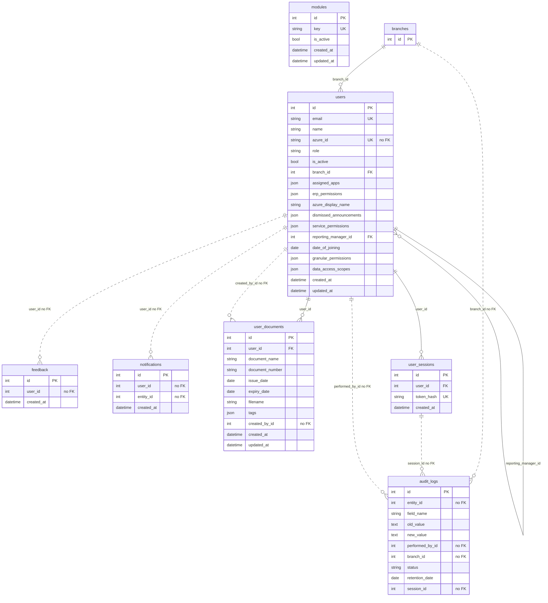

### Organization (11 tables)

| Table | Model | File:line | Soft delete |
|---|---|---|---|
| `branch_addresses` | `BranchAddress` | `modules/organization/models/branch_address.py:8` | — |
| `branch_documents` | `BranchDocument` | `modules/organization/models/branch_document.py:8` | — |
| `branch_user_assignments` | `BranchUserAssignment` | `modules/organization/models/branch_user_assignment.py:9` | — |
| `branches` | `Branch` | `modules/organization/models/branch.py:9` | — |
| `companies` | `Company` | `modules/organization/models/company.py:8` | — |
| `company_addresses` | `CompanyAddress` | `modules/organization/models/company_address.py:8` | — |
| `company_contacts` | `CompanyContact` | `modules/organization/models/company_contact.py:8` | — |
| `company_documents` | `CompanyDocument` | `modules/organization/models/company_document.py:8` | — |
| `company_financial_years` | `CompanyFinancialYear` | `modules/organization/models/company_financial_year.py:8` | — |
| `cost_centers` | `CostCenter` | `modules/organization/models/cost_center.py:9` | — |
| `departments` | `Department` | `modules/organization/models/department.py:9` | — |

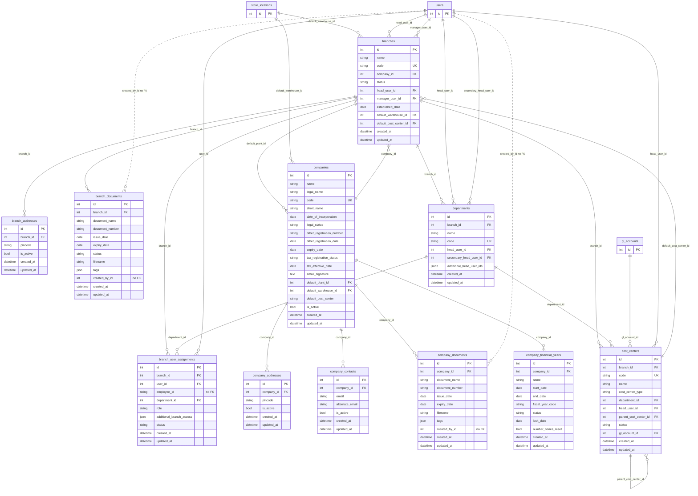

### Service Module / ERP (7 tables)

| Table | Model | File:line | Soft delete |
|---|---|---|---|
| `erp_project_attachment_shares` | `ProjectAttachmentShare` | `modules/erp/models/project_attachment.py:46` | — |
| `erp_project_attachments` | `ProjectAttachment` | `modules/erp/models/project_attachment.py:12` | — |
| `erp_projects` | `Project` | `modules/erp/models/project.py:14` | yes |
| `erp_service_material_attachments` | `ServiceMaterialAttachment` | `modules/erp/models/service_material_attachment.py:12` | — |
| `erp_service_materials` | `ServiceMaterial` | `modules/erp/models/service_material.py:13` | yes |
| `erp_service_request_attachments` | `ServiceRequestAttachment` | `modules/erp/models/service_request_attachment.py:12` | — |
| `erp_service_requests` | `ServiceRequest` | `modules/erp/models/service_request.py:15` | yes |

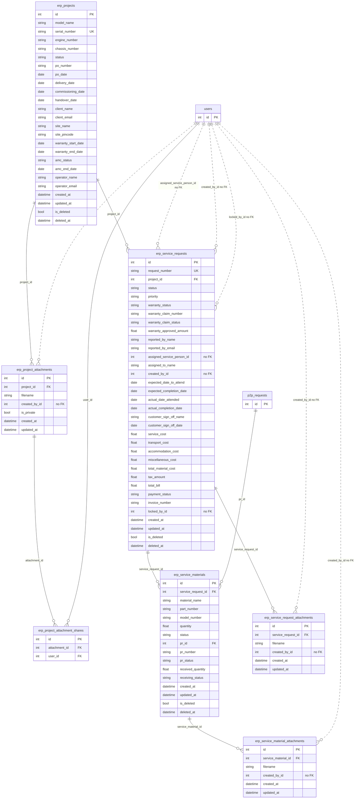

### CRM (14 tables)

| Table | Model | File:line | Soft delete |
|---|---|---|---|
| `crm_activities` | `Activity` | `modules/crm/models/activity.py:10` | yes |
| `crm_activity_attachments` | `ActivityAttachment` | `modules/crm/models/activity_attachment.py:8` | — |
| `crm_documents` | `CrmDocument` | `modules/crm/models/document.py:8` | yes |
| `crm_inquiries` | `Inquiry` | `modules/crm/models/inquiry.py:13` | yes |
| `crm_inquiry_line_items` | `InquiryLineItem` | `modules/crm/models/inquiry.py:85` | — |
| `crm_org_contacts` | `OrgContact` | `modules/crm/models/organization.py:52` | — |
| `crm_organizations` | `Organization` | `modules/crm/models/organization.py:15` | yes |
| `crm_payment_terms` | `PaymentTerm` | `modules/crm/models/payment_term.py:8` | yes |
| `crm_product_categories` | `ProductCategory` | `modules/crm/models/product_category.py:8` | yes |
| `crm_products` | `Product` | `modules/crm/models/product.py:8` | yes |
| `crm_quotation_line_items` | `QuotationLineItem` | `modules/crm/models/inquiry.py:138` | — |
| `crm_quotations` | `Quotation` | `modules/crm/models/inquiry.py:99` | — |
| `crm_stage_logs` | `CrmStageLog` | `modules/crm/models/stage_log.py:8` | — |
| `crm_tenders` | `Tender` | `modules/crm/models/tender.py:13` | yes |

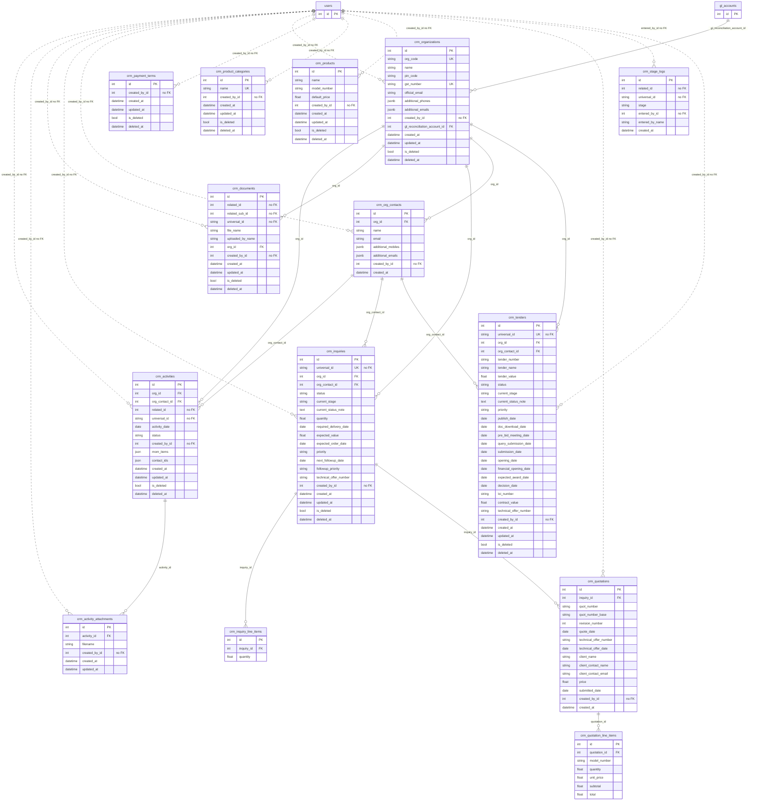

### Procurement / P2P (10 tables)

| Table | Model | File:line | Soft delete |
|---|---|---|---|
| `p2p_goods_receipt_items` | `P2PGoodsReceiptItem` | `modules/p2p/models/goods_receipt.py:58` | — |
| `p2p_goods_receipts` | `P2PGoodsReceipt` | `modules/p2p/models/goods_receipt.py:26` | — |
| `p2p_purchase_order_items` | `P2PPurchaseOrderItem` | `modules/p2p/models/purchase_order.py:56` | — |
| `p2p_purchase_orders` | `P2PPurchaseOrder` | `modules/p2p/models/purchase_order.py:17` | — |
| `p2p_request_attachments` | `P2PRequestAttachment` | `modules/p2p/models/p2p_request_attachment.py:17` | — |
| `p2p_request_items` | `P2PRequestItem` | `modules/p2p/models/p2p_request_item.py:13` | — |
| `p2p_requests` | `P2PRequest` | `modules/p2p/models/p2p_request.py:87` | — |
| `p2p_vendor_quotations` | `VendorQuotation` | `modules/p2p/models/vendor_quotation.py:20` | — |
| `rfq_attachments` | `RFQAttachment` | `modules/p2p/models/rfq_attachment.py:12` | — |
| `rfqs` | `RFQ` | `modules/p2p/models/rfq.py:20` | — |

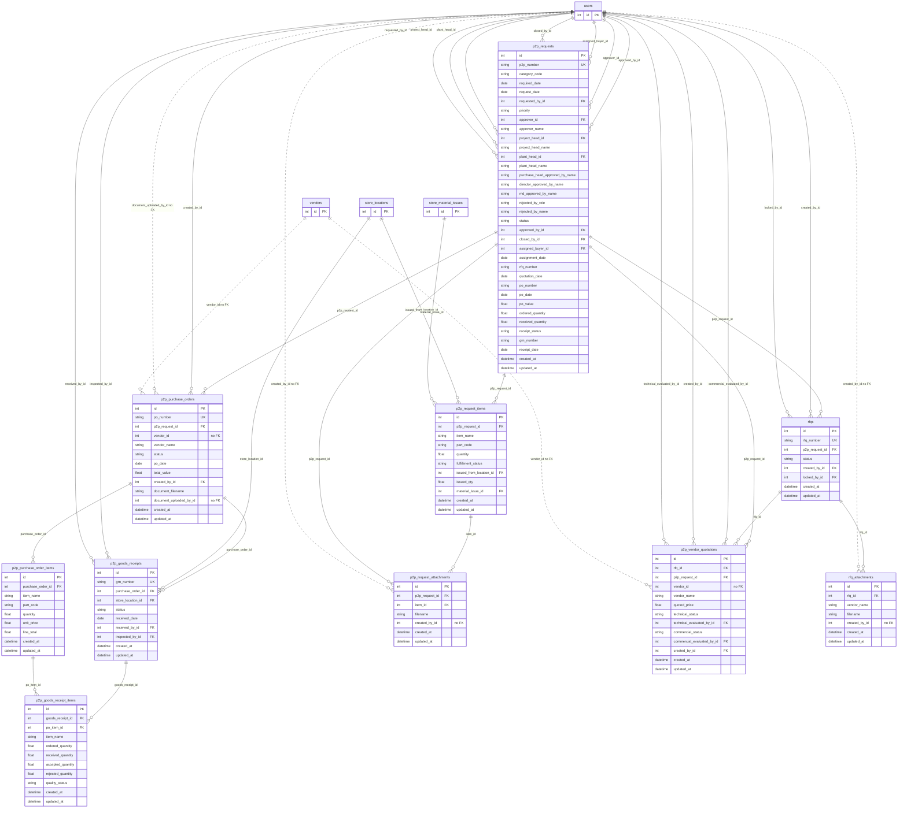

### Store & Inventory (15 tables)

| Table | Model | File:line | Soft delete |
|---|---|---|---|
| `store_bins` | `StoreBin` | `modules/store/models/bin.py:13` | — |
| `store_item_categories` | `StoreItemCategory` | `modules/store/models/category.py:8` | — |
| `store_items` | `StoreItem` | `modules/store/models/item.py:15` | — |
| `store_locations` | `StoreLocation` | `modules/store/models/location.py:8` | — |
| `store_material_issue_items` | `StoreMaterialIssueItem` | `modules/store/models/material_issue.py:37` | — |
| `store_material_issues` | `StoreMaterialIssue` | `modules/store/models/material_issue.py:9` | — |
| `store_material_return_items` | `StoreMaterialReturnItem` | `modules/store/models/material_return.py:42` | — |
| `store_material_returns` | `StoreMaterialReturn` | `modules/store/models/material_return.py:21` | — |
| `store_stock_adjustment_items` | `StoreStockAdjustmentItem` | `modules/store/models/stock_adjustment.py:33` | — |
| `store_stock_adjustments` | `StoreStockAdjustment` | `modules/store/models/stock_adjustment.py:9` | — |
| `store_stock_balances` | `StoreStockBalance` | `modules/store/models/stock_balance.py:8` | — |
| `store_stock_reservations` | `StoreStockReservation` | `modules/store/models/stock_reservation.py:17` | — |
| `store_stock_transactions` | `StoreStockTransaction` | `modules/store/models/stock_transaction.py:32` | — |
| `store_stock_transfer_items` | `StoreStockTransferItem` | `modules/store/models/stock_transfer.py:31` | — |
| `store_stock_transfers` | `StoreStockTransfer` | `modules/store/models/stock_transfer.py:9` | — |

```mermaid
erDiagram
    store_bins {
        int id PK
        int location_id FK
        int parent_id FK
        string code
        string name
        bool is_active
        datetime created_at
        datetime updated_at
    }
    store_item_categories {
        int id PK
        string name
        string code UK
        int parent_id FK
        bool is_active
        datetime created_at
        datetime updated_at
    }
    store_items {
        int id PK
        string item_code UK
        string item_name
        string manufacturer_part_number
        string part_number
        string hsn_sac_code
        bool serial_controlled
        float reorder_quantity
        float standard_cost
        float moving_average_cost
        string status
        int preferred_warehouse_id FK
        datetime created_at
        datetime updated_at
    }
    store_locations {
        int id PK
        int branch_id FK
        string name
        string code UK
        int manager_user_id FK
        string status
        bool is_active
        datetime created_at
        datetime updated_at
    }
    store_material_issue_items {
        int id PK
        int issue_id FK
        int item_id FK
        float quantity
        string batch_number
        datetime created_at
        datetime updated_at
    }
    store_material_issues {
        int id PK
        string issue_number UK
        int location_id FK
        int requested_by_id FK
        int department_id FK
        int p2p_request_id FK
        date issue_date
        int issued_by_id FK
        datetime created_at
        datetime updated_at
    }
    store_material_return_items {
        int id PK
        int return_id FK
        int item_id FK
        float quantity
        string batch_number
        datetime created_at
        datetime updated_at
    }
    store_material_returns {
        int id PK
        string return_number UK
        int location_id FK
        int source_issue_id FK
        date return_date
        int returned_by_id FK
        datetime created_at
        datetime updated_at
    }
    store_stock_adjustment_items {
        int id PK
        int adjustment_id FK
        int item_id FK
        float existing_quantity
        float actual_quantity
        datetime created_at
        datetime updated_at
    }
    store_stock_adjustments {
        int id PK
        string adjustment_number UK
        int location_id FK
        date adjustment_date
        int approved_by_id FK
        int created_by_id FK
        datetime created_at
        datetime updated_at
    }
    store_stock_balances {
        int id PK
        int item_id FK
        int location_id FK
        float on_hand_qty
        float reserved_qty
        datetime created_at
        datetime updated_at
    }
    store_stock_reservations {
        int id PK
        string reservation_number UK
        int item_id FK
        int location_id FK
        float quantity
        int reserved_by_id FK
        date required_date
        string status
        datetime created_at
        datetime updated_at
    }
    store_stock_transactions {
        int id PK
        int item_id FK
        int location_id FK
        int bin_id FK
        float quantity
        string batch_number
        string reference_number
        date transaction_date
        int created_by_id FK
        datetime created_at
        datetime updated_at
    }
    store_stock_transfer_items {
        int id PK
        int transfer_id FK
        int item_id FK
        float quantity
        string batch_number
        datetime created_at
        datetime updated_at
    }
    store_stock_transfers {
        int id PK
        string transfer_number UK
        int from_location_id FK
        int to_location_id FK
        date transfer_date
        int transferred_by_id FK
        datetime created_at
        datetime updated_at
    }
    branches {
        int id PK
    }
    departments {
        int id PK
    }
    p2p_requests {
        int id PK
    }
    users {
        int id PK
    }
    branches ||--o{ store_locations : "branch_id"
    departments ||--o{ store_material_issues : "department_id"
    p2p_requests ||--o{ store_material_issues : "p2p_request_id"
    store_bins ||--o{ store_bins : "parent_id"
    store_bins ||--o{ store_stock_transactions : "bin_id"
    store_item_categories ||--o{ store_item_categories : "parent_id"
    store_items ||--o{ store_material_issue_items : "item_id"
    store_items ||--o{ store_material_return_items : "item_id"
    store_items ||--o{ store_stock_adjustment_items : "item_id"
    store_items ||--o{ store_stock_balances : "item_id"
    store_items ||--o{ store_stock_reservations : "item_id"
    store_items ||--o{ store_stock_transactions : "item_id"
    store_items ||--o{ store_stock_transfer_items : "item_id"
    store_locations ||--o{ store_bins : "location_id"
    store_locations ||--o{ store_items : "preferred_warehouse_id"
    store_locations ||--o{ store_material_issues : "location_id"
    store_locations ||--o{ store_material_returns : "location_id"
    store_locations ||--o{ store_stock_adjustments : "location_id"
    store_locations ||--o{ store_stock_balances : "location_id"
    store_locations ||--o{ store_stock_reservations : "location_id"
    store_locations ||--o{ store_stock_transactions : "location_id"
    store_locations ||--o{ store_stock_transfers : "from_location_id"
    store_locations ||--o{ store_stock_transfers : "to_location_id"
    store_material_issues ||--o{ store_material_issue_items : "issue_id"
    store_material_issues ||--o{ store_material_returns : "source_issue_id"
    store_material_returns ||--o{ store_material_return_items : "return_id"
    store_stock_adjustments ||--o{ store_stock_adjustment_items : "adjustment_id"
    store_stock_transfers ||--o{ store_stock_transfer_items : "transfer_id"
    users ||--o{ store_locations : "manager_user_id"
    users ||--o{ store_material_issues : "issued_by_id"
    users ||--o{ store_material_issues : "requested_by_id"
    users ||--o{ store_material_returns : "returned_by_id"
    users ||--o{ store_stock_adjustments : "approved_by_id"
    users ||--o{ store_stock_adjustments : "created_by_id"
    users ||--o{ store_stock_reservations : "reserved_by_id"
    users ||--o{ store_stock_transactions : "created_by_id"
    users ||--o{ store_stock_transfers : "transferred_by_id"
```

### Quality (13 tables)

| Table | Model | File:line | Soft delete |
|---|---|---|---|
| `quality_capas` | `QualityCapa` | `modules/quality/models/capa.py:12` | — |
| `quality_checklist_items` | `QualityChecklistItem` | `modules/quality/models/quality_checklist.py:34` | — |
| `quality_checklists` | `QualityChecklist` | `modules/quality/models/quality_checklist.py:14` | — |
| `quality_customer_complaints` | `QualityCustomerComplaint` | `modules/quality/models/customer_complaint.py:12` | — |
| `quality_documents` | `QualityDocument` | `modules/quality/models/quality_document.py:10` | yes |
| `quality_inspection_attachments` | `QualityInspectionAttachment` | `modules/quality/models/inspection.py:70` | — |
| `quality_inspection_plans` | `QualityInspectionPlan` | `modules/quality/models/inspection_plan.py:15` | — |
| `quality_inspection_results` | `QualityInspectionResult` | `modules/quality/models/inspection.py:52` | — |
| `quality_inspections` | `QualityInspection` | `modules/quality/models/inspection.py:16` | — |
| `quality_ncrs` | `QualityNcr` | `modules/quality/models/ncr.py:13` | — |
| `quality_rejections` | `QualityRejection` | `modules/quality/models/rejection.py:12` | — |
| `quality_standards` | `QualityStandard` | `modules/quality/models/quality_standard.py:11` | — |
| `quality_supplier_scorecards` | `QualitySupplierScorecard` | `modules/quality/models/supplier_quality.py:10` | — |

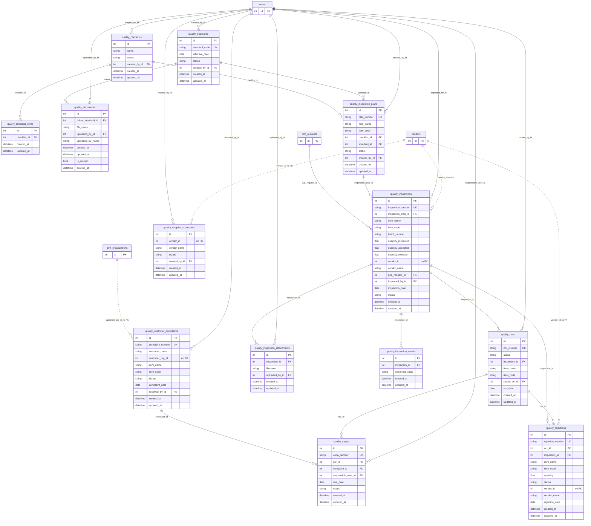

### Project Management (13 tables)

| Table | Model | File:line | Soft delete |
|---|---|---|---|
| `pm_project_approvals` | `PmApproval` | `modules/projects/models/approval.py:11` | — |
| `pm_project_budget_lines` | `PmBudgetLine` | `modules/projects/models/budget.py:9` | — |
| `pm_project_change_requests` | `PmChangeRequest` | `modules/projects/models/change_request.py:11` | — |
| `pm_project_cost_entries` | `PmCostEntry` | `modules/projects/models/budget.py:23` | — |
| `pm_project_deliverables` | `PmDeliverable` | `modules/projects/models/deliverable.py:11` | — |
| `pm_project_documents` | `PmProjectDocument` | `modules/projects/models/document.py:10` | yes |
| `pm_project_issues` | `PmIssue` | `modules/projects/models/issue.py:12` | — |
| `pm_project_milestones` | `PmProjectMilestone` | `modules/projects/models/milestone.py:11` | — |
| `pm_project_phases` | `PmProjectPhase` | `modules/projects/models/phase.py:11` | — |
| `pm_project_resources` | `PmProjectResource` | `modules/projects/models/resource.py:9` | — |
| `pm_project_risks` | `PmRisk` | `modules/projects/models/risk.py:14` | — |
| `pm_project_tasks` | `PmProjectTask` | `modules/projects/models/task.py:12` | — |
| `pm_projects` | `PmProject` | `modules/projects/models/project.py:12` | — |

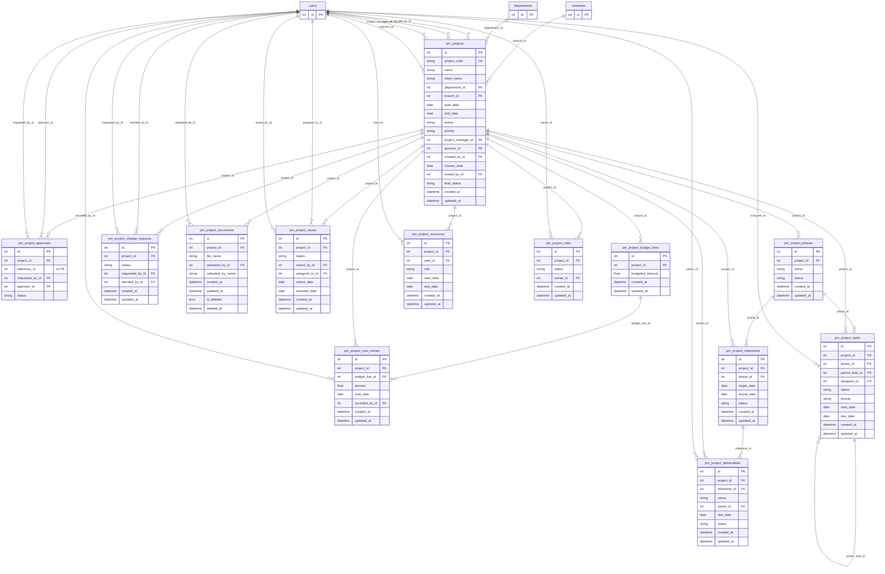

### R&D Tools (8 tables)

| Table | Model | File:line | Soft delete |
|---|---|---|---|
| `rnd_braking_calculations` | `BrakingCalculation` | `modules/rnd/models/tool_calculations.py:14` | — |
| `rnd_calculation_history` | `CalculationHistory` | `modules/rnd/models/calculation_history.py:8` | — |
| `rnd_hydraulic_calculations` | `HydraulicCalculation` | `modules/rnd/models/tool_calculations.py:38` | — |
| `rnd_load_distribution_calculations` | `LoadDistributionCalculation` | `modules/rnd/models/tool_calculations.py:61` | — |
| `rnd_qmax_calculations` | `QmaxCalculation` | `modules/rnd/models/tool_calculations.py:82` | — |
| `rnd_spline_calculations` | `SplineCalculation` | `modules/rnd/models/tool_calculations.py:101` | — |
| `rnd_tractive_effort_calculations` | `TractiveEffortCalculation` | `modules/rnd/models/tool_calculations.py:126` | — |
| `rnd_vehicle_performance_calculations` | `VehiclePerformanceCalculation` | `modules/rnd/models/tool_calculations.py:151` | — |

```mermaid
erDiagram
    rnd_braking_calculations {
        int id PK
        int user_id "no FK"
        string calculation_name
        json inputs_json
        json results_json
        datetime created_at
    }
    rnd_calculation_history {
        int id PK
        int user_id "no FK"
        string tool_name
        string calculation_name
        json inputs_json
        json results_json
        datetime created_at
    }
    rnd_hydraulic_calculations {
        int id PK
        int user_id "no FK"
        string calculation_name
        json inputs_json
        json results_json
        datetime created_at
    }
    rnd_load_distribution_calculations {
        int id PK
        int user_id "no FK"
        string calculation_name
        float total_load
        string status
        json inputs_json
        json results_json
        datetime created_at
    }
    rnd_qmax_calculations {
        int id PK
        int user_id "no FK"
        string calculation_name
        json inputs_json
        json results_json
        datetime created_at
    }
    rnd_spline_calculations {
        int id PK
        int user_id "no FK"
        string calculation_name
        int number_teeth
        json inputs_json
        json results_json
        datetime created_at
    }
    rnd_tractive_effort_calculations {
        int id PK
        int user_id "no FK"
        string calculation_name
        json inputs_json
        json results_json
        datetime created_at
    }
    rnd_vehicle_performance_calculations {
        int id PK
        int user_id "no FK"
        string calculation_name
        string traction_status
        json inputs_json
        json results_json
        datetime created_at
    }
    users {
        int id PK
    }
    users ||..o{ rnd_braking_calculations : "user_id no FK"
    users ||..o{ rnd_calculation_history : "user_id no FK"
    users ||..o{ rnd_hydraulic_calculations : "user_id no FK"
    users ||..o{ rnd_load_distribution_calculations : "user_id no FK"
    users ||..o{ rnd_qmax_calculations : "user_id no FK"
    users ||..o{ rnd_spline_calculations : "user_id no FK"
    users ||..o{ rnd_tractive_effort_calculations : "user_id no FK"
    users ||..o{ rnd_vehicle_performance_calculations : "user_id no FK"
```

### Finance & Accounting (12 tables)

| Table | Model | File:line | Soft delete |
|---|---|---|---|
| `ar_transactions` | `ARTransaction` | `modules/accounts/models/ar_transaction.py:12` | — |
| `bank_accounts` | `BankAccount` | `modules/accounts/models/bank_account.py:10` | — |
| `bank_reconciliations` | `BankReconciliation` | `modules/accounts/models/bank_reconciliation.py:11` | — |
| `gl_accounts` | `GLAccount` | `modules/accounts/models/gl_account.py:11` | — |
| `gl_balances` | `GLBalance` | `modules/accounts/models/gl_balance.py:8` | — |
| `internal_orders` | `InternalOrder` | `modules/accounts/models/internal_order.py:12` | — |
| `journal_entries` | `JournalEntry` | `modules/accounts/models/journal_entry.py:12` | — |
| `journal_entry_lines` | `JournalEntryLine` | `modules/accounts/models/journal_entry.py:52` | — |
| `payment_transactions` | `PaymentTransaction` | `modules/accounts/models/payment_transaction.py:12` | — |
| `period_close` | `PeriodClose` | `modules/accounts/models/period_close.py:11` | — |
| `vendor_invoices` | `VendorInvoice` | `modules/accounts/models/vendor_invoice.py:13` | — |
| `vendors` | `Vendor` | `modules/accounts/models/vendor.py:10` | — |

```mermaid
erDiagram
    ar_transactions {
        int id PK
        string invoice_number UK
        int customer_id FK
        date invoice_date
        date due_date
        float invoice_amount
        float gst_amount
        float discount_amount
        float total_amount
        int revenue_gl_account_id FK
        int reference_id "no FK"
        float amount_received
        float amount_due
        string collection_status
        int journal_entry_id FK
        string status
        int created_by_id FK
        datetime created_at
        datetime updated_at
    }
    bank_accounts {
        int id PK
        string bank_name
        string account_no UK
        string account_holder_name
        string branch_name
        string ifsc_code
        int gl_account_id FK
        string status
        datetime created_at
        datetime updated_at
    }
    bank_reconciliations {
        int id PK
        int bank_account_id FK
        date statement_date
        string status
        int created_by_id FK
        int completed_by_id FK
        datetime created_at
        datetime updated_at
    }
    gl_accounts {
        int id PK
        string code UK
        string name
        string status
        datetime created_at
        datetime updated_at
    }
    gl_balances {
        int id PK
        int gl_account_id FK
        float total_debits
        float total_credits
        datetime created_at
        datetime updated_at
    }
    internal_orders {
        int id PK
        string code UK
        string name
        date start_date
        date end_date
        float budgeted_amount
        int gl_account_id FK
        int cost_center_id FK
        string status
        datetime created_at
        datetime updated_at
    }
    journal_entries {
        int id PK
        string entry_number UK
        date posting_date
        int reference_document_id "no FK"
        float total_debit
        float total_credit
        string status
        int created_by_id FK
        int posted_by_id FK
        date reversal_date
        int reversed_by_id FK
        int reverses_journal_entry_id FK
        datetime created_at
        datetime updated_at
    }
    journal_entry_lines {
        int id PK
        int journal_entry_id FK
        int line_number
        int gl_account_id FK
        int cost_center_id FK
        int internal_order_id FK
        int vendor_id FK
        int customer_id FK
        float debit_amount
        float credit_amount
        date due_date
        datetime created_at
        datetime updated_at
    }
    payment_transactions {
        int id PK
        string payment_number UK
        date payment_date
        float amount
        int bank_account_id FK
        int vendor_id FK
        int vendor_invoice_id FK
        int ar_transaction_id FK
        string cheque_number
        date cheque_date
        int journal_entry_id FK
        int created_by_id FK
        string reconciliation_status
        int bank_reconciliation_id FK
        datetime created_at
        datetime updated_at
    }
    period_close {
        int id PK
        string accounting_period UK
        string status
        int closed_by_id FK
        int reopened_by_id FK
        datetime created_at
        datetime updated_at
    }
    vendor_invoices {
        int id PK
        int purchase_order_id FK
        int vendor_id FK
        string invoice_number
        date invoice_date
        float invoice_amount
        float invoice_total
        int expense_gl_account_id FK
        float qty_po
        float qty_gr
        float qty_invoice
        string matching_status
        string payment_status
        float amount_paid
        float amount_due
        int journal_entry_id FK
        string status
        int variance_approved_by_id FK
        int created_by_id FK
        datetime created_at
        datetime updated_at
    }
    vendors {
        int id PK
        string code UK
        string name
        string pin_code
        string contact_name
        string contact_email
        string bank_name
        string ifsc_code
        string account_holder_name
        int gl_reconciliation_account_id FK
        string status
        datetime created_at
        datetime updated_at
    }
    cost_centers {
        int id PK
    }
    crm_organizations {
        int id PK
    }
    p2p_purchase_orders {
        int id PK
    }
    users {
        int id PK
    }
    ar_transactions ||--o{ payment_transactions : "ar_transaction_id"
    bank_accounts ||--o{ bank_reconciliations : "bank_account_id"
    bank_accounts ||--o{ payment_transactions : "bank_account_id"
    bank_reconciliations ||--o{ payment_transactions : "bank_reconciliation_id"
    cost_centers ||--o{ internal_orders : "cost_center_id"
    cost_centers ||--o{ journal_entry_lines : "cost_center_id"
    crm_organizations ||--o{ ar_transactions : "customer_id"
    crm_organizations ||--o{ journal_entry_lines : "customer_id"
    gl_accounts ||--o{ ar_transactions : "revenue_gl_account_id"
    gl_accounts ||--o{ bank_accounts : "gl_account_id"
    gl_accounts ||--o{ gl_balances : "gl_account_id"
    gl_accounts ||--o{ internal_orders : "gl_account_id"
    gl_accounts ||--o{ journal_entry_lines : "gl_account_id"
    gl_accounts ||--o{ vendor_invoices : "expense_gl_account_id"
    gl_accounts ||--o{ vendors : "gl_reconciliation_account_id"
    internal_orders ||--o{ journal_entry_lines : "internal_order_id"
    journal_entries ||--o{ ar_transactions : "journal_entry_id"
    journal_entries ||--o{ journal_entries : "reverses_journal_entry_id"
    journal_entries ||--o{ journal_entry_lines : "journal_entry_id"
    journal_entries ||--o{ payment_transactions : "journal_entry_id"
    journal_entries ||--o{ vendor_invoices : "journal_entry_id"
    p2p_purchase_orders ||--o{ vendor_invoices : "purchase_order_id"
    users ||--o{ ar_transactions : "created_by_id"
    users ||--o{ bank_reconciliations : "completed_by_id"
    users ||--o{ bank_reconciliations : "created_by_id"
    users ||--o{ journal_entries : "created_by_id"
    users ||--o{ journal_entries : "posted_by_id"
    users ||--o{ journal_entries : "reversed_by_id"
    users ||--o{ payment_transactions : "created_by_id"
    users ||--o{ period_close : "closed_by_id"
    users ||--o{ period_close : "reopened_by_id"
    users ||--o{ vendor_invoices : "created_by_id"
    users ||--o{ vendor_invoices : "variance_approved_by_id"
    vendor_invoices ||--o{ payment_transactions : "vendor_invoice_id"
    vendors ||--o{ journal_entry_lines : "vendor_id"
    vendors ||--o{ payment_transactions : "vendor_id"
    vendors ||--o{ vendor_invoices : "vendor_id"
```

### Cross-module

This diagram shows only links that **cross a module boundary**.

- Solid lines are real FKs.
- Dotted lines are links the business needs that are **missing**. They are either id columns with no FK, or no link at all.

```mermaid
erDiagram
    users {
        int id PK
    }
    branches {
        int id PK
    }
    departments {
        int id PK
    }
    cost_centers {
        int id PK
    }
    companies {
        int id PK
    }
    store_locations {
        int id PK
    }
    store_items {
        int id PK
    }
    p2p_requests {
        int id PK
    }
    p2p_purchase_orders {
        int id PK
    }
    p2p_goods_receipts {
        int id PK
    }
    erp_service_materials {
        int id PK
    }
    erp_service_requests {
        int id PK
    }
    erp_projects {
        int id PK
    }
    store_material_issues {
        int id PK
    }
    quality_inspections {
        int id PK
    }
    quality_customer_complaints {
        int id PK
    }
    quality_rejections {
        int id PK
    }
    p2p_vendor_quotations {
        int id PK
    }
    vendor_invoices {
        int id PK
    }
    vendors {
        int id PK
    }
    crm_organizations {
        int id PK
    }
    crm_inquiries {
        int id PK
    }
    ar_transactions {
        int id PK
    }
    gl_accounts {
        int id PK
    }
    journal_entry_lines {
        int id PK
    }
    pm_projects {
        int id PK
    }
    branches ||--o{ pm_projects : "branch_id"
    branches ||--o{ store_locations : "branch_id"
    branches ||--o{ users : "branch_id"
    cost_centers ||--o{ journal_entry_lines : "cost_center_id"
    crm_inquiries ||..o{ erp_projects : "no hand-off"
    crm_inquiries ||..o{ pm_projects : "no hand-off"
    crm_organizations ||--o{ ar_transactions : "customer_id"
    crm_organizations ||--o{ journal_entry_lines : "customer_id"
    crm_organizations ||..o{ quality_customer_complaints : "customer_org_id no FK"
    departments ||--o{ pm_projects : "department_id"
    departments ||--o{ store_material_issues : "department_id"
    erp_projects ||..o{ pm_projects : "unrelated"
    gl_accounts ||--o{ cost_centers : "gl_account_id"
    gl_accounts ||--o{ crm_organizations : "gl_reconciliation_account_id"
    p2p_goods_receipts ||..o{ quality_inspections : "no link"
    p2p_purchase_orders ||--o{ vendor_invoices : "purchase_order_id"
    p2p_requests ||--o{ erp_service_materials : "pr_id"
    p2p_requests ||--o{ quality_inspections : "p2p_request_id"
    p2p_requests ||--o{ store_material_issues : "p2p_request_id"
    pm_projects ||..o{ p2p_requests : "project_label text only"
    store_items ||..o{ p2p_goods_receipts : "matched by item_name text"
    store_locations ||--o{ branches : "default_warehouse_id"
    store_locations ||--o{ companies : "default_warehouse_id"
    store_locations ||--o{ p2p_goods_receipts : "store_location_id"
    users ||--o{ ar_transactions : "created_by_id"
    users ||--o{ branches : "head_user_id"
    users ||--o{ branches : "manager_user_id"
    users ||--o{ cost_centers : "head_user_id"
    users ||--o{ departments : "head_user_id"
    users ||--o{ departments : "secondary_head_user_id"
    users ||--o{ p2p_goods_receipts : "inspected_by_id"
    users ||--o{ p2p_goods_receipts : "received_by_id"
    users ||--o{ p2p_purchase_orders : "created_by_id"
    users ||--o{ p2p_requests : "approved_by_id"
    users ||--o{ p2p_requests : "approver_id"
    users ||--o{ p2p_requests : "assigned_buyer_id"
    users ||--o{ p2p_requests : "closed_by_id"
    users ||--o{ p2p_requests : "plant_head_id"
    users ||--o{ p2p_requests : "project_head_id"
    users ||--o{ p2p_requests : "requested_by_id"
    users ||--o{ p2p_vendor_quotations : "commercial_evaluated_by_id"
    users ||--o{ p2p_vendor_quotations : "created_by_id"
    users ||--o{ p2p_vendor_quotations : "technical_evaluated_by_id"
    users ||--o{ pm_projects : "closed_by_id"
    users ||--o{ pm_projects : "created_by_id"
    users ||--o{ pm_projects : "project_manager_id"
    users ||--o{ pm_projects : "sponsor_id"
    users ||--o{ quality_customer_complaints : "received_by_id"
    users ||--o{ quality_inspections : "inspected_by_id"
    users ||--o{ store_locations : "manager_user_id"
    users ||--o{ store_material_issues : "issued_by_id"
    users ||--o{ store_material_issues : "requested_by_id"
    users ||--o{ vendor_invoices : "created_by_id"
    users ||--o{ vendor_invoices : "variance_approved_by_id"
    vendors ||..o{ p2p_purchase_orders : "vendor_id no FK"
    vendors ||..o{ p2p_vendor_quotations : "vendor_id no FK"
    vendors ||..o{ quality_inspections : "vendor_id no FK"
    vendors ||..o{ quality_rejections : "vendor_id no FK"
```

---

## 2. How each workflow's data is stored

### 2.0 Top storage issues

| ID | Tag | Issue | Where |
|---|---|---|---|
| P3-STOR-1 | [SEC][ARCH] | The audit middleware takes the IP from the **first `X-Forwarded-For` value with no trusted-proxy check**, so any client can spoof `audit_logs.ip_address`. `owasp.py` already contains the correct check. | `core/audit_context.py:48-51` vs `middleware/owasp.py:165-171` |
| P3-STOR-2 | [ARCH] | `audit_logs.user_agent` is String(255), but the listener copies the raw header untruncated (`user_sessions` truncates to `[:255]`). On Postgres, a UA longer than 255 characters would make the audit INSERT fail, and with it the **whole business transaction** that shares the commit (inferred). | `main/models/audit_log.py:51,70-71`, `core/audit_context.py:53`, compare `auth.py:122` |
| P3-STOR-3 | [ARCH] | `api_source` is set inside the **sync** dependency `get_current_user` (it runs in a thread pool with a copied context), so it probably never reaches the endpoint's context. The column would then always be NULL (inferred). | `main/routes/auth.py:129,139-148`, `core/audit_context.py:35-39` |
| P3-STOR-4 | [BA][SEC] | **Store and Quality write no audit rows at all.** Stock issues, returns, transfers, adjustments, reservations, NCR, CAPA and complaints have no trail. Also unaudited: role, app and active changes, Azure sync, login, logout, CRM contacts, activities, quotation create/delete, and all P2P/RFQ attachment deletes. | grep `AuditLog` under `modules/store`, `modules/quality` = 0; `main/routes/users.py:368-550` |
| P3-STOR-5 | [SEC] | The permission-matrix audit stores `old_value=None, new_value=None` and only a "+N/-M" count, so the actual grants and revocations are lost. Role and `assigned_apps` changes are not audited at all. | `main/routes/users.py:216-225`, `:380-425` |
| P3-STOR-6 | [ARCH] | Soft delete is not restorable. CRM, PM and Quality documents **delete the SharePoint file first** (errors swallowed) and then only flag the row, which is left pointing at a missing file. | `crm/routes/documents.py:187-194`, `projects/routes/documents.py:149-156`, `quality/routes/documents.py:124-131` |
| P3-STOR-7 | [ARCH] | Uploads **overwrite files with the same name**: a simple PUT uses the default replace behaviour, and upload sessions set `conflictBehavior: replace`. The folder is `{root}/{uploader name}/{…}/{record}`, and Quality docs of the same type share one folder. Two rows can point at one file, and deleting one removes it for both. No drive item id is stored. | `utils/sharepoint.py:188,240-262,334-339`, `quality/routes/documents.py:52-55` |
| P3-STOR-8 | [ARCH] | Deleting a P2P request attachment or an RFQ attachment **hard-deletes the row and never deletes the SharePoint file**, and writes no audit. Every upload flow also uploads before commit, so a failed commit orphans files. | `p2p/routes/p2p_requests.py:1141-1160`, `p2p/routes/rfq.py:254-268` |
| P3-STOR-9 | [BA] | Business dates default to the server-local `date.today()` (the host TZ is not pinned, while the scheduler runs in Asia/Kolkata). This affects PR, PO, GRN, issue, return, transfer, adjustment and ledger dates, the accounts posting date, and yearly and daily number series. Between 00:00 and 05:30 IST these get the previous day or year. | `p2p_requests.py:329,963`, `goods_receipts.py:286`, `store/services/stock_ledger.py:92`, `accounts/service.py:198`, `p2p/service.py:31-73`, `main.py:329` |
| P3-STOR-10 | [ARCH][SEC] | Nothing is ever purged. `audit_logs` has no retention (`retention_date` is never written, and `entity_id`/`performed_at` are unindexed). `notifications` has no purge and fans out one row per user per CRM event. `user_sessions` inserts a row on every 15-minute refresh and never deletes. | `audit_log.py:26,33,47`, `utils/notifications.py:97-107`, `auth.py:490-493`, `main.py:336-350` |

- P3-STOR-11: PM project and child hard deletes.
- P3-STOR-12: PM child audit rows carry only the project id.
- P3-STOR-13: CRM quotation numbers come from `count()+1` with no lock or unique constraint.
- P3-STOR-14: Teams push fires before commit.
- P3-STOR-15: Azure sync re-activates users that an admin deactivated.

---

### 2.1 Shared infrastructure (mixins, audit_logs, notifications, files, timestamps)

#### 8.1 Base mixins (every workflow depends on these)

| Mixin | Columns | Where | Notes |
|---|---|---|---|
| `TimestampMixin` | `created_at DateTime(timezone=True) server_default=now()`; `updated_at DateTime(timezone=True) server_default=now() onupdate=now()` | `db/mixins.py:6-8` | Both are set by Postgres (`now()` = transaction start time, so every row written in one request gets the same timestamp). `onupdate` is SQLAlchemy-side: it fires only on ORM UPDATEs, not on bulk `query.update()` or raw SQL. |
| `SoftDeleteMixin` | `is_deleted Boolean default=False NOT NULL` (Python-side default, **no server_default**); `deleted_at DateTime(timezone=True) NULL` | `db/mixins.py:11-13` | There is no `deleted_by_id` column anywhere, so a soft-delete leaves no record of who did it unless the route also writes an audit row. |

There is no global soft-delete filter, such as a `do_orm_execute` criteria or a query class. Every query must add `is_deleted == False` itself. The queries that miss it are listed in §3, part 5 ("Soft-delete correctness").

#### 8.2 `audit_logs`: one polymorphic audit table

**Columns** (`main/models/audit_log.py:22-56`):

| Column | Type | Who sets it |
|---|---|---|
| `id` | Integer PK | DB |
| `entity_type` | String(100) NOT NULL, **indexed** | call site |
| `entity_id` | Integer NULL, **not indexed** | call site (NULL for bulk import and period close) |
| `action` | String(50) NOT NULL, not indexed | call site |
| `field_name` | String(100) | only ERP SR (`service_requests.py:76-99`) and PM `_write_audit` helpers accept it |
| `old_value` / `new_value` | Text | *free text*: a status string (P2P), a single field value (ERP SR), or a JSON dump of a dict (CRM spec revisions) |
| `summary` | Text | human sentence built from `user.name` at write time |
| `performed_by_id` | Integer NULL, **no FK** | call site; NULL for system/email rows |
| `performed_at` | DateTime(tz) `server_default=now()` | DB |
| `module_key`, `subtab_key` | String(50) (`module_key` indexed) | **only the 12 PM `_write_audit` helpers** (`projects/routes/*.py:~20-26`) set them. Everywhere else they are NULL and inferred at read time. |
| `branch_id`, `department`, `status`, `result`, `reason`, `attachment_url`, `retention_date` | nullable | **never written by any call site.** A grep for `retention_date=`, `branch_id=` and `reason=` on AuditLog constructors finds none. |
| `ip_address` String(64), `user_agent` **String(255)**, `session_id` Integer (no FK), `api_source` String(30) | auto | `before_insert` listener |

**`before_insert` listener** (`main/models/audit_log.py:59-87`). It runs on every AuditLog flush and fills each field only if that field is still NULL:
- `ip_address` ← `get_request_ip()`; `user_agent` ← `get_request_user_agent()`; `api_source` ← `get_api_source()`.
- `session_id`: it takes the raw `refresh_token` cookie, hashes it with `hash_refresh_token` (`auth/jwt_handler.py`), and runs a raw Core `SELECT` on `user_sessions` by `token_hash` over the same connection (`:83-87`). Bearer-token calls send no cookie, so their `session_id` is always NULL.

**`core/audit_context.py`**. There are four `ContextVar`s: `_ip_address`, `_user_agent`, `_refresh_token` and `_api_source` (`:13-16`). `AuditContextMiddleware` (a Starlette `BaseHTTPMiddleware`, registered at `main.py:210`) sets them per request (`:46-62`):
- **IP** = `request.client.host`, **overridden by the first element of `X-Forwarded-For` with no trusted-proxy check** (`:48-51`). `middleware/owasp.py:165-171` already implements the correct check (it honours XFF only when the TCP peer is in `settings.trusted_proxies_set`), but the audit middleware does not reuse it.
- UA = the raw `User-Agent` header, not truncated. The column is String(255).
- The refresh token comes from the raw cookie.
- `api_source` is reset to None here. It is set later by `set_api_source()` inside `get_current_user()` (`main/routes/auth.py:139-148`), which is a **sync** `def` (`auth.py:129`). FastAPI runs sync dependencies in a thread pool with a *copied* context, so the value set there probably never reaches the endpoint's context. `api_source` would then always be NULL (inferred; not executed).

**Every `entity_type` / `action` / `module_key` value written (grep of `AuditLog(` and `_write_audit(`):**

| entity_type | actions | writer | old/new stored? |
|---|---|---|---|
| `p2p_request` | created, updated, status_changed, approved, rejected, cancelled, buyer_assigned, item_issued_from_stock, item_sent_to_procurement, quotation_recorded, vendor_selected, po_raised, po_approved, po_fully_approved, closed, attachment_added (`p2p_requests.py:360-1103`); plus from `rfq.py` via `_write_pr_audit`: po_draft_created, po_document_uploaded, vendor_quotations_started, vendor_quotation_added, technical_evaluation_started, vendor_quotation_technical_evaluated, commercial_evaluation_started, vendor_quotation_commercial_evaluated, vendor_selected, po_raised; plus from GRN: grn_recorded, grn_inspected (`goods_receipts.py:306,373`), receipt_updated (`:154-158`); plus email_sent / email_failed (`utils/email.py:410,458`) | `p2p_requests.py:121-126`, `goods_receipts.py:47-48` | only `old_status`→`new_status` strings (`p2p_requests.py:125`, `goods_receipts.py:157`) |
| `rfq` | created, updated, admin_edited, submitted, attachment_added | `rfq.py:36-37` | no |
| `p2p_purchase_order` | email_sent / email_failed (overdue reminder) | `utils/email.py:500-503` | no |
| `service_request` | created, field_updated, deleted, restored, attachment_uploaded, material_added, material_updated, material_deleted, material_photo_uploaded, pr_raised, material_received; email_sent / email_failed | `erp/routes/service_requests.py:76-99`, `utils/email.py:43-44` | yes, per field (`field_name`/`old_value`/`new_value`) |
| `project` (ERP project) | created, updated, deleted, restored, attachment_uploaded, attachment_permissions_updated | `erp/routes/projects.py:36-37` | no |
| `organization` (CRM) | created, updated, deleted, **bulk_imported** (`entity_id=None`, counts only) | `crm/routes/organizations.py:25-26`, `crm/routes/bulk_import.py:605-614` | no |
| `inquiry` | created, deleted; technical_offer_sent / technical_offer_failed | `crm/routes/inquiries.py:40-41`, `utils/email.py:593-597` | no |
| `inquiry_spec` | spec_revision | `crm/routes/inquiries.py:44-50` | **yes: `json.dumps(dict)` of changed fields, old and new** |
| `tender` | created, deleted; technical_offer_sent / failed | `crm/routes/tenders.py:41-42` | no |
| `tender_spec` | spec_revision | `crm/routes/tenders.py:51-57` | yes (JSON dump) |
| `quotation_revision` | revision (only `payment_terms`, `valid_until`, `delivery_time`) | `crm/routes/workflow.py:45-51` | yes (JSON dump) |
| `pm_project` (module_key=`projects`; subtab_key ∈ details_scope, planning, tasks, milestones, deliverables, resources, budget_cost, risks, issues, changes, approvals, documents) | created, updated, deleted | `projects/routes/{project,phases,tasks,milestones,deliverables,resources,budget,risks,issues,change_requests,approvals,documents}.py:~18-26` | helper accepts `field_name`/old/new; see §6 for which call sites pass them |
| `user_permissions` | update | `main/routes/users.py:219-225` | **no: `old_value=None, new_value=None`**; only a "+N/-M" count in the summary |
| `ar_transaction`, `bank_reconciliation`, `journal_entry`, `payment_transaction`, `period_close` (entity_id NULL), `vendor_invoice` | created, posted, collected, completed, payments_matched, reversed, closed, reopened, variance_approved | `accounts/routes/*.py:~17-24` | no |

**No audit at all:** Store (issues, returns, transfers, adjustments, reservations, items, locations, bins; zero `AuditLog` imports under `modules/store`); Quality (inspections, NCR, rejections, CAPA, complaints, plans, checklists, standards, documents; zero under `modules/quality`); CRM activities, contacts, quotation create/delete, CRM documents, products and payment terms; ERP/P2P/RFQ attachment deletes; user create/role/app/active changes other than the permission matrix (see §7); organization masters (branch, company, department). `_ENTITY_TYPE_MODULE` maps `branch`, `company`, `department`, `activity` and `p2p_goods_receipt` (`organization/routes/audit_log.py:17-23`), but **no writer emits these entity types**. GRN rows are logged as `p2p_request`.

**Reading and retention**:
- `GET /organization/audit-logs` (`organization/routes/audit_log.py:40-77`) is admin only. With a `module_key` filter it over-fetches `limit*3` rows and filters in Python (`:69-71`), so pages can come back short and offsets drift.
- The `/dashboard` `by_module` count uses `_infer_module(entity_type)` only (`:95-99`), so every `pm_project` row and every accounts row counts as `"other"`, even though PM rows carry `module_key="projects"`. The "today" boundary is UTC midnight (`:85-86`), which is 05:30 IST.
- **Retention: none.** There is no purge job (`tasks/` holds only `followup_reminders.py` and `po_overdue_reminders.py`), no partitioning, and `retention_date` is never written. The table grows without limit, and `performed_at`/`entity_id` have no index to support per-entity timelines (`get_*_audit` endpoints filter on `entity_type` + `entity_id`).
- There is no DB-level immutability (no trigger or REVOKE), so any code path or DBA can UPDATE or DELETE audit rows. No endpoint deletes them.

#### 8.3 `notifications`

**Columns** (`main/models/notification.py:13-22`): `id`, `user_id Integer NOT NULL indexed (no FK)`, `title String(255)`, `message Text`, `notification_type String(50)`, `entity_type String(100) NULL`, `entity_id Integer NULL`, `is_read Boolean default=False` (Python default), `read_at DateTime(tz)`, `created_at DateTime(tz) server_default=now()`. There is no `updated_at`, no link/URL column and no module column.

**Writers**: only `utils/notifications.py`:
- `broadcast_notification()` (`:85-110`) loads **every active user** (`:97`) and skips users without `app_name` in `get_apps()`, the actor (`exclude_user_id`), and users with `notifications_enabled == False` (`:102`). It adds one `Notification` row per remaining user and queues a Teams push (`:104-108`).
- `notify_user()` (`:113-133`) does the same for a single user.
- Both swallow every exception (`:109`, `:132`). The Teams push is submitted to a thread pool **before the caller commits** (`:82`). If the business transaction later rolls back, the Teams toast has already gone out for a row that does not exist.

**`notification_type` / `entity_type` values written**:

| notification_type | entity_type | writer |
|---|---|---|
| inquiry_created, inquiry_stage_updated, inquiry_deleted | inquiry | `crm/routes/inquiries.py:148-252` |
| organization_created, organization_deleted | organization | `crm/routes/organizations.py:183-297` |
| tender_created, tender_stage_updated, tender_deleted | tender | `crm/routes/tenders.py:156-249` |
| (follow-up due/overdue) | activity | `tasks/followup_reminders.py:90-102` |
| project_created, project_deleted | project | `erp/routes/projects.py:111-200` |
| sr_created, sr_updated, sr_closed, sr_deleted | service_request | `erp/routes/service_requests.py:283-472` |
| pr_raised, pr_received, p2p_request_submitted | p2p_request | `erp/routes/service_requests.py:962-1101` |
| p2p_request_submitted / _approved / _rejected / _buyer_assigned / _item_issued_from_stock / _po_raised / p2p_po_approval_pending / p2p_request_closed | p2p_request | `p2p/routes/p2p_requests.py:367-1056` |
| p2p_grn_recorded | p2p_goods_receipt | `p2p/routes/goods_receipts.py:313` |
| OVERDUE constant | p2p_purchase_order | `tasks/po_overdue_reminders.py:69` |
| feedback | feedback | `main/routes/feedback.py:45-46` |

Nothing notifies users for Store, Quality, PM, RFQ, quotations or permission changes.

**Read/unread**: `GET /notifications` returns the latest 30 with no paging (`main/routes/notifications.py:27-45`). `/unread-count` runs a `count()` on `user_id` + `is_read` with no composite index (`:18-24`). Mark-one sets `is_read=True, read_at=now(utc)` (`:48-59`); mark-all uses a bulk `update` (`:62-71`).

**Preferences**: `PATCH /notifications/preferences {enabled: bool}` sets `users.notifications_enabled` (`:74-84`). This single boolean turns off both the in-app bell and Teams. There is no per-type or per-module preference and no history of changes. Department inbox emails ignore it (docstring `:80-81`). The daily reminder tasks de-duplicate with `func.date(Notification.created_at) == date.today()` (`tasks/followup_reminders.py:46`, `po_overdue_reminders.py:42`). That compares the DB-session date of a timestamptz against the app server's local date.

**Retention**: none. There is no delete endpoint and no purge task. With the broadcast fan-out (one row per CRM user per inquiry, tender and stage change), this becomes the fastest-growing table.

#### 8.4 File storage (SharePoint via Microsoft Graph)

**Upload primitive**: `utils/sharepoint.py:230-262` `upload_file_to_sharepoint(site_id, folder_path, upload_file)`:
- It validates the upload with a dangerous-extension blocklist, an allowlist and magic bytes (`:135-179`).
- The filename is passed through `sanitize_folder_name` (`:124-128`), which strips only `\/:*?"<>|`.
- Files up to 4 MB use a simple `PUT …/root:/{path}/{filename}:/content`, which **silently overwrites an existing item at the same path** (Graph's default conflict behaviour). Larger files use an upload session with explicit `conflictBehavior: "replace"` (`:188`).
- It returns `{"name", "path": f"{folder_path}/{filename}", "webUrl", "size"}` (`:257-262`). The Graph **drive item id, eTag and hash are discarded**, so rows reference files by *path*. A rename or move in SharePoint breaks the link, and two rows with the same filename in the same folder point to the same file.

**Folder builder**: `build_sharepoint_folder_path(user_name, project_name, sr_number, root)` returns `{root}/{uploader name}/{project}/{record}` (`utils/sharepoint.py:334-339`). **The uploader's display name is part of the path**, so one record's files are spread across one folder per uploader, and a user rename starts a new folder tree.

| Table | Path columns | Name / mime / size columns | Folder path built at | Row delete | SharePoint file deleted? |
|---|---|---|---|---|---|
| `erp_service_request_attachments` | sharepoint_path, sharepoint_url | filename, content_type, size | `service_requests.py:550` → `ERP-media/{user}/{project}/{SR-no}` | hard `db.delete` (`:662`) | yes, best-effort, error swallowed (`:656-660`). **Not when the SR itself is soft-deleted** (`:442+`) |
| `erp_service_material_attachments` | sharepoint_path, sharepoint_url | filename, content_type, size | `service_requests.py:797` → `…/{SR-no}/materials` | hard (`:904`) | yes, swallowed (`:898-902`). Material delete (`:741`): see §2 |
| `erp_project_attachments` (+ `erp_project_attachment_shares`, CASCADE) | sharepoint_path, sharepoint_url | filename, content_type, size, is_private | `erp/routes/projects.py:397` → `ERP-media/{user}/{project}/documents` | hard (`:485`) | yes, swallowed (`:479-483`). Not on project soft-delete (`:164`) |
| `p2p_request_attachments` | sharepoint_path, sharepoint_url | filename, content_type, size, doc_type, item_id | `p2p_requests.py:1083` → `ERP-media/{user}/p2p/{PR-no}` | hard (`:1158`) | **NO. File orphaned in SharePoint**; no audit on delete |
| `rfq_attachments` | sharepoint_path, sharepoint_url | filename, content_type, size, vendor_tier, vendor_name | `rfq.py:203` → `ERP-media/{user}/rfq/{RFQ-no}` | hard (`rfq.py:266`) | **NO. Orphaned**; no audit |
| `p2p_purchase_orders.document_*` (inline columns) | document_sharepoint_path, document_sharepoint_url (`purchase_order.py:45-46`) | document_filename, document_content_type, document_size, document_uploaded_by_id, document_uploaded_at | `rfq.py:715` → `ERP-media/{user}/po/{PO-no}` | cannot be replaced once set (`rfq.py:711-712`) | n/a |
| `crm_documents` (soft-delete) | file_path **and** sharepoint_path (same value, `documents.py:87-89`), sharepoint_url | file_name, mime_type, file_size, uploaded_by_name | `crm/routes/documents.py:71-74` → `CRM-media/{user}/{org}/crm/{module}/{universal_id}` | **soft** (`:193-194`) | **yes, hard delete BEFORE the soft delete** (`:187-191`). The soft-deleted row points at a file that no longer exists, so the soft delete cannot be undone |
| `crm_activity_attachments` | sharepoint_path, sharepoint_url | filename, content_type, size | `crm/routes/activities.py:208` → `CRM-media/{user}/{org}/crm/activity/{id}` | hard (`:286`) | yes, swallowed (`:280-284`). Not when the activity is soft-deleted (`:292`) |
| Technical Offer Request PDF (inquiry/tender) | stored as a `crm_documents` row with `folder_type="technical_offer"`, `shared_via_tor=True` (`inquiries.py:324-331`); link = signed token URL (`:342`) | — | `inquiries.py:320`, `tenders.py:318` → `CRM-media/{raised_by}/{org}/crm/{inquiry\|tender}/{uid}/technical-offer` | — | — |
| `pm_project_documents` (soft-delete) | file_path = sharepoint_path, sharepoint_url | file_name, mime_type, file_size, uploaded_by_id, uploaded_by_name | `projects/routes/documents.py:80-83` → `Projects-media/{user}/Projects/projects/{project_id}` | **soft** (`:155-156`) | **yes, hard delete before soft delete** (`:149-153`), same as CRM |
| `quality_documents` (soft-delete) | file_path = sharepoint_path, sharepoint_url | file_name, mime_type, file_size, uploaded_by_id, uploaded_by_name | `quality/routes/documents.py:52-55` → `Quality-media/{user}/Quality/quality/{doc_type}` | **soft** (`:130-131`) | **yes, hard delete before soft delete** (`:124-128`). All quality docs of one type share one folder per uploader, so same-name files overwrite each other |
| `user_documents` | sharepoint_path, sharepoint_url | filename, content_type, size, tags JSON, confidentiality | `main/routes/users.py:299` → `ERP-media/user-documents/{target user name}` | hard (`:363`) | yes; swallows only HTTPException (`:358-362`) |
| `branch_documents`, `company_documents` | sharepoint_path, sharepoint_url | filename, content_type, size, tags JSON | `organization/routes/branch.py:281`, `company.py:263` → `ERP-media/company-documents` (one flat folder) | hard | yes (`branch.py:334`, `company.py:318`) |

Cross-cutting:
- `content_type`/`mime_type` stores the **client-claimed** `UploadFile.content_type` (for example `documents.py:92`, `rfq.py:719`), not a sniffed type.
- Uploads run **before** the DB row is flushed. If the commit fails, the file stays in SharePoint with no row, and nothing reconciles the two.
- No checksum, no version history column, no virus-scan status.

#### 8.5 Timestamp and business-date consistency

- **Audit and entity timestamps** come from Postgres `now()` through the mixin (UTC-aware `timestamptz`). Manual stamps use `datetime.now(timezone.utc)`; for example `deleted_at` in `crm/routes/documents.py:194` and `po.document_uploaded_at` in `rfq.py:724`. **Only 2 `datetime.utcnow()` calls remain:** `auth/jwt_handler.py:25` and `:48` (JWT `exp`). These are naive but converted correctly by PyJWT (inferred), and deprecated in Python 3.12+. Naive `datetime.now()` appears only in R&D report footers (`rnd/tools/**/pdf_builder.py`), where it prints server time.
- **Business dates use `date.today()`**, which is the app server's *local* date. The container TZ is not set anywhere in the repo (inferred UTC), while the scheduler is configured for `Asia/Kolkata` (`main.py:329`). From 00:00 to 05:30 IST these defaults take the previous day:
  - P2P: `request_date` (`p2p_requests.py:329`, `service_requests.py:930`), `assignment_date` (`p2p_requests.py:340,671`, `service_requests.py:937`), `po_date` (`p2p_requests.py:963`, `rfq.py:601`, `purchase_orders.py:82`), `issue_date` (`p2p_requests.py:810`), GRN `received_date` (`goods_receipts.py:286`).
  - Store: `issue_date` (`material_issues.py:92`), `return_date` (`material_returns.py:136`), `adjustment_date` (`stock_adjustments.py:86`), `transfer_date` (`stock_transfers.py:90`), ledger `transaction_date` (`store/services/stock_ledger.py:92`).
  - PM issues: `raised_date` / `resolved_date` (`projects/routes/issues.py:100,135`).
  - Accounts: `posting_date` / `reversal_date` (`accounts/service.py:198,207`) and period close (`period_close.py:52`). A 01:00 IST posting on the 1st lands in the **previous accounting period**.
  - Document-number year and day prefixes: `p2p/service.py:31-73`, `store/service.py:21-80`, `quality/service.py:34-105`, `projects/service.py:29`, `accounts/service.py:43,221,462`, `crm/services/org_code.py:10`, and the `INQ-/TND-YYYYMMDD-` prefixes (`inquiries.py:58`, `tenders.py:64`, `bulk_import.py:245`). On 1 January before 05:30 IST these produce the previous year's series.
  - "Overdue/today" filters: `crm/routes/activities.py:120-122`, CRM/Quality dashboards (`crm/routes/dashboard.py:22`, `quality/routes/dashboard.py:23`), AR ageing (`accounts/reports.py:95,123`), reminder tasks (`tasks/*.py:42-53`), `mis.py:203,421`.
- **Rendering**: emails format `sr.created_at` / `pr.created_at` with `strftime` without converting to IST (`utils/email.py:134,186,258`). The MIS subtitle prints "UTC" explicitly (`mis.py:427`). The audit dashboard "today" starts at UTC midnight (`organization/routes/audit_log.py:85-86`).
- `next_sequential_id` takes `MAX(column)` as a **string** (`core/sequential_id.py:25`). Past `…-9999` the 5-digit number `…-10000` sorts lower, so MAX returns 9999 again and the insert collides (inferred edge case). The daily CRM prefixes are safe; the yearly series are the risk.

### 2.2 Per-workflow storage

Each workflow has a table: step | tables written | key columns | JSON | soft delete | audit row. Problems follow each table.

### 1. P2P: PR, RFQ, quotation, PO, PO approval, GRN, stock, closure

P2P tables have **no SoftDeleteMixin**. Every audit row is `entity_type="p2p_request"` through `_write_audit` (`p2p/routes/p2p_requests.py:121-126`), which puts `old_status`/`new_status` into `old_value`/`new_value` only on status transitions. RFQ writes to `entity_type="rfq"` with no old or new values.

| step | tables written | key columns set | JSON | soft delete | audit_log |
|---|---|---|---|---|---|
| Create PR `POST /p2p-requests` (`p2p_requests.py:299`) | `p2p_requests`, `p2p_request_items`, `notifications` | `status="submitted"`, `request_date=date.today()` (`:329`), `requested_by_id`, the head slots `approver_id`+`approver_name`, `project_head_id`+`_name`, `plant_head_id`+`_name` (name copies), `department` (string copy) | none | n/a | `created` (`:360`), no old/new |
| Edit PR `PATCH /{id}` (`:477`) | `p2p_requests` | any field by `setattr`, plus **free `status`** from any value in `P2P_REQUEST_STATUSES` (`:486-498`) | none | n/a | `status_changed` with old/new status (`:496`). Field edits give `updated` with no field values (inferred) |
| Head approval `/approve` (`:512`) | `p2p_requests`, `notifications` | `{dept\|project\|plant}_head_approved_at`, `_comment`. **No per-slot `_by_id`**: the actor is implied by the assigned slot id. When all slots are done: `status="approved"`, `approved_by_id`, `approved_at` (`:545-548`) | none | n/a | `approved`, summary only. The final one carries old/new status (`:549`) |
| Reject / cancel (`:597`, `:631`) | `p2p_requests` | `status`, `rejected_reason`, `rejected_by_role`, `rejected_by_name` (**name only**), `cancelled_reason` | none | n/a | `rejected` / `cancelled` with old/new status |
| Assign buyer, issue from stock, send to procurement (`:655`, `:770`, `:850`) | `p2p_requests`, `p2p_request_items`, `store_stock_transactions` + `store_stock_balances` via `post_stock_transaction` (`:820`) | `assigned_buyer_id`, `assignment_date`; item `fulfillment_status="stock_issued"`, `issued_qty` | none | n/a | `buyer_assigned`, `item_issued_from_stock`, `item_sent_to_procurement` |
| RFQ create, submit, lock (`rfq.py:96`, `:297`) | `rfqs`, `rfq_attachments` | `status` draft→locked, `created_by_id`, `locked_by_id`, `locked_at` | none | attachment **hard delete** (`rfq.py:266`) | `rfq`/`created`, `submitted` (`rfq.py:338`), no old/new |
| Vendor quotations and technical/commercial evaluation (`rfq.py:355-534`) | `p2p_vendor_quotations`, `p2p_requests` (legacy `vendor`, `quotation`, `selected_vendor` strings) | `vendor_name` (string copy, no vendor FK), `technical_status` + `_evaluated_by_id` + `_evaluated_at`, `commercial_status` + `_by_id` + `_at`, `submitted_at` (**a Date column named `_at`**) | none | n/a | through `_write_pr_audit` onto the PR: `vendor_quotations_started`, … |
| Raise PO, legacy path `/create-po` (`p2p_requests.py:913`) | `p2p_requests` (the `po_number`, `po_date`, `po_value`, `expected_delivery`, `ordered_quantity` copies), `p2p_purchase_orders`, `p2p_purchase_order_items` | PR `status="po_raised"`; PO `status="issued"`, `vendor_name=pr.selected_vendor` (string), `created_by_id` | none | n/a | `po_raised` with old/new status, **on the PR entity**. No `p2p_purchase_order` audit entity |
| PO draft, document, submit, RFQ path (`rfq.py:564-790`) | `p2p_purchase_orders` | `status` draft→issued, `document_uploaded_by_id` (**no FK**, `purchase_order.py:47`), `document_uploaded_at` (**naive `DateTime`**, `:48`, set to tz-aware now at `rfq.py:724`) | none | n/a | `po_draft_created`, `po_document_uploaded`, … on the PR |
| **PO approval** `/approve-po` (`p2p_requests.py:564`) | **`p2p_requests` only** | `purchase_head_approved_at` + `_approved_by_name`, `director_…`, `md_…`, `_comment`. **Names only, no `_by_id`** (`:577-581`). The PR goes to `status="po_approved"`, while the **PO row's `status` stays `"issued"`** | none | n/a | `po_approved` (summary only), `po_fully_approved` with old/new (`:585-589`) |
| GRN record `POST /goods-receipts` (`goods_receipts.py:220`) | `p2p_goods_receipts`, `p2p_goods_receipt_items`, `notifications` | `status="draft"`, `received_by_id`, `received_date` (`date.today()`, `:286`), item `item_name`/`unit`/`ordered_quantity` copies, `quality_status="pending"` | none | n/a | `grn_recorded` on the **PR** (`:306`). A PO with no PR gets no audit |
| GRN inspect `/inspect` (`:321`) | GRN items, GRN, `p2p_purchase_orders`, `p2p_requests`, `store_stock_transactions`/`store_stock_balances` | item `accepted_quantity`, `rejected_quantity`, `quality_status`, `rejection_reason`; GRN `status="completed"`, `inspected_by_id`, `inspected_at` (**naive**, `goods_receipt.py:50`); PO `status` partially_fulfilled/fulfilled; PR `received_quantity`, `receipt_status`, `grn_number`, `status` (`:104-160`). Stock gets **accepted qty only**, matched by **`item_name` string** (`:67`) | none | n/a | `receipt_updated` with old/new PR status (written directly with `AuditLog(`) |
| Close `/close` (`p2p_requests.py:1034`) | `p2p_requests` | `status="closed"`, `closed_by_id`, `closed_at` | none | n/a | `closed` with old/new |
| PR attachment delete (`:1141`) | `p2p_request_attachments` | row **hard-deleted** (`:1158`). The SharePoint file is kept | none | **hard** | **none** |

- **P3-STOR-31 [SEC][BA]** The PO approval chain (Purchase Head, Director, MD) is stored **only as name strings**, `*_approved_by_name` (`p2p/models/p2p_request.py:129-136`), with no `*_by_id`. A renamed or duplicate-named user makes the sign-off unattributable, and the `po_approved` audit summary is free text. The head slots are also missing an actor id: the admin-override path (`p2p_requests.py:536-541`) stamps every pending `*_approved_at` as if each assigned head had approved. Only the audit summary text records that it was an override.
- **P3-STOR-32 [ARCH]** **PO approval lives on the PR row, not the PO.** `p2p_purchase_orders` has no approval columns (`purchase_order.py:17-50`), and its `status` stays `issued` while the PR moves to `po_approved`. Raising a second PO after cancelling the first reuses the same PR approval stamps, and the PR's `po_number`, `po_value` and `po_date` duplicate the PO row (`p2p_requests.py:950-954`). Two sources of truth.
- **P3-STOR-33 [BA]** GRN rejected quantity is **never posted to stock**. `_sync_stock_for_grn` posts only `accepted_quantity`, so there is no quarantine or rejection location and no return-to-vendor record (`goods_receipts.py:63-76`). Stock matching uses a case-insensitive `item_name` string, because GRN and PO lines have no `item_id` FK. Unmatched lines are skipped and only a note is returned, with nothing persisted (`:67-70`), so the gap is lost after the response.
- **P3-STOR-34 [SEC][BA]** `PATCH /p2p-requests/{id}` lets any user with `purchase` app access set **any status** (`p2p_requests.py:486-498`), for example `approved` or `po_approved`, without filling any approval stamp. Stored data then shows an approved PR with NULL `approved_at` and NULL head stamps. Field edits are written through `setattr` with no field-level old or new values.
- **P3-STOR-35 [ARCH]** GRN and PO timestamps are naive `DateTime` (`goods_receipt.py:50`, `purchase_order.py:48`) while the rest use `timezone=True`. `document_uploaded_by_id` has no FK. GRN and PO audit rows are keyed on the PR, so a PO or GRN has no timeline of its own, and a PO without a PR has none at all (`goods_receipts.py:305`).

### 2. ERP: Service Request, materials, raise PR

`erp_service_requests` and `erp_service_materials` use SoftDeleteMixin. Audit goes through `_write_audit` (`erp/routes/service_requests.py:76-99`), `entity_type="service_request"`. This is the only helper in the app that writes **per-field** `field_name`/`old_value`/`new_value`.

| step | tables written | key columns set | JSON | soft delete | audit_log |
|---|---|---|---|---|---|
| Create SR `POST /service-requests` (`:254`) | `erp_service_requests`, `notifications` | `status="open"`, `created_by_id` (**no FK**, `service_request.py:60`), `assigned_service_person_id` (**no FK**) + `assigned_to_name` (copy), `reported_by_name`/`phone`/`email` (free text), `opened_at` | none | project filtered `is_deleted==False` (`:264`) | `created` (`:278`), summary |
| Edit SR `PATCH /{id}` (`:346`) | `erp_service_requests` | changed fields; `status="closed"` sets `closed_at`, reopening clears it (`:377-382`) | none | filtered (`:355`) | `field_updated` **one row per field, with old/new** (`:370`) |
| Delete / restore SR (`:442`, `:479`) | `erp_service_requests` | `is_deleted`, `deleted_at` (no `deleted_by_id`) | none | **soft**. The "10-day recycle bin" is **display only** (`RECYCLE_DAYS=10`, `:310-319`) and nothing purges it | `deleted` / `restored`, summary |
| SR attachment upload / delete (`:530`, `:639`) | `erp_service_request_attachments` | row + SharePoint URL | none | **hard** `db.delete` (`:662`) | upload: `attachment_uploaded` (`:578`). Delete: none (inferred) |
| Material add / edit / delete (`:680`, `:714`, `:741`) | `erp_service_materials` | `material_name`, `part_number`, `quantity` (Float), `unit`, `status="pending"`, `phase` | none | **soft** `is_deleted=True` (`:756`), even when `pr_id` is set | `material_added` / `material_updated` / `material_deleted`, summary only (**no field old/new** here, `:708`, `:735`, `:760`) |
| Material photo add / delete (`:767`, `:880`) | `erp_service_material_attachments` | row + URL | none | **hard** (`:904`) | upload: `material_photo_uploaded` (`:824`). Delete: none |
| **Raise PR** `/raise-pr` (`:967`, helper `:924-964`) | `p2p_requests`, `p2p_request_items`, `erp_service_materials`, `notifications` | PR: `request_date=date.today()`, `department=user.department` (string copy), `requested_by_id`, **`approver_id` + `approver_name` taken as-is from the payload**, `assigned_buyer_id`, `status="submitted"`, SR link **only inside `remarks` text**. Material: `pr_id` (FK), `pr_number`, `pr_status` (copies) | none | n/a | `service_request`/`pr_raised` (`:1017`). **No `p2p_request`/`created` row** |
| Receive material (`~:1060-1100`) | `erp_service_materials` | `received_quantity`, `receiving_status`, `pr_status` re-mirrored | none | n/a | `material_received` (`:1087`) |

- **P3-STOR-36 [BA][SEC]** A PR raised from an SR skips the checks the P2P create path makes. `approver_name` is copied **from the client payload** without loading the user (`service_requests.py:935-936`), while P2P create derives it from the DB (`p2p_requests.py:334`). `project_head_id` and `plant_head_id` are never set, so the new "require Department/Project/Plant Head" rule is bypassed. No `p2p_request` `created` audit row is written either, so the PR's own timeline starts at its first approval.
- **P3-STOR-37 [ARCH]** The SR-to-PR link is one-way and partly text. `p2p_requests` has no `service_request_id`, so the SR number appears only in `remarks` (`:938`). `erp_service_materials.pr_number`/`pr_status` are copies refreshed only on material receipt (`service_material.py:33-41`), so they go stale for every approval, rejection or PO step in between. A soft-deleted material or SR keeps a live `pr_id` pointing at an open PR (`:756`).
- **P3-STOR-38 [ARCH]** `created_by_id`, `assigned_service_person_id` and `locked_by_id` on `erp_service_requests` are plain Integer columns with **no FK** (`service_request.py:58,60,99`). `is_locked`/`locked_by_id` are never set, according to the model's own comment. The recycle-bin "expires in N days" is not enforced, so soft-deleted SRs stay forever while the UI says they expire (`:310-319`).
- **P3-STOR-39 [BA]** Material edits are audited with a summary only. Quantity or part changes after a PR was raised leave no old or new values (`:735`), unlike SR header edits, which are per-field.

### 3. CRM: organization, inquiry, tender, quotation, activity, documents, stage log, bulk import

Soft delete (SoftDeleteMixin) applies to `crm_organizations`, `crm_inquiries`, `crm_tenders`, `crm_activities`, `crm_documents`, `crm_products`, `crm_product_categories` and `crm_payment_terms`. Contacts, quotations, line items and stage logs are not soft-deletable. Audit rows go to `entity_type` values `organization`, `inquiry` and `tender`. They carry a summary sentence only, except `spec_revision`, which stores a JSON dump in old/new.

| step | tables written | key columns set | JSON | soft delete | audit_log |
|---|---|---|---|---|---|
| Create / edit organization + contacts | `crm_organizations`, `crm_org_contacts` | `org_code` (ORG-year lock), `gst_number` (unique), `created_by_id` (**no FK**) | `additional_phones`, `additional_emails` JSONB `["…"]` (`crm/models/organization.py:33-34`); contacts `additional_mobiles/emails` | org: `is_deleted` set on delete (`organizations.py:287`). Contacts are not flagged, so they stay reachable through the org | `organization`/`created`, `updated` (summary lists changed field names only, `organizations.py:261`), `deleted`. **Contacts: none** |
| Create inquiry / tender | `crm_inquiries` / `crm_tenders`, `crm_stage_logs`, `crm_activities` (follow-up), `notifications` | `universal_id` (`next_sequential_id`, locked), `status`, `current_stage` (free text), **owner strings** `bd_owner`, `sales_engineer`, `followup_assigned_to` | none | set on delete (`inquiries.py:243`, `tenders.py:240`); cascade in `crm/services/cascade.py` skips quotations | `created` (`inquiries.py:145`, `tenders.py:153`), summary only |
| Edit inquiry (status/stage via PATCH) | `crm_inquiries` | any field; stage any→any | none | — | spec-revision rows with JSON old/new (`inquiries.py:45`). Plain status/stage PATCH: summary only (inferred) |
| `POST /stages` (never called by FE) | `crm_stage_logs` | `stage`, `entered_by_id` (**no FK**) + `entered_by_name` copy | none | — | stage log is the trail |
| Quotation create / revise / response | `crm_quotations`, `crm_quotation_line_items` | `quot_number` from **count()+1, no lock, not unique** (`workflow.py:34`); `-rN` suffix on revise; client name/email/phone copies; `created_at` NOT NULL with **no default**, set in code | none | **hard** delete (admin), and allowed on deleted inquiries (`workflow.py:158` loads the inquiry without an `is_deleted` filter) | revise: `revision` (`workflow.py:46`). **Create, delete and customer response: none** |
| Activity / MoM | `crm_activities`, `crm_activity_attachments` | `status` Open/Closed/Hold (free text), `assigned_to` String(150) (a name, not an id) | `mom_items` JSON list of `{point, responsibility, …}`; `contact_ids` JSON `[int]` (ids, **no FK**, `activities.py:43-52`) | flag set on delete | **none** |
| Documents (incl. TOR PDF) | `crm_documents` | polymorphic `related_module/related_id` (**no FK**), `shared_via_tor`, `uploaded_by_name` copy | none | flag set; **SharePoint file deleted first** (`documents.py:187-194`, P3-STOR-6) | **none** |
| Bulk import | orgs, contacts, inquiries, line items, activities | numbering bypasses the locked daily sequence (`bulk_import.py:244` uses `db.query(Inquiry).count()`, which includes deleted rows); owners are raw spreadsheet text | as above | re-import can update soft-deleted inquiries (`bulk_import.py:234-237`) | one `bulk_imported` row for the whole file (`bulk_import.py:605`), `entity_id=None` |

- **P3-STOR-40 [ARCH][BA]** CRM identity is text. Owners (`bd_owner`, `sales_engineer`, `followup_assigned_to`, `assigned_to`, `decision_by`) are names, not user ids (`crm/models/inquiry.py:35-36,64`; `tender.py:40,56`; `activity.py:23`). Nothing can enforce "only the owner edits", send owner notifications reliably, or survive a rename. The follow-up reminder job matches users by display-name equality (`tasks/followup_reminders.py:29-37`).
- **P3-STOR-41 [ARCH]** Quotation numbers come from `count()+1` with no lock and no unique constraint (`crm/routes/workflow.py:34`). Two concurrent quotes, or a quote after a hard delete, can reuse a number that is printed on a customer-facing PDF.
- **P3-STOR-42 [BA]** Audit gaps: quotation create, delete and customer response, activities, contacts and documents write no audit row. Organization `updated` lists field names only, with no old or new values (`organizations.py:261`).

### 4. Store: issue, return, transfer, adjustment, reservation, ledger

No Store table uses SoftDeleteMixin, and **no Store route writes an audit row** (a grep for `AuditLog(`/`_write_audit(` under `modules/store` finds 0 hits). Every stock movement goes through `post_stock_transaction` (`store/services/stock_ledger.py:44-92`). It locks the `(item_id, location_id)` balance row with `SELECT … FOR UPDATE` (`:33-35`), writes one `store_stock_transactions` row and updates `store_stock_balances` in the same transaction.

| step | tables written | key columns set | JSON | soft delete | audit_log |
|---|---|---|---|---|---|
| Item / category / location / bin masters | `store_items`, `store_item_categories`, `store_locations`, `store_bins` | codes (unique), min/max/reorder (**read by nothing**), `moving_average_cost` (hand-typed, never computed) | none | **hard** delete (`items.py:97`, `categories.py:74`, `locations.py:82`, `bins.py:72`); fails with IntegrityError once ledger rows exist | **none** |
| GRN inspect → stock in (from P2P) | `store_stock_transactions`, `store_stock_balances` | `transaction_type="receipt"`, `reference_type/reference_number` strings (no FK), quantity only, **no unit cost** | none | n/a | the P2P PR audit only (`goods_receipts.py:306`) |
| Material issue | `store_material_issues`, `store_material_issue_items`, ledger | `issue_number` (locked series), `requested_by_id`, `issued_by_id`, `department_id`, optional `p2p_request_id` | none | none; **no cancel** | **none** |
| Material return | `store_material_returns`, items, ledger (`condition="good"` lines only) | `source_issue_id` optional; cap only when present (`material_returns.py:97`) | none | none | **none** |
| Transfer | `store_stock_transfers`, items, 2 ledger rows | `from/to_location_id`; posts instantly (no in-transit) | none | none | **none** |
| Adjustment | `store_stock_adjustments`, items, ledger | `approved_by_id` = **any user the creator picks** (`stock_adjustments.py:73`); posts immediately | none | none | **none** |
| Reservation | `store_stock_reservations`, balance `reserved_quantity` | `status` active→fulfilled/cancelled; no expiry job; **release not row-locked** (`stock_reservations.py:100,107`) | none | none | **none** |
| Manual stock entry | ledger | any `transaction_type`, free-text reference, any date (`stock.py:91-125`) | none | none | **none** |

- **P3-STOR-43 [BA][SEC]** Inventory has **no audit trail**: 0 audit writes across 10 route files. The ledger records `created_by_id` per movement, but adjustments, manual entries and master deletes can't be reconstructed as "who changed what, and from what to what". There is no document-level history either.
- **P3-STOR-44 [BA]** There is **no valuation data** anywhere in the ledger. `store_stock_transactions` has no unit cost or value column (`store/models/stock_transaction.py:32-49`), GRN posts quantity only (`goods_receipts.py:71-75`), and `store_items.moving_average_cost` is user-editable (`store/schemas/item.py:65`). Stock value can't be derived for Finance.
- **P3-STOR-45 [ARCH]** Quantities are Float throughout: balances, ledger and document lines (Appendix A). The DB schema has `NUMERIC` for `store_items` cost/qty columns, which the models declare as `Float` (P3-MIG-14). There is no DB `CHECK (quantity_on_hand >= 0)`, so only the Python check prevents negative stock (`stock_ledger.py:70-78`).
- **P3-STOR-46 [ARCH]** Ledger `reference_type`/`reference_number` are strings, so a ledger row can't be joined to its source document by key, and GRN lines join to items by **item name text** (`goods_receipts.py:66`).

### 5. Quality: inspection → NCR → rejection → CAPA → complaint

Only `quality_documents` is soft-deletable. **Every other Quality record is hard-deleted**, and the module writes **no audit rows and no notifications**: a grep for `AuditLog(`/`notify_user` under `modules/quality` finds 0 hits.

| step | tables written | key columns set | JSON | soft delete | audit_log |
|---|---|---|---|---|---|
| Standards, checklists (+items), inspection plans | `quality_standards`, `quality_checklists`, `quality_checklist_items`, `quality_inspection_plans` | numbers (locked series, `quality/service.py:16-29`), `created_by_id` (FK) | none | **hard** (`standards.py:113`, `checklists.py:96,115`, `inspection_plans.py:126`) | **none** |
| Inspection + results | `quality_inspections`, `quality_inspection_results` | `inspection_number`, `status` **forced to "pending"** (`inspections.py:100`), `inspected_by_id` = creator (`:97`), `vendor_id` (**no FK**) + `vendor_name`, `p2p_request_id` (never sent by any screen). **No GRN/PO key** | none | **hard** (`inspections.py:158,179`); results replaced by delete-and-reinsert | **none** |
| Inspection attachments | `quality_inspection_attachments` | table and response field exist; **no endpoint writes it** | — | — | — |
| NCR | `quality_ncrs` | `ncr_number`, `status` any→any, `closed_at` set on close and **not cleared on reopen** (`ncr.py:128`) | none | **hard** (`ncr.py:142`) | **none** |
| Rejection | `quality_rejections` | `disposition` label only; `vendor_id` (**no FK**) | none | **hard** (`rejections.py:129`) | **none** |
| CAPA | `quality_capas` | `ncr_id`, `complaint_id` (FK, not validated → 500), `responsible_user_id`, `status` incl. manual "overdue" | none | **hard** (`capa.py:125`) | **none** |
| Customer complaint | `quality_customer_complaints` | `customer_org_id` (**no FK** to `crm_organizations`), `customer_name` copy | none | **hard** (`complaints.py:131`) | **none** |
| Supplier scorecard | `quality_supplier_scorecards` | all scores typed by hand; `vendor_id` (**no FK**) | none | **hard** (`supplier_quality.py:114`) | **none** |

- **P3-STOR-47 [BA][SEC]** Quality records are **hard-deleted with no audit** (11 `db.delete` calls, 0 audit writes). An NCR, CAPA or complaint can vanish without a trace. For a rail supplier working under ISO 9001 / ISO 22163 record-retention expectations, this is the most serious storage gap in the system.
- **P3-STOR-48 [ARCH]** Quality data can't be joined to the transactions it is about. Inspections have no GRN or PO key, `vendor_id` has no FK in 3 tables, and complaints aren't linked to CRM customers. Scorecards therefore can't be computed and must be typed in.

### 6. Project Management: project and children

The PM module has the most complete audit in the app. Its 12 route files call `_write_audit` about 50 times, with per-field `field_name`/`old_value`/`new_value`, and they are the only writers that set `module_key`/`subtab_key`. Only `pm_project_documents` is soft-deletable; every other PM record is hard-deleted.

| step | tables written | key columns set | JSON | soft delete | audit_log |
|---|---|---|---|---|---|
| Create / edit project | `pm_projects` | `project_code` (locked series, `projects/service.py:32-37`), `status` forced "planning" on create (`project.py:125`), `closed_by_id`/`closure_date` **accepted from the client** (`schemas/project.py:40-41`) | none | **hard** delete (`project.py:198`), which fails if any child row exists (no `ondelete`) | `created`, per-field `updated`, `deleted` (`project.py:134,197`) |
| Phases, tasks, milestones, deliverables, resources | respective `pm_project_*` | `status`, `% complete` (separate from status), `assignee_id`/`owner_id` (FK) | none | **hard** (`phases.py:121`, `tasks.py:181`, `milestones.py:139`, `deliverables.py:160`, `resources.py:133`) | per-field rows **keyed to the project id only** (the child id isn't recorded) |
| Budget lines, cost entries | `pm_project_budget_lines`, `pm_project_cost_entries` | amounts Float, negatives allowed, no over-budget block | none | **hard** (`budget.py:157,256`) | per-field, project-level |
| Issues, risks, change requests | `pm_project_issues`, `_risks`, `_change_requests` | CR `decided_by_id` stamped once; approving changes nothing else | none | **hard** (`issues.py:163`, `risks.py:160`, `change_requests.py:147`) | per-field, project-level |
| Approvals | `pm_project_approvals` | `status`, `decided_at`; **no `decided_by` column** (`models/approval.py:20-32`); no TimestampMixin | none | **hard** (`approvals.py:154`) | per-field, project-level; the audit row's `performed_by_id` is the only record of who decided |
| Documents | `pm_project_documents` | `uploaded_by_id` + `uploaded_by_name` | none | soft; **SharePoint file deleted first** (`projects/routes/documents.py:149-156`) | yes |

- **P3-STOR-49 [BA]** Decided approvals and change requests can be **hard-deleted** (`approvals.py:154`, `change_requests.py:147`). The audit row that remains points to the project, not the deleted approval, so the approval record itself is gone.
- **P3-STOR-50 [ARCH]** Child-record audit rows carry only the project id and a field name. "Which task's due date changed" can't be answered once two tasks share a field name (inferred from the `_write_audit` signature in `projects/routes/*.py`).

### 7. User access: users, JSON permission columns, sessions

| step | tables written | key columns set | JSON (shape, writer) | soft delete | audit_log |
|---|---|---|---|---|---|
| First login / every login (web, Teams) | `users`, `user_sessions`, maybe `branches`/`departments` (auto-created from Azure strings) | upsert **by email** (case-sensitive); overwrites `name`, `department`, `designation` from Azure (`auth.py:228-233`); `azure_id` unique | defaults `[]`/`{}` (DB-level server defaults on upgraded DBs only, P3-MIG-12) | n/a | **none** (no login audit) |
| Refresh token | `user_sessions` | new row per rotation (sha256 `token_hash`, expiry 7 d), old revoked (`auth.py:483-493`); **never purged** | — | — | none |
| Admin: apps, ERP perms, approval flags, activate | `users` | `assigned_apps` JSON `["erp","crm",…]`, `erp_permissions` JSON `["project_create",…]`, 7 `is_*` booleans, `is_active` (`users.py:368-459`) | validated against `AVAILABLE_APPS`/permission ids (`users.py:54-86`) | n/a | **none** |
| Admin: Permission Matrix | `users` | `granular_permissions` JSON `["erp:projects:view", …]`, `data_access_scopes` JSON `{"erp": "department", …}` (`users.py:216-218`) | validated against the registry | n/a | one row, **old/new = None**, "+N/-M" count only (`users.py:219-225`) |
| Azure sync | `users` | creates users; **re-activates** all listed (`users.py:503`); promotes Azure admins, never demotes | — | — | **none** |
| Organization masters (company, branch, department, cost centre) | `companies`, `branches`, `departments`, `cost_centers`, children | `departments.additional_head_user_ids` JSONB `[int]` and `branch_user_assignments.additional_branch_access` JSON `[int]`: **ids not validated on write** (`organization/schemas/department.py:23`, `schemas/branch.py:142`) | unknown ids silently dropped on read (`department.py:25-27`) | **hard** (10 `db.delete` calls in `organization/routes`) | **none** (0 audit writes in `modules/organization`) |

- **P3-STOR-51 [SEC][BA]** The **Organization module writes no audit rows**, although it hosts the Audit Logs screen. Company, branch, department and cost-centre changes and hard deletes (10 `db.delete` calls: `branch.py:136`, `department.py:182`, `cost_center.py:94`, `company.py:128,177,228,321`, and others) leave no trail. Changing a department head changes who can approve PRs, with no record of the change.
- **P3-STOR-52 [SEC]** Access changes are almost entirely unaudited. The one matrix row that is written drops the actual grants (old/new = None).
- **P3-STOR-53 [ARCH]** `user_sessions` grows by one row per user every 15 minutes of activity, and nothing deletes expired or revoked rows (`auth.py:490-493`).

---

## 3. Integrity issues

The structural lists (missing FKs, missing indexes, Float money, JSON, soft-delete uniques) are in **Appendix A**. This section covers semantic problems: data that is valid to the database but wrong for the business.

Scope: semantic (behavioural) integrity problems that the structural lists in Appendix A do not capture. Paths are relative to `backend/app` unless prefixed `frontend/`. "(inferred)" = pattern seen but not every call-site traced.

### 1. Denormalized names / copies that go stale

| ID | Tag | Sev | Column(s) | Written at | Refreshed? | Consequence |
|---|---|---|---|---|---|---|
| P3-INT-1 | [ARCH][BA] | High | `p2p_requests.approver_name`, `project_head_name`, `plant_head_name` (model `modules/p2p/models/p2p_request.py:114,118,122`) | create `modules/p2p/routes/p2p_requests.py:334-338` (from validated User row); **also client-supplied free text** via PATCH `P2PRequestUpdate` (`modules/p2p/schemas/p2p_request.py:105-110`) applied by blind `setattr` at `p2p_requests.py:487-489` | Never. PATCH accepts `approver_id` and `approver_name` independently, with no `_validate_head` call (only used at 311-317 on create) | Name shown in the approval screens, MIS and emails can disagree with the id that actually gates approval; a Purchase user can point a slot at any id (inactive, deleted, non-head) and label it with any name. Renamed users keep the old name forever. |
| P3-INT-2 | [BA] | Med | `purchase_head_approved_by_name`, `director_approved_by_name`, `md_approved_by_name`, `rejected_by_name` (`p2p_request.py:130-139`) | `p2p_requests.py:579` (`setattr(... f"{role}_approved_by_name", user.name or user.email)`), `:613` | Never; there is **no matching `*_approved_by_id`** column, so the name is the only record of who signed | Audit trail of who approved a PO-level stage cannot be joined back to a user; if a user is renamed/Azure display-name changes, or two users share a name, the approver identity is ambiguous. (Audit log row, if written, is the only id-based evidence.) |
| P3-INT-3 | [ARCH][BA] | High | PR text copies `vendor`, `rfq_number`, `quotation`, `selected_vendor`, `po_number`, `po_value`, `ordered_quantity`, `received_quantity`, `receipt_status`, `grn_number` (`p2p_request.py:156-173`) | `rfq.py:340` (rfq_number), `rfq.py:554` + `p2p_requests.py:905` (selected_vendor), `rfq.py:647,785-787` + `p2p_requests.py:962-966` (po_number/po_value/ordered_qty), `goods_receipts.py:138-150` (received qty / grn / receipt_status), `p2p_requests.py:884-886` (vendor/quotation via free `setattr`) | Partially: receiving fields are recomputed in `_sync_po_and_pr_status` (`goods_receipts.py:104`) on GRN create only. `po_value` is copied once at PO finalize; editing/cancelling the PO or deleting/rejecting a GRN does not re-sync (inferred). `selected_vendor` is a string, not `vendor_id`. Two parallel code paths (legacy manual `p2p_requests.py:905-975` vs RFQ `rfq.py:554-787`) write the same columns | PR list/MIS (`mis.py`) reports PO value and receipt status from the copy; they drift from `p2p_purchase_orders` / `p2p_goods_receipts` truth. `po_value` is Float (see Appendix A). A PR can show "received" after its GRN is reversed. |
| P3-INT-4 | [BA] | Med | `P2PRequest.department` (String, `p2p_request.py:103`) copied from `users.department` at create (`p2p_requests.py:330`) | create only | Never. `users.department` is itself overwritten from Azure on each SSO login (`modules/main/routes/auth.py:231`) and bulk Azure sync (`users.py:499`) | MIS "by department" filters (`mis.py:117,126-127`, `p2p_requests.py:420`) compare free-text equality; any Azure spelling change ("Purchase" vs "Purchase Dept") splits history into two buckets and a department filter silently misses rows. Not linked to `departments.id`. |
| P3-INT-5 | [BA][SEC] | High | `users.department` free text used as a **key** for dept-head auto-resolution: `p2p_requests.py:312-315` (`User.department == user.department, is_department_head == True ... .first()`) | Azure login `auth.py:221,231`; Azure sync `users.py:499,512` | On every login (from Azure `department` attribute) | Case/whitespace-sensitive equality; `.first()` with no ORDER BY picks an arbitrary head when a department has several; a user whose Azure department is blank gets no head; a department rename in Azure detaches every PR from its head. The org module's `departments` table (with `head_user_id`/`additional_head_user_ids`) is ignored here, so two sources of truth for "who is my head". |
| P3-INT-6 | [ARCH] | Med | `erp_service_materials.pr_number`, `pr_status` (`modules/erp/models/service_material.py:33-40`) | `modules/erp/routes/service_requests.py:954-955` (at raise-PR), `:1084` (on receive_material) | Only when a material is marked received in ERP. P2P never writes back (by design per comment at `service_material.py:33-37`) | ERP service screen shows PR as "submitted" long after it was approved, rejected or cancelled in P2P; a rejected PR still looks live to the service team. |
| P3-INT-7 | [ARCH][BA] | Med | `erp_service_requests.assigned_service_person_id` (Integer, **no FK**, `service_request.py:58`) + `assigned_to_name` (`:59`) | Both client-supplied in create/update schemas `modules/erp/schemas/service_request.py:90-91,113-114,150-151` | Never; no server-side lookup ties the two | Name and id can disagree; "my assigned requests" by id vs display by name diverge; id breaks on DB restore (no FK to catch it). |
| P3-INT-8 | [BA] | Low | `erp_service_requests.reported_by_name/phone/email` (`service_request.py:53-55`) | client free text | n/a (external reporter, snapshot is acceptable) | Acceptable as a snapshot of an external contact; only issue is no link to `crm_org_contacts`, so contact updates are not reflected (inferred). |
| P3-INT-9 | [BA] | Low | `uploaded_by_name` (crm/projects/quality documents), `crm_stage_logs.entered_by_name` | `crm/routes/documents.py:94`, `inquiries.py:65,436`, `tenders.py:71`; auto-generated PDFs set `uploaded_by_name=raised_by` (`inquiries.py:329`, `tenders.py:328`) | Never | Historical snapshot - acceptable for audit, but `created_by_id`/`entered_by_id` have no FK (Appendix A), so the name is the only reliable identity after a restore renumbers users. |
| P3-INT-10 | [BA] | Med | `vendor_name` copies: `p2p_purchase_orders.vendor_name` (`purchase_order.py:29`), `p2p_vendor_quotations.vendor_name` (NOT NULL), `rfq_attachments.vendor_name`, `quality_inspections/rejections.vendor_name`, `quality_supplier_scorecards.vendor_name` (NOT NULL) | `purchase_orders.py:80`, `rfq.py:211,371,599`, `p2p_requests.py:975` (from free-text `selected_vendor`), `quality/routes/inspections.py:94`, `rejections.py:77`, `supplier_quality.py:68` - all from client payload | Never; the paired `vendor_id` columns have **no FK** (Appendix A) and are optional | Vendor rename in master does not propagate; supplier-quality scorecards and rejections for the same vendor cannot be reliably aggregated (spelling variants); PO can carry a vendor_name that matches no vendor master row. |
| P3-INT-11 | [BA] | Med | CRM person strings `crm_inquiries.bd_owner`, `sales_engineer`, `followup_assigned_to` (`crm/models/inquiry.py:35-36,64`), `crm_tenders.bd_owner`, `decision_by` (`tender.py:40,56`), `crm_activities.assigned_to` (`activity.py:23`) | CRM create/update payloads; bulk import `crm/routes/bulk_import.py:426-427` (raw spreadsheet text) | Never - these are not user ids at all | "My inquiries" / owner reports can only match by text (`inquiries.py:91-96` ilike search); MoM "responsibility" falls back to the string (`inquiries.py:480,485`, `tenders.py:469,474`). Employee leaves/renamed => orphaned ownership, no notifications possible, no row-level access control by owner. |

### 2. Hardcoded IDs / emails / tenant-specific values

Good news first: no literal user-id comparisons (`id == 1`, `get(User, 1)`) were found in backend `modules/`, `core/`, `utils/`, nor `user.id === N` / hardcoded email or department comparisons in `frontend/src`. Mailboxes, tenant, SharePoint site are env-driven (`core/config.py:51-83`). `backend/scripts/` is empty; `backend/db_backups/*.sql` are git-ignored (`.gitignore:43`). Remaining hardcodes:

| ID | Tag | Sev | Value | file:line | Used for | Risk |
|---|---|---|---|---|---|---|
| P3-INT-12 | [ARCH][BA] | Med | `P2P_CATEGORY_AUTO_BUYERS` = 6 personal emails (suraj.panwar x3, manish.kumar, mahender.singh, gaurav.katiyar `@premnathrail.com`) | `modules/p2p/models/p2p_request.py:62-69`, resolved by `resolve_auto_buyer_id` `:72-82` | Auto-assign PR buyer by category at create (`p2p_requests.py:321`) | Staff change needs a code deploy. Lookup is `User.email == email` (case-sensitive, `:81`) and does **not** check `is_active` - a departed buyer who is still in the table keeps receiving PRs; if the email is missing the PR is silently created with **no buyer** (no warning to anyone). Personal data in source. Should be a table/admin setting (note: project rule "no metadata customization" covers modules/views, not operational routing data). |
| P3-INT-13 | [ARCH] | Low | `TEAMS_APP_ID = "da0e9c5c-b2d8-4a1f-a92a-7de40bba7eb3"`, `TEAMS_ENTITY_ID = "home"` | `utils/notifications.py:25-26` | Teams activity-feed deep link | Must match the published `teams-app/manifest.json`; a republished app with a new id breaks every Teams notification silently (best-effort sender). Should be env. |
| P3-INT-14 | [ARCH] | Low | `PORTAL_URL = "https://erp.premnathrailtools.cloud/dashboard"` | `utils/notifications.py:28` (used `:37`) | Link in Teams notifications | Staging/dev notifications deep-link into production. Should be env (`FRONTEND_URL`). |
| P3-INT-15 | [ARCH] | Low | `_EXCLUDED_MAILBOX_LOCAL_PARTS = {"accounts","corporate","info","prpl","pew.research","service"}` | `modules/main/routes/users.py:34` (used `:47`) | Excludes shared mailboxes from Azure sync | Tenant-specific list in code; a real employee whose local part is e.g. `service` can never be provisioned by sync; new shared mailboxes get imported as users (and counted as licences / appear in pickers). |
| P3-INT-16 | [SEC] | Med | Email "from" = acting user's mailbox (`actor_email or settings.SENDER_EMAIL`) | `utils/email.py:525-528` | R&D emails sent as the clicking user | Requires app-level Graph `Mail.Send` over **all** mailboxes (application permission) - the app can send as anyone in the tenant; a bug in `actor_email` sourcing = spoofing. (inferred: permission scope not verified in Azure) |
| P3-INT-17 | [BA] | Low | Role keys `purchase_head/director/md` -> flags `is_purchase_head/is_director/is_md` | `modules/p2p/routes/p2p_requests.py:48,221-243`, `mis.py:33` | PO approval chain | Chain is fixed in code (acceptable per no-metadata rule) but the flags are per-user booleans with no uniqueness: several users can be `is_md`, and any of them approves; `_check_po_reject_access` lets any PO approver reject regardless of stage. |
| P3-INT-18 | [ARCH] | Low | `DOMAIN_EMAIL=""` default = "allow all domains" | `core/config.py:53` | SSO domain gate and sync filter (`users.py:44`) | Fail-open default: an env missing this value lets guest/partner accounts from the tenant log in and be synced. |

### 3. What breaks after a DB restore or Azure re-sync

Commit `0bb4d46` fixed one case. A restore renumbered every user, and the hardcoded buyer user-ids in `P2P_CATEGORY_AUTO_BUYERS` then pointed at the wrong people (comment at `p2p/models/p2p_request.py:58-61`). The same failure mode still exists wherever an integer user id is stored without an FK, or outside the row it describes.

| ID | Tag | Sev | What depends on a stable id | Evidence | What happens after ids change |
|---|---|---|---|---|---|
| P3-INT-19 | [SEC] | High | **JWT `sub` = integer user id.** `get_current_user` resolves by id only and never compares the token's `email` claim | `main/routes/auth.py:157-158`, tokens built at `:263,386,495` | Any access token issued before the restore (15-minute life) authenticates as **whoever now holds that id**. The same applies to `user_sessions.user_id` if sessions survive the restore (inferred). Fix: check `payload["email"] == user.email` in `get_current_user` and revoke all sessions after a restore. |
| P3-INT-20 | [ARCH] | High | User ids with **no FK** in about 38 columns: `created_by_id` on CRM, ERP and attachment tables, `notifications.user_id`, `feedback.user_id`, `audit_logs.performed_by_id`, `erp_service_requests.assigned_service_person_id`/`locked_by_id`, all 8 `rnd_*.user_id` (Appendix A) | Appendix A "Id columns with no ForeignKey" | A restore or re-import that renumbers users **silently reassigns** ownership, notifications, audit authorship and R&D calculation history to other people. With no FK, the DB can't catch it, and there is no error, only wrong data. |
| P3-INT-21 | [ARCH] | Med | User ids **inside JSON**: `departments.additional_head_user_ids` (JSONB `[int]`), `branch_user_assignments.additional_branch_access` (`[int]`, branch ids), `crm_activities.contact_ids` (`[int]`) | writers not validated: `organization/schemas/department.py:23`, `schemas/branch.py:142`; readers drop unknown ids: `organization/routes/department.py:25-27` | Stale ids are **silently dropped** on read, so extra department heads vanish from the UI and from approval routing with no error. No FK or cascade is possible inside JSON. |
| P3-INT-22 | [SEC][ARCH] | Med | Users matched **by email, case-sensitive**, not by the immutable `azure_id` | web login `auth.py:217`, Teams `:372`, sync `users.py:495`; `azure_id` unique at `main/models/user.py:24` | An Azure email or UPN rename creates a new user row, or a duplicate-key 500 on `azure_id`. A reused mailbox inherits the previous owner's apps, flags and grants. Web login uses `mail` and Teams uses the UPN, so one person can split into two rows (P2-USR-5). |
| P3-INT-23 | [BA] | Med | Azure strings **auto-create** org masters: office location → branch, department → department | `provisioning.py:35-69` (called from `auth.py` callback) | Every re-sync or login with a new spelling creates a new branch or department row. A branch an admin deleted or renamed is re-created. Free-text `users.department` then drives PR head resolution (P3-INT-5). |
| P3-INT-24 | [ARCH] | Low | Postgres sequences after a data-only `pg_restore` | inferred | If a dump is restored without `setval`, the next insert collides with existing ids (`duplicate key … _pkey`). This needs an ops runbook item, not code. |
| P3-INT-25 | [BA] | Low | Hardcoded buyer **emails** | `p2p/models/p2p_request.py:62-69,81` | Survives id renumbering (the point of 0bb4d46). It is still case-sensitive, doesn't check `is_active`, and gives no warning when unresolved (P3-INT-12). |

### 4. JSON column shapes

All 33 JSON/JSONB columns are listed in Appendix A. None is queried *inside* by SQL (no `.contains()`, `->>` or `@>` in routes, inferred from grep), so none needs a GIN index. The problems are validation and stale ids.

| Column | Type | Shape written | Validated on write? | Stale-id risk |
|---|---|---|---|---|
| `users.assigned_apps` | JSON | `["erp","crm",…]` | yes, against the modules table ∪ `AVAILABLE_APPS` (`users.py:74-86`) | no |
| `users.erp_permissions` | JSON | `["project_create","sr_edit",…]` | yes (`users.py:54-71`) | no. But 9 of the 15 ids are never read (Phase 0 F0-7) |
| `users.granular_permissions` | JSON | `["erp:projects:view",…]` | yes, against the registry (`users.py:188-228`) | no |
| `users.data_access_scopes` | JSON | `{"erp":"department",…}` | yes | no. **Never read** anywhere |
| `users.service_permissions`, `dismissed_announcements` | JSON | lists of strings | — | no. `service_permissions` has no reader (inferred) |
| `departments.additional_head_user_ids` | JSONB | `[int]` user ids | **no** | **yes** (P3-INT-21) |
| `branch_user_assignments.additional_branch_access` | JSON | `[int]` branch ids | **no** | **yes** |
| `crm_organizations.additional_phones/emails`, contacts `additional_mobiles/emails` | JSONB | `["…"]` | no format check (Phase 1 P1-CRM) | no |
| `crm_activities.mom_items` | JSON | `[{point, responsibility, target_date, …}]` | shape not enforced by a schema (inferred) | the `responsibility` name is free text |
| `crm_activities.contact_ids` | JSON | `[int]` contact ids | no | **yes** |
| `*_documents.tags` (company, branch, user) | JSON | `["…"]` | no | no |
| `rnd_*.inputs_json/results_json` | JSON NOT NULL | the tool's request and response dicts | Pydantic tool schemas | no. Tied to `user_id` with **no FK** (P3-INT-20) |

### 5. Soft-delete correctness

There is no global soft-delete filter. `db/mixins.py:11-13` adds the columns only, and there is no `do_orm_execute` hook, so every query must add `is_deleted == False` itself. A static scan of queries on the 13 soft-delete models found 37 queries with no `is_deleted` filter. Most are harmless id-to-label lookups. These are the ones that matter:

| ID | Tag | Sev | Query | Effect |
|---|---|---|---|---|
| P3-INT-26 | [BA] | Med | ERP SR loaded without the filter in 8 mutation endpoints: `erp/routes/service_requests.py:652` (attachment delete), `:687` (add material), `:722,725` (edit material), `:748` (delete material), `:781` (material photo upload), `:894` (photo delete), `:1062` (receive material) | A service request **in the Recycle Bin can still be modified**: materials added, photos uploaded, receipts recorded. |
| P3-INT-27 | [BA] | Med | Finance loads CRM customers without the filter: `accounts/service.py:480,517,563`, `accounts/routes/ar_transactions.py:22`, `bank_reconciliations.py:91`, `reports.py:117` | AR invoices can be raised and posted against a **deleted customer**. |
| P3-INT-28 | [BA] | Low | `crm/routes/workflow.py:158` loads the inquiry for quotation work without the filter | Quotations can be created, revised and printed on a deleted inquiry (matches P2-CRM-15). |
| P3-INT-29 | [ARCH] | Low | Bulk import `crm/routes/bulk_import.py:236,244` counts and matches inquiries including deleted ones | Sequence numbers skip, and re-imports update deleted inquiries. |

**Unique constraints that collide with soft-deleted rows** (7 columns, Appendix A):
- `crm_organizations.gst_number` and `org_code`, `crm_inquiries/crm_tenders.universal_id`, `erp_projects.serial_number`, `erp_service_requests.request_number`, `crm_product_categories.name`.
- The case users meet is re-creating an organization whose GST number belongs to a deleted org. That gives the wrong "name exists" message on create and a 500 on update (P1-CRM-12).
- For ERP projects, the duplicate-serial check deliberately includes deleted rows (`erp/routes/projects.py:99,148`). The user can't reuse a serial number while its project sits in the Recycle Bin, and the message doesn't say that is the reason.
- The two CRM partial unique indexes (`WHERE is_deleted = false`, P3-MIG-5/6) are the right pattern, but they exist only in migrations.

### 6. Nullable-but-required and NOT NULL gaps

| ID | Tag | Sev | Column | Issue |
|---|---|---|---|---|
| P3-INT-30 | [BA] | High | `p2p_goods_receipts.store_location_id` (nullable FK) | With no location, `_sync_stock_for_grn` posts **no stock**, yet the GRN completes and the PR shows "received" (`goods_receipts.py:60-61,364-369`). This should be NOT NULL, or at least required on inspect. |
| P3-INT-31 | [BA] | Med | `p2p_purchase_orders.total_value`, `p2p_purchase_order_items.unit_price` (nullable) | The live PO path never fills them (P2-P2P-27). The 3-way match treats null as 0 variance (`accounts/service.py:292-296`). |
| P3-INT-32 | [BA] | Med | Head slot ids on `p2p_requests` (`approver_id`, `project_head_id`, `plant_head_id`) are nullable, and the schema treats them as optional (`p2p/schemas/p2p_request.py:87-92`) | "All three heads required" (commit c765df7) exists only in the frontend. |
| P3-INT-33 | [ARCH] | Low | `crm_quotations.created_at`, `crm_org_contacts.created_at`, `crm_stage_logs.created_at`: NOT NULL with **no default** (`crm/models/inquiry.py:130`, `organization.py:65`, `stage_log.py`) | Any insert path that forgets to set them (a raw SQL fix, a new endpoint, a CSV load) fails. These should use `TimestampMixin` or `server_default=func.now()`. |
| P3-INT-34 | [ARCH] | Low | `created_at`/`updated_at` on 67 tables: NOT NULL in the model but **nullable in the upgraded DB** (P3-MIG-4) | The DB won't stop a NULL timestamp that the model forbids. |

---

## 4. Models vs migrations

Sources:
- an AST sweep of every `upgrade()` body in `backend/alembic/versions`, classifying each op as guarded (inside a `has_table`/`has_column`/inspector check) or unguarded;
- `compare_metadata` against the local DB at head `d0e2f4a6b8c1`, read-only, run twice: once with the `env.py` imports, once with `Feedback` and `ProductCategory` added.

### 1. Fresh-DB vs upgraded-DB divergence

Mechanism: `ea1db0867f03_baseline.py:34` runs `Base.metadata.create_all()` using whatever env.py imported (108 tables, current shape). Every later migration therefore runs against tables that may already be in their final shape (fresh DB) or in their historic shape (upgraded DB).

Guard tally over upgrade() bodies (G = inside an inspector/has_table/has_column `if`, U = unconditional):

| op | guarded | unguarded |
|---|---|---|
| add_column (op + batch_op) | 154 | 1 |
| create_table | 86 | 15 |
| create_index | 57 | 17 |
| create_foreign_key (op + batch_op) | 16 | 1 (+2 helper calls) |
| alter_column (op + batch_op) | 5 | 9 |
| drop_table / drop_index | 5 | 2 |
| rename_table | 3 | 0 |
| create_all(tables=[...]) | - | 3 (idempotent, checkfirst) |

Unguarded schema ops and why they currently do NOT crash a fresh DB:

- **P3-MIG-1 [ARCH] High** - `a1c3e7f92b48_add_feedback.py:26,36` unguarded `create_table('feedback')` + `create_index('ix_feedback_user_id')`. It works on a fresh DB only because env.py does NOT import `Feedback`, so baseline create_all skips the table. Fixing the env.py import gap (section 4) makes fresh `alembic upgrade head` fail with DuplicateTable at this migration. The two defects hide each other.
- **P3-MIG-2 [ARCH] Low** - Unguarded create_table/create_index in `e1f5a7b3c9d4:39-82` (stock_items/balances/transactions), `c5e9f1a7b3d8:29,48` (engineering_documents), `d6f0a2b8c4e9:29,50` (electrical_work_orders), `e7a9c1b3d5f6:19-84` (manufacturing_*), `a9c2e5f8d1b3:18-90` (asset_*). All of these tables were later dropped from the models (they are not in the current models), so create_all never builds them. Safe today. They become fatal if any of those table names are reused by a future model. `f2a6b8c4d0e5:20` unguarded `add_column('p2p_request_items','stock_item_id')` is safe for the same reason: the model has no such column, and `d1e3f5a7b9c2` drops it.
- **P3-MIG-3 [ARCH] Med** - `b8e2f4a6c1d9_migrate_purchase_requisitions_to_p2p.py:163-177`: `_drop_old_service_material_fk` removes only an FK that points at `purchase_requisitions`. Then `_add_new_service_material_fk` creates `fk_erp_service_materials_pr_id_p2p_requests` unconditionally. On a fresh DB, create_all has already built `erp_service_materials_pr_id_fkey -> p2p_requests` (model `service_material.py:38`), so the fresh DB ends up with **two identical FKs** on `pr_id`, while an upgraded DB has one. No crash, but the schemas differ and a later drop-by-name leaves one FK behind (inferred).
- **P3-MIG-4 [ARCH] High** - Timestamp nullability. `app/db/mixins.py:7-8` declares `created_at/updated_at: Mapped[datetime]` (non-Optional, so NOT NULL). The migrations create these columns with only `server_default=now()` (for example `bc9bd9ce0076:38-39`), so they are nullable. The live diff shows **134 modify_nullable, all created_at/updated_at, across 67 tables, all `db=True model=False`**. A fresh DB (create_all) gets NOT NULL; the upgraded dev DB (and by inference prod) gets NULL. Likewise 4 created_at/updated_at columns on `p2p_goods_receipts` and `p2p_goods_receipt_items` have no server default in the DB while the model says now() (live diff).
- Baseline `ea1db0867f03:37-48` alter_column calls on `users` are idempotent (nullable=False only). OK. `a5d2f8c1e4b7:24` and `b3c9f1d47e20:21` alter_column calls are idempotent. OK.
- Guarded create_index calls sit inside the `if table not in existing_tables` block. On a fresh DB they are skipped, and the index created instead is the one the **model** declares. So index names and uniqueness follow the model on fresh DBs and the migration on upgraded DBs (see P3-MIG-6).

### 2. DB-only constraints and defaults (and the reverse)

Evidence is the prior read-only compare_metadata run (`compare_metadata`): **355 diffs** = 151 modify_default, 134 modify_nullable, 19 remove_index, 16 remove_constraint, 16 remove_column, 11 add_index, 8 modify_type, 4 add_constraint.

| ID | Sev | Object | Migration (DB side) | Model side | Effect |
|---|---|---|---|---|---|
| P3-MIG-5 | High | Partial unique `ix_crm_organizations_name_unique_live` on `lower(name) WHERE is_deleted=false` | `c3a9e5f21d47_add_unique_org_name_index.py:23` (raw SQL) | not declared | A fresh DB (create_all) has **no** org-name uniqueness. Autogenerate proposes `drop_index`. |
| P3-MIG-6 | High | Partial unique `ix_crm_products_name_model_unique_live` | `d7f1a4c8e932_add_unique_product_name_model_index.py:22` | not declared | Same as P3-MIG-5, for crm_products. |
| P3-MIG-7 | Med | `*_number` uniqueness on 7 quality tables + pm_projects: DB has named `UniqueConstraint uq_<t>_<col>` + **non-unique** `ix_<t>_<col>` | e.g. `bc9bd9ce0076:40-45` (complaint_number), `1da47fa70f0e` (quality phase1) | `unique=True, index=True` gives one **unique index** `ix_<t>_<col>` (e.g. `customer_complaint.py:19`) | Different object types and names: fresh = unique index, upgraded = constraint + plain index. Autogenerate emits 8 remove_constraint + 8 remove_index + 8 add_index. |
| P3-MIG-8 | Med | Accounts numbering: DB `ar_transactions_invoice_number_key`, `journal_entries_entry_number_key`, `payment_transactions_payment_number_key` (column-level `unique=True`, no index) | `c5d6e7f8a9b0:25`, `a3b4c5d6e7f8:26`, `b4c5d6e7f8a9:56` | `unique=True, index=True` (e.g. `ar_transaction.py:23`) | Same kind of divergence as P3-MIG-7 (3 add_index + 3 remove_constraint). |
| P3-MIG-9 | Low | Store doc numbers: DB `store_material_issues_issue_number_key`, `..._returns_return_number_key`, `..._adjustments_adjustment_number_key`, `..._reservations_reservation_number_key`, `..._transfers_transfer_number_key` | store migrations | model's unique index already exists in the DB | Redundant duplicate unique (constraint + index) on 5 tables. |
| P3-MIG-10 | Low | `branches`, `departments`, `modules`, `store_locations` `code`/`key`: DB has unique **index** `ix_*_code` | `b6f1c8a3d5e7:59`, `a3c7d9e5f1b6:56` | `unique=True` without index gives a UniqueConstraint `<t>_code_key` (e.g. `branch.py:18`) | Name and type differ between fresh and upgraded DBs (4 add_constraint + 4 remove_index). |
| P3-MIG-11 | Med | FK indexes that exist only in the DB: `ix_p2p_vendor_quotations_rfq_id`, `..._p2p_request_id`, `ix_quality_checklist_items_checklist_id`, `ix_quality_inspection_results_inspection_id`, `ix_quality_inspection_attachments_inspection_id` | `7194d06da32c:52`, `1da47fa70f0e:63` | no `index=True` | A fresh DB is missing these indexes (perf). Autogenerate would drop them. |
| P3-MIG-12 | Med | **147 server defaults only in the DB** (model=None): users 15 (`'[]'::json` assigned_apps/erp_permissions/granular_permissions/dismissed_announcements, `'{}'` data_access_scopes, 10 boolean flags), accounts tables ~37 (ar_transactions 7, vendor_invoices 6, gl_* 10, journal_entries 4, bank_accounts 4...), 60+ other tables 1-3 each | baseline `ea1db0867f03:37-48` (existing_server_default on users), accounts phase1-4 migrations (12/11/7/7 non-now server_defaults) | models use Python `default=` only. Only 2 non-now `server_default`s exist in all models (`crm/models/document.py:37`, `erp/models/project_attachment.py:26`) | Raw-SQL inserts, CSV imports and seed scripts work on upgraded DBs but get NULL / NOT NULL violations on a fresh DB. |
| P3-MIG-13 | Med | 16 orphan columns kept only in the DB: `p2p_requests` (machine_down, machine_id, machine_equipment, failure_reason, scope_of_work, service_start/completion_date, purpose_reason, estimated_cost, delivery_location, assigned_to) and `p2p_request_items` (item_code, specification, drawing_number, bom_reference, estimated_unit_price) | added by `28f1795d8875_p2p_category_rework_fields.py:29-40`; no migration drops them | removed from the models | Dead data in the DB. Autogenerate proposes drop_column (data loss if accepted blindly). |
| P3-MIG-14 | Med | `store_items` 8 cost/qty columns `NUMERIC(14,2/4)` in the DB | `180186fddf01_add_store_item_master_and_bins.py:49-63` | `Float` | Fresh DB = double precision (money in float). compare_type flags all 8. |
| - | Low | `uq_project_attachment_share` | dropped in upgrade `a5d2f8c1e4b7:26-28`, **re-created** in downgrade `:41` | absent | Consistent at head. The downgrade fails if rows now share (attachment_id, user_id) or have user_id NULL (`:42` sets NOT NULL). |
| - | High | created_at/updated_at nullability (134) | see P3-MIG-4 | | |

Reverse direction (model-declared, but DBs that predate the baseline may lack them). Tables that existed before `ea1db0867f03` were created by the pre-Alembic `create_all` at whatever model shape existed then. The baseline's `create_all(checkfirst)` never adds indexes or uniques to existing tables. So any `index=True`/`unique=True` added to users, erp_*, crm_* models before the 2026-07-29 baseline and not covered by a guarded create_index is missing on the oldest DBs (inferred; the live diff shows 11 add_index / 4 add_constraint of this kind at least on dev).

### 3. Renames and drop/re-create

- **P3-MIG-15 [ARCH] Low.** `a4b1e6c8d2f3` renames `pr_requests`, `pr_request_items` and `pr_request_attachments` to `p2p_*` with `op.rename_table` only (`:33,55,68`). Postgres keeps the old **sequence and index names** (`pr_requests_id_seq`, `ix_pr_requests_*`, `pr_requests_pkey`) on upgraded DBs, while a fresh DB gets `p2p_*` names. This works today, but any future migration that drops or alters an index or sequence **by name** behaves differently on the two kinds of DB (inferred; `compare_metadata` doesn't report index names the models don't declare).
- **P3-MIG-16 [ARCH] Med.** `vendors` was created by `c8d3e5f1a7b2:31`, dropped in `ae88c635814e`, and re-created in `e1f2a3b4c5d6:58`. `companies` was created by `b6f1c8a3d5e7:27`, dropped in `a6b3d9e1c4f7:48`, and re-created in `d8e0f2c4a6b9:48`. Any data held in the first versions was lost at the drop (inferred; there is no copy step in those migrations). This is also why the P2P and Quality `vendor_id` columns never got an FK to `vendors`: they predate the current table.

### 4. `alembic/env.py` and model imports

- `env.py:18-102` and `main.py:12-96` import the **same** model list. Both omit `Feedback` (`main/models/feedback.py:7`) and `ProductCategory` (`crm/models/product_category.py:8`, also missing from `crm/models/__init__.py:1-9`).
- **P3-MIG-17 [ARCH] High. Confirmed against the local DB.** With `env.py`'s imports, `compare_metadata` proposes **`remove_table crm_product_categories`** and **`remove_table feedback`**. The next `alembic revision --autogenerate` would generate `DROP TABLE` for both. Anyone who accepts it without reading it deletes production data.
- **Don't fix this by adding the imports alone.** Once `Feedback` is imported, the baseline `create_all` creates the `feedback` table on a fresh DB. The unguarded `create_table('feedback')` in `a1c3e7f92b48_add_feedback.py:26` then fails with DuplicateTable (P3-MIG-1). The fix is to add both imports **and** guard `a1c3e7f92b48` with `if not inspector.has_table("feedback")`.
- `env.py` sets no `compare_type`, `compare_server_default` or `include_object` (`alembic/env.py:117,135,159` pass only `target_metadata`). Autogenerate therefore ignores the 8 type drifts and 151 default drifts found by the explicit comparison, and would keep proposing drops for the DB-only indexes.

### 5. `csv_templates/` dumps vs the models

`csv_templates/` holds 7 files: header-only exports of `crm_inquiries`, `crm_inquiry_line_items`, `crm_quotations`, `crm_quotation_line_items`, plus **`crm_inquiry_approvals`** and **`crm_inquiry_tasks`**, and `check_unknown_tables.sql`.

- **P3-MIG-18 [ARCH] Med.** `crm_inquiry_approvals` and `crm_inquiry_tasks` have **no model and no migration** in the repo. If these dumps came from production, and `check_unknown_tables.sql` suggests they did (inferred), then production has two tables the code doesn't know about. They are invisible to Alembic until someone runs autogenerate with an `include_object` that reflects them, and they won't be in any fresh or restored-from-migration environment.
- The folder isn't the bulk-import template, despite its name (P2-CRM). Rename it or move it out of the repo root.

### 6. Downgrade safety

- 126 of 127 migrations have a non-empty `downgrade()`. 117 files contain `drop_table` or `drop_column`, so most downgrades are **destructive**: rolling back drops the data added since.
- `a5d2f8c1e4b7` downgrade re-creates `uq_project_attachment_share` and sets `user_id` NOT NULL (`:41-42`). It fails if rows now duplicate `(attachment_id, user_id)` or have a NULL `user_id`.
- Practical rule: treat production as **forward-only** and restore from backup rather than run `alembic downgrade` there.

---

## Appendix A — Structural facts (generated from model metadata)

Generated from the SQLAlchemy metadata. Indexes and constraints that exist only in migrations are **not** counted here (see §4, P3-MIG-5…11).

### Id columns with no ForeignKey (51)

| table | column | likely target | model file:line |
|---|---|---|---|
| `audit_logs` | `branch_id` | `branches` | `modules/main/models/audit_log.py:7` |
| `audit_logs` | `performed_by_id` | `users` | `modules/main/models/audit_log.py:7` |
| `audit_logs` | `session_id` | `user_sessions` | `modules/main/models/audit_log.py:7` |
| `branch_documents` | `created_by_id` | `users` | `modules/organization/models/branch_document.py:8` |
| `branch_user_assignments` | `employee_id` | `?` | `modules/organization/models/branch_user_assignment.py:9` |
| `company_documents` | `created_by_id` | `users` | `modules/organization/models/company_document.py:8` |
| `crm_activities` | `created_by_id` | `users` | `modules/crm/models/activity.py:10` |
| `crm_activities` | `universal_id` | `?` | `modules/crm/models/activity.py:10` |
| `crm_activity_attachments` | `created_by_id` | `users` | `modules/crm/models/activity_attachment.py:8` |
| `crm_documents` | `created_by_id` | `users` | `modules/crm/models/document.py:8` |
| `crm_documents` | `related_sub_id` | `?` | `modules/crm/models/document.py:8` |
| `crm_documents` | `universal_id` | `?` | `modules/crm/models/document.py:8` |
| `crm_inquiries` | `created_by_id` | `users` | `modules/crm/models/inquiry.py:13` |
| `crm_inquiries` | `universal_id` | `?` | `modules/crm/models/inquiry.py:13` |
| `crm_org_contacts` | `created_by_id` | `users` | `modules/crm/models/organization.py:52` |
| `crm_organizations` | `created_by_id` | `users` | `modules/crm/models/organization.py:15` |
| `crm_payment_terms` | `created_by_id` | `users` | `modules/crm/models/payment_term.py:8` |
| `crm_product_categories` | `created_by_id` | `users` | `modules/crm/models/product_category.py:8` |
| `crm_products` | `created_by_id` | `users` | `modules/crm/models/product.py:8` |
| `crm_quotations` | `created_by_id` | `users` | `modules/crm/models/inquiry.py:99` |
| `crm_stage_logs` | `entered_by_id` | `users` | `modules/crm/models/stage_log.py:8` |
| `crm_stage_logs` | `universal_id` | `?` | `modules/crm/models/stage_log.py:8` |
| `crm_tenders` | `created_by_id` | `users` | `modules/crm/models/tender.py:13` |
| `crm_tenders` | `universal_id` | `?` | `modules/crm/models/tender.py:13` |
| `erp_project_attachments` | `created_by_id` | `users` | `modules/erp/models/project_attachment.py:12` |
| `erp_service_material_attachments` | `created_by_id` | `users` | `modules/erp/models/service_material_attachment.py:12` |
| `erp_service_request_attachments` | `created_by_id` | `users` | `modules/erp/models/service_request_attachment.py:12` |
| `erp_service_requests` | `assigned_service_person_id` | `users` | `modules/erp/models/service_request.py:15` |
| `erp_service_requests` | `created_by_id` | `users` | `modules/erp/models/service_request.py:15` |
| `erp_service_requests` | `locked_by_id` | `users` | `modules/erp/models/service_request.py:15` |
| `feedback` | `user_id` | `users` | `modules/main/models/feedback.py:7` |
| `notifications` | `user_id` | `users` | `modules/main/models/notification.py:7` |
| `p2p_purchase_orders` | `document_uploaded_by_id` | `users` | `modules/p2p/models/purchase_order.py:17` |
| `p2p_purchase_orders` | `vendor_id` | `vendors` | `modules/p2p/models/purchase_order.py:17` |
| `p2p_request_attachments` | `created_by_id` | `users` | `modules/p2p/models/p2p_request_attachment.py:17` |
| `p2p_vendor_quotations` | `vendor_id` | `vendors` | `modules/p2p/models/vendor_quotation.py:20` |
| `quality_customer_complaints` | `customer_org_id` | `crm_organizations` | `modules/quality/models/customer_complaint.py:12` |
| `quality_inspections` | `vendor_id` | `vendors` | `modules/quality/models/inspection.py:16` |
| `quality_rejections` | `vendor_id` | `vendors` | `modules/quality/models/rejection.py:12` |
| `quality_supplier_scorecards` | `vendor_id` | `vendors` | `modules/quality/models/supplier_quality.py:10` |
| `rfq_attachments` | `created_by_id` | `users` | `modules/p2p/models/rfq_attachment.py:12` |
| `rnd_braking_calculations` | `user_id` | `users` | `modules/rnd/models/tool_calculations.py:14` |
| `rnd_calculation_history` | `user_id` | `users` | `modules/rnd/models/calculation_history.py:8` |
| `rnd_hydraulic_calculations` | `user_id` | `users` | `modules/rnd/models/tool_calculations.py:38` |
| `rnd_load_distribution_calculations` | `user_id` | `users` | `modules/rnd/models/tool_calculations.py:61` |
| `rnd_qmax_calculations` | `user_id` | `users` | `modules/rnd/models/tool_calculations.py:82` |
| `rnd_spline_calculations` | `user_id` | `users` | `modules/rnd/models/tool_calculations.py:101` |
| `rnd_tractive_effort_calculations` | `user_id` | `users` | `modules/rnd/models/tool_calculations.py:126` |
| `rnd_vehicle_performance_calculations` | `user_id` | `users` | `modules/rnd/models/tool_calculations.py:151` |
| `user_documents` | `created_by_id` | `users` | `modules/main/models/user_document.py:8` |
| `users` | `azure_id` | `?` | `modules/main/models/user.py:13` |

### Polymorphic id columns (no FK possible) (8)

| table | column | model file:line |
|---|---|---|
| `ar_transactions` | `reference_id` | `modules/accounts/models/ar_transaction.py:12` |
| `audit_logs` | `entity_id` | `modules/main/models/audit_log.py:7` |
| `crm_activities` | `related_id` | `modules/crm/models/activity.py:10` |
| `crm_documents` | `related_id` | `modules/crm/models/document.py:8` |
| `crm_stage_logs` | `related_id` | `modules/crm/models/stage_log.py:8` |
| `journal_entries` | `reference_document_id` | `modules/accounts/models/journal_entry.py:12` |
| `notifications` | `entity_id` | `modules/main/models/notification.py:7` |
| `pm_project_approvals` | `reference_id` | `modules/projects/models/approval.py:11` |

### FK columns with no index (179)

| table | column | references | model file:line |
|---|---|---|---|
| `ar_transactions` | `created_by_id` | `users.id` | `modules/accounts/models/ar_transaction.py:12` |
| `ar_transactions` | `customer_id` | `crm_organizations.id` | `modules/accounts/models/ar_transaction.py:12` |
| `ar_transactions` | `journal_entry_id` | `journal_entries.id` | `modules/accounts/models/ar_transaction.py:12` |
| `ar_transactions` | `revenue_gl_account_id` | `gl_accounts.id` | `modules/accounts/models/ar_transaction.py:12` |
| `bank_accounts` | `gl_account_id` | `gl_accounts.id` | `modules/accounts/models/bank_account.py:10` |
| `bank_reconciliations` | `bank_account_id` | `bank_accounts.id` | `modules/accounts/models/bank_reconciliation.py:11` |
| `bank_reconciliations` | `completed_by_id` | `users.id` | `modules/accounts/models/bank_reconciliation.py:11` |
| `bank_reconciliations` | `created_by_id` | `users.id` | `modules/accounts/models/bank_reconciliation.py:11` |
| `branch_addresses` | `branch_id` | `branches.id` | `modules/organization/models/branch_address.py:8` |
| `branch_documents` | `branch_id` | `branches.id` | `modules/organization/models/branch_document.py:8` |
| `branch_user_assignments` | `branch_id` | `branches.id` | `modules/organization/models/branch_user_assignment.py:9` |
| `branch_user_assignments` | `department_id` | `departments.id` | `modules/organization/models/branch_user_assignment.py:9` |
| `branch_user_assignments` | `user_id` | `users.id` | `modules/organization/models/branch_user_assignment.py:9` |
| `branches` | `company_id` | `companies.id` | `modules/organization/models/branch.py:9` |
| `branches` | `default_cost_center_id` | `cost_centers.id` | `modules/organization/models/branch.py:9` |
| `branches` | `default_warehouse_id` | `store_locations.id` | `modules/organization/models/branch.py:9` |
| `branches` | `head_user_id` | `users.id` | `modules/organization/models/branch.py:9` |
| `branches` | `manager_user_id` | `users.id` | `modules/organization/models/branch.py:9` |
| `companies` | `default_plant_id` | `branches.id` | `modules/organization/models/company.py:8` |
| `companies` | `default_warehouse_id` | `store_locations.id` | `modules/organization/models/company.py:8` |
| `company_addresses` | `company_id` | `companies.id` | `modules/organization/models/company_address.py:8` |
| `company_contacts` | `company_id` | `companies.id` | `modules/organization/models/company_contact.py:8` |
| `company_documents` | `company_id` | `companies.id` | `modules/organization/models/company_document.py:8` |
| `company_financial_years` | `company_id` | `companies.id` | `modules/organization/models/company_financial_year.py:8` |
| `cost_centers` | `branch_id` | `branches.id` | `modules/organization/models/cost_center.py:9` |
| `cost_centers` | `department_id` | `departments.id` | `modules/organization/models/cost_center.py:9` |
| `cost_centers` | `gl_account_id` | `gl_accounts.id` | `modules/organization/models/cost_center.py:9` |
| `cost_centers` | `head_user_id` | `users.id` | `modules/organization/models/cost_center.py:9` |
| `cost_centers` | `parent_cost_center_id` | `cost_centers.id` | `modules/organization/models/cost_center.py:9` |
| `crm_activities` | `org_contact_id` | `crm_org_contacts.id` | `modules/crm/models/activity.py:10` |
| `crm_documents` | `org_id` | `crm_organizations.id` | `modules/crm/models/document.py:8` |
| `crm_inquiries` | `org_contact_id` | `crm_org_contacts.id` | `modules/crm/models/inquiry.py:13` |
| `crm_organizations` | `gl_reconciliation_account_id` | `gl_accounts.id` | `modules/crm/models/organization.py:15` |
| `crm_tenders` | `org_contact_id` | `crm_org_contacts.id` | `modules/crm/models/tender.py:13` |
| `departments` | `branch_id` | `branches.id` | `modules/organization/models/department.py:9` |
| `departments` | `head_user_id` | `users.id` | `modules/organization/models/department.py:9` |
| `departments` | `secondary_head_user_id` | `users.id` | `modules/organization/models/department.py:9` |
| `erp_project_attachment_shares` | `attachment_id` | `erp_project_attachments.id` | `modules/erp/models/project_attachment.py:46` |
| `erp_project_attachment_shares` | `user_id` | `users.id` | `modules/erp/models/project_attachment.py:46` |
| `erp_project_attachments` | `project_id` | `erp_projects.id` | `modules/erp/models/project_attachment.py:12` |
| `erp_service_material_attachments` | `service_material_id` | `erp_service_materials.id` | `modules/erp/models/service_material_attachment.py:12` |
| `erp_service_materials` | `pr_id` | `p2p_requests.id` | `modules/erp/models/service_material.py:13` |
| `erp_service_materials` | `service_request_id` | `erp_service_requests.id` | `modules/erp/models/service_material.py:13` |
| `erp_service_request_attachments` | `service_request_id` | `erp_service_requests.id` | `modules/erp/models/service_request_attachment.py:12` |
| `internal_orders` | `cost_center_id` | `cost_centers.id` | `modules/accounts/models/internal_order.py:12` |
| `internal_orders` | `gl_account_id` | `gl_accounts.id` | `modules/accounts/models/internal_order.py:12` |
| `journal_entries` | `created_by_id` | `users.id` | `modules/accounts/models/journal_entry.py:12` |
| `journal_entries` | `posted_by_id` | `users.id` | `modules/accounts/models/journal_entry.py:12` |
| `journal_entries` | `reversed_by_id` | `users.id` | `modules/accounts/models/journal_entry.py:12` |
| `journal_entries` | `reverses_journal_entry_id` | `journal_entries.id` | `modules/accounts/models/journal_entry.py:12` |
| `journal_entry_lines` | `cost_center_id` | `cost_centers.id` | `modules/accounts/models/journal_entry.py:52` |
| `journal_entry_lines` | `customer_id` | `crm_organizations.id` | `modules/accounts/models/journal_entry.py:52` |
| `journal_entry_lines` | `gl_account_id` | `gl_accounts.id` | `modules/accounts/models/journal_entry.py:52` |
| `journal_entry_lines` | `internal_order_id` | `internal_orders.id` | `modules/accounts/models/journal_entry.py:52` |
| `journal_entry_lines` | `journal_entry_id` | `journal_entries.id` | `modules/accounts/models/journal_entry.py:52` |
| `journal_entry_lines` | `vendor_id` | `vendors.id` | `modules/accounts/models/journal_entry.py:52` |
| `p2p_goods_receipt_items` | `goods_receipt_id` | `p2p_goods_receipts.id` | `modules/p2p/models/goods_receipt.py:58` |
| `p2p_goods_receipt_items` | `po_item_id` | `p2p_purchase_order_items.id` | `modules/p2p/models/goods_receipt.py:58` |
| `p2p_goods_receipts` | `inspected_by_id` | `users.id` | `modules/p2p/models/goods_receipt.py:26` |
| `p2p_goods_receipts` | `received_by_id` | `users.id` | `modules/p2p/models/goods_receipt.py:26` |
| `p2p_goods_receipts` | `store_location_id` | `store_locations.id` | `modules/p2p/models/goods_receipt.py:26` |
| `p2p_purchase_order_items` | `purchase_order_id` | `p2p_purchase_orders.id` | `modules/p2p/models/purchase_order.py:56` |
| `p2p_purchase_orders` | `created_by_id` | `users.id` | `modules/p2p/models/purchase_order.py:17` |
| `p2p_purchase_orders` | `p2p_request_id` | `p2p_requests.id` | `modules/p2p/models/purchase_order.py:17` |
| `p2p_request_attachments` | `item_id` | `p2p_request_items.id` | `modules/p2p/models/p2p_request_attachment.py:17` |
| `p2p_request_attachments` | `p2p_request_id` | `p2p_requests.id` | `modules/p2p/models/p2p_request_attachment.py:17` |
| `p2p_request_items` | `issued_from_location_id` | `store_locations.id` | `modules/p2p/models/p2p_request_item.py:13` |
| `p2p_request_items` | `material_issue_id` | `store_material_issues.id` | `modules/p2p/models/p2p_request_item.py:13` |
| `p2p_request_items` | `p2p_request_id` | `p2p_requests.id` | `modules/p2p/models/p2p_request_item.py:13` |
| `p2p_requests` | `approved_by_id` | `users.id` | `modules/p2p/models/p2p_request.py:87` |
| `p2p_requests` | `approver_id` | `users.id` | `modules/p2p/models/p2p_request.py:87` |
| `p2p_requests` | `assigned_buyer_id` | `users.id` | `modules/p2p/models/p2p_request.py:87` |
| `p2p_requests` | `closed_by_id` | `users.id` | `modules/p2p/models/p2p_request.py:87` |
| `p2p_requests` | `plant_head_id` | `users.id` | `modules/p2p/models/p2p_request.py:87` |
| `p2p_requests` | `project_head_id` | `users.id` | `modules/p2p/models/p2p_request.py:87` |
| `p2p_requests` | `requested_by_id` | `users.id` | `modules/p2p/models/p2p_request.py:87` |
| `p2p_vendor_quotations` | `commercial_evaluated_by_id` | `users.id` | `modules/p2p/models/vendor_quotation.py:20` |
| `p2p_vendor_quotations` | `created_by_id` | `users.id` | `modules/p2p/models/vendor_quotation.py:20` |
| `p2p_vendor_quotations` | `p2p_request_id` | `p2p_requests.id` | `modules/p2p/models/vendor_quotation.py:20` |
| `p2p_vendor_quotations` | `rfq_id` | `rfqs.id` | `modules/p2p/models/vendor_quotation.py:20` |
| `p2p_vendor_quotations` | `technical_evaluated_by_id` | `users.id` | `modules/p2p/models/vendor_quotation.py:20` |
| `payment_transactions` | `ar_transaction_id` | `ar_transactions.id` | `modules/accounts/models/payment_transaction.py:12` |
| `payment_transactions` | `bank_account_id` | `bank_accounts.id` | `modules/accounts/models/payment_transaction.py:12` |
| `payment_transactions` | `bank_reconciliation_id` | `bank_reconciliations.id` | `modules/accounts/models/payment_transaction.py:12` |
| `payment_transactions` | `created_by_id` | `users.id` | `modules/accounts/models/payment_transaction.py:12` |
| `payment_transactions` | `journal_entry_id` | `journal_entries.id` | `modules/accounts/models/payment_transaction.py:12` |
| `payment_transactions` | `vendor_id` | `vendors.id` | `modules/accounts/models/payment_transaction.py:12` |
| `payment_transactions` | `vendor_invoice_id` | `vendor_invoices.id` | `modules/accounts/models/payment_transaction.py:12` |
| `period_close` | `closed_by_id` | `users.id` | `modules/accounts/models/period_close.py:11` |
| `period_close` | `reopened_by_id` | `users.id` | `modules/accounts/models/period_close.py:11` |
| `pm_project_approvals` | `approver_id` | `users.id` | `modules/projects/models/approval.py:11` |
| `pm_project_approvals` | `requested_by_id` | `users.id` | `modules/projects/models/approval.py:11` |
| `pm_project_change_requests` | `decided_by_id` | `users.id` | `modules/projects/models/change_request.py:11` |
| `pm_project_change_requests` | `requested_by_id` | `users.id` | `modules/projects/models/change_request.py:11` |
| `pm_project_cost_entries` | `budget_line_id` | `pm_project_budget_lines.id` | `modules/projects/models/budget.py:23` |
| `pm_project_cost_entries` | `recorded_by_id` | `users.id` | `modules/projects/models/budget.py:23` |
| `pm_project_deliverables` | `milestone_id` | `pm_project_milestones.id` | `modules/projects/models/deliverable.py:11` |
| `pm_project_deliverables` | `owner_id` | `users.id` | `modules/projects/models/deliverable.py:11` |
| `pm_project_documents` | `uploaded_by_id` | `users.id` | `modules/projects/models/document.py:10` |
| `pm_project_issues` | `assigned_to_id` | `users.id` | `modules/projects/models/issue.py:12` |
| `pm_project_issues` | `raised_by_id` | `users.id` | `modules/projects/models/issue.py:12` |
| `pm_project_milestones` | `phase_id` | `pm_project_phases.id` | `modules/projects/models/milestone.py:11` |
| `pm_project_resources` | `user_id` | `users.id` | `modules/projects/models/resource.py:9` |
| `pm_project_risks` | `owner_id` | `users.id` | `modules/projects/models/risk.py:14` |
| `pm_project_tasks` | `assignee_id` | `users.id` | `modules/projects/models/task.py:12` |
| `pm_project_tasks` | `parent_task_id` | `pm_project_tasks.id` | `modules/projects/models/task.py:12` |
| `pm_project_tasks` | `phase_id` | `pm_project_phases.id` | `modules/projects/models/task.py:12` |
| `pm_projects` | `branch_id` | `branches.id` | `modules/projects/models/project.py:12` |
| `pm_projects` | `closed_by_id` | `users.id` | `modules/projects/models/project.py:12` |
| `pm_projects` | `created_by_id` | `users.id` | `modules/projects/models/project.py:12` |
| `pm_projects` | `department_id` | `departments.id` | `modules/projects/models/project.py:12` |
| `pm_projects` | `project_manager_id` | `users.id` | `modules/projects/models/project.py:12` |
| `pm_projects` | `sponsor_id` | `users.id` | `modules/projects/models/project.py:12` |
| `quality_capas` | `complaint_id` | `quality_customer_complaints.id` | `modules/quality/models/capa.py:12` |
| `quality_capas` | `ncr_id` | `quality_ncrs.id` | `modules/quality/models/capa.py:12` |
| `quality_capas` | `responsible_user_id` | `users.id` | `modules/quality/models/capa.py:12` |
| `quality_checklist_items` | `checklist_id` | `quality_checklists.id` | `modules/quality/models/quality_checklist.py:34` |
| `quality_checklists` | `created_by_id` | `users.id` | `modules/quality/models/quality_checklist.py:14` |
| `quality_customer_complaints` | `received_by_id` | `users.id` | `modules/quality/models/customer_complaint.py:12` |
| `quality_documents` | `linked_standard_id` | `quality_standards.id` | `modules/quality/models/quality_document.py:10` |
| `quality_documents` | `uploaded_by_id` | `users.id` | `modules/quality/models/quality_document.py:10` |
| `quality_inspection_attachments` | `inspection_id` | `quality_inspections.id` | `modules/quality/models/inspection.py:70` |
| `quality_inspection_attachments` | `uploaded_by_id` | `users.id` | `modules/quality/models/inspection.py:70` |
| `quality_inspection_plans` | `checklist_id` | `quality_checklists.id` | `modules/quality/models/inspection_plan.py:15` |
| `quality_inspection_plans` | `created_by_id` | `users.id` | `modules/quality/models/inspection_plan.py:15` |
| `quality_inspection_plans` | `standard_id` | `quality_standards.id` | `modules/quality/models/inspection_plan.py:15` |
| `quality_inspection_results` | `inspection_id` | `quality_inspections.id` | `modules/quality/models/inspection.py:52` |
| `quality_inspections` | `inspected_by_id` | `users.id` | `modules/quality/models/inspection.py:16` |
| `quality_inspections` | `inspection_plan_id` | `quality_inspection_plans.id` | `modules/quality/models/inspection.py:16` |
| `quality_inspections` | `p2p_request_id` | `p2p_requests.id` | `modules/quality/models/inspection.py:16` |
| `quality_ncrs` | `inspection_id` | `quality_inspections.id` | `modules/quality/models/ncr.py:13` |
| `quality_ncrs` | `raised_by_id` | `users.id` | `modules/quality/models/ncr.py:13` |
| `quality_rejections` | `inspection_id` | `quality_inspections.id` | `modules/quality/models/rejection.py:12` |
| `quality_rejections` | `ncr_id` | `quality_ncrs.id` | `modules/quality/models/rejection.py:12` |
| `quality_standards` | `created_by_id` | `users.id` | `modules/quality/models/quality_standard.py:11` |
| `quality_supplier_scorecards` | `created_by_id` | `users.id` | `modules/quality/models/supplier_quality.py:10` |
| `rfq_attachments` | `rfq_id` | `rfqs.id` | `modules/p2p/models/rfq_attachment.py:12` |
| `rfqs` | `created_by_id` | `users.id` | `modules/p2p/models/rfq.py:20` |
| `rfqs` | `locked_by_id` | `users.id` | `modules/p2p/models/rfq.py:20` |
| `rfqs` | `p2p_request_id` | `p2p_requests.id` | `modules/p2p/models/rfq.py:20` |
| `store_bins` | `parent_id` | `store_bins.id` | `modules/store/models/bin.py:13` |
| `store_item_categories` | `parent_id` | `store_item_categories.id` | `modules/store/models/category.py:8` |
| `store_items` | `preferred_warehouse_id` | `store_locations.id` | `modules/store/models/item.py:15` |
| `store_locations` | `branch_id` | `branches.id` | `modules/store/models/location.py:8` |
| `store_locations` | `manager_user_id` | `users.id` | `modules/store/models/location.py:8` |
| `store_material_issue_items` | `issue_id` | `store_material_issues.id` | `modules/store/models/material_issue.py:37` |
| `store_material_issue_items` | `item_id` | `store_items.id` | `modules/store/models/material_issue.py:37` |
| `store_material_issues` | `department_id` | `departments.id` | `modules/store/models/material_issue.py:9` |
| `store_material_issues` | `issued_by_id` | `users.id` | `modules/store/models/material_issue.py:9` |
| `store_material_issues` | `location_id` | `store_locations.id` | `modules/store/models/material_issue.py:9` |
| `store_material_issues` | `p2p_request_id` | `p2p_requests.id` | `modules/store/models/material_issue.py:9` |
| `store_material_issues` | `requested_by_id` | `users.id` | `modules/store/models/material_issue.py:9` |
| `store_material_return_items` | `item_id` | `store_items.id` | `modules/store/models/material_return.py:42` |
| `store_material_return_items` | `return_id` | `store_material_returns.id` | `modules/store/models/material_return.py:42` |
| `store_material_returns` | `location_id` | `store_locations.id` | `modules/store/models/material_return.py:21` |
| `store_material_returns` | `returned_by_id` | `users.id` | `modules/store/models/material_return.py:21` |
| `store_material_returns` | `source_issue_id` | `store_material_issues.id` | `modules/store/models/material_return.py:21` |
| `store_stock_adjustment_items` | `adjustment_id` | `store_stock_adjustments.id` | `modules/store/models/stock_adjustment.py:33` |
| `store_stock_adjustment_items` | `item_id` | `store_items.id` | `modules/store/models/stock_adjustment.py:33` |
| `store_stock_adjustments` | `approved_by_id` | `users.id` | `modules/store/models/stock_adjustment.py:9` |
| `store_stock_adjustments` | `created_by_id` | `users.id` | `modules/store/models/stock_adjustment.py:9` |
| `store_stock_adjustments` | `location_id` | `store_locations.id` | `modules/store/models/stock_adjustment.py:9` |
| `store_stock_reservations` | `reserved_by_id` | `users.id` | `modules/store/models/stock_reservation.py:17` |
| `store_stock_transactions` | `bin_id` | `store_bins.id` | `modules/store/models/stock_transaction.py:32` |
| `store_stock_transactions` | `created_by_id` | `users.id` | `modules/store/models/stock_transaction.py:32` |
| `store_stock_transfer_items` | `item_id` | `store_items.id` | `modules/store/models/stock_transfer.py:31` |
| `store_stock_transfer_items` | `transfer_id` | `store_stock_transfers.id` | `modules/store/models/stock_transfer.py:31` |
| `store_stock_transfers` | `from_location_id` | `store_locations.id` | `modules/store/models/stock_transfer.py:9` |
| `store_stock_transfers` | `to_location_id` | `store_locations.id` | `modules/store/models/stock_transfer.py:9` |
| `store_stock_transfers` | `transferred_by_id` | `users.id` | `modules/store/models/stock_transfer.py:9` |
| `user_documents` | `user_id` | `users.id` | `modules/main/models/user_document.py:8` |
| `users` | `branch_id` | `branches.id` | `modules/main/models/user.py:13` |
| `users` | `reporting_manager_id` | `users.id` | `modules/main/models/user.py:13` |
| `vendor_invoices` | `created_by_id` | `users.id` | `modules/accounts/models/vendor_invoice.py:13` |
| `vendor_invoices` | `expense_gl_account_id` | `gl_accounts.id` | `modules/accounts/models/vendor_invoice.py:13` |
| `vendor_invoices` | `journal_entry_id` | `journal_entries.id` | `modules/accounts/models/vendor_invoice.py:13` |
| `vendor_invoices` | `purchase_order_id` | `p2p_purchase_orders.id` | `modules/accounts/models/vendor_invoice.py:13` |
| `vendor_invoices` | `variance_approved_by_id` | `users.id` | `modules/accounts/models/vendor_invoice.py:13` |
| `vendors` | `gl_reconciliation_account_id` | `gl_accounts.id` | `modules/accounts/models/vendor.py:10` |

### Float columns holding money or quantity (94)

| table | column | model file:line |
|---|---|---|
| `ar_transactions` | `amount_due` | `modules/accounts/models/ar_transaction.py:12` |
| `ar_transactions` | `amount_received` | `modules/accounts/models/ar_transaction.py:12` |
| `ar_transactions` | `discount_amount` | `modules/accounts/models/ar_transaction.py:12` |
| `ar_transactions` | `gst_amount` | `modules/accounts/models/ar_transaction.py:12` |
| `ar_transactions` | `invoice_amount` | `modules/accounts/models/ar_transaction.py:12` |
| `ar_transactions` | `total_amount` | `modules/accounts/models/ar_transaction.py:12` |
| `bank_accounts` | `current_balance` | `modules/accounts/models/bank_account.py:10` |
| `bank_accounts` | `opening_balance` | `modules/accounts/models/bank_account.py:10` |
| `bank_reconciliations` | `book_balance` | `modules/accounts/models/bank_reconciliation.py:11` |
| `bank_reconciliations` | `statement_balance` | `modules/accounts/models/bank_reconciliation.py:11` |
| `cost_centers` | `annual_budget` | `modules/organization/models/cost_center.py:9` |
| `crm_inquiries` | `budget` | `modules/crm/models/inquiry.py:13` |
| `crm_inquiries` | `expected_value` | `modules/crm/models/inquiry.py:13` |
| `crm_inquiries` | `quantity` | `modules/crm/models/inquiry.py:13` |
| `crm_inquiry_line_items` | `quantity` | `modules/crm/models/inquiry.py:85` |
| `crm_organizations` | `credit_limit` | `modules/crm/models/organization.py:15` |
| `crm_organizations` | `discount_percentage` | `modules/crm/models/organization.py:15` |
| `crm_products` | `default_price` | `modules/crm/models/product.py:8` |
| `crm_quotation_line_items` | `gst_percent` | `modules/crm/models/inquiry.py:138` |
| `crm_quotation_line_items` | `quantity` | `modules/crm/models/inquiry.py:138` |
| `crm_quotation_line_items` | `subtotal` | `modules/crm/models/inquiry.py:138` |
| `crm_quotation_line_items` | `total` | `modules/crm/models/inquiry.py:138` |
| `crm_quotation_line_items` | `unit_price` | `modules/crm/models/inquiry.py:138` |
| `crm_quotations` | `discount` | `modules/crm/models/inquiry.py:99` |
| `crm_quotations` | `price` | `modules/crm/models/inquiry.py:99` |
| `crm_tenders` | `contract_value` | `modules/crm/models/tender.py:13` |
| `crm_tenders` | `tender_value` | `modules/crm/models/tender.py:13` |
| `erp_service_materials` | `estimated_budget` | `modules/erp/models/service_material.py:13` |
| `erp_service_materials` | `quantity` | `modules/erp/models/service_material.py:13` |
| `erp_service_materials` | `received_quantity` | `modules/erp/models/service_material.py:13` |
| `erp_service_requests` | `accommodation_cost` | `modules/erp/models/service_request.py:15` |
| `erp_service_requests` | `miscellaneous_cost` | `modules/erp/models/service_request.py:15` |
| `erp_service_requests` | `service_cost` | `modules/erp/models/service_request.py:15` |
| `erp_service_requests` | `tax_amount` | `modules/erp/models/service_request.py:15` |
| `erp_service_requests` | `tax_percentage` | `modules/erp/models/service_request.py:15` |
| `erp_service_requests` | `total_bill` | `modules/erp/models/service_request.py:15` |
| `erp_service_requests` | `total_material_cost` | `modules/erp/models/service_request.py:15` |
| `erp_service_requests` | `transport_cost` | `modules/erp/models/service_request.py:15` |
| `erp_service_requests` | `warranty_approved_amount` | `modules/erp/models/service_request.py:15` |
| `gl_accounts` | `opening_balance` | `modules/accounts/models/gl_account.py:11` |
| `gl_balances` | `closing_balance` | `modules/accounts/models/gl_balance.py:8` |
| `gl_balances` | `opening_balance` | `modules/accounts/models/gl_balance.py:8` |
| `gl_balances` | `total_credits` | `modules/accounts/models/gl_balance.py:8` |
| `gl_balances` | `total_debits` | `modules/accounts/models/gl_balance.py:8` |
| `internal_orders` | `budgeted_amount` | `modules/accounts/models/internal_order.py:12` |
| `journal_entries` | `total_credit` | `modules/accounts/models/journal_entry.py:12` |
| `journal_entries` | `total_debit` | `modules/accounts/models/journal_entry.py:12` |
| `journal_entry_lines` | `credit_amount` | `modules/accounts/models/journal_entry.py:52` |
| `journal_entry_lines` | `debit_amount` | `modules/accounts/models/journal_entry.py:52` |
| `p2p_goods_receipt_items` | `accepted_quantity` | `modules/p2p/models/goods_receipt.py:58` |
| `p2p_goods_receipt_items` | `ordered_quantity` | `modules/p2p/models/goods_receipt.py:58` |
| `p2p_goods_receipt_items` | `received_quantity` | `modules/p2p/models/goods_receipt.py:58` |
| `p2p_goods_receipt_items` | `rejected_quantity` | `modules/p2p/models/goods_receipt.py:58` |
| `p2p_purchase_order_items` | `line_total` | `modules/p2p/models/purchase_order.py:56` |
| `p2p_purchase_order_items` | `quantity` | `modules/p2p/models/purchase_order.py:56` |
| `p2p_purchase_order_items` | `tax_rate` | `modules/p2p/models/purchase_order.py:56` |
| `p2p_purchase_order_items` | `unit_price` | `modules/p2p/models/purchase_order.py:56` |
| `p2p_purchase_orders` | `total_value` | `modules/p2p/models/purchase_order.py:17` |
| `p2p_request_items` | `issued_qty` | `modules/p2p/models/p2p_request_item.py:13` |
| `p2p_request_items` | `quantity` | `modules/p2p/models/p2p_request_item.py:13` |
| `p2p_requests` | `ordered_quantity` | `modules/p2p/models/p2p_request.py:87` |
| `p2p_requests` | `po_value` | `modules/p2p/models/p2p_request.py:87` |
| `p2p_requests` | `received_quantity` | `modules/p2p/models/p2p_request.py:87` |
| `p2p_vendor_quotations` | `quoted_price` | `modules/p2p/models/vendor_quotation.py:20` |
| `payment_transactions` | `amount` | `modules/accounts/models/payment_transaction.py:12` |
| `pm_project_budget_lines` | `budgeted_amount` | `modules/projects/models/budget.py:9` |
| `pm_project_cost_entries` | `amount` | `modules/projects/models/budget.py:23` |
| `quality_inspections` | `quantity_accepted` | `modules/quality/models/inspection.py:16` |
| `quality_inspections` | `quantity_inspected` | `modules/quality/models/inspection.py:16` |
| `quality_inspections` | `quantity_rejected` | `modules/quality/models/inspection.py:16` |
| `quality_rejections` | `quantity` | `modules/quality/models/rejection.py:12` |
| `rnd_load_distribution_calculations` | `total_load` | `modules/rnd/models/tool_calculations.py:61` |
| `store_items` | `moving_average_cost` | `modules/store/models/item.py:15` |
| `store_items` | `reorder_quantity` | `modules/store/models/item.py:15` |
| `store_items` | `standard_cost` | `modules/store/models/item.py:15` |
| `store_material_issue_items` | `quantity` | `modules/store/models/material_issue.py:37` |
| `store_material_return_items` | `quantity` | `modules/store/models/material_return.py:42` |
| `store_stock_adjustment_items` | `actual_quantity` | `modules/store/models/stock_adjustment.py:33` |
| `store_stock_adjustment_items` | `existing_quantity` | `modules/store/models/stock_adjustment.py:33` |
| `store_stock_balances` | `on_hand_qty` | `modules/store/models/stock_balance.py:8` |
| `store_stock_balances` | `reserved_qty` | `modules/store/models/stock_balance.py:8` |
| `store_stock_reservations` | `quantity` | `modules/store/models/stock_reservation.py:17` |
| `store_stock_transactions` | `quantity` | `modules/store/models/stock_transaction.py:32` |
| `store_stock_transfer_items` | `quantity` | `modules/store/models/stock_transfer.py:31` |
| `vendor_invoices` | `amount_due` | `modules/accounts/models/vendor_invoice.py:13` |
| `vendor_invoices` | `amount_paid` | `modules/accounts/models/vendor_invoice.py:13` |
| `vendor_invoices` | `invoice_amount` | `modules/accounts/models/vendor_invoice.py:13` |
| `vendor_invoices` | `invoice_gst` | `modules/accounts/models/vendor_invoice.py:13` |
| `vendor_invoices` | `invoice_total` | `modules/accounts/models/vendor_invoice.py:13` |
| `vendor_invoices` | `qty_gr` | `modules/accounts/models/vendor_invoice.py:13` |
| `vendor_invoices` | `qty_invoice` | `modules/accounts/models/vendor_invoice.py:13` |
| `vendor_invoices` | `qty_po` | `modules/accounts/models/vendor_invoice.py:13` |
| `vendors` | `credit_limit` | `modules/accounts/models/vendor.py:10` |
| `vendors` | `early_payment_discount_pct` | `modules/accounts/models/vendor.py:10` |

### JSON columns (33)

| table | column | type | model file:line |
|---|---|---|---|
| `branch_documents` | `tags` | `json` | `modules/organization/models/branch_document.py:8` |
| `branch_user_assignments` | `additional_branch_access` | `json` | `modules/organization/models/branch_user_assignment.py:9` |
| `company_documents` | `tags` | `json` | `modules/organization/models/company_document.py:8` |
| `crm_activities` | `contact_ids` | `json` | `modules/crm/models/activity.py:10` |
| `crm_activities` | `mom_items` | `json` | `modules/crm/models/activity.py:10` |
| `crm_org_contacts` | `additional_emails` | `jsonb` | `modules/crm/models/organization.py:52` |
| `crm_org_contacts` | `additional_mobiles` | `jsonb` | `modules/crm/models/organization.py:52` |
| `crm_organizations` | `additional_emails` | `jsonb` | `modules/crm/models/organization.py:15` |
| `crm_organizations` | `additional_phones` | `jsonb` | `modules/crm/models/organization.py:15` |
| `departments` | `additional_head_user_ids` | `jsonb` | `modules/organization/models/department.py:9` |
| `rnd_braking_calculations` | `inputs_json` | `json` | `modules/rnd/models/tool_calculations.py:14` |
| `rnd_braking_calculations` | `results_json` | `json` | `modules/rnd/models/tool_calculations.py:14` |
| `rnd_calculation_history` | `inputs_json` | `json` | `modules/rnd/models/calculation_history.py:8` |
| `rnd_calculation_history` | `results_json` | `json` | `modules/rnd/models/calculation_history.py:8` |
| `rnd_hydraulic_calculations` | `inputs_json` | `json` | `modules/rnd/models/tool_calculations.py:38` |
| `rnd_hydraulic_calculations` | `results_json` | `json` | `modules/rnd/models/tool_calculations.py:38` |
| `rnd_load_distribution_calculations` | `inputs_json` | `json` | `modules/rnd/models/tool_calculations.py:61` |
| `rnd_load_distribution_calculations` | `results_json` | `json` | `modules/rnd/models/tool_calculations.py:61` |
| `rnd_qmax_calculations` | `inputs_json` | `json` | `modules/rnd/models/tool_calculations.py:82` |
| `rnd_qmax_calculations` | `results_json` | `json` | `modules/rnd/models/tool_calculations.py:82` |
| `rnd_spline_calculations` | `inputs_json` | `json` | `modules/rnd/models/tool_calculations.py:101` |
| `rnd_spline_calculations` | `results_json` | `json` | `modules/rnd/models/tool_calculations.py:101` |
| `rnd_tractive_effort_calculations` | `inputs_json` | `json` | `modules/rnd/models/tool_calculations.py:126` |
| `rnd_tractive_effort_calculations` | `results_json` | `json` | `modules/rnd/models/tool_calculations.py:126` |
| `rnd_vehicle_performance_calculations` | `inputs_json` | `json` | `modules/rnd/models/tool_calculations.py:151` |
| `rnd_vehicle_performance_calculations` | `results_json` | `json` | `modules/rnd/models/tool_calculations.py:151` |
| `user_documents` | `tags` | `json` | `modules/main/models/user_document.py:8` |
| `users` | `assigned_apps` | `json` | `modules/main/models/user.py:13` |
| `users` | `data_access_scopes` | `json` | `modules/main/models/user.py:13` |
| `users` | `dismissed_announcements` | `json` | `modules/main/models/user.py:13` |
| `users` | `erp_permissions` | `json` | `modules/main/models/user.py:13` |
| `users` | `granular_permissions` | `json` | `modules/main/models/user.py:13` |
| `users` | `service_permissions` | `json` | `modules/main/models/user.py:13` |

### Unique columns on soft-delete tables (7)

| table | column | model file:line |
|---|---|---|
| `crm_inquiries` | `universal_id` | `modules/crm/models/inquiry.py:13` |
| `crm_organizations` | `gst_number` | `modules/crm/models/organization.py:15` |
| `crm_organizations` | `org_code` | `modules/crm/models/organization.py:15` |
| `crm_product_categories` | `name` | `modules/crm/models/product_category.py:8` |
| `crm_tenders` | `universal_id` | `modules/crm/models/tender.py:13` |
| `erp_projects` | `serial_number` | `modules/erp/models/project.py:14` |
| `erp_service_requests` | `request_number` | `modules/erp/models/service_request.py:15` |

### NOT NULL timestamps with no default (3)

| table | column | model file:line |
|---|---|---|
| `crm_org_contacts` | `created_at` | `modules/crm/models/organization.py:52` |
| `crm_quotations` | `created_at` | `modules/crm/models/inquiry.py:99` |
| `crm_stage_logs` | `created_at` | `modules/crm/models/stage_log.py:8` |

### Naive (timezone-less) DateTime columns (2)

| table | column | model file:line |
|---|---|---|
| `p2p_goods_receipts` | `inspected_at` | `modules/p2p/models/goods_receipt.py:26` |
| `p2p_purchase_orders` | `document_uploaded_at` | `modules/p2p/models/purchase_order.py:17` |

FKs without ondelete: 209 of 211 FK columns
