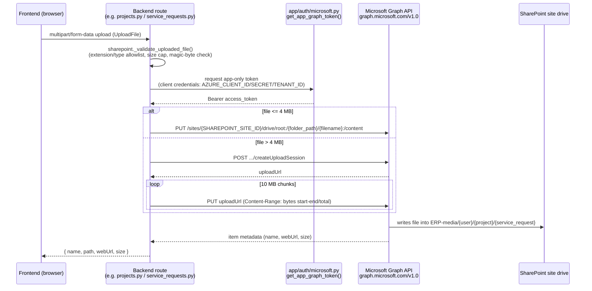

# Microsoft Graph Integration

This document covers every real use of the Microsoft Graph API in this codebase: SharePoint file storage, Graph-based email sending, Teams activity-feed push notifications, and Teams SSO. Authentication/authorization design (Entra ID app registration, session cookies, JWT) is documented in `../security/SECURITY.md` — this file only summarizes the Graph-facing pieces of that flow.

## 1. SharePoint file storage

**Source:** `backend/app/utils/sharepoint.py`

All ERP/CRM/Purchase file attachments (project photos, service request media, PR attachments, CRM documents) are stored in a single SharePoint document library, accessed exclusively through Microsoft Graph's `/sites/{site-id}/drive` endpoints using an **app-only token** (client-credentials grant — no per-user delegated permissions, no user ever touches SharePoint directly).

### Config

From `backend/app/core/config.py`:

| Setting | Purpose |
|---|---|
| `AZURE_CLIENT_ID` / `AZURE_CLIENT_SECRET` / `AZURE_TENANT_ID` | Entra ID app registration credentials used to acquire the app-only Graph token (`app.auth.microsoft.get_app_graph_token`) |
| `SHAREPOINT_SITE_ID` | The Graph site ID of the target SharePoint site (`/sites/{SHAREPOINT_SITE_ID}/drive`) |
| `SHAREPOINT_FOLDER` | Root folder name inside the site's default drive (defaults to `"ERP-media"`) |

### Folder convention

`build_sharepoint_folder_path(user_name, project_name, service_request_number)` builds a path of the form:

```
{SHAREPOINT_FOLDER}/{sanitized user_name}/{sanitized project_name}/{sanitized service_request_number}
```

Each segment is sanitized (`sanitize_folder_name`) to strip characters illegal in SharePoint paths (`\ / : * ? " < > |`).

### Functions

- **`upload_file_to_sharepoint(site_id, folder_path, upload_file)`** — validates the file first (`_validate_uploaded_file`: extension/content-type allowlist, blocks dangerous types like SVG/HTML/JS, enforces a 2 GB cap, and verifies the file's real byte signature against its claimed extension to catch renamed/spoofed uploads). Files ≤ 4 MB (`SIMPLE_UPLOAD_LIMIT`, Graph's simple-upload limit) go via a single `PUT .../root:/{path}:/content`. Larger files use a resumable session: `_start_large_upload_session` (`POST .../createUploadSession`) followed by `_upload_large_file`, which streams the file in 10 MB chunks via `PUT` with `Content-Range` headers.
- **`delete_file_from_sharepoint(site_id, file_path)`** — `DELETE .../root:/{path}`.
- **`download_file_content(site_id, file_path)`** — `GET .../root:/{path}:/content`, returning raw bytes + content-type so the backend can re-serve the file from its own origin (used for in-app image/PDF/video rendering instead of Microsoft's Office viewer, which refuses to be iframed). Callers must do their own authorization check first.
- **`get_preview_url(site_id, file_path)`** — `POST .../root:/{path}:/preview`, mints a short-lived embeddable Microsoft preview link. Also requires the caller to authorize access first, since the returned URL grants read access to anyone holding it.

All Graph calls are made with `httpx.AsyncClient` directly against `https://graph.microsoft.com/v1.0`; there is no Graph SDK dependency.

### Callers

Grep for `from app.utils.sharepoint import` / `sharepoint.` across `backend/app/modules` shows these routes use it:

- `backend/app/modules/erp/routes/projects.py` — project attachments
- `backend/app/modules/erp/routes/service_requests.py` — service request media/attachments
- `backend/app/modules/p2p/routes/p2p_requests.py` — PR attachments
- `backend/app/modules/crm/routes/activities.py` — CRM activity documents
- `backend/app/modules/crm/routes/documents.py` — CRM document library

### Upload flow



## 2. Email — sent via Graph `sendMail`, not SMTP

**Source:** `backend/app/utils/email.py`

Outbound email (service-request client/team notifications, p2p alerts to the Purchase department, and a diagnostic `/test-email` endpoint in `backend/app/modules/erp/routes/service_requests.py`) is sent through Microsoft Graph's `POST /v1.0/users/{sender}/sendMail` endpoint using the same app-only token as SharePoint (`get_app_graph_token`). There is **no SMTP/`smtplib`/`aiosmtplib` anywhere in this codebase** — all email is Graph API mail, sent "as" the mailbox configured in `SENDER_EMAIL`, with `TEAM_EMAIL` as the internal recipient for team-facing alerts. The company logo is embedded as a base64 CID inline attachment (not a remote image URL) so it renders even with "block external images" enabled and works in local dev where there's no public URL.

## 3. In-app notifications + Teams activity-feed push

**Source:** `backend/app/utils/notifications.py`

This module is primarily **in-app, DB-backed notifications**: `broadcast_notification` / `notify_user` insert rows into the `Notification` table (via SQLAlchemy `Session`) for every user with access to the given app. It does **not** send email.

In addition, for any user with an `azure_id` set, it makes a *real* Graph call to push a native Teams activity-feed notification (bell icon + toast + mobile push inside Microsoft Teams): `POST https://graph.microsoft.com/v1.0/users/{azure_user_id}/teamwork/sendActivityNotification`, using a token acquired via `get_msal_app().acquire_token_for_client(...)` (app-only, same credential set as above). The payload's `webUrl` is a Teams deep link (`https://teams.microsoft.com/l/entity/{TEAMS_APP_ID}/home?webUrl=...`) pointing at the deployed portal (`https://erp.premnathrailtools.cloud/dashboard`); `TEAMS_APP_ID` must match the Teams app manifest's catalog ID. Failures here are caught and logged — they never block the in-app notification write.

## 4. Entra ID / MSAL authentication (SSO)

Config keys `AZURE_CLIENT_ID`, `AZURE_CLIENT_SECRET`, `AZURE_TENANT_ID` in `backend/app/core/config.py` drive both the app-only Graph token used above and the interactive login flow in `backend/app/modules/main/routes/auth.py` (OAuth authorization-code redirect flow via `app/auth/microsoft.py`, plus JWKS validation and On-Behalf-Of token exchange for Teams SSO — see below). Full session/cookie/JWT design is documented in `../security/SECURITY.md`; this file only covers the Graph-facing calls.

## 5. Microsoft Teams integration — real, working SSO (not just an installed-but-unused package)

**Frontend:** `frontend/src/app/login/page.tsx` and `frontend/src/app/auth/teams-success/page.tsx` are the only two files importing `@microsoft/teams-js`.

- `login/page.tsx` dynamically imports `@microsoft/teams-js`, calls `teams.app.initialize()` to detect whether the app is running inside a Teams tab, and if so calls `teams.authentication.getAuthToken()` for silent SSO — posting the resulting token to the backend instead of showing the normal login form.
- `auth/teams-success/page.tsx` is the popup hand-off landing page for the redirect-based Teams login path.

**Backend:** `backend/app/modules/main/routes/auth.py` implements two dedicated endpoints:

- `POST /auth/teams-token` — validates a Teams `getAuthToken()` SSO JWT: fetches/caches Azure AD's JWKS, verifies signature/audience/issuer, enforces replay protection (`_used_token_ids`, keyed by `jti`), creates/updates the local `User` (matched by `azure_id`), then performs a best-effort On-Behalf-Of exchange (`msal.ConfidentialClientApplication.acquire_token_on_behalf_of`) to obtain a delegated Graph token — OBO failure does not block login.
- `POST /auth/teams-exchange` — swaps a one-time code (issued by `/auth/callback` for the Teams *popup* flow, since the popup's cookie jar is isolated from the main Teams frame) for real session cookies.

This is exercised by a real test suite, `backend/app/tests/test_teams_sso.py`, covering rejection of missing/malformed/wrong-audience/wrong-issuer/replayed tokens, successful session creation, and OBO-failure resilience.

**Verdict:** Teams SSO (tab detection + silent `getAuthToken()` + OBO Graph token exchange + popup-code fallback) is a real, tested feature. There is **no evidence of a broader Teams app** beyond this SSO path and the activity-feed push in §3 — no Teams bot, no Teams message extension, no adaptive cards, no tabs beyond the login/SSO hand-off pages. `TEAMS_APP_ID`/manifest referenced in `notifications.py` is only used to build the deep link for activity notifications.

## 6. Calendar / Planner / Outlook events

No Graph Calendar, Planner, or Outlook-events integration exists anywhere in this codebase. A grep across `backend/` for `calendar|planner|outlook` (case-insensitive) returns no matches. If calendar or task-planning features are ever added, they are not present today.

## 7. Copilot / Copilot Studio / AI agents

No Copilot or Microsoft 365 Copilot/Copilot Studio integration exists anywhere in this codebase. A case-insensitive grep for `copilot` across both `backend/` and `frontend/src` returns no matches.
