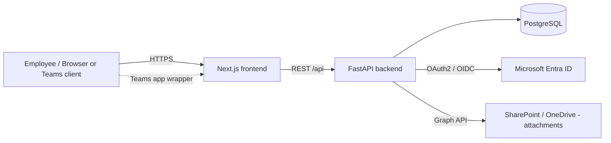

# Software Requirements Specification (SRS)

> Grounded in the actual codebase as of 2026-08-14. See [../product/PRODUCT.md](../product/PRODUCT.md) for the business-level view this SRS formalizes.

## 1. Overview

The Premnathrail Portal is an internal, Microsoft-SSO-gated web application (FastAPI backend, Next.js/React frontend, PostgreSQL database) serving five independently access-controlled modules:

| Module key (`AppModule`) | Purpose |
|---|---|
| `erp` | Service Module: machine/project registry, service request lifecycle, materials, warranty/AMC |
| `crm` | Organizations, inquiries, tenders, activities, Minutes of Meeting |
| `rnd` | Railway engineering calculators (braking, hydraulic, load distribution, qmax, spline, tractive effort) |
| `purchase` | Purchase Requisitions raised from a Service Request's materials list; also hosts the Purchase team's queue for the standalone module below |
| `p2p` | Standalone Purchase Requisition module — any department raises a PR directly |

## 2. Actors

| Actor | Definition in code |
|---|---|
| **Admin** | `User.role == 'admin'`. Implicitly granted every module (`get_apps()` in `backend/app/modules/main/models/user.py` returns `AVAILABLE_APPS` for admins) and every ERP permission. |
| **User (module member)** | `User.role == 'user'` with one or more modules present in `assigned_apps`. |
| **ERP-permissioned user** | A `user` whose `erp_permissions` list includes a given granular flag (e.g. `sr_edit`); enforced client-side via `useRequireErpPermission` in `frontend/src/hooks/useAuth.ts` and mirrored server-side per code comments. |
| **Unauthenticated visitor** | Anyone without a valid session; redirected to `/login`, which initiates Microsoft SSO. |
| **Microsoft Entra ID (Azure AD)** | External identity provider; the system trusts it exclusively for authentication — see `backend/app/modules/main/routes/auth.py`. |
| **Microsoft Graph / SharePoint** | External system used only as attachment storage (`backend/app/utils/sharepoint.py`), not as an actor with UI-level actions in this system. |

## 3. System Context

- The frontend never talks to SharePoint or Entra ID directly for data; the backend brokers both (`get_app_graph_token`, `exchange_code_for_token` in `backend/app/auth/microsoft.py`, referenced from `auth.py` and `sharepoint.py`).
- A Teams-specific token-exchange path exists (`/auth/teams-token`, `/auth/teams-exchange` in `auth.py`), confirming the app is also consumed inside a Microsoft Teams app wrapper, not only a standalone browser tab.

## 4. Assumptions

- The organization's Microsoft 365 tenant and Entra ID app registration remain active and correctly configured (`AZURE_CLIENT_ID`, `AZURE_CLIENT_SECRET`, `AZURE_TENANT_ID` per README setup instructions).
- Users have a company Microsoft account; there is no local username/password fallback anywhere in `backend/app/modules/main/routes/auth.py`.
- SharePoint/Graph API is reachable for attachment upload/download; `backend/app/utils/sharepoint.py` enforces a practical 2 GB file-size ceiling and an allow-list of extensions/content-types (documents, images, common video formats).
- Module and permission names (`AVAILABLE_APPS`, `AppModule`, ERP permission strings) are currently hardcoded in both backend and frontend rather than DB-driven — a constraint the current product roadmap flags as needing to change before many more modules are added (see `../product/PRODUCT.md`, Product Roadmap section).

## 5. Constraints

- **Auth**: Microsoft SSO only — no other identity provider, no password auth.
- **Architecture**: modular monolith (`backend/app/modules/{erp,crm,rnd,purchase,p2p,main}/`), each module following models → schemas → repositories/service → routes.
- **Storage**: relational data in PostgreSQL via SQLAlchemy; binary attachments in SharePoint, referenced by URL/path columns only (never stored as blobs in Postgres) — see e.g. `ProjectAttachment.sharepoint_path`/`sharepoint_url` in `frontend/src/types/index.ts` and the mirrored backend model.
- **Deletion model**: destructive deletes on key entities (Service Requests, CRM Organizations/Inquiries/Tenders/Notes/Activities/Documents) are soft-deletes (`is_deleted` flag) rather than physical row deletes — see Non-Functional Requirements for detail.
- **No native mobile app**: the same web frontend is used in-browser and inside a Teams app wrapper; there is no separate iOS/Android codebase in this repo.

## 6. Out of Scope

Confirmed by absence of any corresponding module in `backend/app/modules/`:
- Accounting/finance (system of record: SAP)
- HR (system of record: ADP)
- Email client (Outlook is used directly)
- General-purpose document management (SharePoint itself; the portal only stores attachment references)

## 7. Related Documents

- [FUNCTIONAL_REQUIREMENTS.md](FUNCTIONAL_REQUIREMENTS.md)
- [NON_FUNCTIONAL_REQUIREMENTS.md](NON_FUNCTIONAL_REQUIREMENTS.md)
- [USER_STORIES.md](USER_STORIES.md)
- [USE_CASES.md](USE_CASES.md)
- [ACCEPTANCE_CRITERIA.md](ACCEPTANCE_CRITERIA.md)
- [../product/PRODUCT.md](../product/PRODUCT.md)
