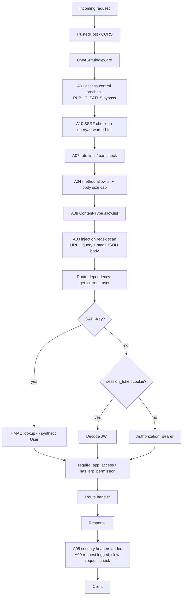

# Security Guide

How to keep Premnathrail Portal secure.

## What's Actually Implemented (this codebase)

The rest of this document is general guidance; this section maps it to real
code so "is X actually done?" has a concrete answer.

### `OWASPMiddleware` (`backend/app/middleware/owasp.py`)

Registered globally in `main.py` (after CORS/TrustedHost/logging). Runs on
every request:

| OWASP category | What it does |
|---|---|
| A01 Broken Access Control | Rejects any `/api/` request with no Bearer token, `session_token` cookie, or `X-API-Key` before it reaches the route (`PUBLIC_PATHS` bypass the check). Also tracks repeated 404s per IP as scan behavior. |
| A03 Injection | Regex-scans the URL, query string, and suspicious headers for SQLi/XSS/path-traversal/template-injection/command-injection patterns; separately scans small JSON bodies on POST/PATCH/DELETE. URL is `urllib.parse.unquote`'d first so percent-encoded payloads (`%20`, `%3C`) still match. |
| A04 Insecure Design | Body size caps (512 KB JSON / 10 GB multipart), HTTP method allowlist, Content-Type allowlist on mutating requests, slow-request logging (>5s). |
| A05 Security Misconfiguration | `X-Content-Type-Options`, `Strict-Transport-Security`, CSP, `Referrer-Policy`, `Permissions-Policy`, COOP/CORP on every response; strips `Server`/`X-Powered-By` headers. |
| A07 Auth & Session Failures | Per-bucket sliding-window rate limits (`auth`: 5/min, `delete`: 10/min, `write`: 40/min, `default`: 200/min) keyed by client IP; 10 violations within the ban window (10 min) auto-bans the IP (`429` + `Retry-After`). |
| A06 Vulnerable Components | **Not automated.** There is no CI pipeline in this repo (no `.github/workflows`, no `pip-audit`/`safety` job configured anywhere) — dependency vulnerability scanning is a manual/periodic task today, not an enforced gate. Treat any claim elsewhere in this doc of automated dependency scanning as aspirational until a CI job actually exists. |
| A08 Data Integrity | Rejects mutating requests with a missing/disallowed `Content-Type`. |
| A09 Logging & Monitoring Failures | Every request gets a `Request-ID` (generated or passed through), logged with the outcome; security-relevant rejections are tagged in logs (`[A01]`, `[A03]`, `[A07]`, etc. — grep `owasp.py` for the exact tag used at each rejection point); requests slower than `SLOW_REQUEST_MS` (5000ms) are logged as a slow-request warning regardless of outcome. |
| A10 SSRF | Blocks query params and `X-Forwarded-For`/`X-Real-IP` header values that resolve to a private/loopback/link-local IP (RFC 1918, `127.0.0.0/8`, `169.254.0.0/16`, `::1`, `fc00::/7`, plus `localhost`/`*.internal`/`*.local`). |

Bulk-DELETE protection lives in the same middleware: a `DELETE` on a bare
collection endpoint (e.g. `/api/v1/erp/projects`, no `{id}`) is rejected with
`405`, and any `DELETE` whose query string looks like an id list (`ids=1,2,3`)
is rejected with `400` — per-resource delete is the only supported shape.

Tests: `backend/app/tests/test_security_middleware.py`.

### API Key Authentication (`backend/app/middleware/api_key.py`, `.../routes/api_keys.py`)

Keys are `pew_<random>`, stored as `HMAC-SHA256(raw_key, SECRET_KEY)` — the raw
key is shown exactly once, at creation, and never persisted or logged. Admin
CRUD lives at `/api/v1/api-keys` (list/create/revoke). A validated key acts as
a synthetic `User` (`role="api_service"`) scoped to `allowed_apps`.

### Microsoft Teams SSO (`backend/app/modules/main/routes/auth.py`)

`/auth/teams-token` validates a Teams `getAuthToken()` JWT: decodes the payload
to check `aud`/`iss` before ever hitting the network, rejects replays via a
`jti`-keyed in-memory set, fetches/caches the tenant's JWKS (1 hour TTL) and
verifies the RS256 signature with `python-jose`, then attempts an
On-Behalf-Of exchange (MSAL `acquire_token_on_behalf_of`) for a Graph token —
OBO failure doesn't block login, it just means Graph-backed features degrade.
`/auth/teams-exchange` hands the Teams *popup* flow's one-time code (120s TTL,
issued by `/auth/callback`) back to the main frame as real session cookies.

### Session delivery

`/auth/callback` and both Teams routes set `session_token` as an **httponly**
cookie (`SameSite=None; Secure` when `SECURE_COOKIES=true`, `SameSite=Lax`
otherwise — Teams needs `None`+`Secure` because the portal runs inside a
cross-site iframe). `get_current_user` checks, in order: `X-API-Key` →
`session_token` cookie → `Authorization: Bearer`. OAuth `state` is
server-side only (in-memory, 10-minute TTL, capped at 500 pending), never a
browser cookie — avoids SameSite issues during the redirect round-trip
entirely.

### Presence indicator auth note

`/api/v1/presence/*` (see [ARCHITECTURE.md](../architecture/ARCHITECTURE.md))
requires a valid session like any other route, but does **not** check that the
caller actually has access to the specific SR/project id being "viewed" —
matches legacy behavior, low risk (leaks only a name/email pair, not record
data), but worth knowing if this is ever extended.

---

## Security Architecture Overview

Every `/api/` request passes through the same middleware stack before it
reaches a route handler. `OWASPMiddleware` is registered globally in
`backend/app/main.py`; the auth dependency (`get_current_user`) runs per-route
as a FastAPI dependency, not as middleware, but is included below since it's
on every protected request's path.



Bulk-DELETE protection and per-IP ban enforcement live inside the same
`OWASPMiddleware` pass, not shown as separate boxes above for brevity — see
the OWASP table below for details.

---

## Authentication Design

- **Primary path (web app): Microsoft SSO / Entra ID only.** There is no
  password login anywhere in the product. The flow is standard OAuth
  authorization-code: `/auth/login` redirects to Microsoft, `/auth/callback`
  exchanges the code, verifies the user's email domain (if `DOMAIN_EMAIL` is
  set), creates/updates the local `User` row, and issues a JWT as an
  **httponly** `session_token` cookie (`SameSite=None; Secure` when
  `SECURE_COOKIES=true`, else `SameSite=Lax`). OAuth `state` is tracked
  server-side only (in-memory, 10-minute TTL, capped at 500 pending) — never
  a browser cookie — so the redirect round-trip has no SameSite dependency.
- **Teams path:** `/auth/teams-token` validates a Teams `getAuthToken()` JWT
  (checks `aud`/`iss` from the decoded payload before any network call,
  rejects replays via a `jti` set, verifies the RS256 signature against the
  tenant's cached JWKS), then attempts an On-Behalf-Of exchange for a Graph
  token (failure degrades Graph-backed features but doesn't block login).
  `/auth/teams-exchange` hands a one-time code (120s TTL) from the Teams
  popup back to the main frame as real session cookies — needed because
  Teams runs the app in a cross-site iframe.
- **`get_current_user` resolution order:** `X-API-Key` header →
  `session_token` cookie → `Authorization: Bearer` header. The first one
  present wins; there's no fallback chaining beyond first-match.
- **Secondary path: API keys.** See [API Key Authentication](#api-key-authentication-backendappmiddlewareapikeypy-routesapi_keyspy)
  above and the Permission Matrix for how far this path actually reaches.
- **Session lifetime:** JWT expiry is `ACCESS_TOKEN_EXPIRE_MINUTES` (24
  hours by default) — there is no refresh-token rotation; a user simply
  re-authenticates via SSO once the cookie's JWT expires.

---

## Authorization / RBAC

Authorization is two-layered:

1. **Module access** — every user has a `role` and an `assigned_apps` list;
   `User.get_apps()` returns every module (`erp`, `crm`, `rnd`, `purchase`,
   `p2p`) for `role == "admin"`, or exactly
   `assigned_apps` otherwise. Backend routes gate on this via the
   `require_app_access(app_name)` FastAPI dependency
   (`backend/app/core/permissions.py`); frontend pages mirror it with the
   `useRequireApp(appName)` hook (`frontend/src/hooks/useAuth.ts`) for UX
   purposes only — the frontend guard is not itself a security boundary.
2. **Granular ERP permissions** — only the `erp` module has a second,
   per-action layer (`project_create/edit/delete`, `sr_create/edit/delete`,
   plus `project_view`/`sr_view` which are assignable but not currently
   checked by any route) stored in `User.erp_permissions` and checked with
   `has_erp_permission(user, permission)`. CRM, R&D, and both purchase
   modules have no such breakdown — module access is all-or-nothing for
   them today.

Admins (`role == "admin"`) bypass both layers implicitly — `get_apps()`
returns everything, and `has_erp_permission` short-circuits to `True`. A
separate `require_admin` dependency (`backend/app/modules/main/routes/users.py`)
gates user-management endpoints and is stricter still (checks `role`
directly, unrelated to module grants).

For the full, code-derived route-by-route and page-by-page breakdown —
including two identified inconsistencies in the `purchase` vs
`p2p` app boundary — see
**[PERMISSION_MATRIX.md](./PERMISSION_MATRIX.md)**.

---

## Authentication & Authorization

### Do's ✅

- ✅ Use Microsoft SSO (no passwords)
- ✅ Validate JWT tokens on every protected route
- ✅ Check user.is_active (disabled users denied)
- ✅ Use HTTPS only (redirect HTTP)
- ✅ Set HttpOnly cookies (prevent XSS access)
- ✅ Refresh tokens periodically (24 hour expiry)
- ✅ Log all auth events (login, logout, failed attempts)

### Don'ts ❌

- ❌ Store passwords in database (use Microsoft SSO instead)
- ❌ Hardcode credentials in code
- ❌ Send tokens in URL (use Authorization header)
- ❌ Accept tokens without validation
- ❌ Use weak SECRET_KEY
- ❌ Log tokens or passwords

---

## Database Security

### Connection

- ✅ Use connection pooling
- ✅ Encrypt connection to database (SSL)
- ✅ Use strong database password (20+ chars, random)
- ✅ Restrict database network access (VPC security group)

### Queries

- ✅ Use parameterized queries (SQLAlchemy does this)
- ✅ Never concatenate user input into SQL

```python
# ✅ Good — SQLAlchemy handles escaping
user = db.query(User).filter(User.email == email).first()

# ❌ Bad — SQL injection vulnerability
user = db.query(f"SELECT * FROM users WHERE email = '{email}'")
```

### Backups

- ✅ Backup database daily
- ✅ Encrypt backups
- ✅ Store backups in secure location (S3 with encryption)
- ✅ Test restore procedure monthly

---

## API Security

### Input Validation

- ✅ Validate all inputs (using Pydantic)
- ✅ Limit field lengths (prevent DoS)
- ✅ Reject unexpected fields

```python
class CreateNoteSchema(BaseModel):
    title: str  # Pydantic validates type
    description: str | None = None
```

### Rate Limiting

- ✅ Limit API requests per user (e.g., 100 req/min)
- ✅ Limit login attempts (e.g., 5 attempts/5 min)
- ✅ Block IP after repeated failures

### CORS

- ✅ Restrict CORS to known domains
- ✅ Don't use `allow_origins=["*"]` in production

```python
app.add_middleware(
    CORSMiddleware,
    allow_origins=["https://app.premnathrail.com"],
    allow_methods=["GET", "POST", "PUT", "DELETE"],
)
```

---

## Secrets Management

### What's actually implemented

`backend/app/core/config.py` loads all secrets via `pydantic_settings`
(`Settings(BaseSettings)`, `env_file=".env"`): `SECRET_KEY`,
`AZURE_CLIENT_ID`/`AZURE_CLIENT_SECRET`/`AZURE_TENANT_ID`, `database_url`,
SharePoint/Graph mail settings, etc. — no secret is hardcoded in source.

There's a real production guard, not just a convention: a
`@model_validator(mode="after")` (`_reject_placeholder_secret_in_production`)
raises at startup if `environment == "production"` and `SECRET_KEY` is
empty, still the placeholder `"..."`, or under 32 characters — the app
refuses to boot with a weak/default key in prod. No equivalent strength
check exists for `AZURE_CLIENT_SECRET` or `database_url` — those are trusted
as-provided.

API keys (the `pew_...` secondary auth path) get their own, stricter
treatment: the raw key is shown exactly once at creation time and only the
`HMAC-SHA256(raw_key, SECRET_KEY)` digest is persisted — the app itself
cannot recover a raw key from the database even if it wanted to.

Deployment-specific secret storage (Kubernetes secrets, a cloud secrets
manager, etc.) is an infra decision outside this repo's scope — this
section only covers what the application code itself does with secrets.

### Environment Variables

- ✅ Store secrets in `.env` (local development)
- ✅ Store secrets in your platform's secret store in production (Kubernetes secrets, AWS Secrets Manager, or your host's equivalent — whichever this deployment actually uses)

### Never commit secrets

```bash
# ✅ Good — secrets in .env (not committed)
DATABASE_URL=postgresql://...
SECRET_KEY=...

# ❌ Bad — secrets in code
app = FastAPI()
SECRET_KEY = "super-secret-key-123"  # Visible in git history!
```

### Rotate secrets regularly

- Change database password every 3 months
- Rotate Azure OAuth credentials yearly
- Rotate API tokens when compromised

---

## Code Security

### Dependencies

- ✅ Use known, maintained packages
- ✅ Pin versions in requirements.txt
- ✅ Check for vulnerabilities: `pip install safety && safety check`

### Code review

- ✅ Review all code before merging
- ✅ Look for security issues: SQL injection, XSS, CSRF
- ✅ Check dependencies are safe

### Testing

- ✅ Test authentication (login, token validation)
- ✅ Test authorization (user cannot access others' data)
- ✅ Test input validation (invalid data rejected)

---

## HTTPS & TLS

### Always use HTTPS

```python
# Redirect HTTP to HTTPS
@app.middleware("http")
async def https_redirect(request, call_next):
    if request.url.scheme == "http":
        url = request.url.replace(scheme="https")
        return RedirectResponse(url=url)
    return await call_next(request)
```

### TLS Certificate

- ✅ Use valid certificate (Let's Encrypt is free)
- ✅ Certificate must match domain name
- ✅ Renew certificate before expiry (auto-renewal recommended)
- ✅ Use TLS 1.2+ (disable older versions)

---

## Data Privacy

### Sensitive Data

These fields are sensitive:
- Passwords (don't store — use SSO)
- Tokens (don't log)
- Email addresses (encrypt if PII)
- Phone numbers (encrypt if stored)

### Data Retention

- Delete old data per policy (e.g., old notes after 2 years)
- GDPR right to be forgotten (delete user data)
- Backup older data separately

### Compliance

- GDPR — Protect EU user data
- CCPA — Protect California user data
- Industry standards (ISO 27001, SOC 2)

---

## Audit Logging

A single, polymorphic `AuditLog` table (`backend/app/modules/main/models/audit_log.py`)
backs a shared audit trail: `entity_type` + `entity_id` identify the record,
`action` + `field_name`/`old_value`/`new_value` capture the change,
`summary` holds a human-readable line, `performed_by_id` + `performed_at`
record who/when.

Confirmed callers (grep for `AuditLog(`):

- `backend/app/modules/erp/routes/projects.py`
- `backend/app/modules/erp/routes/service_requests.py`
- `backend/app/modules/crm/routes/inquiries.py`
- `backend/app/modules/crm/routes/organizations.py`
- `backend/app/modules/crm/routes/tenders.py`
- `backend/app/modules/purchase/routes/purchase_requisitions.py`
- `backend/app/modules/p2p/routes/p2p_requests.py`

**Gap:** `crm/routes/activities.py`, `crm/routes/notes.py`,
`crm/routes/documents.py`, `crm/routes/workflow.py`, and the entire `rnd`
module do **not** write to `AuditLog` — changes there (CRM activities/notes/
documents, task/approval/quotation/PO/competitor/discussion workflow items,
and all R&D calculations) leave no audit trail today. Worth a deliberate
decision (accepted gap vs. backlog item) rather than an oversight left
unflagged.

---

## Data Protection

### Soft delete

ERP (`projects`, `service_requests`) and CRM (`inquiries`, `organizations`,
`tenders`) use a `deleted_at` column rather than hard-deleting rows — this is
what backs the "Recycle Bin" pages in the frontend
(`dashboard/erp/recycle-bin`, `dashboard/crm/recycle-bin`). Purchase,
p2p, and R&D data were not found using this pattern at time
of writing — deletes there are presumed hard deletes; confirm against the
actual model files if this matters for a specific record type.

### PII stored

CRM `organizations`/`inquiries`/`tenders` and ERP `projects`/
`service_requests` schemas carry contact fields (client/contact email and
phone) as ordinary string columns — no field-level encryption or masking is
applied at the application layer; protection relies on transport (HTTPS),
access control (module/permission gates above), and database-level access
restriction. For the full schema/column-level detail, see
[../database/SCHEMA.md](../database/SCHEMA.md) and
[../database/ER_DIAGRAM.md](../database/ER_DIAGRAM.md) — this document
intentionally doesn't duplicate a full column dump.

### Bulk-delete protection

Covered by `OWASPMiddleware` (A04, see the OWASP table above): a bare
collection `DELETE` (no `{id}` in the path) is rejected with `405`, and a
`DELETE` whose query string looks like an id list (`ids=1,2,3`) is rejected
with `400`.

---

## Logging & Monitoring

### Logs to collect

- ✅ Login attempts (success and failure)
- ✅ API errors (500 errors)
- ✅ Database errors
- ✅ Security events (failed auth, suspicious activity)

### Logs to NOT collect

- ❌ Passwords
- ❌ Tokens
- ❌ Credit card numbers
- ❌ API keys

### Centralize logs

- ✅ Use ELK stack, CloudWatch, or Datadog
- ✅ Retention: 90 days minimum
- ✅ Alert on suspicious patterns

---

## Incident Response

### If compromised:

1. **Isolate** — Take affected system offline
2. **Assess** — What was accessed?
3. **Notify** — Inform affected users
4. **Fix** — Patch vulnerability
5. **Review** — How did this happen? Prevent next time.

### Contact list

- Security lead: [email]
- CTO: [email]
- Legal: [email]

---

## Security Checklist

### Development
- [ ] No hardcoded secrets
- [ ] Parameterized SQL queries
- [ ] Input validation
- [ ] Error handling (don't leak info)
- [ ] Tests for auth/authz

### Deployment
- [ ] HTTPS enabled
- [ ] Strong database password
- [ ] Rate limiting
- [ ] CORS configured
- [ ] Logging enabled
- [ ] Monitoring alerts

### Operations
- [ ] Database backups working
- [ ] Logs being collected
- [ ] Security patches applied
- [ ] Secrets rotated
- [ ] Incident response plan exists

---

## Resources

- [OWASP Top 10](https://owasp.org/www-project-top-ten/) — Common vulnerabilities
- [FastAPI security docs](https://fastapi.tiangolo.com/tutorial/security/) — Best practices
- [CWE Top 25](https://cwe.mitre.org/top25/) — Common weaknesses
- [AWS security best practices](https://aws.amazon.com/architecture/security-identity-compliance/)

---

**Questions?** Contact security team.
