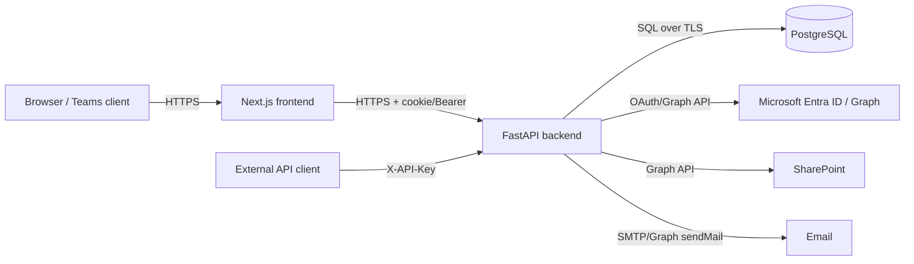

# Threat Model — Premnathrail Portal

> Identifies threats, attack surfaces, and mitigations using STRIDE. Companion to [SECURITY.md](SECURITY.md) (which documents *what's implemented*) — this document analyzes *what could go wrong* and cross-references the existing mitigation. See [PERMISSION_MATRIX.md](PERMISSION_MATRIX.md) for the full authorization breakdown.

## 1. Scope & Assets

**In scope**: the FastAPI backend, Next.js frontend, PostgreSQL database, and their trust boundaries with Microsoft Entra ID (SSO/Teams), SharePoint (attachments), and reverse-proxy/hosting infra.

**Key assets**:
- Customer/business data (CRM organizations, inquiries, tenders, quotations)
- Client machine + service records (ERP projects, service requests)
- Purchase/financial-adjacent data (PRs, vendor info, PO references)
- User identity & session tokens (JWT `session_token`, API keys)
- Audit trail (`AuditLog` table)

## 2. Trust Boundaries

Each arrow is a trust boundary crossing — the sections below walk STRIDE per boundary.

## 3. STRIDE Analysis

### Spoofing (identity)

| Threat | Attack Surface | Mitigation | Status |
|---|---|---|---|
| Forged session token | `session_token` cookie / `Authorization: Bearer` | JWT signed with `SECRET_KEY`; startup validator rejects weak/placeholder keys in production (`config.py`) | ✅ Mitigated |
| Stolen API key reused | `X-API-Key` header | Raw key shown once at creation, only HMAC-SHA256 digest persisted — server can't leak a reusable raw key from its own DB | ✅ Mitigated |
| Teams token replay | `/auth/teams-token` | `jti`-keyed in-memory replay set rejects reuse; RS256 signature verified against cached JWKS | ✅ Mitigated |
| IP spoofing to bypass rate limiting | `X-Forwarded-For` header | `TRUSTED_PROXIES` fails closed by default — untrusted forwarded headers ignored | ✅ Mitigated (if configured correctly in prod) |
| OAuth `state` forgery (CSRF on login) | `/auth/callback` | `state` tracked server-side only, in-memory, 10-min TTL — never a spoofable cookie | ✅ Mitigated |

### Tampering (data integrity)

| Threat | Attack Surface | Mitigation | Status |
|---|---|---|---|
| SQL injection | Any user-supplied field reaching a query | SQLAlchemy parameterized queries throughout; `OWASPMiddleware` also regex-scans URL/query/body for SQLi patterns (defense in depth) | ✅ Mitigated |
| Request body tampering (unexpected fields, oversized payload) | POST/PATCH/PUT bodies | Pydantic schema validation rejects unexpected fields; 512KB JSON / 10GB multipart caps | ✅ Mitigated |
| Bulk-delete abuse (mass tampering via collection DELETE) | `DELETE /api/v1/.../{collection}` | Bare-collection DELETE rejected (405); id-list query strings rejected (400) | ✅ Mitigated |
| Audit trail tampering/gaps | CRM activities/notes/documents/workflow, all of R&D | **No** `AuditLog` writes for these routes — a malicious or buggy change here leaves no record | ⚠️ **Gap** — flagged in `SECURITY.md` §Audit Logging |

### Repudiation (deniability)

| Threat | Attack Surface | Mitigation | Status |
|---|---|---|---|
| User denies performing an action | Any mutating endpoint | `AuditLog` records `performed_by_id`/`performed_at` for ERP, CRM (inquiries/orgs/tenders), Purchase, P2P | ✅ Mitigated for covered modules |
| Same, on uncovered modules | CRM activities/notes/documents/workflow, R&D | No audit record exists to counter a denial | ⚠️ **Gap** — same as above |
| Request-level traceability missing | Any request | Every request gets a `Request-ID`, logged with outcome | ✅ Mitigated |

### Information Disclosure

| Threat | Attack Surface | Mitigation | Status |
|---|---|---|---|
| Cross-tenant/cross-org data leak via missing authz check | Any `GET` by id | Module access (`require_app_access`) + ERP-only granular permissions gate most routes | ✅ Mitigated for gated modules |
| Presence endpoint leaks who's viewing a record the caller can't access | `/api/v1/presence/*` | Requires valid session but does **not** check record-level access — leaks name/email pair only, not record data | ⚠️ **Accepted low-risk gap** (documented in `SECURITY.md`) |
| PII exposure (contact email/phone) at rest | CRM/ERP contact fields | No field-level encryption — relies on transport (HTTPS) + access control + DB-level restriction | ⚠️ **Accepted risk** — acceptable only if DB access is tightly restricted |
| Sensitive data in logs | Application logs | Explicit "don't log" list: passwords, tokens, credit cards, API keys (raw key never persisted at all) | ✅ Mitigated by design |
| Verbose error responses leaking internals | Any 500 error | Not verified in this pass — confirm FastAPI's default exception handling doesn't leak stack traces in production | ❓ **Unverified** — recommend a manual check |
| SSRF via query params / forwarded headers | Any endpoint accepting URLs | `OWASPMiddleware` blocks private/loopback/link-local IP targets | ✅ Mitigated |

### Denial of Service

| Threat | Attack Surface | Mitigation | Status |
|---|---|---|---|
| Auth brute-force | `/auth/*` | 5 req/min bucket, auto-ban after 10 violations in 10 min | ✅ Mitigated |
| Write/delete flooding | Mutating endpoints | 40/min (write), 10/min (delete) buckets | ✅ Mitigated |
| Oversized payload DoS | Any body | 512KB JSON / 10GB multipart caps | ✅ Mitigated |
| Slow-request resource exhaustion | Any endpoint | Slow requests (>5s) logged, but **not throttled or killed** — logging only, not prevention | ⚠️ **Partial** |
| No general API rate limiting beyond auth/write/delete buckets confirmed comprehensive | All endpoints | `default: 200/min` bucket exists per `SECURITY.md`, but `README.md` Next Steps still lists "Add rate limiting" as open — reconcile which is accurate | ❓ **Needs reconciliation** — see [Risk Register R-06](../product/RISK_REGISTER.md) |

### Elevation of Privilege

| Threat | Attack Surface | Mitigation | Status |
|---|---|---|---|
| Non-admin escalates via `assigned_apps` manipulation | Any write to `User.assigned_apps` | Only `require_admin`-gated user-management routes can modify this | ✅ Mitigated (assuming no other write path exists — not independently re-verified here) |
| ERP granular permission bypass | ERP routes | `has_erp_permission` checked per action; admins short-circuit to `True` by design (expected, not a bug) | ✅ Mitigated |
| Frontend-only permission checks mistaken for real security | `useRequireApp` hook | Explicitly documented as UX-only, not a security boundary — backend `require_app_access` is the real gate | ✅ Understood risk, correctly documented |
| `purchase` vs `p2p` app-boundary inconsistency | Purchase-related routes | `SECURITY.md` references "two identified inconsistencies" in `PERMISSION_MATRIX.md` | ⚠️ **Gap** — see that file for specifics |

## 4. Summary of Open Gaps

1. **Audit trail coverage** — CRM activities/notes/documents/workflow and all of R&D have no audit log (Tampering + Repudiation)
2. **Purchase/P2P permission boundary inconsistencies** — documented in `PERMISSION_MATRIX.md`, not yet resolved
3. **Slow-request logging without throttling** — DoS mitigation is detection-only for this vector
4. **Rate-limiting status unclear** — `SECURITY.md` describes buckets as implemented, `README.md` Next Steps still lists it as a to-do; needs reconciliation
5. **PII field-level encryption** — accepted risk, not a gap per se, but worth an explicit sign-off
6. **Error response verbosity** — unverified whether production stack traces are suppressed

## 5. Recommendations (Priority Order)

1. Reconcile the rate-limiting status contradiction between `SECURITY.md` and `README.md`
2. Decide (accept vs. backlog) the missing audit trail on CRM activities/notes/documents/workflow + R&D
3. Resolve the two `purchase`/`p2p` permission inconsistencies noted in `PERMISSION_MATRIX.md`
4. Verify production error responses don't leak stack traces
5. Add automated dependency vulnerability scanning (`SECURITY.md` already flags this as manual-only today)

---
*Last updated: 2026-08-27. Re-run this analysis whenever a new external integration, auth path, or data type is added — and whenever an item in §4 is resolved, move it here to a "Closed" section instead of deleting the row.*
