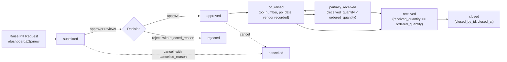
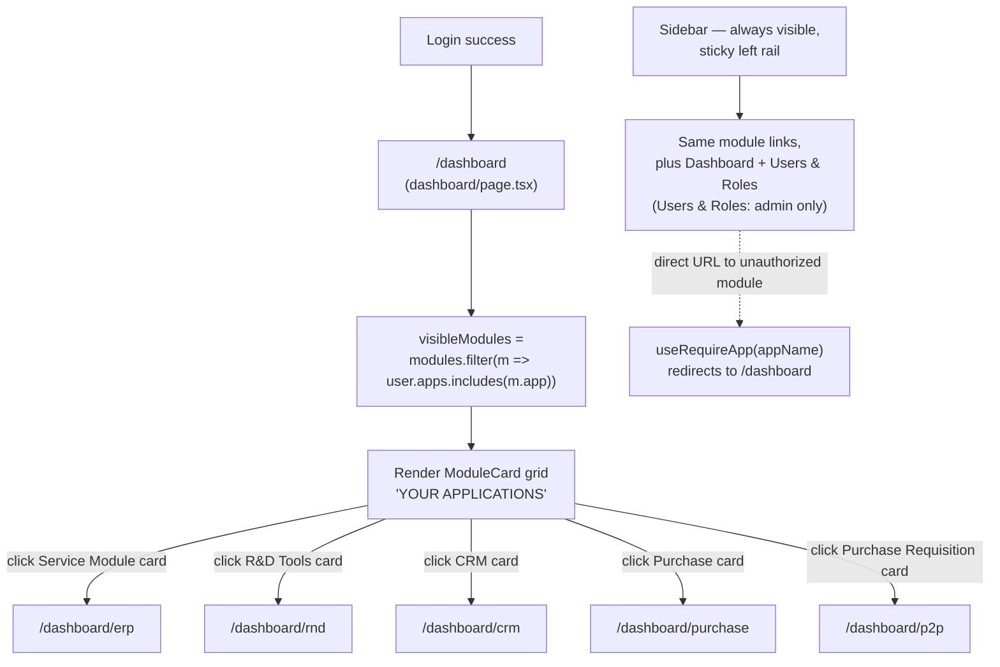

# User Flows

Grounded in the actual frontend implementation — file paths cited throughout. Cross-reference: [../product/PRODUCT.md](../product/PRODUCT.md).

## 1. Microsoft SSO Login

Source: `frontend/src/app/login/page.tsx`, `frontend/src/hooks/useAuth.ts`, `frontend/src/store/authStore.ts` (referenced), backend `/auth/microsoft-login` and `/auth/callback`.

The session lives in an **httponly cookie** set by the backend `/auth/callback` — the frontend cannot read it directly, so on every page load it must ask the backend "am I logged in?" via `GET /auth/me` (`useAuth()` calls `fetchUser()` once on mount, gated by `hasChecked`).

Two distinct login paths exist in the code: a normal browser redirect flow, and a Microsoft Teams-embedded flow (silent SSO, falling back to a popup). There is also a legacy `?token=` query-param path for old bookmarked links (`setToken(token)` in `useEffect`).

```mermaid
sequenceDiagram
    actor U as User
    participant B as Browser (login/page.tsx)
    participant API as Backend (/auth/*)
    participant MS as Microsoft Identity Platform

    U->>B: Navigate to /login
    B->>API: GET /auth/me (fetchUser, via useAuth hook)
    API-->>B: 401 (not authenticated)
    B->>B: Render "Sign in with Microsoft" button

    alt Standard browser flow
        U->>B: Click "Sign in with Microsoft"
        B->>API: window.location.href = /auth/microsoft-login
        API->>MS: Redirect to Microsoft OAuth consent screen
        U->>MS: Enter work-account credentials
        MS->>API: Redirect to /auth/callback with auth code
        API->>MS: Exchange code for tokens
        API->>API: Validate email domain is authorized; check user is_active
        alt domain unauthorized
            API-->>B: Redirect to /login?error=unauthorized
        else account inactive
            API-->>B: Redirect to /login?error=inactive
        else success
            API->>API: Set httponly session cookie
            API-->>B: Redirect to /dashboard
        end
    else Inside Microsoft Teams tab
        B->>B: teams.app.initialize() resolves (detected as Teams host)
        B->>MS: teams.authentication.getAuthToken() (silent SSO)
        alt silent token succeeds
            B->>API: POST teams-token-login(token)
            API-->>B: Session cookie set
            B->>B: fetchUser() then router.push("/dashboard")
        else silent SSO fails
            B->>B: Show "Sign-in required — tap below to continue."
            U->>B: Click continue
            B->>MS: teams.authentication.authenticate() (popup, 600x640)
            MS-->>B: Auth code
            B->>API: teamsExchange(code)
            API-->>B: Session cookie set
            B->>B: router.push("/dashboard")
        end
    end

    B->>B: On /dashboard, useAuth redirects to /login if hasChecked && !user
```

Error states actually rendered in code (`ERROR_MESSAGES` map in `login/page.tsx`):
- `unauthorized` → "Your Microsoft account's email domain is not authorized for this portal."
- `inactive` → "Your account has been deactivated. Contact an administrator."
- any other `?error=` value → generic "Sign-in failed. Please try again."

The sign-in button shows a spinner and "Redirecting to Microsoft…" while `busy` is true.

## 2. Raising a Service Request (ERP module)

Source: `frontend/src/components/erp/ServiceRequestForm.tsx`, `frontend/src/app/dashboard/erp/projects/[id]/page.tsx` (entry point), `frontend/src/types/index.ts` (`SRStatus`, `SRPriority`).

Entry point is gated by the granular permission `sr_create` (`hasErpPermission(user, 'sr_create')` — admins always pass). The button appears on a Project's detail page ("+ New Service Request").

```mermaid
flowchart TD
    A[Project detail page] -->|"+ New Service Request"\n(sr_create permission)| B[Service Request create form]
    B --> C{Fill issue details:\ntitle, description, category,\nsub-category, failure mode,\npriority}
    C --> D[Submit]
    D --> E["Status: open"]
    E --> F["acknowledged"]
    F --> G["assigned"]
    G --> H["scheduled"]
    H --> I["in_progress"]
    I -->|materials needed| J["pending_parts\n(raise Purchase Requisition)"]
    J --> I
    I --> K["on_hold"]
    K --> I
    I --> L["work_completed"]
    L --> M["review"]
    M --> N["closed"]
    M -.->|cancel any time| O["cancelled"]
```

Full `SRStatus` enum (from `frontend/src/types/index.ts`): `open | acknowledged | assigned | scheduled | in_progress | pending_parts | on_hold | work_completed | review | closed | cancelled`.
`SRPriority`: `critical | high | medium | low`.

Note: the exact linear ordering of intermediate statuses (acknowledged → assigned → scheduled → in_progress) is inferred from the enum's declaration order and domain logic (a service ticket is naturally acknowledged, then assigned to a technician, then scheduled, then worked). The backend does not appear to enforce a strict state machine in the reviewed frontend types — this diagram represents the intended/typical path, not a hard validation rule verified in code.

## 3. Raising a Standalone Purchase Requisition (Purchase Requisition module)

Source: `backend/app/modules/p2p/models/p2p_request.py`, `frontend/src/types/index.ts` (`P2PRequestStatus`), `frontend/src/app/dashboard/p2p/` pages.

**Verified status set** — `P2PRequestStatus` in `frontend/src/types/index.ts` is:
```
submitted | approved | po_raised | partially_received | received | closed | rejected | cancelled
```
This is the *same* set of statuses as the SR-linked `PurchaseRequisition.PRStatus` type in the same file — the two purchase flows (SR-triggered vs. standalone) share an identical status vocabulary. No divergence was found between them.



Supporting fields observed on `P2PRequest` (`frontend/src/types/index.ts`): `assigned_buyer_id/name`, `vendor`, `rfq_number`, `quotation`, `vendor_comparison`, `selected_vendor`, `po_number/po_date/po_value/expected_delivery`, `ordered_quantity/received_quantity/pending_quantity/receipt_status/grn_number/receipt_date/receiving_remarks` — i.e. the lifecycle carries a buyer-assignment step and a vendor RFQ/quotation step between `approved` and `po_raised`, and receiving detail (GRN number, receipt date) between `po_raised` and `closed`.

## 4. Navigating Between Modules (Dashboard / Sidebar)

Source: `frontend/src/app/dashboard/page.tsx`, `frontend/src/components/Sidebar.tsx`, `frontend/src/components/ModuleCard.tsx`, `frontend/src/hooks/useAuth.ts` (`useRequireApp`).

Module visibility is driven entirely by `user.apps` (computed server-side; admins implicitly get every module). Both the dashboard's `ModuleCard` grid and the `Sidebar` links filter on the same `AppModule` set: `'erp' | 'rnd' | 'crm' | 'purchase' | 'p2p'`.



Route guards actually implemented (`frontend/src/hooks/useAuth.ts`):
- `useRequireApp(appName)` — redirects to `/dashboard` if `user.apps` doesn't include `appName`.
- `useRequireAdmin()` — redirects to `/dashboard` if `user.role !== 'admin'` (used for `/dashboard/users`).
- `useRequireErpPermission(permission, fallback)` — additional backstop for ERP sub-permission-gated routes (e.g. create/edit), on top of the UI already hiding the entry-point button/link.

The Sidebar (`Sidebar.tsx`) is a fixed glass panel (see [DESIGN_SYSTEM.md](DESIGN_SYSTEM.md)) rendered inside the authenticated dashboard shell, not per-page — so module switching never triggers a full page reload of the shell itself, only the content area.
